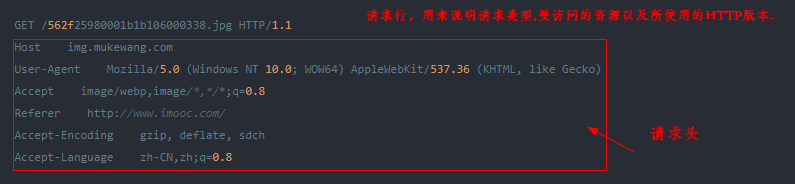
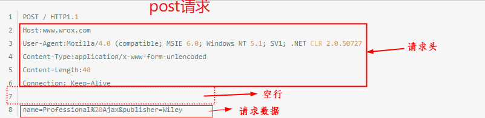
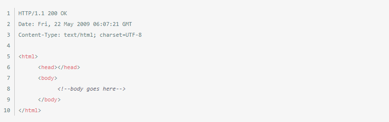
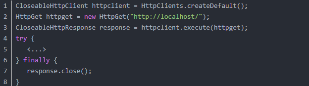

# HttpClient 笔记

HttpClient 不是一个浏览器。他是一个客户端的http通信实现库。HttpClient 的目标是发送和接收HTTP 报文。


HttpClient 不会去处理内容，执行嵌入在 HTML页面中的javascript 代码，猜测内容类型，如果没有明确设置，否则不会重新格式化请求/重定向URI，或其它和HTTP通信无关的功能。（**HttpClient 所不能做的**）

## 特性

1. 基于标准、纯净的Java语言。实现了Http1.0和Http1.1
2. 以可扩展的面向对象的结构实现了Http全部的方法（GET, POST, PUT, DELETE, HEAD, OPTIONS, and TRACE）。
3. 支持HTTPS协议。
4. 通过Http代理建立透明的连接。
5. 利用CONNECT方法通过Http代理建立隧道的https连接。
6. Basic, Digest, NTLMv1, NTLMv2, NTLM2 Session, SNPNEGO/Kerberos认证方案。
7. 插件式的自定义认证方案。
8. 便携可靠的套接字工厂使它更容易的使用第三方解决方案。
9. 连接管理器支持多线程应用。支持设置最大连接数，同时支持设置每个主机的最大连接数，发现并关闭过期的连接。
10. 自动处理Set-Cookie中的Cookie。
11. 插件式的自定义Cookie策略。
12. Request的输出流可以避免流中内容直接缓冲到socket服务器。
13. Response的输入流可以有效的从socket服务器直接读取相应内容。
14. 在http1.0和http1.1中利用KeepAlive保持持久连接。
15. 直接获取服务器发送的response code和 headers。
16. 设置连接超时的能力。
17. 实验性的支持http1.1 response caching。
18. 源代码基于Apache License 可免费获取。

## 使用方法

使用HttpClient发送请求、接收响应很简单，一般需要如下几步即可。
1. 创建HttpClient对象。
2. 创建请求方法的实例，并指定请求URL。如果需要发送GET请求，创建HttpGet对象；如果需要发送POST请求，创建HttpPost对象。
3. 如果需要发送请求参数，可调用HttpGet、HttpPost共同的setParams(HetpParams params)方法来添加请求参数；对于HttpPost对象而言，也可调用setEntity(HttpEntity entity)方法来设置请求参数。
4. 调用HttpClient对象的execute(HttpUriRequest request)发送请求，该方法返回一个HttpResponse。
5. 调用HttpResponse的getAllHeaders()、getHeaders(String name)等方法可获取服务器的响应头；调用HttpResponse的getEntity()方法可获取HttpEntity对象，该对象包装了服务器的响应内容。程序可通过该对象获取服务器的响应内容。
6. 释放连接。无论执行方法是否成功，都必须释放连接


## HTTP请求结构

**客户端发送一个HTTP请求到服务器的请求消息包括以下格式：**

+ 请求行 request line
+ 请求头部 header
+ 空行
+ 请求数据



第一部分：请求行，用来说明请求类型,要访问的资源以及所使用的HTTP版本.

第二部分：请求头部，紧接着请求行（即第一行）之后的部分，用来说明服务器要使用的附加信息HOST将指出请求的目的地.
User-Agent,服务器端和客户端脚本都能访问它,它是浏览器类型检测逻辑的重要基础.该信息由你的浏览器来定义,。

第三部分：空行，请求头部后面的空行是必须的,即使第四部分的请求数据为空，也必须有空行。

第四部分：请求数据也叫主体，可以添加任意的其他数据。



第一部分：请求行，第一行明了是post请求，以及http1.1版本。

第二部分：请求头部，第二行至第六行。

第三部分：空行，第七行的空行。

第四部分：请求数据，第八行。

## HTTP之响应消息Response

一般情况下，服务器接收并处理客户端发过来的请求后会返回一个HTTP的响应消息。

HTTP响应也由四个部分组成，分别是：**状态行**、**消息报头**、**空行** 和 **响应正文**。



第一部分：状态行，由HTTP协议版本号， 状态码， 状态消息 三部分组成。
第一行为状态行，（HTTP/1.1）表明HTTP版本为1.1版本，状态码为200，状态消息为（ok）

第二部分：消息报头，用来说明客户端要使用的一些附加信息
第二行和第三行为消息报头，Date:生成响应的日期和时间；Content-Type:指定了MIME类型的HTML(text/html),编码类型是UTF-8

第三部分：空行，消息报头后面的空行是必须的

第四部分：响应正文，服务器返回给客户端的文本信息。空行后面的html部分为响应正文。

## 状态码

状态代码有三位数字组成，第一个数字定义了响应的类别，共分五种类别:

- 1xx：指示信息--表示请求已接收，继续处理
- 2xx：成功--表示请求已被成功接收、理解、接受
- 3xx：重定向--要完成请求必须进行更进一步的操作
- 4xx：客户端错误--请求有语法错误或请求无法实现
- 5xx：服务器端错误--服务器未能实现合法的请求

```
200 OK //客户端请求成功
400 Bad Request //客户端请求有语法错误，不能被服务器所理解
401 Unauthorized //请求未经授权，这个状态代码必须和WWW-Authenticate报头域一起使用
403 Forbidden //服务器收到请求，但是拒绝提供服务
404 Not Found //请求资源不存在，eg：输入了错误的URL
500 Internal Server Error //服务器发生不可预期的错误
503 Server Unavailable //服务器当前不能处理客户端的请求，一段时间后可能恢复正常
```

## HTTP请求方法

据HTTP标准，HTTP请求可以使用多种请求方法。
HTTP1.0定义了三种请求方法： **GET**, **POST** 和 **HEAD**方法。
HTTP1.1新增了五种请求方法：**OPTIONS**, **PUT**, **DELETE**, **TRACE** 和  **CONNECT** 方法。
```
GET 请求指定的页面信息，并返回实体主体。
HEAD 类似于get请求，只不过返回的响应中没有具体的内容，用于获取报头
POST 向指定资源提交数据进行处理请求（例如提交表单或者上传文件）。数据被包含在请求体中。
POST请求可能会导致新的资源的建立和/或已有资源的修改。
PUT 从客户端向服务器传送的数据取代指定的文档的内容。
DELETE 请求服务器删除指定的页面。
CONNECT HTTP/1.1协议中预留给能够将连接改为管道方式的代理服务器。
OPTIONS 允许客户端查看服务器的性能。
TRACE 回显服务器收到的请求，主要用于测试或诊断。
```

## HttpClient 执行基本请求

**HttpClient最基本的功能是执行HTTP方法。** 一次 HTTP 方法的执行包含一个或多个 HTTP 请求/响应的交互，通常由 HttpClient的内部来处理。使用者需要提供一个Request对象来执行HTTP请求，HttpClient就会把请求传送给目标服务器并返回一个相对应的Response对象，如果执行不成功，将会抛出一个异常。

显然，HttpClient API 的主要切入点就是定义描述上述契约的HttpClient接口。



1) HTTP 请求（Request）

HttpClient很好地支持了HTTP/1.1规范中所有的HTTP方法：GET，HEAD， POST，PUT， DELETE， TRACE 和 OPTIONS。每个方法都有一个特别的类：HttpGet，HttpHead， HttpPost，HttpPut，HttpDelete，HttpTrace和HttpOptions。URI是统一资源标识符的缩写，用来标识与请求相符合的资源。HTTP 请求URI包含了一个协议名称，主机名，可选端口，资源路径，可选的参数，可选的片段。
```
HttpGet httpget = new HttpGet("http://www.google.com/search?hl=en&q=httpclient&btnG=Google+Search&aq=f&oq=");

```

HttpClient提供了URIBuilder工具类来简化创建、修改请求 URIs。
```
URI uri = new URIBuilder()
          .setScheme("http")
          .setHost("www.google.com")
          .setPath("/search")
          .setParameter("q", "httpclient")
          .setParameter("btnG", "Google Search")
          .setParameter("aq", "f")
          .setParameter("oq", "")
          .build();
HttpGet httpget = new HttpGet(uri);


System.out.println(httpget.getURI());
//http://www.google.com/search?q=httpclient&btnG=Google+Search&aq=f&oq=
```

2) HTTP 响应（Response）

HTTP 相应是服务器接收并解析请求信息后返回给客户端的信息，它的起始行包含了`一个协议版本，一个状态码和描述状态的短语`。

```
HttpResponse response = new BasicHttpResponse(HttpVersion.HTTP_1_1
                             ,HttpStatus.SC_OK, "OK");
System.out.println(response.getProtocolVersion()); //
System.out.println(response.getStatusLine().getStatusCode());
System.out.println(response.getStatusLine().getReasonPhrase());
System.out.println(response.getStatusLine().toString());

////输出
//HTTP/1.1
//200
//OK
//HTTP/1.1 200 OK
```

3) 处理报文头部（Headers）

一个HTTP报文包含了许多描述报文的首部，比如内容长度，内容类型等。HttpClient提供了一些方法来取出，添加，移除，枚举头部。
```html
HttpResponse response = new BasicHttpResponse(HttpVersion.HTTP_1_1,HttpStatus.SC_OK, "OK");
response.addHeader("Set-Cookie","c1=a; path=/; domain=localhost");
response.addHeader("Set-Cookie","c2=b; path=\"/\", c3=c; domain=\"localhost\"");
Header h1 = response.getFirstHeader("Set-Cookie");
System.out.println(h1);
Header h2 = response.getLastHeader("Set-Cookie");
System.out.println(h2);
Header[] hs = response.getHeaders("Set-Cookie");
System.out.println(hs.length);
```
**HttpClient也提供了其他便利的方法把HTTP报文转化为单个的HTTP元素。**
```html
HttpResponse response = new BasicHttpResponse(HttpVersion.HTTP_1_1,HttpStatus.SC_OK, "OK");
response.addHeader("Set-Cookie","c1=a; path=/; domain=localhost");
response.addHeader("Set-Cookie","c2=b; path=\"/\", c3=c; domain=\"localhost\"");
HeaderElementIterator it = new BasicHeaderElementIterator(
response.headerIterator("Set-Cookie"));
while (it.hasNext()) {
     HeaderElement elem = it.nextElement();
     System.out.println(elem.getName() + " = " + elem.getValue());
     NameValuePair[] params = elem.getParameters();
     for (int i = 0; i < params.length; i++) {
          System.out.println(" " + params[i]);
     }
}

```

4) HTTP实体（HTTP Entity）

HttpClient区分出三种实体：

- **流式实体（streamed）**： 内容来源于一个流，或者在运行中产生。特别的，这个类别包括从响应中接收到的实体。流式实体不可重复。
- **自包含实体（self-contained）**：在内存中的内容或者通过独立的连接/其他实体获得的内容。自包含实体是可重复的。这类实体大部分是HTTP内含实体请求。
- **包装实体（wrapping）**：从另外一个实体中获取内容。


5) 确保释放低级别的资源
```java
CloseableHttpClient httpclient = HttpClients.createDefault();
HttpGet httpget = new HttpGet("http://localhost/");
CloseableHttpResponse response = httpclient.execute(httpget);
try {
     HttpEntity entity = response.getEntity();
     if (entity != null) {
        InputStream instream = entity.getContent();
        try {
            // do something useful
        } finally {
            instream.close();
        }
   }
} finally {
     response.close();
}

```

6) 消费实体内容

为了消费实体内容，推荐的方式是使用`HttpEntity#getContent()`或者 `HttpEntity#writeTo(OutputStream)`方法。HttpClient也提供了一个EntityUtils类，它有几个静态方法更容易的从实体中读取内容或信息。取代了直接读取java.io.InputStream，你可以通过这个类的方法取出全部内容体并放入一个String 中或者byte数组中。可是，强烈不建议使用EntityUtils，除非响应实体来自于信任的HTTP服务器并且知道它的长度。
```java
CloseableHttpClient httpclient = HttpClients.createDefault();
HttpGet httpget = new HttpGet("http://localhost/");
CloseableHttpResponse response = httpclient.execute(httpget);
try {
HttpEntity entity = response.getEntity();
if (entity != null) {
        long len = entity.getContentLength();
        if (len != -1 && len < 2048) {
             System.out.println(EntityUtils.toString(entity));
    } else {
        // Stream content out
    }
}
} finally {
    response.close();
}

```


在某些情况下，多次读取实体内容是必要的。在这种情况下，实体内容必须以一些方式缓冲，内存或者硬盘中。为了达到这个目的，最简单的方法是把原始的实体用`BufferedHttpEntity`类包装起来。这将会使原始实体的内容读入一个in-memory缓冲区。所有方式的实体包装都是代表最原始的那个实体。
```java
CloseableHttpResponse response = <...>
HttpEntity entity = response.getEntity();
if (entity != null) {
    entity = new BufferedHttpEntity(entity);
}
```


7) 生产实体内容

对于基本的数据容器String, byte array, input stream, and file，HttpClient为它们提供了几个对应的类：StringEntity, ByteArrayEntity, InputStreamEntity 和 FileEntity。

```java
File file = new File("somefile.txt");
FileEntity entity = new FileEntity(file,ContentType.create("text/plain", "UTF-8"));
HttpPost httppost = new HttpPost("http://localhost/action.do");
httppost.setEntity(entity);

//请注意InputStreamEntity是不可重复的，因为它仅仅能够从数据流中读取一次。一般建议实
//现一个定制的HttpEntity类来代替使用一般的InputStreamEntity。FileEntity将会是一个
//好的出发点。
```

**HTML表单**

许多应用需要模仿一个登陆HTML表单的过程，比如：为了登陆一个web应用或者提交输入的数据。HttpClient提供了`UrlEncodedFormEntity`类来简化这个过程。
```java
List<NameValuePair> formparams = new ArrayList<NameValuePair>();
formparams.add(new BasicNameValuePair("param1", "value1"));
formparams.add(new BasicNameValuePair("param2", "value2"));

UrlEncodedFormEntity entity = new UrlEncodedFormEntity(formparams, Consts.UTF_8);
HttpPost httppost = new HttpPost("http://localhost/handler.do");
httppost.setEntity(entity);

//UrlEncodedFormEntity实例像上面一样使用URL编码方式来编码参数并生成下面的内容：
//param1=value1&m2=value2
```

**内容分块**

通常，我们推荐让**HttpClient**选择基于被传递的HTTP报文属相最合适的传输编码方式。可能地，可以通过设置`HttpEntity#setChunked()`为true来通知HttpClient你要进行分块编码。注意HttpClient将会使用这个标志作为提示。当使用一些不支持分块编码的HTTP版本（比如HTTP/1.0.）时，这个值将会忽略
（`分块编码是是HTTP1.1协议中定义的Web用户向服务器提交数据的一种方法`）。
```java
StringEntity entity = new StringEntity("important message",
                           ContentType.create("plain/text", Consts.UTF_8));
entity.setChunked(true);
HttpPost httppost = new HttpPost("http://localhost/acrtion.do");
httppost.setEntity(entity);
```

8) 响应处理器

最简单、最方便的方式来处理响应是使用`ResponseHandler`接口，它包含了一个handleResponse(HttpResponse response)方法。这个方法减轻使用者对于连接管理的担心。
当你使用ResponseHandler时，无论是请求执行成功亦或出现异常，HttpClient将会自动地确保连接释放回连接管理器中。
```java
CloseableHttpClient httpclient = HttpClients.createDefault();
HttpGet httpget = new HttpGet("http://localhost/json");
ResponseHandler<MyJsonObject> rh = new ResponseHandler<MyJsonObject>() {
    @Override
    public JsonObject handleResponse(final HttpResponse response) throws IOException {
        StatusLine statusLine = response.getStatusLine();
        HttpEntity entity = response.getEntity();
        if (statusLine.getStatusCode() >= 300) {
            throw new HttpResponseException(statusLine.getStatusCode(),
                statusLine.getReasonPhrase());
        }
        if (entity == null) {
             throw new ClientProtocolException("Response contains no content");
        }
        Gson gson = new GsonBuilder().create();
        ContentType contentType = ContentType.getOrDefault(entity);
        Charset charset = contentType.getCharset();
        Reader reader = new InputStreamReader(entity.getContent(), charset);
        return gson.fromJson(reader, MyJsonObject.class);
    }
};
MyJsonObject myjson = client.execute(httpget, rh);
```


