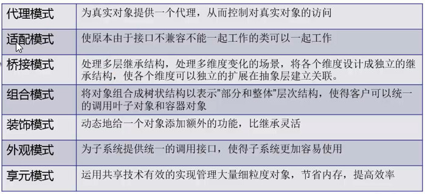

028 设计模式总结

设计模式可以帮助我们改善系统的设计，增强系统的 健壮性、可扩展性，为以后铺平道路。

但是，设计模式可以改善系统的设计是没错，过多的模式也会使系统变的复杂。所以当我们第一次设计一个系统时，请将你确定的变化点处理掉，不确定的变化点千万不要假设它存在，如果你曾经这么做过，那么请改变你的思维，让这些虚无的变化点在你脑子中彻底消失。

因为我们完全可以使用另外一种手法来容纳我们的变化点，那就是重构。

用抽象构建框架，用细节实现扩展。

## 设计模式大杂烩（24种设计模式的总结以及学习设计模式的几点建议）

&emsp;&emsp;迄今为止，将24种设计模式介绍完了，其中包括`GOF23种设计模式`以及`简单工厂模式`，这些设计模式之间并不是完全独立的，而是互相之间，会有一些相同的影子，下面我们来一起总结下这24种设计模式。

### 23+1 模式

- <a name="create">**创建型**：  <a name="sigle">单例模式</a>   简单工厂模式   工厂方法模式   抽象工厂模式  建造者模式  原型模式</a>
- <a name="structure">**结构型**：  代理模式   适配器模式   装饰器模式   桥接模式   组合模式   享元模式  外观模式 </a>
-  <a name="behavior">**行为型**：  观察者模式   模板方法模式   命令模式   状态模式   职责链模式   解释器模式  中介者模式   访问者模式   策略模式  备忘录模式  迭代器模式</a>

以上便是设计模式的分类以及各个模式的传送门，可以看到其中行为型模式的个数为最多，结构型次之，创建型设计模式最少。

在写这篇文章的时候，考虑的最多的一个问题就是，从哪几个维度去对比设计模式能让大家更加清楚的看出各个设计模式的区别与联系，思来想去，下面决定从以下几个维度去对比设计模式。

- **设计原则：** 描述每个设计模式都遵循了哪些设计原则，破坏了哪些设计原则。
- **常用场景：** 描述各个设计模式大部分情况下，都会在哪些场景下出现。
- **使用概率：** 主要指在普遍的工作当中，该设计模式出现的频率，若是类库或是开源框架提供的功能中包含该模式，则也会计算其频率。
- **复杂度：** 特指一个设计模式在实现的时候的复杂度，主要的衡量标准是类的数量、类之间的耦合关系。
- **变化点：** 设计模式很大的一个意义在于容纳变化，掌握一个设计模式的变化点是非常重要的一件事。
- **选择关键点：** 当选择使用一个设计模式的时候，指出最关键的选择点在哪里。
- **逆鳞：** 龙有逆鳞，不可触摸，同样的，设计模式也有逆鳞，有些地方是不能碰的。
- **相关设计模式：** 与其它设计模式的关系。

创建型设计模式
<table><tr><td bgcolor=#6D7D8D width=700px >单例模式</td></tr></table>

-  设计原则：无
-  常用场景：应用中有对象需要是全局的且唯一
-  案例：
	- 项目中，读取配置文件的类，一般也只有一个对象，没有必要每次使用配置文件数据，每次new一个对象去读取。
	- 应用程序的日志应用，一般都采用单例模式，这一班是由于共享的日志文件一直处于打开状态，否则内特容不好追加。
	- 网站的计数器，一般也是采用单例模式实现，否则难于同步。
	- 数据库连接池的设计一般采用单例模式，因为数据库连接是一种数据库资源。
	- 操作系统的文件系统，也是大的单例模式是想的具体例子，一个操作系统只能有一个文件系统。
	- Applcation也是单例模式的典型应用（servlet编程中会涉及到）
	- 在Spring中，每个bean默认就是单例的，这样做的优点是Spring容器可以管理。
	- 在Servlet编程中，每个Servlet也是单例
	- 在sprig mvc框架中，控制对象也是单例
-  核心作用：**保证一个类只有一个实例，并且提供一个访问该实例的全局访问点。**
-  使用概率：99.99999%
-  复杂度：低
-  变化点：无
-  选择关键点：一个对象在应用中出现多个实例是否会引起逻辑上或者是程序上的错误
-  逆鳞：在以为是单例的情况下，却产生了多个实例
-  相关设计模式
 - 原型模式：单例模式是只有一个实例，原型模式每拷贝一次都会创造一个新的实例。
 

<table><tr><td bgcolor=#6D7D8D width=700px >简单工厂模式</td></tr></table>

- 设计原则：遵循单一职责、违背开闭原则
- 常用场景：需要在一堆产品中选择其中一个产品
- 使用概率：99.99999%
- 复杂度：低
- 变化点：产品的种类
- 选择关键点：一种产品是否可根据某个参数决定它的种类
- 逆鳞：工厂类不能正常工作
- 相关设计模式
 - 工厂方法模式：工厂方法模式是简单工厂模式的进一步抽象化，在这两者之间做选择，主要看将工厂进一步抽象化是否有必要，通常情况下，如果工厂的作用仅仅是用来制造产品，则没必要使用工厂方法模式。

<table><tr><td bgcolor=#6D7D8D width=700px >工厂方法模式</td></tr></table>

- 设计原则：遵循单一职责、依赖倒置、开闭原则
- 常用场景：一种场景是希望工厂与产品的种类对客户端保持透明，给客户端提供一致的操作，另外一种是不同的工厂和产品可以提供客户端不同的服务或功能
- 使用概率：60%
- 复杂度：中低
- 变化点：工厂与产品的种类
- 选择关键点：工厂类和产品类是否是同生同灭的关系
- 逆鳞：无
- 相关设计模式
 - 抽象工厂模式：工厂方法模式与抽象工厂模式最大的区别在于，在工厂方法模式中，工厂创造的是一个产品，而在抽象工厂模式中，工厂创造的是一个产品族。

<table><tr><td bgcolor=#6D7D8D width=700px >抽象工厂模式</td></tr></table>

 
- 设计原则：遵循单一职责、依赖倒置、开闭原则
- 常用场景：需要一个接口可以提供一个产品族，且不必知道产品的具体种类
- 案例：
	- JDK 中Caledar的getInstance 方法
	- JDBC中Conection对象的获取
	- Hibernate中SessionFactory创建Session
	- Spring中IOC容器创建管理bena对象
	- XML解析时的DocumentBuilderFactory创建解析器对象
	- 反射中Class对象的newInstance（）
- 核心作用：
	- 实例化对象，用工厂方法代替new操作
	- 将选择实现类、创建对象统一管理和控制。从而将调用者跟我们的实现类解耦。
- 使用概率：30%
- 复杂度：中
- 变化点：工厂与产品的种类
- 选择关键点：产品族是否需要一起提供，且是否有一致的接口
- 逆鳞：无
- 相关设计模式
 - 建造者模式：两者都是建造一批对象或者说产品，不同的是两者的目的和实现手段，在建造者模式中，是为了复用对象的构建过程而定义了一个指挥者，而在抽象工厂模式中，是为了提供一个这批对象的创建接口而定义了抽象工厂接口。

<table><tr><td bgcolor=#6D7D8D width=700px >建造者模式</td></tr></table>

- 设计原则：遵循单一职责、开闭原则
- 常用场景：需要构建一批构建过程相同但表示不同的产品，而构建过程非常复杂
- 案例：（**开发中应用场景**）
	- stringBuilder类的append方法
	- SQL中的PreparedStatement
	- JDOM中，DomBuilder、SAXbuilder
- 核心作用:
	- 分离了对象子组建的单独构造（由builder来负责）和装配（由Director负责）。从而可
	以构造出复杂的对象。这个模式适用于：某个对象的构造过程复杂的情况下使用。
	- 由于实现了构建和装配的解耦。不同的构建器，相同的装配，也可以做出不同的对象；相同
	的构建器，不同的装配顺序也可以做出不同的对象。也就是实现了构建算法、装配算法的解
	耦，实现了更好的复用。
- 使用概率：10%
- 复杂度：中
- 变化点：产品的表示
- 选择关键点：各个产品的构建过程是否相同
- 逆鳞：指挥者不能正常工作
结构型设计模式

<table><tr><td bgcolor=#6D7D8D width=700px >原型模式</td></tr></table>

- 设计原则：无
- 常用场景：需要在运行时动态的创建指定实例种类的对象，或是需要复用其状态
- 案例：
	- 原型模式很少单独出现，一般是和工厂方法模式一起出现，通过clone的方法创建一个对
	象，然后有工厂方法提供给调用者。
	- Spring中的bean的创建实际就是两种：单例模式和原型模式。（当然，原型模式需要和工
	厂模式搭配起来）
- 使用概率：10%
- 复杂度：中低
- 变化点：无
- 选择关键点：创建出来的对象是否可以立即投入使用
- 逆鳞：在以为是深度拷贝的情况下，却未实现深度拷贝

 结构型设计模式

<table><tr><td bgcolor=#6D7D8D width=700px >代理模式</td></tr></table>

- 设计原则：体现功能复用
- 常用场景：需要修改或屏蔽某一个或若干个类的部分功能，复用另外一部分功能，可使用静态代理，若是需要拦截一批类中的某些方法，在方法的前后插入一些一致的操作，假设这些类有一致的接口，可使用JDK的动态代理，否则可使用cglib
	- AOP （面向切面编程）的核心实现机制！
- 案例：（**任何大型框架都会使用代理模式**）
	- 安全代理：屏蔽对真实角色的直接访问
	- 远程代理：通过代理类处理远程方法调用（RMI）
	- 延迟加载：先加载轻量级的代理对象，真正需要再加载真实对象
- 分类
	- 静态代理（静态定义代理类）
	- 动态代理（动态生成代理类）-- `这个用的更多`
	- JDK自带的动态代理
		- `java.lang.reflect.Proxy`
			- `作用：动态生成代理类和对象`
		- `java.lang.reflect.InvocationHandler(处理接口)` --这个很重要
			- `可以通过invoke方法实现对真实角色的代理访问`
			- `每次通过Proxy生成代理类对象时都要指定对应的处理器对象`
	- javaassist字节码操作库实现
	- CGLIB
	- ASM(底层使用指令，可维护性较差)
- 核心作用
	- 通过代理，控制对对像的访问！
	`可以详细控制访问某个（某类）对象的方法，在调用这个方法前做前置处理，调用这个方法后做后置处理。（即AOP的微观实现！--> 即：AOP面向切面编程的核心机制）`
- 使用概率：99.99999%
- 复杂度：中高
- 变化点：静态代理没有变化点，动态代理的变化点为具有相同切入点的类
- 选择关键点：静态代理选择的关键点是是否要复用被代理的部分功能，动态代理选择的关键点在于能否在将被代理的这一批类当中，找出相同的切入点
- 逆鳞：切入点的不稳定
- 相关设计模式
 - 适配器模式：对于适配器模式当中的定制适配器，它与静态代理有着相似的部分，二者都有复用功能的作用，不同的是，静态代理会修改一部分原有的功能，而适配器往往是全部复用，而且在复用的同时，适配器还会将复用的类适配一个接口

**jdk动态代理使用的局限性：**

通过反射类`Proxy`和`InvocationHandler`回调接口实现的jdk动态代理，要求委托类必须实现一个接口，但事实上并不是所有类都有接口，对于没有实现接口的类，便无法使用该方方式实现动态代理。

<table><tr><td bgcolor=#6D7D8D width=700px >适配器模式</td></tr></table>

- 设计原则：遵循开闭原则、体现功能复用
- 常用场景：需要使用一个类的功能，但是该类的接口不符合使用场合要求的接口，可使用定制适配器，又或者是有一个接口定义的行为过多，则可以定义一个缺省适配器，让子类选择性的覆盖适配器的方法
- 案例： Java AWT 、 Java I/O 、Spring Web MVC
	- IO 中输入流和输出流的设计
	- Swing包中图形界面构件功能
	- Servlet API中提供了一个request对象的Decorator设计模式的默认实现类HttpServletRequestWrapper，HttpServletRequestWrapper类，增强了request对象的功能。
	- Struts2中，request，response，session对象的处理

        `看到Wrapper后缀名字类 一般都是装饰类`
- 使用概率：40%
- 复杂度：中
- 变化点：无
- 选择关键点：定制适配器的选择关键点在于是否有更加优良的替代方案，缺省适配器的选择关键点在于接口中的方法是否可以不全部提供，且都有缺省方案
- 逆鳞：无
- 相关设计模式
 - 装饰器模式：对于适配器模式中的定制适配器与装饰器模式，二者都是使用组合加继承的手段，不同的是，适配器模式的目的在于适配接口，装饰器模式的目的在于动态的添加功能，且可以叠加。

 
<table><tr><td bgcolor=#6D7D8D width=700px >装饰器模式</td></tr></table>

- 设计原则：遵循迪米特、单一职责、开闭原则，破坏里氏替换，体现功能复用
- 常用场景：一个类需要动态的添加功能，且这些功能可以相互叠加
- 案例：Java I/O、Spring Core、Spring Web MVC
- 使用概率：99.99999%
- 复杂度：中
- 变化点：动态添加的功能或者说装饰器
- 选择关键点：添加的功能是否需要动态组装
- 逆鳞：无

 
<table><tr><td bgcolor=#6D7D8D width=700px >桥接模式</td></tr></table>
 
- 设计原则：遵循单一职责、迪米特、开闭原则，体现功能复用
- 常用场景：一个对象有多个维度的变化，需要将这些维度抽离出来，让其独立变化
	- JDBC驱动程序
	- AWT中的Peer架构
	- 银行日志管理：
		- 格式分类：操作日志、交易日志、异常日志
		- 距离分类：本地记录日志、异地记录日志
	- 人力资源系统中的奖金计算模块：
		- 奖金分类：个人奖金、团体奖金、激励奖金
		- 部门分类：人事部门、销售部门、研发部门
	- OA系统中的消息处理：
		- 业务类型：普通消息、加急消息、特急消息
		- 发送消息方式：系统内消息、手机短信、邮件
- 使用概率：20%
- 复杂度：中高
- 变化点：维度的扩展与增加
- 选择关键点：是否可以将对象拆分成多个不相关的维度
- 逆鳞：无
 
<table><tr><td bgcolor=#6D7D8D width=700px >组合模式</td></tr></table>
 
- 设计原则：遵循依赖倒置、开闭原则，破坏接口隔离
- 常用场景：当有一个结构可以组合成树形结构，且需要向客户端提供一致的操作接口，使得客户端操作忽略简单元素与复杂元素
	- 操作系统的资源管理器
	- GUI中的容器层次
	- XML文件解析
	- OA 系统中，组件结构的处理
	- Junit单元测试框架
		- 底层设计就是典型的组合模式，TestCase（叶子）、TestUnite（容器）、Test接口（抽象）
- 案例： EL、Spring Cache、Spring Web MVC
- 使用概率：30%
- 复杂度：中
- 变化点：节点的数量
- 选择关键点：对外提供一致操作接口的结构是否可转化为树形结构
- 逆鳞：结构不稳定或结构中的节点有递归关系

<table><tr><td bgcolor=#6D7D8D width=700px >享元模式</td></tr></table>

- 设计原则：无
- 常用场景：一些状态相同的对象被大量的重复使用
	- 内存属于稀缺资源，不要随便浪费。如果有很多个完全相同或相似的对象，我们可以通过享
元模式，节省内存。
- 案例：Integer缓存、String intern、ThreadLocal

- 核心：
	- 享元模式可以共享的方式高效地支持大量的细粒度对象的重要。
	- 享元对象能做到共享的关键是区分了内部状态和外部状态。
		- 内部状态：可以共享，不会随环境变化而改变
		- 外部状态：不可以共享，会随环境变化改变
- 使用概率：90%
- 复杂度：中
- 变化点：无
- 选择关键点：被共享的对象是否可以将外部状态提取出来
- 逆鳞：没有将外部状态提取完全

<table><tr><td bgcolor=#6D7D8D width=700px >外观模式</td></tr></table>
 
- 设计原则：遵循迪米特
- 常用场景：一个子系统需要对外提供服务
	- 频率很高。哪里都会遇到。各种技术和框架中都有外观模式的使用。如：
		- JDBC封装后的，commons提供的DBUtils类，Hibernate提供的工具类、Spring JDBC工具类等
- 案例：Tomcat、DispatcherServlet（几乎所有的RPC系统都是门面模式）
- 使用概率：60%
- 复杂度：中
- 变化点：无
- 选择关键点：子系统对外提供服务是否需要依赖很多的类
- 逆鳞：子系统对外提供的服务的变化或子系统本身的不稳定
- 相关设计模式
 - 中介者模式：二者都是为了处理复杂的耦合关系，不同的是外观模式处理的是类之间复杂的依赖关系，中介者模式处理的是对象之间复杂的交互关系
 
 **结构型模型汇总**

 

行为型设计模式

<table><tr><td bgcolor=#6D7D8D width=700px >观察者模式</td></tr></table>
 
- 设计原则：遵循迪米特、开闭原则
- 常用场景：需要将观察者与被观察者解耦或者是观察者的种类不确定
- 案例：
	- 聊天室程序的，服务器转发给所有客户端
	- 网络游戏（多人联机对战）场景中，服务器将客户端的状态进行分发
	- 邮件订阅
	- Servlet中，监听器的实现
	- Android中，广播机制
	- JDK的AWT中事件处理模型，基于观察者模式的委派事件模型
		- 事件源 ---------目标对象
		- 事件监听器 ------观察者
	- 京东商场中，群发某商品打折信息
	- JDK提供了对观察者模式的支持，使用Observable类和Observer接口
- 使用概率：40%
- 复杂度：中
- 变化点：观察者的种类与个数
- 选择关键点：观察者与被观察者是否是多对一的关系
- 逆鳞：观察者之间有过多的细节依赖
 
<table><tr><td bgcolor=#6D7D8D width=700px >模板方法模式</td></tr></table>
 

- 设计原则：破坏里氏替换，体现功能复用
- 常用场景：一批子类的功能有可提取的公共算法骨架
- 案例：非常频繁。各个框架/类库都有他的影子。比如常见的有：
	- 数据库访问的封装
	- Hibernate中模板程序
	- servlet中关于doGet/doPost方法调用
	- Junit单元测试
	- spring中JDBCTemplate、HibernateTemplate等
- 使用概率：80%
- 复杂度：中低
- 变化点：算法骨架内各个步骤的具体实现
- 选择关键点：算法骨架是否牢固
- 逆鳞：无

什么时候用到模板方法模式：

实现一个算法时，整体步骤很固定。但是，某些部分易变。易变部分可以抽象成出来，供子类实现。

<table><tr><td bgcolor=#6D7D8D width=700px >命令模式</td></tr></table>
 

- 设计原则：遵循迪米特、开闭原则
- 常用场景：行为的请求者与行为的处理者耦合度过高
- 案例：
	- Struts2中，action的整个调用过程中就有命令模式。
	- 数据库事务机制的底层实现
	- 命令的撤销和恢复
- 使用概率：20%
- 复杂度：中高
- 变化点：命令的种类
- 选择关键点：请求者是否不需要关心命令的执行只知道接受者
- 逆鳞：命令的种类无限制增长
- 相关设计模式
 - 职责链模式：容易将二者关联在一起的原因是，二者都是为了处理请求或者命令而存在的，而且二者都是为了将请求者与响应者解耦，不同的是命令模式中，客户端需要知道一个命令的接受者，在创建命令的时候就把接受者与命令绑定在一起发送给调用者，而职责链模式中，客户端并不关心最终处理请求的对象是谁，客户端只是封装一个请求对象，随后交给职责链的头部而已，也正因为这样，二者的实现方式，有着很大的区别
 

<table><tr><td bgcolor=#6D7D8D width=700px >状态模式</td></tr></table>

- 设计原则：遵循单一职责、依赖倒置、开闭原则
- 常用场景：一个对象在多个状态下行为不同，且这些状态可互相转换
- 案例：（**开发中常见的场景**）
	- 银行系统中账号状态的管理
	- OA系统中公文状态的管理
	- 酒店系统中，房间状态的管理
	- 线程对象各状态之间的切换
- 使用概率：20%
- 复杂度：中
- 变化点：状态的种类
- 选择关键点：这些状态是否经常在运行时需要在不同的动态之间相互转换
- 逆鳞：无
- 相关设计模式
 - 策略模式：二者的实现方式非常相似，策略接口与状态接口，具体的策略与具体的状态以及二者都拥有的上下文，如果看它们的类图，会发现几乎一模一样，而二者不同的地方就在于，状态模式经常会在处理请求的过程中更改上下文的状态，而策略模式只是按照不同的算法处理算法逻辑，而且从实际场景来讲，顾名思义，状态模式改变的是状态，策略模式改变的是策略
 

<table><tr><td bgcolor=#6D7D8D width=700px >职责链模式</td></tr></table>

- 设计原则：遵循迪米特
- 常用场景：一个请求的处理需要多个对象当中的一个或几个协作处理
- 案例：
	- Java中，异常机制就是一种责任链。一个try可以对应多个catch，当第一个catch不匹配类型，则自动跳到第二个catch。
	- Javascript语言中，事件的冒泡和铺货机制。Java语言中，事件处理采用观察者模式。
	- Servlet开发中，过滤器的链式处理
	- Struts2中，拦截器的调用也是典型的责任链模式。
- 使用概率：15%
- 复杂度：中
- 变化点：处理链的长度与次序
- 选择关键点：对于每一次请求是否每个处理的对象都需要一次处理机会
- 逆鳞：无
 

<table><tr><td bgcolor=#6D7D8D width=700px >解释器模式</td></tr></table>

- 设计原则：遵循单一职责
- 常用场景：有一种语言被频繁的使用
- 案例：
	- EL表达式的处理
	- 正则表达式解析器
	- SQL语法的解析器
	- 数学表达式解析器
- 使用概率：0.00009%
- 复杂度：中高
- 变化点：语言的规则
- 选择关键点：被频繁使用的语言是否可用文法表示
- 逆鳞：语言的规则无限制增长或规则十分不稳定
 

<table><tr><td bgcolor=#6D7D8D width=700px >中介者模式</td></tr></table>

- 设计原则：遵循迪米特，破坏单一职责
- 常用场景：一个系列的对象交互关系十分复杂
- 案例：
	- MVC模式（其中的C，控制器就是一个中介者对象。M和V都和他打交道）
	- 窗口游戏程序，窗口软件开发中窗口对象也是一个中介者对象
	- 图形界面开发GUI中，多个组件之间的交互，可以通过引入一个中介者对象来解决，可以是
	整体的窗口对象或者DOM对象
	- Java.lang.reflect.Method#invoke()
- 核心作用：解耦多个同事对象之间的交互关系。每个对象都持有中介者对象的引用，只跟中介者对象打交道。我们通过中介者对象统一管理这些交互关系。
- 使用概率：10%
- 复杂度：中
- 变化点：对象之间的交互
- 选择关键点：复杂的交互关系是否有共性可被中介者承担
- 逆鳞：中介者无法工作
 

<table><tr><td bgcolor=#6D7D8D width=700px >访问者模式</td></tr></table>

- 设计原则：遵循倾斜的开闭原则
- 常用场景：作用于一个数据结构之上的操作经常变化
- 案例：开发中的场景（应用范围非常窄，了解即可）
	- XML文档解析器设计
	- 编译器的设计
	- 复杂集合对象的处理
- 使用概率：5%
- 复杂度：高
- 变化点：数据结构之上的操作
- 选择关键点：数据结构是否稳定以及操作是否经常变化
- 逆鳞：数据结构的不稳定
 
<table><tr><td bgcolor=#6D7D8D width=700px >
策略模式</td></tr></table>

- 设计原则：遵循单一职责、依赖倒置、迪米特、开闭原则
- 常用场景：算法或者策略需要经常替换
- 案例：（**开发中常见的场景**）
	- JAVASE中GUI编程中，资源访问策略
	- Spring框架中，Resource接口，资源访问策略
	- javax.servlet.HttpServlet#service()
	- Jdk中的TreeSet和 TreeMap的排序功能就是使用了策略模式。
- 核心作用：（本质）分离算法，选择实现
- 使用概率：60%
- 复杂度：中
- 变化点：策略的种类
- 选择关键点：客户端是否依赖于某一个或若干个具体的策略
- 逆鳞：无
 
<table><tr><td bgcolor=#6D7D8D width=700px >
备忘录模式</td></tr></table>

- 设计原则：遵循迪米特、开闭原则
- 常用场景：需要在对象的外部保存该对象的内部状态
- 案例：
	- 棋类游戏的，悔棋
	- 普通软件中的，撤销操作
	- 数据库软件中，事务管理中，回滚操作
	- Photoshop软件中的，历史纪录
- 使用概率：5%
- 复杂度：中
- 变化点：无
- 选择关键点：是否可以在必要的时候捕捉到对象的内部状态
- 逆鳞：大对象的备份
 

<table><tr><td bgcolor=#6D7D8D width=700px >
迭代器模式</td></tr></table>

- 设计原则：遵循迪米特
- 常用场景：需要迭代访问一个聚合对象中的各个元素，且不暴露该聚合对象内部的表示
	- JDK内置的迭代器（List/Set）
- 使用概率：99.99999%
- 复杂度：中
- 变化点：聚合对象的种类
- 选择关键点：客户端是否关心遍历的次序
- 逆鳞：无
- 相关设计模式
 - 访问者模式：二者都是迭代的访问一个聚合对象中的各个元素，不同的是，访问者模式中，扩展开放的部分在作用于对象的操作上，而迭代器模式中，扩展开放的部分在聚合对象的种类上，而且二者的实现方式也有着很大的区别。
 

结束语

以上便是24种设计模式的各个特点与部分模式的对比，如果总结的过程当中有疏漏或是错误，请各位不吝赐教，LZ感激不尽。

此外需要说明的是，上面的概率当中有的会出现99.99999%这样的数字，这是因为这个模式已经嵌入到JAVA类库或是我们常用的开源框架当中（标注一下：LZ总结的主要针对WEB开发，android的开发LZ并未接触过，所以不包括在此列），比如迭代器模式，只要你使用过ArrayList或者HashSet，LZ就认为这个模式被使用。这个使用频率从某种意义上讲，可以认为是该模式的重要程度，当然由于这个频率是LZ制定的，所以仅代表个人观点。

这里再针对设计模式的学习，给各位提一点点建议，仅供参考，请各位吸优排差，次序不分先后。

1、之前说过，**学习设计模式除了努力之外还要靠缘分**，所以如果有设计模式当时怎么看都不明白，可以暂且放下，之后说不定哪天你突然之间就明白了。（此话并非虚言，LZ很多次的顿悟常发生在上厕所、洗澡、回家路上等一些学习之外的时候。）

2、对于已经在工作的人来说，可以常思考一下，有没有哪个设计模式可以**改善现有的系统架构**，但不要轻易付诸实践。

3、学习设计模式之前，一定要先整明白**UML类图**，什么关联，依赖，聚合，组合等等都得搞明白儿的，否则学习起来也依然会很吃力。

4、对于初学者，一定要在弄清楚标准的实现代码之后，**写一个属于自己的例子**，哪怕是比葫芦画瓢，然后仔细体会设计模式使用前后的差异，主要从扩展性和类（类包括客户端，而不仅仅指设计模式中的角色）的职责两个方面。

5、一定要将**设计模式的变化点**搞清楚，这点非常重要，甚至重要程度高于设计模式的场景、实现方式以及类和对象之间的耦合关系，很多时候，设计模式的滥用就是因为变化点没搞清楚，以至于该变化的没变化，不该变化的经常变化，增加系统的负担。

6、设计模式不是一次性学习完就可以扔掉不看的东西，而是要**经常回过头来看看**，说不定每一次你都有不一样的体会，而且一般情况下，这些体会会越来越深刻，越来越透彻。

7、如果可能的话，**多研究一些开源框架**，去找找它们里面的设计模式。

LZ暂时也就只能想到这些，如果以后有想到再补充吧，各位如果有什么好的建议也可以与LZ分享一下。

到此为止，整个设计模式系列就真真正正的彻底结束了，当初写的时候也没想到自己可以真的坚持下来，虽说整整26篇文章不算多，但是LZ确实花费了大量的时间和精力，值得欣慰的是LZ本人也得到了巨大的收获，不仅仅是对设计模式的理解日益加深，而且还得了不少猿友的支持，让LZ对分享这一道路更加坚定。

以后的编程之路还很长，对于LZ来说，编程并不仅仅是工作，而是一份事业，它给了LZ荣誉、金钱、成就感等等很多东西，希望各位至少在年轻的时候不要被一些悲观化的观点所干扰，特别是对编程有着热爱的猿友们，极致才能成就大道，但凡在一个领域有所成就者，大都是钻研了数十年的成果。

