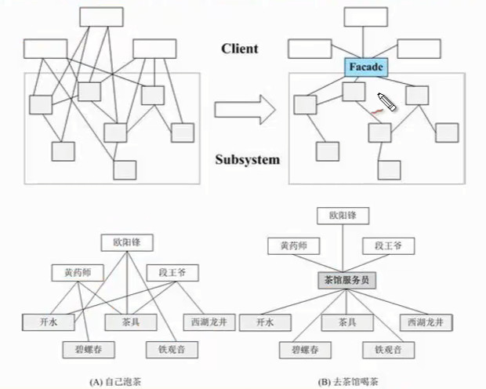

# GOF 设计模式设计原则

# <a name="six">设计原则(六大原则--指导原则--原则是死的，人是活的)</a>

并不一定要完完全全遵守这些规则，否则为何数据库会有逆范式。

###### 单一职责原则（六大规则中的小萝莉，人见人爱）：描述的意思是每个类都只负责单一的功能，切不可太多，并且一个类应当尽量的把一个功能做到极致。
###### 里氏替换原则（六大原则中最文静的姑娘，但却不太招人喜欢）：这个原则表达的意思是一个子类应该可以替换掉父类并且可以正常工作。
###### 接口隔离原则（六大原则当中最挑三拣四的挑剔女，胸部极小）：也称接口最小化原则，强调的是一个接口拥有的行为应该尽可能的小
###### 依赖倒置原则（六大原则中最小鸟依人的姑娘，对抽象的东西非常依赖）：这个原则描述的是高层模块不该依赖于低层模块，二者都应该依赖于抽象，抽象不应该依赖于细节，细节应该依赖于抽象。
###### 迪米特原则（六大原则中最害羞的姑娘，不太爱和陌生人说话）：也称最小知道原则，即一个类应该尽量不要知道其他类太多的东西，不要和陌生的类有太多接触。
###### 开-闭原则（六大原则中绝对的大姐大，另外五姐妹心甘情愿臣服）：最后一个原则，一句话，对修改关闭，对扩展开放。

就是说我任何的改变都不需要修改原有的代码，而只需要加入一些新的实现，就可以达到我的目的，这是系统设计的理想境界，但是没有任何一个系统可以做到这一点，哪怕我一直最欣赏的spring框架也做不到，虽说它的扩展性已经强到变态。

这个(开-闭原则)原则更像是前五个原则的总纲，前五个原则就是围着它转的，只要我们尽量的遵守前五个原则，那么设计出来的系统应该就比较符合开闭原则了，相反，如果你违背了太多，那么你的系统或许也不太遵循开闭原则。

1.单一职责原则

**定义：** 不要存在多于一个导致类变更的原因。通俗的说，即一个类只负责一项职责。

**问题由来：** 类T负责两个不同的职责：职责P1，职责P2。当由于职责P1需求发生改变而需要修改类T时，有可能会导致原本运行正常的职责P2功能发生故障。

**解决方案：** 遵循单一职责原则。分别建立两个类T1、T2，使T1完成职责P1功能，T2完成职责P2功能。这样，当修改类T1时，不会使职责P2发生故障风险；同理，当修改T2时，也不会使职责P1发生故障风险。

2.里氏替换原则

**定义1：** 如果对每一个类型为 T1的对象 o1，都有类型为 T2 的对象o2，使得以 T1定义的所有程序 P 在所有的对象 o1 都代换成 o2 时，程序 P 的行为没有发生变化，那么类型 T2 是类型 T1 的子类型。

**定义2：** 所有引用基类的地方必须能透明地使用其子类的对象。

**问题由来：** 有一功能P1，由类A完成。现需要将功能P1进行扩展，扩展后的功能为P，其中P由原有功能P1与新功能P2组成。新功能P由类A的子类B来完成，则子类B在完成新功能P2的同时，有可能会导致原有功能P1发生故障。

**解决方案：** 当使用继承时，遵循里氏替换原则。类B继承类A时，除添加新的方法完成新增功能P2外，尽量不要重写父类A的方法，也尽量不要重载父类A的方法

**只要父类能出现的地方，其子类就应该能出现。也就是用子类替换父类后，保证程序照样运行。**

里氏替换原则通俗的来讲就是：子类可以扩展父类的功能，但不能改变父类原有的功能,否则可能导致原来的功能出错。

3.依赖倒置原则

依赖倒置原则基于这样一个事实：相对于细节的多变性，抽象的东西要稳定的多。以抽象为基础搭建起来的架构比以细节为基础搭建起来的架构要稳定的多。在 java中，抽象指的是接口或者抽象类，细节就是具体的实现类，使用接口或者抽象类的目的是制定好规范和契约，而不去涉及任何具体的操作，把展现细节的任 务交给他们的实现类去完成。         

依赖倒置原则的**核心思想是面向接口编程**

4.接口隔离原则

**定义：** 客户端不应该依赖它不需要的接口；一个类对另一个类的依赖应该建立在最小的接口上。

**问题由来：** 类A通过接口I依赖类B，类C通过接口I依赖类D，如果接口I对于类A和类B来说不是最小接口，则类B和类D必须去实现他们不需要的方法。

**解决方案：** 将臃肿的接口I拆分为独立的几个接口，类A和类C分别与他们需要的接口建立依赖关系。也就是采用接口隔离原则

**接口细化，也就是接口中的方法要尽量少。**

5.迪米特法则

**定义：** 一个对象应该对其他对象保持最少的了解。

**问题由来：** 类与类之间的关系越密切，耦合度越大，当一个类发生改变时，对另一个类的影响也越大。

**解决方案：** 尽量降低类与类之间的耦合。

也称为最少知识原则，其定义为：**一个对象应当对其他对象有最少的了解。也就是一个类中不要有过多的其他类。**

6.开闭原则

**定义：** 一个软件实体如类、模块和函数应该对扩展开放，对修改关闭。

**问题由来：** 在软件的生命周期内，因为变化、升级和维护等原因需要对软件原有代码进行修改时，可能会给旧代码中引入错误，也可能会使我们不得不对整个功能进行重构，并且需要原有代码经过重新测试。

**解决方案：** 当软件需要变化时，尽量通过扩展软件实体的行为来实现变化，而不是通过修改已有的代码来实现变化。

一个软件实体（如类，模块，和函数）应该**对扩展开放，对修改关闭（重点）**。

**结论：**

+ 单一职责原则：一个类只负责一项职责

+ 里氏替换原则：子类可以扩展父类的功能，但不能改变父类原有的功能

+ 依赖倒置原则：核心思想是面向接口编程

+ 接口隔离原则：接口细化，也就是接口中的方法要尽量少。

+ 迪米特法则：一个类中不要有过多的其他类。

+ 开闭原则：一个软件实体（如类，模块，和函数）应该对扩展开放，对修改关闭。

## 开闭原则

1) 对代码的修改要关闭，对代码的扩展要开发

> 迪米特法则（最小知识原则）：
> - `一个软件实体应当尽可能少的与其他实体发生相互作用。`
>  

