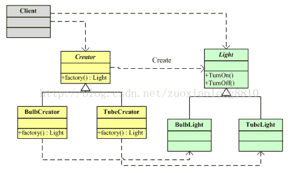
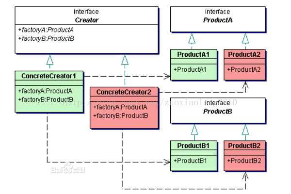

028 设计模式--创建型

##  <h1 id="0">23+1 模式</h1>

- <a name="create">**创建型**：  [单例模式](#1) 、[简单工厂模式](#2) 、[工厂方法模式](#3) 、 [抽象工厂模式](#4)、[建造者模式](#5) 、[原型模式](#6)</a>
- <a name="structure">**结构型**</a>：  代理模式  、 适配器模式  、 装饰器模式 、  桥接模式 、  组合模式 、  享元模式 、 外观模式
-  <a name="behavior">**行为型**</a>：  观察者模式  、 模板方法模式 、  命令模式 、  状态模式 、  职责链模式 、  解释器模式 、 中介者模式  、 访问者模式、   策略模式、  备忘录模式、  迭代器模式

##### <h2 id="1" name="sigle">单例模式详解</h2>

<font color=#E18B00 size=3>单例模式是一种创建型模式，单例模式提供一个创建对象的接口，但是多次调用该接口返回的是同一个实例的引用，目的是为了保证只有一个实例，并且提供一个访问这个实例的统一接口。</font>


**场景：**

 > Spring框架中单例bean的创建

 Spring中默认配置的bean的scope为`singleton`，也就是单例作用域。那么看看它是如何做到的。

- <font color=#f47777 size=4>同一个jvm应用的不同模块需要使用同一个对象实例进行信息共享。</font>

- <font color=#f47777 size=4>需要同一个实例来生成全局统一的序列号</font>

在工作过程中，发现所有可以使用单例模式的类都有一个共性，那就是这个类没有自己的状态，换句话说，这些类无论你实例化多少个，其实都是一样的，而且更重要的一点是，这个类如果有两个或者两个以上的实例的话，我的程序竟然会产生程序错误或者与现实相违背的逻辑错误。

这样的话，如果我们不将这个类控制成单例的结构，应用中就会存在很多一模一样的类实例，这会非常浪费系统的内存资源，而且容易导致错误甚至一定会产生错误，所以我们单例模式所期待的目标或者说使用它的目的，是为了<font size=3 face="黑体" color=red>尽可能的节约内存空间，减少无谓的GC消耗，并且使应用可以正常运作。</font>

我稍微总结一下，一般一个类能否做成单例，最容易区别的地方就在于，<font size=3 face="黑体" color=red>这些类，在应用中如果有两个或者两个以上的实例会引起错误，又或者我换句话说，就是这些类，在整个应用中，同一时刻，有且只能有一种状态。</font>

一般实践当中，有很多应用级别的资源会被做成单例，比如配置文件信息，逻辑上来讲，整个应用有且只能在同在时间有一个，当然如果你有多个，这可能并不会引起程序级别错误，这里指的错误特指异常或者ERROR。但是当我们试图改变配置文件的时候，问题就出来了。

你有两种选择，第一种，将所有的实例全部更新成一模一样的状态。第二种，就是等着出现问题。

然而出现的问题大部分是逻辑层次上的错误，个人觉得这是比程序错误更加严重的错误，因为它不会告诉你空指针，不会告诉你非法参数，很多时候要等到影响到客户使用时才会被发现。

下面，我们就来看一下做成单例的几种方式。

第一种方式，我们来看一下最标准也是最原始的单例模式的构造方式。
```Java
public class Singleton {

    //一个静态的实例
    private static Singleton singleton;
    //私有化构造函数
    private Singleton(){}
    //给出一个公共的静态方法返回一个单一实例
    public static Singleton getInstance(){
        if (singleton == null) {
            singleton = new Singleton();
        }
        return singleton;
    }
}
```
这是在不考虑并发访问的情况下标准的单例模式的构造方式，这种方式通过几个地方来限制了我们取到的实例是唯一的。

<font size=3 face="黑体" color=#FF6161>1.静态实例，带有static关键字的属性在每一个类中都是唯一的。</font>
<font size=3 face="黑体" color=#FF6161>2.限制客户端随意创造实例，即私有化构造方法，此为保证单例的最重要的一步。</font>
<font size=3 face="黑体" color=#FF6161>3.给一个公共的获取实例的静态方法，注意，是静态的方法，因为这个方法是在我们未获取到实例的时候就要提供给客户端调用的，所以如果是非静态的话，那就变成一个矛盾体了，因为非静态的方法必须要拥有实例才可以调用。</font>
<font size=3 face="黑体" color=#FF6161>4.判断只有持有的静态实例为null时才调用构造方法创造一个实例，否则就直接返回。</font>

假如你去面试一家公司，给了你一道题，让你写出一个单例模式的例子，那么如果你是刚出大学校门的学生，你能写出上面这种示例，假设我是面试官的话，满分100的话，我会给90分，剩下的那10分算是给更优秀的人一个更高的台阶。但如果你是一个有过两三年工作经验的人，如果你写出上面的示例，我估计我最多给你30分，甚至心情要是万一不好的话可能会一分不给。

为什么同样的示例放到不同的人身上差别会这么大，就是因为前面我提到的那个情况，在不考虑并发访问的情况下，上述示例是没有问题的。

至于为什么在并发情况下上述的例子是不安全的呢，我在这里给各位制造了一个并发的例子，用来说明，上述情况的单例模式，是有可能造出来多个实例的，我自己测试了约莫100次左右，最多的一次，竟然造出了3个实例。下面给出代码，大约运行10次（并发是具有概率性的，10次只是保守估计，也可能一次，也可能100次）就会发现我们创造了不只一个实例。
```Java
import java.util.Collections;
import java.util.HashSet;
import java.util.Set;
import java.util.concurrent.ExecutorService;
import java.util.concurrent.Executors;

public class TestSingleton {
    
    boolean lock ;
    
    public boolean isLock() {
        return lock;
    }

    public void setLock(boolean lock) {
        this.lock = lock;
    }
    
    public static void main(String[] args) throws InterruptedException {
        final Set<String> instanceSet = Collections.synchronizedSet(new HashSet<String>());
        final TestSingleton lock = new TestSingleton();
        lock.setLock(true);
        ExecutorService executorService = Executors.newCachedThreadPool();
        for (int i = 0; i < 100; i++) {
            executorService.execute(new Runnable() {
                
                public void run() {
                    while (true) {
                        if (!lock.isLock()) {
                            Singleton singleton = Singleton.getInstance();
                            instanceSet.add(singleton.toString());
                            break;
                        }
                    }
                }
            });
        }
        Thread.sleep(5000);
        lock.setLock(false);
        Thread.sleep(5000);
        System.out.println("------并发情况下我们取到的实例------");
        for (String instance : instanceSet) {
            System.out.println(instance);
        }
        executorService.shutdown();
    }
}
```

 我在程序中同时开启了100个线程，去访问getInstance方法，并且把获得实例的toString方法获得的实例字符串装入一个同步的set集合，set集合会自动去重，所以看结果如果输出了两个或者两个以上的实例字符串，就说明我们在并发访问的过程中产生了多个实例。

程序当中让main线程睡眠了两次，第一次是为了给足够的时间让100个线程全部开启，第二个是将锁打开以后，保证所有的线程都已经调用了getInstance方法。

好了，这下我们用事实说明了，上述的单例写法，我们是可以创造出多个实例的，至于为什么在这里要稍微解释一下，虽说我一直都喜欢用事实说话，包括看书的时候，我也不喜欢作者跟我解释为什么，而是希望给我一个例子，让我自己去印证。

造成这种情况的原因是因为，当并发访问的时候，第一个调用getInstance方法的线程A，在判断完singleton是null的时候，线程A就进入了if块准备创造实例，但是同时另外一个线程B在线程A还未创造出实例之前，就又进行了singleton是否为null的判断，这时singleton依然为null，所以线程B也会进入if块去创造实例，这时问题就出来了，有两个线程都进入了if块去创造实例，结果就造成单例模式并非单例。

为了避免这种情况，我们就要考虑并发的情况了，我们最容易想到的方式应该是下面这样的方式，直接将整个方法同步。
```Java
public class BadSynchronizedSingleton {

    //一个静态的实例
    private static BadSynchronizedSingleton synchronizedSingleton;
    //私有化构造函数
    private BadSynchronizedSingleton(){}
    //给出一个公共的静态方法返回一个单一实例
    public synchronized static BadSynchronizedSingleton getInstance(){
        if (synchronizedSingleton == null) {
            synchronizedSingleton = new BadSynchronizedSingleton();
        }
        return synchronizedSingleton;
    }
    
}
```

上面的做法很简单，就是将整个获取实例的方法同步，这样在一个线程访问这个方法时，其它所有的线程都要处于挂起等待状态，倒是避免了刚才同步访问创造出多个实例的危险，但是我只想说，这样的设计实在是糟糕透了，这样会造成很多无谓的等待，所以为了表示我的愤怒，我在类名上加入Bad。

其实我们同步的地方只是需要发生在单例的实例还未创建的时候，在实例创建以后，获取实例的方法就没必要再进行同步控制了，所以我们将上面的示例改为很多教科书中标准的单例模式版本，也称为<font size=2 color=red>**双重加锁**</font>。
```Java
public class SynchronizedSingleton {

    //一个静态的实例
    private static SynchronizedSingleton synchronizedSingleton;
    //私有化构造函数
    private SynchronizedSingleton(){}
    //给出一个公共的静态方法返回一个单一实例
    public static SynchronizedSingleton getInstance(){
        if (synchronizedSingleton == null) {
            synchronized (SynchronizedSingleton.class) {
                if (synchronizedSingleton == null) {
                    synchronizedSingleton = new SynchronizedSingleton();
                }
            }
        }
        return synchronizedSingleton;
    }
}

```
这种做法与上面那种最无脑的同步做法相比就要好很多了，因为我们只是在当前实例为null，也就是实例还未创建时才进行同步，否则就直接返回，这样就节省了很多无谓的线程等待时间，值得注意的是在同步块中，我们再次判断了synchronizedSingleton是否为null，解释下为什么要这样做。

假设我们去掉同步块中的是否为null的判断，有这样一种情况，假设A线程和B线程都在同步块外面判断了synchronizedSingleton为null，结果A线程首先获得了线程锁，进入了同步块，然后A线程会创造一个实例，此时synchronizedSingleton已经被赋予了实例，A线程退出同步块，直接返回了第一个创造的实例，此时B线程获得线程锁，也进入同步块，此时A线程其实已经创造好了实例，B线程正常情况应该直接返回的，但是因为同步块里没有判断是否为null，直接就是一条创建实例的语句，所以B线程也会创造一个实例返回，此时就造成创造了多个实例的情况。

经过刚才的分析，貌似上述双重加锁的示例看起来是没有问题了，但如果再进一步深入考虑的话，其实仍然是有问题的。

如果我们深入到JVM中去探索上面这段代码，它就有可能（注意，只是有可能）是有问题的。

因为虚拟机在执行创建实例的这一步操作的时候，其实是分了好几步去进行的，也就是说创建一个新的对象并非是原子性操作。在有些JVM中上述做法是没有问题的，但是有些情况下是会造成莫名的错误。
首先要明白在JVM创建新的对象时，主要要经过三步。


<font size=3 face="黑体" color=blue>1.分配内存</font>
<font size=3 face="黑体" color=blue>2.初始化构造器</font>
<font size=3 face="黑体" color=blue>3.将对象指向分配的内存的地址</font>

这种顺序在上述双重加锁的方式是没有问题的，因为这种情况下JVM是完成了整个对象的构造才将内存的地址交给了对象。但是如果2和3步骤是相反的（2和3可能是相反的是因为JVM会针对字节码进行调优，而其中的一项调优便是调整指令的执行顺序），就会出现问题了。

因为这时将会先将内存地址赋给对象，针对上述的双重加锁，就是说先将分配好的内存地址指给synchronizedSingleton，然后再进行初始化构造器，这时候后面的线程去请求getInstance方法时，会认为synchronizedSingleton对象已经实例化了，直接返回一个引用。如果在初始化构造器之前，这个线程使用了synchronizedSingleton，就会产生莫名的错误。

所以我们在语言级别无法完全避免错误的发生，我们只有将该任务交给JVM，所以有一种比较标准的单例模式。如下所示。

```Java
package com.oneinstance;

public class InnerClassSingleton {
    
    public static Singleton getInstance(){
        return Singleton.singleton;
    }

    private static class Singleton{
        
        protected static Singleton singleton = new Singleton();
        
    }
}
```
首先来说一下，这种方式为何会避免了上面莫名的错误，主要是因为一个类的静态属性只会在第一次加载类时初始化，这是JVM帮我们保证的，所以我们无需担心并发访问的问题。所以在初始化进行一半的时候，别的线程是无法使用的，因为JVM会帮我们强行同步这个过程。另外由于静态变量只初始化一次，所以singleton仍然是单例的。

上面这种写法是我们使用静态的内部类作为单例，这样不太符合我们的习惯。所以我们改为以下形式。
```Java
public class Singleton {
    
    private Singleton(){}
    
    public static Singleton getInstance(){
        return SingletonInstance.instance;
    }
    
    private static class SingletonInstance{
        
        static Singleton instance = new Singleton();
        
    }
}
```

好了，进行到这里，单例模式算是已经完成了。最终的产物就是如上述的形式。上述形式保证了以下几点。

<font size=3 face="黑体" color=blue>1.Singleton最多只有一个实例，在不考虑反射强行突破访问限制的情况下。</font>			
<font size=3 face="黑体" color=blue>2.保证了并发访问的情况下，不会发生由于并发而产生多个实例。</font>   
<font size=3 face="黑体" color=blue> 3.保证了并发访问的情况下，不会由于初始化动作未完全完成而造成使用了尚未正确初始化的实例。</font>      

 以下为不太常用的方式，这里给出来只是给各位参考，不建议使用下述方式。

 第一种，就是俗称的**饿汉式加载**。
```Java
public class Singleton {
    
    private static Singleton singleton = new Singleton();
    
    private Singleton(){}
    
    public static Singleton getInstance(){
        return singleton;
    }
    
}
```

上述方式与我们最后一种给出的方式类似，只不过没有经过内部类处理，这种方式最主要的缺点就是一旦我访问了Singleton的任何其他的静态域，就会造成实例的初始化，而事实是可能我们从始至终就没有使用这个实例，造成内存的浪费。

不过在有些时候，直接初始化单例的实例也无伤大雅，对项目几乎没什么影响，比如我们在应用启动时就需要加载的配置文件等，就可以采取这种方式去保证单例。

第二种我就不贴了，与双重锁定一模一样，只是给<font color=red>`静态的实例属性加上关键字volatile`</font>，标识这个属性是不需要优化的。

这样也不会出现实例化发生一半的情况，因为加入了volatile关键字，就等于禁止了JVM自动的指令重排序优化，并且强行保证线程中对变量所做的任何写入操作对其他线程都是即时可见的。这里没有篇幅去介绍volatile以及JVM中变量访问时所做的具体动作，总之volatile会强行将对该变量的所有读和取操作绑定成一个不可拆分的动作。如果读者有兴趣的话，可以自行去找一些资料看一下相关内容。

不过值得注意的是，volatile关键字是在JDK1.5以及1.5之后才被给予了意义，所以这种方式要在JDK1.5以及1.5之后才可以使用，但仍然还是不推荐这种方式，一是因为代码相对复杂，二是因为由于JDK版本的限制有时候会有诸多不便。

好了，以上基本上就是常见的所有单例模式的构造方式，如果下次再有面试让你去写一个单例模式，有时间的话就把上面所有的全部写给面试官并一一将优劣讲给他听吧，这样的话估计offer已经离你不远了。 [单例模式](#1) | [创建型](#0)


##### <h2 id="2" name="simpleFactory">简单工厂模式详解</h2>

<font size=4 face="黑体" color=#B08CFF>定义：从设计模式的类型上来说，简单工厂模式是属于创建型模式，又叫做静态工厂方法（`Static Factory Method`）模式，但不属于23种GOF设计模式之一。简单工厂模式是由一个工厂对象决定创建出哪一种产品类的实例。简单工厂模式是工厂模式家族中最简单实用的模式，可以理解为是不同工厂模式的一个特殊实现。</font>


 [简单工厂模式详解](#2) | [创建型](#0)

##### <h2 id="3" name="factory">工厂方法模式详解</h2>


<font size=4 face="黑体" color=#B08CFF>定义：工厂方法(Factory Method)模式的意义是定义一个创建产品对象的工厂接口，将实际创建工作推迟到子类当中。核心工厂类不再负责产品的创建，这样核心类成为一个抽象工厂角色，仅负责具体工厂子类必须实现的接口，这样进一步抽象化的好处是使得工厂方法模式可以使系统在不修改具体工厂角色的情况下引进新的产品。</font>

&emsp;&emsp;可以看到工厂方法模式中定义了一个工厂接口，而具体的创建工作推迟到具体的工厂类，它是对简单工厂模式中的工厂类进一步抽象化，从而产生一个工厂类的抽象和实现体系，从而弥补简单工厂模式对修改开放的诟病。



 &emsp;&emsp;可以看到，上面右半部分是产品抽象和实现体系，**左半部分是工厂抽象和实现体系**，其中工厂体系依赖于产品体系，每一个工厂负责创造一种产品，这就省去了简单工厂中的elseif判断，又客户端决定实例化一个特定的工厂去创建相应的产品。

首先是抽象产品接口。
```Java
public interface Light {

    public void turnOn();

    public void turnOff();
    
}
```
下面是具体的产品。
```Java
public class BuldLight implements Light{

    public void turnOn() {
        System.out.println("BuldLight On");    
    }

    public void turnOff() {
        System.out.println("BuldLight Off");    
    }

}
```
```Java
public class TubeLight implements Light{

    public void turnOn() {
        System.out.println("TubeLight On");    
    }

    public void turnOff() {
        System.out.println("TubeLight Off");    
    }

}
```
下面是抽象的工厂接口。
```Java
public interface Creator {

    public Light createLight();
}
```
下面是创建指定产品的具体工厂。
```Java
public class BuldCreator implements Creator{

    public Light createLight() {
        return new BuldLight();
    }

}
```
```Java
public class TubeCreator implements Creator{

    public Light createLight() {
        return new TubeLight();
    }

}
```
下面我们写个测试类去实验一下这个工厂方法模式的实例代码。
```Java
public class Client {

    public static void main(String[] args) {
        Creator creator = new BuldCreator();
        Light light = creator.createLight();
        light.turnOn();
        light.turnOff();
        
        creator = new TubeCreator();
        light = creator.createLight();
        light.turnOn();
        light.turnOff();
    }
}
```
可以看到，我们使用可以随意的在具体的工厂和产品之间切换，并且不需要修改任何代码，就可以让原来的程序正常运行，这也是工厂方法模式对扩展开放的表现，另外工厂方法模式弥补了简单工厂模式不满足开闭原则的诟病，当我们需要增加产品时，只需要增加相应的产品和工厂类，而不需要修改现有的代码。

上面的示例可以比较清楚的展示各个类之间的关系，但是始终缺乏说服力，因为它完全没有什么实际意义，下面LZ就给出一些我们接触过的例子来说明工厂方法模式的好处。

关于能够说明工厂方法模式的实例，LZ翻遍了所有能找到的源码，想寻找一个让各位读者既能学习到新的东西，又能对工厂方法理解更深的现有的优秀框架的设计。经过跋山涉水，LZ决定还是拿数据库连接来说事，我知道你想说，我去，又是数据库连接。LZ只想说，我们每天做的最多的就是增删改查好吗，其它的咱也不认识啊，囧。

众所周知，为了统一各个数据库操作的标准，于是有了JDBC的API，它用于给我们这种被称作只会使用现成的东西的程序猿，提供一系列统一的，标准化的操作数据库的接口。其实JDBC的各个类或接口，就是我们操作数据库的过程中各个协助者的抽象，这样的设计是为了让我们对数据库的操作依赖于抽象，还记得我们在设计模式总纲中提到的一句话吗，用抽象构建框架，用细节扩展实现。

JDBC API（即抽象的接口或类）就是整个数据库操作的框架，而各个数据库的驱动就是那些细节。而我们的操作依赖于JDBC API，而不是任何一个具体数据库的细节。

JDBC是如何统一了数据库世界的呢？其实最主要的就是靠两个接口，就统一了世界。。。

来看第一个接口Driver，附上源码。

```Java
package java.sql;

import java.sql.DriverPropertyInfo;
import java.sql.SQLException;

/**
 * The interface that every driver class must implement.
 */
public interface Driver {

    Connection connect(String url, java.util.Properties info)
        throws SQLException;

    boolean acceptsURL(String url) throws SQLException;

    DriverPropertyInfo[] getPropertyInfo(String url, java.util.Properties info)
             throws SQLException;

    int getMajorVersion();

    int getMinorVersion();

    boolean jdbcCompliant();
}
```

由于篇幅，LZ删掉了很多注释，只保留了这个类注释的第一句话，翻译过来是这是一个任何驱动类都必须实现的接口。多么霸气啊。也就是每个数据库厂商都必须实现这个接口来提供JDBC服务，即java数据库连接服务，来方便程序猿对数据库应用编程。

我们先忽略掉下面的五个方法，第一个方法毫无疑问是这个接口中相对而讲最重要的方法了，即创造一个数据库连接，虽然方法名称是connect，但是我觉得这个方法完全可以改为createConnection。

提到Connction，这个接口我们一定不陌生，它的源码也已经在代理模式一章出现过，这里我们再次让它出场，我依旧会删掉它的大部分方法，限于篇幅。

```Java
package java.sql;

import java.sql.PreparedStatement;
import java.sql.SQLException;

/**
 * <P>A connection (session) with a specific
 * database. SQL statements are executed and results are returned
 * within the context of a connection.
 * <P>
 */
public interface Connection  extends Wrapper {

    Statement createStatement() throws SQLException;

    PreparedStatement prepareStatement(String sql) throws SQLException;

}
```

以上便是Connection接口，这里只留下了两个方法，这两个方法相信各位读者都非常熟悉，它们都是我们最经常用的方法之二。

以上两个接口作为JDBC API的一部分，它们相当于告诉了数据库生产厂商两个要求。

**第一，数据库厂商要提供一个数据库驱动类，它的作用可以是可以创造数据库连接，而这个数据库连接向上转型为我们JDBC的Connection。**

**第二，数据库厂商要提供一个数据库连接的实现类，这个实现类可以执行具体数据库的各个操作，比如帮我们执行SQL，返回执行结果，关闭连接等等。**

我们都知道mysql的驱动类位于com.mysql.jdbc.Driver，而mysql的connection实现类也在这个包中，名称是ConnectionImpl，而相应的oracle也有驱动类，位于oracle.jdbc.driver.OracleDriver，相应的oracle也有connection实现类，位于oracle.jdbc.OracleConnectionWrapper。一般每个数据库都会有一个Connection的扩展接口，这个接口的作用是提供使用者针对当前数据库特殊的操作。

这里我们忽略掉这些中间接口以及抽象类，我给出上述六个类的UML图，如果各位以前知道工厂方法模式的话，各位看一下，它们的关系是否很熟悉。


我们对比上面标准的工厂方法模式，就会发现它们的关系不正是工厂方法模式吗？

**工厂方法模式就是提供一个抽象的工厂，一个抽象的产品，在上述当中相当于Driver（数据库连接工厂）和Connection（抽象产品），实现的一方需要提供一个具体的工厂类（比如mysql驱动）和一个具体的产品（比如mysql数据库连接）。**

客户端调用时不依赖于具体工厂和产品（即到底是mysql驱动，mysql数据库连接还是oracle驱动，oracle连接，我们程序猿不需要管的，我们只管使用抽象的driver和connection，对吧？），而是依赖于抽象工厂和抽象产品完成工作。

各位可以看到我在类图里面加入了一个DriverManager，这个类相信各位也不陌生，这是我们天天打交道的类，虽说因为hibernate和ibatis的封装，或许我们不能经常看到，但LZ相信它活在每个程序猿的心中。

DriverMananger在这个设计当中扮演者一个管理者的角色，它帮我们管理数据库驱动，让我们不需要直接接触驱动接口，我们获取连接只需要和DriverManager打交道就可以，也就是说客户端依赖于DriverManager和Connection就可以完成工作，不再需要与Driver关联，所以上述说我们依赖于Driver和Connection，现在DriverManager帮我们管理Driver，那我们只需要依赖于DriverManager和Connection就可以了。

LZ在类图中拉出了DriverManager的方法，其中的registerDriver方法正是我们注册数据库驱动的入口。来看看mysql的Driver中做了什么，oracle类似。

```Java
public class Driver extends NonRegisteringDriver
  implements java.sql.Driver
{
  public Driver()
    throws SQLException
  {
  }

  static
  {
    try
    {
      DriverManager.registerDriver(new Driver());
    } catch (SQLException E) {
      throw new RuntimeException("Can't register driver!");
    }
  }
}
```

可以看到，在类构造方法中，加入了registerDriver这个方法，所以当我们使用class.forName加载驱动的时候，将会把mysql驱动注册到DriverManager，这时DriverManager中就会持有Mysql驱动所必要的信息，我们就可以使用DriverManager来获得具体的mysql连接了，当然，你要提供url，用户名和密码。

原来我们都是活在温室里的花朵，都被这些设计者细心呵护着，生怕我们知道一点底层的东西。记得LZ当初第一次看到Class.forName时，还觉得真是个神奇的东西，没想到只是这些设计者给我们的糖外衣。

工厂方法模式的好处和适用的场景都相对比较好理解。

好处就是，**从类关系上来说，它可以让客户端与具体的工厂与产品解耦，从业务角度来说，它让客户端与具体的产品解耦**。

**适用的场景就是我们需要一个产品帮我们完成一项任务，但是这个产品有可能有很多品牌（像这里的mysql，oracle），为了保持我们对产品操作的一致性，我们就可能要用到工厂方法模式。**

工厂方法模式也有它所不足的地方，可能你会说，这多好啊，我们操纵数据库不再需要关心具体是哪个数据库。是的，你很爽啊，那是因为这些产品的实现都不用你写啊，都是数据库厂商给你写的。

假设产品数量巨多，而且需要我们亲手去逐个实现的时候，**工厂方法模式就会增加系统的复杂性**，到处都是工厂类和产品类，而且这里所说的工厂类和产品类只是概念上的，真正的产品可能不是一两个类就能搞定，否则mysql和oracle的驱动包为啥要那么多类，而不是就一个Driver和一个Connection。

当然这也不是绝对，比如我们经常使用的HashSet和ArrayList，也是使用的工厂方法模式，各位看下他们的类图就看出来了。


各位可能会说，不对啊，这和我们刚才理解的不太一样啊，按照刚才的说法，我们不是应该直接使用iterable和iterator吗？这样多牛X，我们不依赖于具体产品了。对于这个LZ表示三条黑线垂下，sun或者说oracle为了集合框架给你提供了这么多具备各个特性的集合，你只用iterator和iterable，估计当初参与设计集合框架的人都要气的去shi了。。

上述这便是工厂方法模式另外一种用法了，刚才因为我们不关心真正的产品是什么，所以我们直接使用抽象接口操作。但是我们使用iterable和iterator的时候，我们是关心真正产品的特性的，所以为了使用产品的特性，我们就需要使用产品特有的接口了，比如特殊的SortedSet可排序，比如ArrayList可以有重复元素，可以根据索引获取元素等等。当然你依然是可以使用iterable和iterator的，但是不管你用什么，在这种场景下，产品是你自己选的，一句话，你随便。。。

<font size=3 face="黑体" color=#FF5F49>**两种使用方式一种是对使用者透明的，一种是不透明的，一种是使用者对具体的产品不关心，这种情况下，一般产品提供的功能是类似的。一种是使用者非常了解产品的特性，并想使用产品的特性，这种情况下，一般产品只提供最基本的一致的功能，但每个产品都会有自己独特的一面。**</font>

但是LZ个人觉得真正做项目的过程当中很少用到工厂方法模式，这个模式更多的是帮助我们理解现有的开源项目，就像现在，你是不是对JDBC的大体框架有了一定认识了呢，如果你不知道这个模式，可能看源码会觉得一头雾水呢。

另外，文章最后插播一段内容，如果各位看过上一章（简单工厂模式）的话，一定还记得那个恶心的elseif结构，这是简单工厂的诟病，它对扩展开放，对修改也开放。

简单工厂模式在项目规模相对较小或者说具体的产品类相对不多的情况下（针对上章的描述，特指的servlet数量不多的情况下），其实这种设计还是可以接受的，因为少量的elseif可以换来我们开发上的便利。

所以LZ建议各位永远不要忘记，**规则只是用来指导你的，不是用来限制你的，只要设计合理，你的设计就是规则！**

不过针对简单工厂模式，你可以认为它给我们提供了一个思路，就是我们其实可以省掉那些让人痛恨的xml配置，对于我们后续的优化有着一定指导意义。

就像上一章中的处理方式，很明显存在着隐患，那就是在servlet数量急剧上升的时候，工厂类就会变得非常臃肿和复杂，变得难以维护和阅读。本章LZ给各位读者介绍一种优化方式，可以采取一项JDK当中在1.5版本引入的技术，即注解，去消除那些elseif的逻辑判断。

我们可以参考struts2的做法，即每一个Servlet我们都可以采用注解去设置它的名称，或者叫url，然后我们让我们的简单工厂依据这个去实例化我们的servlet。

根据以上方案，我们需要按照以下步骤让我们的简单工厂彻底死翘翘。

- [x] **1.需要声明一个注解，它可以用来给servlet标识它的名称。**


- [x] **2.需要声明一个注解的处理器，用来处理我们的注解，主要作用是通过一个CLASS文件，去获得它的注解信息。**


- [x] **3.基于性能，我们需要将servlet与名称的映射与应用的生命周期绑定，并且这份映射在整个应用当中有且仅有一份，且不可更改。**


- [x] **4.让我们用于分派请求的过滤器，使用映射信息将客户请求对应到相应的servlet去处理，并且将分派逻辑移回过滤器，从而彻底删除简单工厂，即ServletFactory。**

特别说一下，这四步当中，其中第三步是可选的，但也是必须的，因为如果不做这种处理，那么你就等着你的项目N长时间打开一个网页吧。

以上是简单工厂给我们的启示，具体如何实现这样一个基于注解的请求分配的架构，LZ不再给各位一一演示，因为这已经只剩下一个堆积代码的过程，具体的实现方案已经有了，如果各位读者有兴趣，可以私底下尝试一下这种方式。

好了，工厂方法模式就给各位分享到这吧，感谢各位的欣赏。[工厂方法模式详解](#3) | [创建型](#0)  

**场景**

- 不同条件下创建不同实例，用于统一管理bean
- 不同条件下调用不同工厂方法获取不同场景下的bean

##### <h2 id="4" name="abstract">抽象工厂模式详解</h2>

抽象工厂模式算是工厂相关模式的终极形态，如果各位完全理解了上一章的工厂方法模式，那么抽象工厂模式就很好理解了。它与工厂方法唯一的区别就是工厂的接口里是一系列创造抽象产品的方法，而不再是一个，而相应的，抽象产品也不再是一个了，而是一系列相关的产品。这其实是工厂方法模式的一种扩展不是吗?

通常意义来我们谈到扩展，通常有两种方式可以扩展一个接口或者类，就是继承和组合。

通常情况下，我们推荐使用组合扩展一个现有的类或接口，但这并非绝对，如果你扩展的子类或子接口与现有的类或接口明显是“是一个（is a）”的关系，也就是继承的关系，那么使用继承可以获得更多的好处。

下面我们就首先来看一下抽象工厂模式的定义以及类图，全部引自百度百科。

<font size=3 face="黑体" color=#FF8F35>**定义：为创建一组相关或相互依赖的对象提供一个接口，而且无需指定他们的具体类。**</font>

定义中说了，我们是要创建一个接口， 而这个接口是干嘛的呢，前面说了，是为了创建一组相关或者相互依赖的对象，而且还有一点就是，我们创建的对象不是具体的类，也就是说我们创建的是一个接口或者一个抽象类。

下面我们来看看抽象工厂模式的类图。



我们对比下刚才的定义，LZ给各位分析下上面的类图，首先刚才说了，我们要创建一个接口，这个接口就是指的Creator，而一组相关或者相互依赖的对象，就是指的ProductA和ProductB以及它们具体的实现类，而上面又提到说不是返回的具体的类，所以我们返回的应该是接口或者抽象类，那么在上述类图当中，则是指的ProductA和ProductB接口。

下面LZ将上述类图诠释成容易理解的JAVA代码，供各位参考。

首先给出我们的产品族，也就是类图中右半部分。

```Java
package net;

interface ProductA {

    void methodA();
}

interface ProductB {
    
    void methodB();
}

class ProductA1 implements ProductA{

    public void methodA() {
        System.out.println("产品A系列中1型号产品的方法");
    }
    
}

class ProductA2 implements ProductA{

    public void methodA() {
        System.out.println("产品A系列中2型号产品的方法");
    }
    
}

class ProductB1 implements ProductB{

    public void methodB() {
        System.out.println("产品B系列中1型号产品的方法");
    }
    
}

class ProductB2 implements ProductB{

    public void methodB() {
        System.out.println("产品B系列中2型号产品的方法");
    }
    
}
```

结构比较清晰，下面是类图中左半部分，首先给出工厂接口。

```Java
package net;

public interface Creator {

    ProductA createProductA();
    
    ProductB createProductB();
    
}
```

下面是两个具体的工厂实现类。

```Java
package net;

public class ConcreteCreator1 implements Creator{

    public ProductA createProductA() {
        return new ProductA1();
    }

    public ProductB createProductB() {
        return new ProductB1();
    }

}
package net;

public class ConcreteCreator2 implements Creator{

    public ProductA createProductA() {
        return new ProductA2();
    }

    public ProductB createProductB() {
        return new ProductB2();
    }

}
```
这样我们的类图代码就实现完毕，下面我们写一个测试类，去调用一下，感受一下抽象工厂模式的客户端调用方式。
```Java
package net;


public class Client {

    public static void main(String[] args) throws Exception {
        Creator creator = new ConcreteCreator1();
        ProductA productA = creator.createProductA();
        ProductB productB = creator.createProductB();
        productA.methodA();
        productB.methodB();
        
        creator = new ConcreteCreator2();
        productA = creator.createProductA();
        productB = creator.createProductB();
        productA.methodA();
        productB.methodB();
    }
}
```

上面的代码比较简单，结构很清晰但不太容易理解，因为它全部是抽象的表示，与实际联系不上，所以也会对各位的理解造成阻碍，下面我们就一起讨论一个现有的例子，去加深去抽象工厂模式的理解。

上一章我们介绍了iterable接口，它可以制作iterator，iterator方法是一个工厂方法，用于让子类制作一系列的iterator，不过java集合框架一般都将iterator的实现作为内部类出现，所以我们从未见过LZ上章提到的ListIterator和KeyIterator的实现类，但它们确实存在于JAVA的集合框架，并且它们的实现类被封装在相应的抽象类或者具体的容器实现类中。

oracle公司为何不让我们看到这些iterator的实现类呢？其实原因很简单，一是怕我们在写程序的时候依赖于这些iterator的实现类，二是这些迭代器的实现都要依赖于当前的容器实现，我们假设有一天JDK中的集合框架要升级，要替换掉某个iterator的实现，换做一种更快的迭代方式（假设存在这种方式），那么以前使用特定迭代器的程序可能就无法正常运行了。当然大部分的情况下，oracle不会将现有的类剔除，但是会加上@Deprecated注解，来标识这是一个过时的东西，不再推荐你使用。但就算是这样，还是有缺点，就是JDK升级以后，你享受不到JDK集合框架速度上的提升，除非你将所有你使用过具体的Iterator的地方全部手动替换掉。

上述大致描述了下集合框架设计时对iterator处理方式的初衷，从中可以看出抽象工厂模式就是为了解决抽象产品不再是一个的时候的问题。因为不管是简单工厂，还是工厂方法，都有一个缺陷，那就是整个模式当中只能有一个抽象产品，所以直观的，你在工厂方法模式中再添加一个创造抽象产品的方法就是抽象工厂模式了，相应的当然还有添加一个抽象产品，还有一系列具体的该抽象产品的实现。

在集合框架里，有一个不太明显的抽象工厂模式，就是List接口，它在iterable的基础上，扩展了一个创建产品的方法，本次以List接口为例，我们来看看List接口的源码。

```Java
package java.util;

public interface List<E> extends Collection<E> {
    
    Iterator<E> iterator();//一种产品

    Object[] toArray();

    <T> T[] toArray(T[] a);

    ListIterator<E> listIterator();//另外一种产品

    ListIterator<E> listIterator(int index);

}
```
LZ去掉了List接口中的很多方法，一是为了节省版面，另外是为了更清晰，我们主要关注iterator和listIterator方法，LZ在上面加了标注。

其中ListIterator是Iterator的子接口，但归根到底，它其实属于另外一种产品，为什么这么说呢，ListIterator不是Iterator的子接口吗，怎么能算是另外一种产品呢？这是因为我们listIterator方法的返回类型是ListIterator，而不是Iterator，所以两者的功能是不同的，比如ListIterator还可以向前移动。

我们可以认为这两个方法产生的一个是只能向后移动的迭代器，一个是可以前后移动的迭代器，这算是两种产品，相当于上面的ProductA和ProductB。

这个设计可以看做是一个抽象工厂模式，List接口定义了两种生产不同产品的方法，这属于两个系列的产品，不过由于产品接口本身的继承关系，两者的实现类也会被做成继承的关系。下面给出上面提到的接口的UML图。


这个图看起来有点复杂，各位可以和上面标准的抽象工厂模式类图对比一下，下面LZ来解释一下在抽象工厂模式当中，上述几个类都代表的什么角色。

1.List，是抽象工厂的角色，它有两个制造产品的方法，iterator和listIterator，相当于Creator。

2.ListIterator和Iterator都是抽象产品，相当于ProductA和ProductB。其中ListIterator有两个实现类，分别是AbstractList.ListItr和LinkedList.ListItr，相当于ProductA1和ProductA2。Iterator的实现类为AbstractList.Itr，相当于ProductB1，但是没有B2。

3.LinkedList是其中一个具体的工厂类，相当于ConcreteCreator1，实现抽象工厂List，它制造的两个具体产品分别是LinkedList.ListItr和AbstractList.Itr。

4.同样的，ArrayList也是一个具体的工厂类，相当于ConcreteCreator2，实现抽象工厂List，它制造的两个具体产品分别是AbstractList.ListItr和AbstractList.Itr。

结合上一章工厂方法模式，我们来分析一下工厂方法模式和抽象工厂模式二者的关系。

Iterable接口是List的父接口，所以它只负责一个产品Iterator的制造，所以是工厂方法模式，而List接口扩展了Iterable接口，又添加了一个制造产品的方法，即又添加了一个系列的产品，所以就成为了抽象工厂模式。

rrayList和LinkedList分别是List接口的两种实现，前者是基于数组操作，后者是基于链表。两者都可以产生Iterator和ListIterator，而Iterator的实现都是在AbstractList中实现的，是一样的处理方式，而对于ListIterator的实现却不相同，AbstractList.ListItr是基于数组的操作，LinkedList.ListItr是基于链表的操作方式。

所以抽象工厂模式一般是为了处理抽象产品多于一个的问题，而且这些产品多数情况下是有关系的，像上述JAVA集合框架的例子当中，Iterator和ListIterator就是继承的关系，大部分情况下，很少会使用抽象工厂模式去创造一批毫无关系的产品。

基于抽象工厂一旦定义，抽象产品的个数就已经固定，所以最好在抽象产品的个数不太会变化的情况下使用抽象工厂模式，当然，我们可以使用继承去弥补抽象工厂模式的这一不足，创造另外一个继承体系去扩展现有的框架。

下面LZ给出简单工厂模式，工厂方法模式一直到抽象工厂模式的演变过程，三者是由简到繁的关系。由于三者都已经详细的解释过，所以此处不再多做解释，留给各位读者自己思考它们的进化过程，首先LZ给出简单工厂的具体代码。

```Java
//抽象产品
interface Product{}

//具体产品
class ProductA implements Product{}
class ProductB implements Product{}

//产品工厂（下一步就是它的进化，就变成了工厂方法模式）
public class ProductFactory {

    private ProductFactory(){}
    
    public static Product getProduct(String productName){
        if (productName.equals("A")) {
            return new ProductA();
        }else if (productName.equals("B")) {
            return new ProductB();
        }else {
            return null;
        }
    }
}
```
LZ在上面加了简单的注释，下面LZ给出工厂方法模式的代码，注意，前面有关产品的类和接口是不变的。
```Java
//抽象产品
interface Product{}

//具体产品
class ProductA implements Product{}
class ProductB implements Product{}

//将简单工厂中的工厂给抽象成接口
interface Factory{
    Product getProduct();
}
//具体的工厂A，创造产品A
class FactoryA implements Factory{

    public Product getProduct() {
        return new ProductA();
    }
    
}
//具体的工厂B，创造产品B
class FactoryB implements Factory{

    public Product getProduct() {
        return new ProductB();
    }
    
}
```
可以看到，产品部分并没有变化，只是将简单工厂中的工厂类抽象成接口，并给相应产品添加相应的工厂类，就进化成了工厂方法模式。下面我们再看工厂方法如何进化成抽象工厂模式。
```Java
//抽象产品
interface Product{}

//具体产品
class ProductA implements Product{}
class ProductB implements Product{}

//多了一个抽象产品1
interface Product1{}

//具体产品1
class Product1A implements Product1{}
class Product1B implements Product1{}

//原有的工厂方法模式的工厂里添加一个方法
interface Factory{
    Product getProduct();
    //添加另外一个产品族的创造方法
    Product1 getProduct1();
}
//具体的工厂A，创造产品A
class FactoryA implements Factory{

    public Product getProduct() {
        return new ProductA();
    }
    //添加相应的实现
    public Product1 getProduct1() {
        return new Product1A();
    }
    
}
//具体的工厂B，创造产品B
class FactoryB implements Factory{

    public Product getProduct() {
        return new ProductB();
    }
    //添加相应的实现
    public Product1 getProduct1() {
        return new Product1B();
    }
    
}
```
与工厂方法对比下就发现，多了一个产品系列叫Product1，工厂接口里多了一个方法，叫getProduct1，所以抽象工厂模式就是工厂方法模式添加了抽象产品所演变而来的。

有关工厂的三个模式到这里就全部介绍完了，三者有着很大的关联和明显的关系，要想灵活运用这三种设计模式，还是要彻底理解它们所针对的问题以及三者的关系。下面罗列下这三种设计模式依次进化的原因。

- [x] **1，首先从简单工厂进化到工厂方法，是因为工厂方法弥补了简单工厂对修改开放的弊端，即简单工厂违背了开闭原则。**


- [x] **2，从工厂方法进化到抽象工厂，是因为抽象工厂弥补了工厂方法只能创造一个系列的产品的弊端。**

各位可以思考下，假设我们不使用抽象工厂模式，改用工厂方法去处理抽象工厂中多产品的问题，如何处理呢？其实很简单，就是有几个产品系列，我们就造几个工厂方法模式就可以了，只不过这样处理未免太不优雅，就像下面这样。

```Java
//抽象产品
interface Product{}

//具体产品
class ProductA implements Product{}
class ProductB implements Product{}

//工厂接口
interface Factory{
    Product getProduct();
}

//具体的工厂A，创造产品A
class FactoryA implements Factory{

    public Product getProduct() {
        return new ProductA();
    }
    
}
//具体的工厂B，创造产品B
class FactoryB implements Factory{

    public Product getProduct() {
        return new ProductB();
    }
    
}

/*   以上是一个产品的工厂方法  */

//抽象产品1
interface Product1{}

//具体产品1
class Product1A implements Product1{}
class Product1B implements Product1{}

//工厂接口1
interface Factory1{
    Product1 getProduct1();
}

//具体的工厂1A，创造产品1A
class Factory1A implements Factory1{

    public Product1 getProduct1() {
        return new Product1A();
    }
    
}
//具体的工厂1B，创造产品1B
class Factory1B implements Factory1{

    public Product1 getProduct1() {
        return new Product1B();
    }
    
}
```

以上用两个工厂方法模式，代替了抽象工厂模式，那么可想而知，假设又多了一个产品Product2，那么我们还需要再建立一套工厂方法模式，这显然会大大增加系统的复杂性，而且也不易于客户端操作。

不过这也不一定就不可以，假设我们上面Product和Factory接口包括它们的一套实现是现有的，并且我们无法改变，比如是一个第三方的jar包提供的。那么为了扩展这个第三方的jar包，我们可以将jar包中的工厂方法模式扩展成为抽象工厂来达到我们扩展现有类功能的目的，就像下面这样。

```Java
//抽象产品
interface Product{}

//具体产品
class ProductA implements Product{}
class ProductB implements Product{}

//工厂接口
interface Factory{
    Product getProduct();
}

//具体的工厂A，创造产品A
class FactoryA implements Factory{

    public Product getProduct() {
        return new ProductA();
    }
    
}
//具体的工厂B，创造产品B
class FactoryB implements Factory{

    public Product getProduct() {
        return new ProductB();
    }
    
}

/*   假设以上是一个第三方jar包中的工厂方法模式，我们无法改动源码   */

//我们自己特有的产品
interface MyProduct{}

//我们自己特有的产品实现
class MyProductA implements MyProduct{}
class MyProductB implements MyProduct{}

//扩展原有的工厂接口
interface MyFactory extends Factory{
    MyProduct getMyProduct();
}

//我们自己特有的工厂A，扩展自原有的工厂A，并且实现获得我们自己特有产品的接口方法
class MyFactoryA extends FactoryA implements MyFactory{

    public MyProduct getMyProduct() {
        return new MyProductA();
    }
    
}
//同A
class MyFactoryB extends FactoryB implements MyFactory{

    public MyProduct getMyProduct() {
        return new MyProductB();
    }
    
}
```

这样我们就可以得到我们自己特有的抽象工厂和使用我们自己特有的产品了，并且我们自己的抽象工厂还兼并了第三方jar包中的产品，例如，我们可以使用MyFactoryA获得jar包中的ProductA产品等。

上面的做法相当于我们从现有的体系当中，扩展出一套我们自己的继承体系，这样做的好处是我们可以完整的复用jar包中的各个类功能，缺点是继承会导致系统的复杂性增加，耦合度相对较高。

所以我们还可以有另外一种做法，就是创造我们自己的一套独有的工厂方法模式，这套体系与jar包中的类和接口毫无关系，我们再使用一个组合工厂将二者结合起来，就像下面这样。

```Java
//抽象产品
interface Product{}

//具体产品
class ProductA implements Product{}
class ProductB implements Product{}

//工厂接口
interface Factory{
    Product getProduct();
}

//具体的工厂A，创造产品A
class FactoryA implements Factory{

    public Product getProduct() {
        return new ProductA();
    }
    
}
//具体的工厂B，创造产品B
class FactoryB implements Factory{

    public Product getProduct() {
        return new ProductB();
    }
    
}

/*   假设以上是一个第三方jar包中的工厂方法模式，我们无法改动源码   */

//我们自己特有的产品
interface MyProduct{}

//我们自己特有的产品实现
class MyProductA implements MyProduct{}
class MyProductB implements MyProduct{}

//我们自己的工厂接口
interface MyFactory{
    MyProduct getMyProduct();
}

//我们自己特有的工厂A，产生产品A
class MyFactoryA implements MyFactory{
    
    public MyProduct getMyProduct() {
        return new MyProductA();
    }
    
}

//我们自己特有的工厂B，产生产品B
class MyFactoryB implements MyFactory{
    
    public MyProduct getMyProduct() {
        return new MyProductB();
    }
    
}

/*  到这里是我们自己的一套工厂方法模式，去创造我们自己的产品，以下我们将以上二者组合   */

//我们使用组合的方式将我们的产品系列和jar包中的产品组合起来
class AssortedFactory implements MyFactory,Factory{
    
    MyFactory myFactory;
    Factory factory;
    
    public AssortedFactory(MyFactory myFactory, Factory factory) {
        super();
        this.myFactory = myFactory;
        this.factory = factory;
    }

    public Product getProduct() {
        return factory.getProduct();
    }

    public MyProduct getMyProduct() {
        return myFactory.getMyProduct();
    }
    
}
```

可以看到，组合的工厂AssortedFactory集成了我们自己的工厂和jar包中的工厂两者的功能。这样做则会非常灵活，因为我们的一套体系不再依赖于jar包中的类或接口而存在，哪怕是jar包中的类改变或者不在了，我们自己的这一套依旧可以独立存在。

从上面就可以看出，我们在处理很多问题的时候其实是有很多种方式的，而且每一种方式可能都有各自的好处和坏处，很难去判断说那一种方式是最好的，而且也根本就没有这个说法，所以我们能做的，就是根据实际的情况去掂量各个方式的利弊，从而选择出一种更适合当前情况的处理方式。

本期抽象工厂模式就到这里了，希望各位看到这里对三个与工厂相关的模式有一定自己的理解，并且可以灵活使用，达到无模式就是最好的模式的境界，甚至，我们可以把我们自己写的东西起个名字，冒充设计模式，比如最后一种我们叫它组合工厂模式。当然，LZ本人并未达到无模式的境界，正在与各位一起努力。 [抽象工厂模式](#4) | [创建型](#0)


##### <h2 id="5"  name="build">建造者模式详解（都市异能版）</h2>


 [建造者模式](#5) |[创建型](#0)

##### <h2 id="6"  name="yuanxin">原型模式详解（clone方法源码的简单剖析）</h2>


**相比单例设计模式，原型模式是每次创建一个对象**

**使用场景**

- 当有业务场景使用某个bean时候需要使用自己的一个拷贝的时候使用。

- 相同的方法，不同的执行顺序，产生不同的事件结果时， 可以采用建造者模式

- 多个部件或零件， 都可以装配到一个对象中， 但是产生的运行结果又不相同时， 则可
以使用该模式。

 [原型模式](#6) | [创建型](#0)
