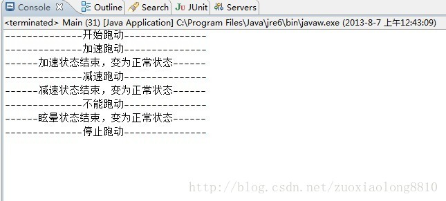
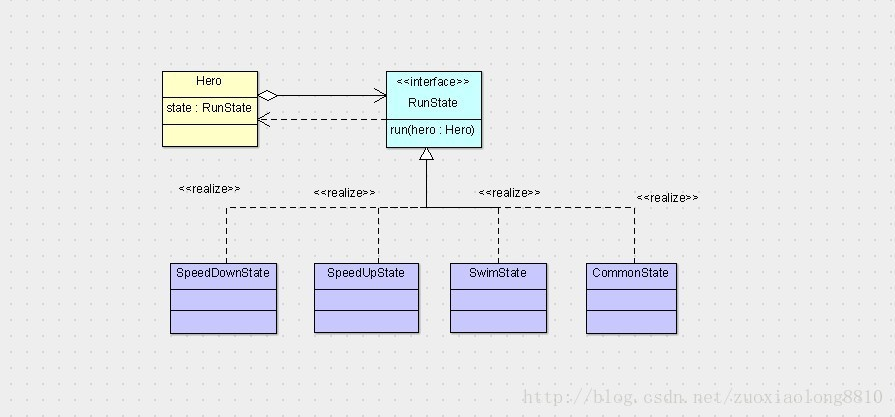
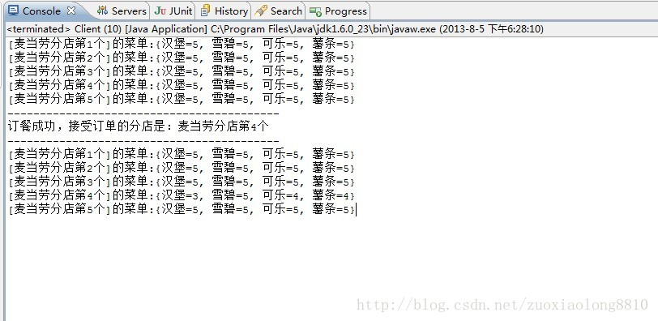
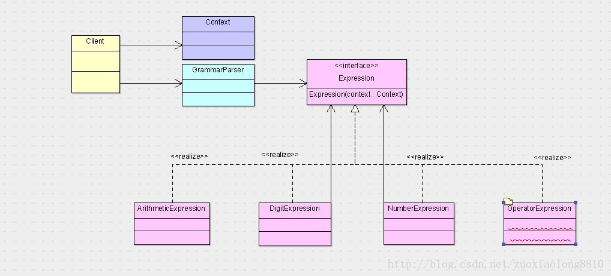

028 设计模式--行为型

## <h1 id="0">23+1 模式</h1>

- <a name="create">**创建型**：</a> 单例模式 、  简单工厂模式 、  工厂方法模式  、 抽象工厂模式 、 建造者模式 、 原型模式
- <a name="structure">**结构型**：</a>  代理模式  、 适配器模式 、  装饰器模式  、 桥接模式 、  组合模式 、  享元模式 、 外观模式 
-  <a name="behavior">**行为型**：[观察者模式](#1)  、  [模板方法模式](#2) 、  [命令模式](#3)  、[状态模式](#4) 、  [职责链模式](#5)  、 [解释器模式](#6)  、[中介者模式](#7) 、  [访问者模式](#8) 、  [策略模式](#9) 、 [备忘录模式](#10) 、[迭代器模式](#11)</a> 


## 行为型

##### <h2 id="1" name="observer">观察者模式详解（包含观察者模式JDK的漏洞以及事件驱动模型）</h2>


说起观察者模式，LZ还是非常激动的，当初这算是第一个让LZ感受到设计模式强大的家伙。当初LZ要做一个小型WEB项目，要上传给服务器文件，一个需求就是要显示上传进度，LZ就是用这个模式解决了当时的问题，那时LZ接触JAVA刚几个月，比葫芦画瓢的用了观察者模式。

现在谈及观察者模式，能用到的地方就相对较多了，通常意义上如果一个对象状态的改变需要通知很多对这个对象关注的一系列对象，就可以使用观察者模式。

下面LZ先给出观察者模式标准版的定义，引自百度百科。

<font size=3 face="黑体" color=#FFA81E>**定义：观察者模式（有时又被称为发布-订阅模式、模型-视图模式、源-收听者模式或从属者模式）是软件设计模式的一种。在此种模式中，一个目标物件管理所有相依于它的观察者物件，并且在它本身的状态改变时主动发出通知。这通常透过呼叫各观察者所提供的方法来实现。此种模式通常被用来实作事件处理系统。**</font>

上面的定义当中，主要有这样几个意思，首先是有一个目标的物件，通俗点讲就是一个类，它管理了所有依赖于它的观察者物件，或者通俗点说是观察者类，并在它自己状态发生变化时，主动发出通知。

**简单点概括成通俗的话来说，就是一个类管理着所有依赖于它的观察者类，并且它状态变化时会主动给这些依赖它的类发出通知。**

那么我们针对上面的描述给出观察者模式的类图，百度百科没有给出观察者模式的类图，这里LZ自己使用工具给各位画一个。


可以看到，我们的被观察者类Observable只关联了一个Observer的列表，然后在自己状态变化时，使用notifyObservers方法通知这些Observer，具体这些Observer都是什么，被观察者是不关心也不需要知道的。

上面就将观察者和被观察者二者的耦合度降到很低了，而我们具体的观察者是必须要知道自己观察的是谁，所以它依赖于被观察者。

下面LZ给写出一个很简单的观察者模式，来使用JAVA代码简单诠释一下上面的类图。

首先是观察者接口。
```Java
package net;

//这个接口是为了提供一个统一的观察者做出相应行为的方法
public interface Observer {

    void update(Observable o);
    
}
```
再者是具体的观察者。
```Java
package net;

public class ConcreteObserver1 implements Observer{

    public void update(Observable o) {
        System.out.println("观察者1观察到" + o.getClass().getSimpleName() + "发生变化");
        System.out.println("观察者1做出相应");
    }

}
```
```Java
package net;

public class ConcreteObserver2 implements Observer{

    public void update(Observable o) {
        System.out.println("观察者2观察到" + o.getClass().getSimpleName() + "发生变化");
        System.out.println("观察者2做出相应");
    }

}
```
下面是被观察者，它有一个观察者的列表，并且有一个通知所有观察者的方法，通知的方式就是调用观察者通用的接口行为update方法。下面我们看它的代码。

```Java
package net;

import java.util.ArrayList;
import java.util.List;

public class Observable {

    List<Observer> observers = new ArrayList<Observer>();
    
    public void addObserver(Observer o){
        observers.add(o);
    }
    
    public void changed(){
        System.out.println("我是被观察者，我已经发生变化了");
        notifyObservers();//通知观察自己的所有观察者
    }
    
    public void notifyObservers(){
        for (Observer observer : observers) {
            observer.update(this);
        }
    }
}
```
这里面很简单，新增两个方法，一个是为了改变自己的同时通知观察者们，一个是为了给客户端一个添加观察者的公共接口。

下面我们使用客户端调用一下，看一下客户端如何操作。
```Java
package net;


public class Client {

    public static void main(String[] args) throws Exception {
        Observable observable = new Observable();
        observable.addObserver(new ConcreteObserver1());
        observable.addObserver(new ConcreteObserver2());
        
        observable.changed();
    }
}
```
可以看到我们在操作被观察者时，只要调用changed方法，观察者们就会做出相应的动作，而添加观察者这个行为算是准备阶段，将具体的观察者关联到被观察者上面去。 

下面LZ给出一个有实际意义的例子，比如我们经常看的小说网站，都有这样的功能，就是读者可以订阅作者，这当中就有明显的观察者模式案例，就是作者和读者。他们的关系是一旦读者关注了一个作者，那么这个作者一旦有什么新书，就都要通知读者们，这明显是一个观察者模式的案例，所以我们可以使用观察者模式解决。

由于JDK中为了方便开发人员，已经写好了现成的观察者接口和被观察者类，下面LZ先给出JDK中现成的观察者和被观察者代码，外加自己的一点解释，来帮助一些读者对JDK中对观察者模式的支持熟悉一下。

先来观察者接口。
```Java
//观察者接口，每一个观察者都必须实现这个接口
public interface Observer {
    //这个方法是观察者在观察对象产生变化时所做的响应动作，从中传入了观察的对象和一个预留参数
    void update(Observable o, Object arg);

}
```

下面是被观察者类。
```Java
import java.util.Vector;

//被观察者类
public class Observable {
    //这是一个改变标识，来标记该被观察者有没有改变
    private boolean changed = false;
    //持有一个观察者列表
    private Vector obs;
    
    public Observable() {
    obs = new Vector();
    }
    //添加观察者，添加时会去重
    public synchronized void addObserver(Observer o) {
        if (o == null)
            throw new NullPointerException();
    if (!obs.contains(o)) {
        obs.addElement(o);
    }
    }
    //删除观察者
    public synchronized void deleteObserver(Observer o) {
        obs.removeElement(o);
    }
    //notifyObservers(Object arg)的重载方法
    public void notifyObservers() {
    notifyObservers(null);
    }
    //通知所有观察者，被观察者改变了，你可以执行你的update方法了。
    public void notifyObservers(Object arg) {
        //一个临时的数组，用于并发访问被观察者时，留住观察者列表的当前状态，这种处理方式其实也算是一种设计模式，即备忘录模式。
        Object[] arrLocal;
    //注意这个同步块，它表示在获取观察者列表时，该对象是被锁定的
    //也就是说，在我获取到观察者列表之前，不允许其他线程改变观察者列表
    synchronized (this) {
        //如果没变化直接返回
        if (!changed)
                return;
            //这里将当前的观察者列表放入临时数组
            arrLocal = obs.toArray();
            //将改变标识重新置回未改变
            clearChanged();
        }
        //注意这个for循环没有在同步块，此时已经释放了被观察者的锁，其他线程可以改变观察者列表
        //但是这并不影响我们当前进行的操作，因为我们已经将观察者列表复制到临时数组
        //在通知时我们只通知数组中的观察者，当前删除和添加观察者，都不会影响我们通知的对象
        for (int i = arrLocal.length-1; i>=0; i--)
            ((Observer)arrLocal[i]).update(this, arg);
    }

    //删除所有观察者
    public synchronized void deleteObservers() {
    obs.removeAllElements();
    }

    //标识被观察者被改变过了
    protected synchronized void setChanged() {
    changed = true;
    }
    //标识被观察者没改变
    protected synchronized void clearChanged() {
    changed = false;
    }
    //返回被观察者是否改变
    public synchronized boolean hasChanged() {
    return changed;
    }
    //返回观察者数量
    public synchronized int countObservers() {
    return obs.size();
    }
}
```

被观察者除了一点同步的地方需要特殊解释一下，其余的相信各位都能看明白各个方法的用途。其实上述JDK的类是有漏洞的，或者说，在我们使用观察者模式时要注意一个问题，就是notifyObservers这个方法中的这一段代码。

```Java
for (int i = arrLocal.length-1; i>=0; i--)
            ((Observer)arrLocal[i]).update(this, arg);
```

在循环遍历观察者让观察者做出响应时，JDK没有去抓取update方法中的异常，所以假设在这过程中有一个update方法抛出了异常，那么剩下还未通知的观察者就全都通知不到了，所以LZ个人比较疑惑这样的用意（LZ无法想象JAVA类库的制造者没考虑到这个问题），是sun当时真的忘了考虑这一点，还是另有它意？当然各位读者如果有自己的见解可以告知LZ，不过LZ认为，不管是sun如此做是别有用意，还是真的欠考虑，我们都要注意在update方法里一定要处理好异常，个人觉得JDK中比较保险的做法还是如下这样。
```Java
for (int i = arrLocal.length-1; i>=0; i--){
            try {
                ((Observer)arrLocal[i]).update(this, arg);
            } catch (Throwable e) {e.printStackTrace();}
        }
```

这样无论其中任何一个update是否成功都不会影响其余的观察者进行更新状态，**我们自己比较保险的做法就是给update方法整个加上try块，或者确认不会发生运行时异常。**

上面LZ和各位一起分析了JDK中观察者模式的源码，下面我们就拿上述小说网的例子，做一个DEMO。

首先要搞清楚在读者和作者之间是谁观察谁，很明显，应该是读者观察作者。所以作者是被观察者，读者是观察者，除了这两个类之外，我们还需要额外添加一个管理器帮我们管理下作者的列表便于读者关注，于是一个观察者模式的DEMO就出现了。如下，首先是读者类，LZ在各个类都加了点注释。

```Java
//读者类，要实现观察者接口
public class Reader implements Observer{
    
    private String name;
    
    public Reader(String name) {
        super();
        this.name = name;
    }

    public String getName() {
        return name;
    }
    
    //读者可以关注某一位作者，关注则代表把自己加到作者的观察者列表里
    public void subscribe(String writerName){
        WriterManager.getInstance().getWriter(writerName).addObserver(this);
    }
    
    //读者可以取消关注某一位作者，取消关注则代表把自己从作者的观察者列表里删除
    public void unsubscribe(String writerName){
        WriterManager.getInstance().getWriter(writerName).deleteObserver(this);
    }
    
    //当关注的作者发表新小说时，会通知读者去看
    public void update(Observable o, Object obj) {
        if (o instanceof Writer) {
            Writer writer = (Writer) o;
            System.out.println(name+"知道" + writer.getName() + "发布了新书《" + writer.getLastNovel() + "》，非要去看！");
        }
    }
    
}
```

  下面是作者类。

```Java
//作者类，要继承自被观察者类
public class Writer extends Observable{
    
    private String name;//作者的名称
    
    private String lastNovel;//记录作者最新发布的小说

    public Writer(String name) {
        super();
        this.name = name;
        WriterManager.getInstance().add(this);
    }

    //作者发布新小说了，要通知所有关注自己的读者
    public void addNovel(String novel) {
        System.out.println(name + "发布了新书《" + novel + "》！");
        lastNovel = novel;
        setChanged();
        notifyObservers();
    }
    
    public String getLastNovel() {
        return lastNovel;
    }

    public String getName() {
        return name;
    }

}
```

 然后我们还需要一个管理器帮我们管理这些作者。如下。
```Java
import java.util.HashMap;
import java.util.Map;

//管理器，保持一份独有的作者列表
public class WriterManager{
    
    private Map<String, Writer> writerMap = new HashMap<String, Writer>();

    //添加作者
    public void add(Writer writer){
        writerMap.put(writer.getName(), writer);
    }
    //根据作者姓名获取作者
    public Writer getWriter(String name){
        return writerMap.get(name);
    }
    
    //单例
    private WriterManager(){}
    
    public static WriterManager getInstance(){
        return WriterManagerInstance.instance;
    }
    private static class WriterManagerInstance{
        
        private static WriterManager instance = new WriterManager();
        
    }
} 
```

好了，这下我们的观察者模式就做好了，这个简单的DEMO可以支持读者关注作者，当作者发布新书时，读者会观察到这个事情，会产生相应的动作。下面我们写个客户端调用一下。

```Java
//客户端调用
public class Client {

    public static void main(String[] args) {
        //假设四个读者，两个作者
        Reader r1 = new Reader("谢广坤");
        Reader r2 = new Reader("赵四");
        Reader r3 = new Reader("七哥");
        Reader r4 = new Reader("刘能");
        Writer w1 = new Writer("谢大脚");
        Writer w2 = new Writer("王小蒙");
        //四人关注了谢大脚
        r1.subscribe("谢大脚");
        r2.subscribe("谢大脚");
        r3.subscribe("谢大脚");
        r4.subscribe("谢大脚");
        //七哥和刘能还关注了王小蒙
        r3.subscribe("王小蒙");
        r4.subscribe("王小蒙");
        
        //作者发布新书就会通知关注的读者
        //谢大脚写了设计模式
        w1.addNovel("设计模式");
        //王小蒙写了JAVA编程思想
        w2.addNovel("JAVA编程思想");
        //谢广坤取消关注谢大脚
        r1.unsubscribe("谢大脚");
        //谢大脚再写书将不会通知谢广坤
        w1.addNovel("观察者模式");
    }
    
}
```
看下我们得到的结果，就会发现，我们确实通知了读者它所关注的作者的动态，而且读者取消关注以后，作者的动态将不再通知该读者。下面是运行结果。


我们使用观察者模式的用意是为了作者不再需要关心他发布新书时都要去通知谁，更重要的是他不需要关心他通知的是读者还是其它什么人，他只知道这个人是实现了观察者接口的，即我们的被观察者依赖的只是一个抽象的接口观察者接口，而不关心具体的观察者都有谁都是什么，比如以后要是游客也可以关注作者了，那么只要游客类实现观察者接口，那么一样可以将游客列入到作者的观察者列表中。

另外，我们让读者自己来选择自己关注的对象，这相当于被观察者将维护通知对象的职能转化给了观察者，这样做的好处是由于一个被观察者可能有N多观察者，所以让被观察者自己维护这个列表会很艰难，这就像一个老师被许多学生认识，那么是所有的学生都记住老师的名字简单，还是让老师记住N多学生的名字简单？答案显而易见，让学生们都记住一个老师的名字是最简单的。

另外，**观察者模式分离了观察者和被观察者二者的责任，这样让类之间各自维护自己的功能，专注于自己的功能，会提高系统的可维护性和可重用性。**

观察者模式其实还有另外一种形态，就是**事件驱动模型**，LZ个人觉得这两种方式大体上其实是非常相似的，所以LZ决定一起引入事件驱动模型。不过观察者更多的强调的是发布-订阅式的问题处理，而事件驱动则更多的注重于界面与数据模型之间的问题，两者还是有很多适用场景上的区别的，虽不能一概而论，但放在一起讨论还是很方便各位理解二者。

说到事件驱动，由于JAVA在桌面应用程序方面有很多欠缺，所以swing的使用其实并不是特别广泛，因为你不可能要求大多数人的机子上都安装了JDK，除非你是给特殊用户人群开发的应用程序，这些用户在你的可控范围内，那么swing或许可以派上用场。

考虑到学习JAVA或者使用JAVA的人群大部分都是在进行web开发，所以本次讨论事件驱动，采用web开发当中所用到的示例。

相信各位都知道tomcat，这是一个app服务器，在使用的过程中，或许经常会有人用到listener，即监听器这个概念。那么其实这个就是一个事件驱动模型的应用。比如我们的spring，我们在应用启动的时候要初始化我们的IOC容器，那么我们的做法就是加入一个listener，这样伴随着tomcat服务器的启动，spring的IOC容器就会跟着启动。

那么这个listener其实就是事件驱动模型中的监听器，它用来监听它所感兴趣的事，比如我们springIOC容器启动的监听器，就是实现的ServletContextListener这个接口，说明它对servletContext感兴趣，会监听servletContext的启动和销毁。

 LZ不打算使用这个例子作为讲解，因为它的内部运作比较复杂，需要搬上来tomcat的源码，对于新手来说，这是个噩耗，所以我们将上述的例子改为事件驱动来实现。也好让各位针对性的对比观察者模式和事件驱动模型。

首先事件驱动模型与观察者模式勉强的对应关系可以看成是，被观察者相当于事件源，观察者相当于监听器，事件源会产生事件，监听器监听事件。所以这其中就搀和到四个类，事件源，事件，监听器以及具体的监听器。

JDK当中依然有现成的一套事件模型类库，其中监听器只是一个标识接口，因为它没有表达对具体对象感兴趣的意思，所以也无法定义监听的事件，只是为了统一，用来给特定的监听器继承。它的源代码如下。

```Java
package java.util;

/**
 * A tagging interface that all event listener interfaces must extend.
 * @since JDK1.1
 */
public interface EventListener {
}
```
  由于代码很短，所以LZ没有删减，当中标注了，所有的事件监听器都必须继承，这是一个标识接口。上述的事件，JDK当中也有一个现成的类供继承，就是EventObject，这个类的源代码如下。
```Java
public class EventObject implements java.io.Serializable {

    private static final long serialVersionUID = 5516075349620653480L;

    /**
     * The object on which the Event initially occurred.
     */
    protected transient Object  source;

    /**
     * Constructs a prototypical Event.
     *
     * @param    source    The object on which the Event initially occurred.
     * @exception  IllegalArgumentException  if source is null.
     */
    public EventObject(Object source) {
    if (source == null)
        throw new IllegalArgumentException("null source");

        this.source = source;
    }

    /**
     * The object on which the Event initially occurred.
     *
     * @return   The object on which the Event initially occurred.
     */
    public Object getSource() {
        return source;
    }

    /**
     * Returns a String representation of this EventObject.
     *
     * @return  A a String representation of this EventObject.
     */
    public String toString() {
        return getClass().getName() + "[source=" + source + "]";
    }
}
```

这个类并不复杂，它只是想表明，所有的事件都应该带有一个事件源，大部分情况下，这个事件源就是我们被监听的对象。

如果我们采用事件驱动模型去分析上面的例子，那么作者就是事件源，而读者就是监听器，依据这个思想，我们把上述例子改一下，首先我们需要自定义我们自己的监听器和事件。所以我们定义如下作者事件。

```Java
import java.util.EventObject;

public class WriterEvent extends EventObject{
    
    private static final long serialVersionUID = 8546459078247503692L;

    public WriterEvent(Writer writer) {
        super(writer);
    }
    
    public Writer getWriter(){
        return (Writer) super.getSource();
    }

}
```

这代表了一个作者事件，这个事件当中一般就是包含一个事件源，在这里就是作者，当然有的时候你可以让它带有更多的信息，以方便监听器做出更加细致的动作。下面我们定义如下监听器。

```Java
import java.util.EventListener;

public interface WriterListener extends EventListener{

    void addNovel(WriterEvent writerEvent);
    
}
```

这个监听器猛地一看，特别像观察者接口，它们承担的功能是类似的，都是提供观察者或者监听者实现自己响应的行为规定，其中addNovel方法代表的是作者发布新书时的响应。加入了这两个类以后，我们原有的作者和读者类就要发生点变化了，我们先来看作者类的变化。

```Java
import java.util.HashSet;
import java.util.Set;

//作者类
public class Writer{
    
    private String name;//作者的名称
    
    private String lastNovel;//记录作者最新发布的小说
    
    private Set<WriterListener> writerListenerList = new HashSet<WriterListener>();//作者类要包含一个自己监听器的列表

    public Writer(String name) {
        super();
        this.name = name;
        WriterManager.getInstance().add(this);
    }

    //作者发布新小说了，要通知所有关注自己的读者
    public void addNovel(String novel) {
        System.out.println(name + "发布了新书《" + novel + "》！");
        lastNovel = novel;
        fireEvent();
    }
    //触发发布新书的事件，通知所有监听这件事的监听器
    private void fireEvent(){
        WriterEvent writerEvent = new WriterEvent(this);
        for (WriterListener writerListener : writerListenerList) {
            writerListener.addNovel(writerEvent);
        }
    }
    //提供给外部注册成为自己的监听器的方法
    public void registerListener(WriterListener writerListener){
        writerListenerList.add(writerListener);
    }
    //提供给外部注销的方法
    public void unregisterListener(WriterListener writerListener){
        writerListenerList.remove(writerListener);
    }
    
    public String getLastNovel() {
        return lastNovel;
    }

    public String getName() {
        return name;
    }

}
```

可以看到，作者类的主要变化是添加了一个自己的监听器列表，我们使用set是为了它的天然去重效果，并且提供给外部注册和注销的方法，与观察者模式相比，这个功能本身是由基类Observable提供的，不过观察者模式中有统一的观察者Observer接口，但是监听器没有，虽说有EventListener这个超级接口，但它毕竟没有任何行为。所以我们一般需要维持一个自己特有的监听器列表。

下面我们看读者类的变化，如下。

```Java
public class Reader implements WriterListener{

    private String name;
    
    public Reader(String name) {
        super();
        this.name = name;
    }

    public String getName() {
        return name;
    }
    
    //读者可以关注某一位作者，关注则代表把自己加到作者的监听器列表里
    public void subscribe(String writerName){
        WriterManager.getInstance().getWriter(writerName).registerListener(this);
    }
    
    //读者可以取消关注某一位作者，取消关注则代表把自己从作者的监听器列表里注销
    public void unsubscribe(String writerName){
        WriterManager.getInstance().getWriter(writerName).unregisterListener(this);
    }
    
    public void addNovel(WriterEvent writerEvent) {
        Writer writer = writerEvent.getWriter();
        System.out.println(name+"知道" + writer.getName() + "发布了新书《" + writer.getLastNovel() + "》，非要去看！");
    }

}
```
 读者类的变化，首先本来是实现Observer接口，现在要实现WriterListener接口，响应的update方法就改为我们定义的addNovel方法，当中的响应基本没变。另外就是关注和取消关注的方法中，原来是给作者类添加观察者和删除观察者，现在是注册监听器和注销监听器，几乎是没什么变化的。

我们彻底将刚才的观察者模式改成了事件驱动，现在我们使用事件驱动的类再运行一下客户端，其中客户端代码和WriterManager类的代码是完全不需要改动的，直接运行客户端即可。我们会发现得到的结果与观察者模式一模一样。

走到这里我们发现二者可以达到的效果一模一样，那么两者是不是一样呢？

答案当然是否定的，首先我们从实现方式上就能看出，事件驱动可以解决观察者模式的问题，但反过来则不一定，另外二者所表达的业务场景也不一样，比如上述例子，使用观察者模式更贴近业务场景的描述，而使用事件驱动，从业务上讲，则有点勉强。

**二者除了业务场景的区别以外，在功能上主要有以下区别。**
<font size=3 face="黑体" color=#FF875B>
1，观察者模式中观察者的响应理论上讲针对特定的被观察者是唯一的（说理论上唯一的原因是，如果你愿意，你完全可以在update方法里添加一系列的elseif去产生不同的响应，但LZ早就说过，你应该忘掉elseif），而事件驱动则不是，因为我们可以定义自己感兴趣的事情，比如刚才，我们可以监听作者发布新书，我们还可以在监听器接口中定义其它的行为。再比如tomcat中，我们可以监听servletcontext的init动作，也可以监听它的destroy动作。

2，虽然事件驱动模型更加灵活，但也是付出了系统的复杂性作为代价的，因为我们要为每一个事件源定制一个监听器以及事件，这会增加系统的负担，各位看看tomcat中有多少个监听器和事件类就知道了。

3，另外观察者模式要求被观察者继承Observable类，这就意味着如果被观察者原来有父类的话，就需要自己实现被观察者的功能，当然，这一尴尬事情，我们可以使用适配器模式弥补，但也不可避免的造成了观察者模式的局限性。事件驱动中事件源则不需要，因为事件源所维护的监听器列表是给自己定制的，所以无法去制作一个通用的父类去完成这个工作。

4，被观察者传送给观察者的信息是模糊的，比如update中第二个参数，类型是Object，这需要观察者和被观察者之间有约定才可以使用这个参数。而在事件驱动模型中，这些信息是被封装在Event当中的，可以更清楚的告诉监听器，每个信息都是代表的什么。
</font>

由于上述使用事件驱动有点勉强，所以LZ给各位模拟一个我们js当中的一个事件驱动模型，就是按钮的点击事件。

在这个模型当中，按钮自然就是事件源，而事件的种类有很多，比如点击（click），双击（dblclick），鼠标移动事件（mousemove）。我们的监听器与事件个数是一样的，所以这也是事件驱动的弊端，我们需要一堆事件和监听器，下面LZ一次性给出这三种事件和监听器，其余还有很多事件，类似，LZ这里省略。

```Java
import java.util.EventObject;
//按钮事件基类
public abstract class ButtonEvent extends EventObject{

    public ButtonEvent(Object source) {
        super(source);
    }

    public Button getButton(){
        return (Button) super.getSource();
    }
}
//点击事件
class ClickEvent extends ButtonEvent{

    public ClickEvent(Object source) {
        super(source);
    }

}
//双击事件
class DblClickEvent extends ButtonEvent{

    public DblClickEvent(Object source) {
        super(source);
    }

}
//鼠标移动事件
class MouseMoveEvent extends ButtonEvent{
    //鼠标移动事件比较特殊，因为它需要告诉监听器鼠标当前的坐标是在哪，我们记录为x,y
    private int x;
    private int y;

    public MouseMoveEvent(Object source, int x, int y) {
        super(source);
        this.x = x;
        this.y = y;
    }

    public int getX() {
        return x;
    }

    public int getY() {
        return y;
    }
    
}
```
 以上是三种事件，都非常简单，只有鼠标移动需要额外的坐标，下面给出三种监听器。

```Java
import java.util.EventListener;
//点击监听器
interface ClickListener extends EventListener{

    void click(ClickEvent clickEvent);
    
}

//双击监听器
interface DblClickListener extends EventListener{

    void dblClick(DblClickEvent dblClickEvent);
    
}

//鼠标移动监听器
interface MouseMoveListener extends EventListener{

    void mouseMove(MouseMoveEvent mouseMoveEvent);
    
}
```

三种监听器分别监听点击，双击和鼠标移动。下面给出我们最重要的类，Button。

```Java
//我们模拟一个html页面的button元素，LZ只添加个别属性，其余属性同理
public class Button {
    
    private String id;//这相当于id属性
    private String value;//这相当于value属性
    private ClickListener onclick;//我们完全模拟原有的模型，这个其实相当于onclick属性
    private DblClickListener onDblClick;//同理，这个相当于双击属性
    private MouseMoveListener onMouseMove;//同理
    
    //按钮的单击行为
    public void click(){
        onclick.click(new ClickEvent(this));
    }
    //按钮的双击行为
    public void dblClick(){
        onDblClick.dblClick(new DblClickEvent(this));
    }
    //按钮的鼠标移动行为
    public void mouseMove(int x,int y){
        onMouseMove.mouseMove(new MouseMoveEvent(this,x,y));
    }
    //相当于给id赋值
    public void setId(String id) {
        this.id = id;
    }
    //类似
    public void setValue(String value) {
        this.value = value;
    }
    //这个相当于我们在给onclick添加函数，即设置onclick属性
    public void setOnclick(ClickListener onclick) {
        this.onclick = onclick;
    }
    //同理
    public void setOnDblClick(DblClickListener onDblClick) {
        this.onDblClick = onDblClick;
    }
    //同理
    public void setOnMouseMove(MouseMoveListener onMouseMove) {
        this.onMouseMove = onMouseMove;
    }
    //以下get方法
    public String getId() {
        return id;
    }
    
    public String getValue() {
        return value;
    }
    
    public ClickListener getOnclick() {
        return onclick;
    }
    
    public DblClickListener getOnDblClick() {
        return onDblClick;
    }
    
    public MouseMoveListener getOnMouseMove() {
        return onMouseMove;
    }
    
}
```
可以看到，按钮Button类有很多属性，都是我们经常看到的，id，value，onclick等等。下面我们模拟编写一个页面，这个页面可以当做是一个JSP页面，我们只有一个按钮，我们用JAVA语言把它描述出来，如下。
```Java
//假设这个是我们写的某一个特定的jsp页面，里面可能有很多元素，input，form，table，等等
//我们假设只有一个按钮
public class ButtonJsp {

    private Button button;

    public ButtonJsp() {
        super();
        button = new Button();//这个可以当做我们在页面写了一个button元素
        button.setId("submitButton");//取submitButton为id
        button.setValue("提交");//提交按钮
        button.setOnclick(new ClickListener() {//我们给按钮注册点击监听器
            //按钮被点，我们就验证后提交
            public void click(ClickEvent clickEvent) {
                System.out.println("--------单击事件代码---------");
                System.out.println("if('表单合法'){");
                System.out.println("\t表单提交");
                System.out.println("}else{");
                System.out.println("\treturn false");
                System.out.println("}");
            }
        });
        button.setOnDblClick(new DblClickListener() {
            //双击的话我们提示用户不能双击“提交”按钮
            public void dblClick(DblClickEvent dblClickEvent) {
                System.out.println("--------双击事件代码---------");
                System.out.println("alert('您不能双击"+dblClickEvent.getButton().getValue()+"按钮')");
            }
        });
        button.setOnMouseMove(new MouseMoveListener() {
            //这个我们只简单提示用户鼠标当前位置，示例中加入这个事件
            //目的只是为了说明事件驱动中，可以包含一些特有的信息，比如坐标
            public void mouseMove(MouseMoveEvent mouseMoveEvent) {
                System.out.println("--------鼠标移动代码---------");
                System.out.println("alert('您当前鼠标的位置，x坐标为："+mouseMoveEvent.getX()+"，y坐标为："+mouseMoveEvent.getY()+"')");
            }
        });
    }

    public Button getButton() {
        return button;
    }
    
}
```

以上可以认为我们给web服务中写了一个简单的页面，下面我们看客户在访问我们的页面时，我们的页面在做什么。
```Java
public class Client {

    public static void main(String[] args) {
        ButtonJsp jsp = new ButtonJsp();//客户访问了我们的这个JSP页面
        //以下客户开始在按钮上操作
        jsp.getButton().dblClick();//双击按钮
        jsp.getButton().mouseMove(10, 100);//移动到10，100
        jsp.getButton().mouseMove(15, 90);//又移动到15,90
        jsp.getButton().click();//接着客户点了提交
    }
}
```
  我们看运行结果可以看到，我们的三个事件都起了作用，最终提交了表单。


以上就是模拟整个JSP页面中，我们的按钮响应用户事件的过程，我相信通过这两个例子，各位应该对观察者模式和事件驱动都有了自己的理解和认识，二者都是用来处理变化与响应的问题，其中观察者更多的是发布-订阅，也就是类似读者和作者的关系，而事件驱动更多的是为了响应客户的请求，从而制定一系列的事件和监听器，去处理客户的请求与操作。

二者其实都是有自己的弱项的，只有掌握了模式的弱项才能更好的使用，不是有句话叫“真正了解一个东西，不是知道它能干什么，而是知道它不能干什么。”吗？

观察者模式所欠缺的是设计上的问题，即观察者和被观察者是多对一的关系，那么反过来的话，就无法支持了。

各位可以尝试将二者位置互换达到这个效果，这算是设计模式的活用，很简单，就是让被观察者做成一个接口，提供是否改变的方法，让观察者维护一个被观察者的列表，另外开启一个线程去不断的测试各个被观察者是否改变。由于本篇已经够长，所以LZ不再详细编写，如果有哪位读者有需要，可以在下方留言，LZ看到的话，如果有时间，会写出来放到资源里供各位下载。

观察者模式还有一个缺点就是，每一个观察者都要实现观察者接口，才能添加到被观察者的列表当中，假设一个观察者已经存在，而且我们无法改变其代码，那么就无法让它成为一个观察者了，不过这个我们依然可以使用适配器模式解决。但是还有一个问题就不好解决了，就是假如我们很多类都是现成的，当被观察者发生变化时，每一个观察者都需要调用不同的方法，那么观察者模式就有点捉襟见肘的感觉了，我们必须适配每一个类去统一他们变化的方法名称为update，这是一个很可怕的事情。

对于事件驱动就没有这样的问题，我们可以实现多个监听器来达到监听多个事件源的目的，但是它的缺点刚才已经说过了，在事件源或者事件增加时，监听器和事件类通常情况下会成对增加，造成系统的复杂性增加，不过目前看来，事件驱动模型一般都比较稳定，所以这个问题并不太明显，因为很少见到无限增加事件的情况发生。

还有一个缺点就是我们的事件源需要看准时机触发自己的各个监听器，这也从某种意义上增加了事件源的负担，造成了类一定程度上的臃肿。

最后，LZ再总结下二者针对的业务场景概述。


<font size=3 color=red face="黑体">**观察者模式：发布（release）--订阅（subscibe），变化（change）--更新（update）**</font>						

			
<font size=3 color=red face="黑体">**事件驱动模型：请求（request）--响应（response），事件发生（occur）--事件处理（handle）**</font>  [观察者模式](#1) | [行为型](#0)

##### <h2 id="2" name="template">模板方法模式详解（包含与类加载器不得不说的故事）</h2>


模板方法模式，这是一个在许多优秀的开源项目中LZ见的最多的一个设计模式，也是LZ觉得最为优秀的一个设计模式，所以这一章LZ会尽自己所能的去尽量将这个设计模式解释清楚。

模板方法模式，一般是为了统一子类的算法实现步骤，所使用的一种手段或者说是方式。它在父类中定义一系列算法的步骤，而将具体的实现都推迟到子类。

最典型的形式就是一个接口，一个抽象父类，父类中会有一系列的抽象方法，而在子类中去一一实现这些方法。

下面LZ给举一个例子，比如我们有一个接口，里面就一个方法，是用来制造一个HTML页面，如下。
```Java
public interface PageBuilder {

    String bulidHtml();
    
}
```
这个接口很简单，就是直接制造一个Html页面的内容，假设我们不使用模板方法模式，直接让各个子类去直接实现这个接口，那么肯定实现的方式千奇百怪，而且步骤也乱七八糟的，这样实在不利于维护和扩展。所以我们可以使用模板方法模式，将这个过程给制定好，然后把具体的内容填充交给子类就好，这样这些子类生成的HTML页面就会非常一致。

基于这个目的，我们定义如下抽象类，去实现这个接口，并且我们定义好步骤。
```Java
public abstract class AbstractPageBuilder implements PageBuilder{

    private StringBuffer stringBuffer = new StringBuffer();
    
    public String bulidHtml() {
        //首先加入doctype,因为都是html页面,所以我们父类不需要推迟给子类实现,直接在父类实现
        stringBuffer.append("<!DOCTYPE html PUBLIC \"-//W3C//DTD XHTML 1.0 Transitional//EN\" \"http://www.w3.org/TR/xhtml1/DTD/xhtml1-strict.dtd\">");
        //页面下面就是成对的一个HTML标签，我们也在父类加入,不需要给子类实现
        stringBuffer.append("<html xmlns=\"http://www.w3.org/1999/xhtml\">");
        //下面就应该是head标签里的内容了,这个我们父类做不了主了,推迟到子类实现,所以我们定义一个抽象方法,让子类必须实现
        appendHead(stringBuffer);
        //下面是body的内容了，我们父类依然无法做主，仍然推迟到子类实现
        appendBody(stringBuffer);
        //html标签的关闭
        stringBuffer.append("</html>");
        return stringBuffer.toString();
    }
    
    //第一个模板方法
    protected abstract void appendHead(StringBuffer stringBuffer);
    
    //第二个模板方法
    protected abstract void appendBody(StringBuffer stringBuffer);

}
```

上面LZ已经加了注释，这下我们如果要制作一个html页面，就直接继承我们的抽象父类就可以了，而我们的子类只需要实现两个模板方法，就可以成功完成html页面的创建，下面LZ给出一个子类，我们随意制造一个html页面。

```Java
public class MyPageBuilder extends AbstractPageBuilder{

    @Override
    protected void appendHead(StringBuffer stringBuffer) {
        stringBuffer.append("<head><title>你好</title></head>");
    }

    @Override
    protected void appendBody(StringBuffer stringBuffer) {
        stringBuffer.append("<body><h1>你好,世界！</h1></body>");
    }
    
    public static void main(String[] args) {
        PageBuilder pageBuilder = new MyPageBuilder();
        System.out.println(pageBuilder.bulidHtml());
    }

}
```

我们简单的加入一个head和body标签，然后创建测试类运行一下，就会发现，我们按照父类给的标准模板，生成了一个html页面。

这样做的方式的好处是，父类可以规范子类的创建过程，便于我们维护，而且子类也更省事，因为像doctype包括html标签都是一样的，所以子类不再需要关心这些。当然上述LZ写的有点粗糙，其实我们可以定义的更仔细一点，比如head标签里，第一个是title，然后是meta等等。但作为例子，我们还是遵循简单的原则，主要还是想给各位传达模板方法模式的思想。

模板方法模式是所有设计模式当中，LZ觉得最无侵入性的模式，因为它的好处实在是太明显了。模板方法模式并不强制接口的实现类必须继承，所以不会对子类造成任何影响，而如果子类的实现可以配得上模板类的模板，那么就可以享受模板方法模式带来的好处。

<font size=3 face="黑体" color=red>通常情况下，模板方法模式用于定义构建某个对象的步骤与顺序，或者定义一个算法的骨架。</font>

我们刚才的示例明显就是构建一个String对象的过程，在这里要声明一点，对于模板方法模式，父类提供的构建步骤和顺序或者算法骨架，通常是不希望甚至是不允许子类去覆盖的，<font size=3 face="黑体" color=red>所以在某些场景中，可以直接将父类中提供骨架的方法声明为final类型。</font>

模板方法模式还有一种使用的方式，为了给子类足够的自由度，可以提供一些方法供子类覆盖，去实现一些骨架中不是必须但却可以有自定义实现的步骤。

比如上述的例子当中，我们应该都知道，HTML页面中有一些标签是可有可无的。比如meta标签，link标签，script标签等。那么我们可以将刚才的例子细化一下，去看一下上面说的供子类覆盖的方法是什么。我们将刚才的抽象父类细化成如下形式。

```Java
public abstract class AbstractPageBuilder implements PageBuilder{

    private static final String DEFAULT_DOCTYPE = "<!DOCTYPE html PUBLIC \"-//W3C//DTD XHTML 1.0 Transitional//EN\" \"http://www.w3.org/TR/xhtml1/DTD/xhtml1-strict.dtd\">";
    
    private static final String DEFAULT_XMLNS = "http://www.w3.org/1999/xhtml";
    
    private StringBuffer stringBuffer = new StringBuffer();
    
    public String bulidHtml() {
        stringBuffer.append(DEFAULT_DOCTYPE);
        stringBuffer.append("<html xmlns=\"" + DEFAULT_XMLNS + "\">");
        stringBuffer.append("<head>");
        appendTitle(stringBuffer);
        appendMeta(stringBuffer);
        appendLink(stringBuffer);
        appendScript(stringBuffer);
        stringBuffer.append("</head>");
        appendBody(stringBuffer);
        stringBuffer.append("</html>");
        return stringBuffer.toString();
    }
    
    protected void appendMeta(StringBuffer stringBuffer){
    }
    
    protected void appendLink(StringBuffer stringBuffer){
    }
    
    protected void appendScript(StringBuffer stringBuffer){
    }
    
    protected abstract void appendTitle(StringBuffer stringBuffer);
    
    protected abstract void appendBody(StringBuffer stringBuffer);

}
```
可以看到，我们将head标签的生成过程更加细化了，分成四个方法，title，meta，link和script。但是这四个里面appendTitle是模板方法，子类必须实现，而其它三个则是普通的空方法。

那么上述三个方法，就是留给子类覆盖的，当然子类可以选择不覆盖，那么生成的HTML就没有meta，link和script这三种标签，如果想有的话，就可以覆盖其中任意一个，比如下面这样。
```Java
public class MyPageBuilder extends AbstractPageBuilder{
    
    protected void appendMeta(StringBuffer stringBuffer) {
        stringBuffer.append("<meta http-equiv=\"Content-Type\" content=\"text/html; charset=utf-8\" />");
    }

    protected void appendTitle(StringBuffer stringBuffer) {
        stringBuffer.append("<title>你好</title>");
    }

    protected void appendBody(StringBuffer stringBuffer) {
        stringBuffer.append("<body>你好，世界！</body>");
    }

    public static void main(String[] args) {
        PageBuilder pageBuilder = new MyPageBuilder();
        System.out.println(pageBuilder.bulidHtml());
    }
    
}
```
我们覆盖了appendMeta方法，所以我们就可以在head标签中生成一个meta标签。如果各位看过上章的适配器模式，其实这里和缺省适配很像，目的都是一样的，因为如果把appendMeta也写成抽象方法，那么子类就必须实现，但是meta标签又不是必须的，所以子类就有可能把appendMeta，appendLink，appendScript方法全空着了。

**所以为了不强制子类实现不必要的抽象方法，但又不剥夺子类自由选择的权利，我们在父类提供一个默认的空实现，来让子类自由选择是否要覆盖掉这些方法。**

说到模板方法模式，我们JDK当中有一个类与它还有一个不得不说的故事，那就是类加载器。

JDK类加载器可以大致分为三类，分别是启动类加载器，扩展类加载器，以及应用程序加载器。

这三者加载类的路径分别为如下：
<font size=3 face="黑体" color=red>
**启动类加载器：**JAVA_HOME/lib目录下，以及被-Xbootcalsspath参数设定的路径，不过启动类加载器加载的类是有限制的，如果JVM不认识的话，你放在这些目录下也没用。

**扩展类加载器：**JAVA_HOME/lib/ext目录下，以及被java.ext.dirs系统变量指定的路径。

**应用程序类加载器：**用户自己的类路径（classpath），这个类加载器就是我们经常使用的系统类加载器，并且JDK中的抽象类ClassLoader的默认父类加载器就是它。</font>

在这里为什么说类加载器和模板方法模式有关呢，是因为`ClassLoader类`就使用了模板模式，去保证类加载过程中的唯一性。LZ先给各位看下这个类当中的模板模式的应用。

```Java
public abstract class ClassLoader {
    //这是一个重载方法
    public Class<?> loadClass(String name) throws ClassNotFoundException {
    return loadClass(name, false);
    }
    
    //这里就是父类算法的定义
    protected synchronized Class<?> loadClass(String name, boolean resolve)
    throws ClassNotFoundException
    {
    Class c = findLoadedClass(name);
    if (c == null) {
        try {
        if (parent != null) {
            c = parent.loadClass(name, false);
        } else {
            c = findBootstrapClass0(name);
        }
        } catch (ClassNotFoundException e) {
            c = findClass(name);
        }
    }
    if (resolve) {
        resolveClass(c);
    }
    return c;
    }
    //这里留了一个方法给子类选择性覆盖
    protected Class<?> findClass(String name) throws ClassNotFoundException {
    throw new ClassNotFoundException(name);
    }

}
```
LZ截取了主要的部分，为了突出这三个方法。在上面LZ加了简单的注释，相信经过刚才的介绍，各位应该能看出来这是一个模板方法模式，只是它没有定义抽象方法，因为findClass这个方法，并不是必须实现的，所以JDK选择留给程序员们自己选择是否要覆盖。

从代码上我们可以看出，在ClassLoader中定义的算法顺序是。

1，首先看是否有已经加载好的类。

2，如果父类加载器不为空，则首先从父类类加载器加载。

3，如果父类加载器为空，则尝试从启动加载器加载。

4，如果两者都失败，才尝试从findClass方法加载。

这是JDK类加载器的双亲委派模型，即先从父类加载器加载，直到继承体系的顶层，否则才会采用当前的类加载器加载。这样做的目的刚才已经说了，是为了JVM中类的一致性。                            

如果有读者第一次接触这方面的知识，估计会比较迷茫，下面LZ给出一个例子。各位猜测下下面程序的运行结果会是什么？
```Java
package com.classloader;

public class ClassLoaderTest {

    public static void main(String[] args) throws Exception {
        Class<?> clazz = ClassLoader.getSystemClassLoader().loadClass("com.classloader.ClassLoaderTest");
        Object entity = clazz.newInstance();
        System.out.println(entity instanceof ClassLoaderTest);
    }
}
```
相信各位都可以毫无疑问的猜测出来，结果应该是true，这是因为entity是ClassLoaderTest类的一个实例，instanceof关键字用来判断一个实例是否属于一个特定的类型，所以结果就是true。

那么各位再来猜猜下面这段代码的运行结果会是什么？
```Java
package com.classloader;

import java.io.IOException;
import java.io.InputStream;

class MyClassLoader extends ClassLoader{
    
    public Class<?> loadClass(String name) throws ClassNotFoundException {
        String fileName = name.substring(name.lastIndexOf(".")+1) + ".class";
        InputStream is = getClass().getResourceAsStream(fileName);
        if (is == null) {
            return super.loadClass(name);
        }
        try {
            byte[] b = new byte[is.available()];
            is.read(b);
            return defineClass(name, b, 0, b.length);
        } catch (IOException e) {
            throw new ClassNotFoundException();
        }
    }
    
}

public class ClassLoaderTest {

    public static void main(String[] args) throws InstantiationException, IllegalAccessException, ClassNotFoundException {
        ClassLoader classLoader = new MyClassLoader();
        Class<?> clazz = classLoader.loadClass("com.classloader.ClassLoaderTest");
        Object entity = clazz.newInstance();
        System.out.println(entity instanceof ClassLoaderTest);
    }
    
}
```
 对于类加载器比较熟悉的读者们可能觉得这个结果并不出乎意料，可是或许还是有人会比较意外，为什么结果会是false呢？

这是因为如果没有按照ClassLoader中提供的骨架算法去加载类的话，可能会造成JVM中有两个一模一样的类信息，他们是来自一个类文件，但却不是一个加载器加载的，所以这两个类不相等。

这也是类加载器为何要使用模板模式给我们定义好查找的算法，是为了保证我们加载的每一个类在虚拟机当中都有且仅有一个。

不过你可能会想，既然如此，为何不把loadClass方法写成final类型的，这样不是更安全吗？

这是因为有的时候我们希望JVM当中每一个类有且仅有一个，但有的时候我们希望有两个，甚至N个，就比如我们的tomcat，你可以想象下，你每一个项目假设都有com.xxx.xxxx.BaseDao等等，如果这些类都是一个的话，你的tomcat还能同时启动多个WEB服务吗？虽说tomcat也是遵循的双亲委派模型，但是从此也可以看出来，我们并不是在所有时候都希望同一个全限定名的类在整个JVM里面只有一个。

这里提到类加载器，是为了给模板方法一个现有的现实中的例子，以便于有些看多了自己制造的例子的读者可以换个口味，如果有机会，LZ会在这个系列完结以后，专门开一个系列来和各位分享学习虚拟机过程中的感悟，本次不再过多介绍类加载器的相关内容。

另外，如果多掌握一些类加载器的知识，还是对平时的工作和学习有很大帮助的，各位也可以私下去搜索下相关资料。

好了，模板方法模式就介绍到这里吧，希望各位都有自己的收获。 [模板方法模式](#2) | [行为型](#0)

##### <h2 id="3" name="mingling">命令模式详解（故事版）</h2>


<font size=3 face="黑体" color=#42b707>&emsp;&emsp;定义：在软件系统中，“行为请求者”与“行为实现者”通常呈现一种“紧耦合”。但在某些场合，比如要对行为进行“记录、撤销/重做、事务”等处理，这种无法抵御变化的紧耦合是不合适的。在这种情况下，如何将“行为请求者”与“行为实现者”解耦？将一组行为抽象为对象，实现二者之间的松耦合。这就是命令模式（Command Pattern）。</font>

优缺点：
- 1，最大的优点，就是将行为请求者和行为实现者解耦。
- 2，命令的添加特别方便，并且可以方便的制定各种命令和利用现有命令组合出新的命令。
- 3，如果针对每一类具有共同接口的接受者制作一个调用者，可以控制命令的执行情况。

  [命令模式](#3) | [行为型](#0)

##### <h2 id="4" name="mingling" name="state">状态模式详解（DOTA版）</h2>


<font size=3 face="黑体" color=#42b707>定义：(源于Design Pattern)：当一个对象的内在状态改变时允许改变其行为，这个对象看起来像是改变了其类。</font>

- 1、有一个对象，它是有状态的。
- 2、这个对象在状态不同的时候，行为不一样。
- 3、这些状态是可以切换的，而非毫无关系。


类图中包含三个角色。

**Context：它就是那个含有状态的对象，它可以处理一些请求，这些请求最终产生的响应会与状态相关。**

**State：状态接口，它定义了每一个状态的行为集合，这些行为会在Context中得以使用。**

**ConcreteState：具体状态，实现相关行为的具体状态类。**

 玩过的朋友都知道，DOTA里的英雄有很多状态，比如正常，眩晕，加速，减速等等。相信就算没有玩过DOTA的朋友们，在其它游戏里也能见到类似的情况。那么假设我们的DOTA没有使用状态模式，则我们的英雄类会非常复杂和难以维护，我们来看下，原始版的英雄类是怎样的。
```Java
package com.state;

//英雄类
public class Hero {
    
    public static final int COMMON = 1;//正常状态
    
    public static final int SPEED_UP = 2;//加速状态
    
    public static final int SPEED_DOWN = 3;//减速状态
    
    public static final int SWIM = 4;//眩晕状态
    
    private int state = COMMON;//默认是正常状态
    
    private Thread runThread;//跑动线程
    
    //设置状态
    public void setState(int state) {
        this.state = state;
    }
    //停止跑动
    public void stopRun() {
        if (isRunning()) runThread.interrupt();
        System.out.println("--------------停止跑动---------------");
    }
    //开始跑动
    public void startRun() {
        if (isRunning()) {
            return;
        }
        final Hero hero = this;
        runThread = new Thread(new Runnable() {
            public void run() {
                while (!runThread.isInterrupted()) {
                    try {
                        hero.run();
                    } catch (InterruptedException e) {
                        break;
                    }
                }
            }
        });
        System.out.println("--------------开始跑动---------------");
        runThread.start();
    }
    
    private boolean isRunning(){
        return runThread != null && !runThread.isInterrupted();
    }
    //英雄类开始奔跑
    private void run() throws InterruptedException{
        if (state == SPEED_UP) {
            System.out.println("--------------加速跑动---------------");
            Thread.sleep(4000);//假设加速持续4秒
            state = COMMON;
            System.out.println("------加速状态结束，变为正常状态------");
        }else if (state == SPEED_DOWN) {
            System.out.println("--------------减速跑动---------------");
            Thread.sleep(4000);//假设减速持续4秒
            state = COMMON;
            System.out.println("------减速状态结束，变为正常状态------");
        }else if (state == SWIM) {
            System.out.println("--------------不能跑动---------------");
            Thread.sleep(2000);//假设眩晕持续2秒
            state = COMMON;
            System.out.println("------眩晕状态结束，变为正常状态------");
        }else {
            //正常跑动则不打印内容，否则会刷屏
        }
    }

}
```
  下面我们写一个客户端类，去试图让英雄在各种状态下奔跑一下。
```Java
package com.state;

public class Main {

    public static void main(String[] args) throws InterruptedException {
        Hero hero = new Hero();
        hero.startRun();
        hero.setState(Hero.SPEED_UP);
        Thread.sleep(5000);
        hero.setState(Hero.SPEED_DOWN);
        Thread.sleep(5000);
        hero.setState(Hero.SWIM);
        Thread.sleep(5000);
        hero.stopRun();
    }
}
```


可以看到，我们的英雄在跑动过程中随着状态的改变，会以不同的状态进行跑动。

在上面原始的例子当中，我们的英雄类当中有明显的if else结构，我们再来看看百度百科中状态模式所解决的问题的描述。

**状态模式解决的问题：状态模式主要解决的是当控制一个对象状态的条件表达式过于复杂时的情况。把状态的判断逻辑转移到表示不同状态的一系列类中，可以把复杂的判断逻辑简化。**

不用说，状态模式是可以解决我们上面的if else结构的，我们采用状态模式，利用多态的特性可以消除掉if else结构。这样所带来的好处就是可以大大的增加程序的可维护性与扩展性。

下面我们就使用状态模式对上面的例子进行改善，首先第一步，就是我们需要定义一个状态接口，这个接口就只有一个方法，就是run。
```Java
package com.state;

public interface RunState {

    void run(Hero hero);
    
}
```
与状态模式类图不同的是，我们加入了一个参数Hero（Context），这样做的目的是为了具体的状态类当达到某一个条件的时候可以切换上下文的状态。下面列出四个具体的状态类，其实就是把if else拆掉放到这几个类的run方法中。
```Java
package com.state;

public class CommonState implements RunState{

    public void run(Hero hero) {
        //正常跑动则不打印内容，否则会刷屏
    }

}
```

```Java
package com.state;

public class SpeedUpState implements RunState{

    public void run(Hero hero) {
        System.out.println("--------------加速跑动---------------");
        try {
            Thread.sleep(4000);//假设加速持续4秒
        } catch (InterruptedException e) {}
        hero.setState(Hero.COMMON);
        System.out.println("------加速状态结束，变为正常状态------");
    }
    
}
```
```Java
package com.state;

public class SpeedDownState implements RunState{

    public void run(Hero hero) {
        System.out.println("--------------减速跑动---------------");
        try {
            Thread.sleep(4000);//假设减速持续4秒
        } catch (InterruptedException e) {}
        hero.setState(Hero.COMMON);
        System.out.println("------减速状态结束，变为正常状态------");
    }

}
```
```Java
package com.state;

public class SwimState implements RunState{

    public void run(Hero hero) {
        System.out.println("--------------不能跑动---------------");
        try {
            Thread.sleep(2000);//假设眩晕持续2秒
        } catch (InterruptedException e) {}
        hero.setState(Hero.COMMON);
        System.out.println("------眩晕状态结束，变为正常状态------");
    }

}
```
这下我们的英雄类也要相应的改动一下，最主要的改动就是那些if else可以删掉了，如下。
```Java
package com.state;


//英雄类
public class Hero {
    
    public static final RunState COMMON = new CommonState();//正常状态
    
    public static final RunState SPEED_UP = new SpeedUpState();//加速状态
    
    public static final RunState SPEED_DOWN = new SpeedDownState();//减速状态
    
    public static final RunState SWIM = new SwimState();//眩晕状态
    
    private RunState state = COMMON;//默认是正常状态
    
    private Thread runThread;//跑动线程
    
    //设置状态
    public void setState(RunState state) {
        this.state = state;
    }
    //停止跑动
    public void stopRun() {
        if (isRunning()) runThread.interrupt();
        System.out.println("--------------停止跑动---------------");
    }
    //开始跑动
    public void startRun() {
        if (isRunning()) {
            return;
        }
        final Hero hero = this;
        runThread = new Thread(new Runnable() {
            public void run() {
                while (!runThread.isInterrupted()) {
                    state.run(hero);
                }
            }
        });
        System.out.println("--------------开始跑动---------------");
        runThread.start();
    }
    
    private boolean isRunning(){
        return runThread != null && !runThread.isInterrupted();
    }

}
```
 可以看到，现在我们的英雄类优雅了许多，我们使用刚才同样的客户端运行即可得到同样的结果。

对比我们的原始例子，现在我们使用状态模式之后，有几个明显的优点：
<font size=3 face="黑体" color=#2F8900>
一、我们去掉了if else结构，使得代码的可维护性更强，不易出错，这个优点挺明显，如果试图让你更改跑动的方法，是刚才的一堆if else好改，还是分成了若干个具体的状态类好改呢？答案是显而易见的。

二、使用多态代替了条件判断，这样我们代码的扩展性更强，比如要增加一些状态，假设有加速20%，加速10%，减速10%等等等（这并不是虚构，DOTA当中是真实存在这些状态的），会非常的容易。                

三、状态是可以被共享的，这个在上面的例子当中有体现，看下Hero类当中的四个static final变量就知道了，因为状态类一般是没有自己的内部状态的，所有它只是一个具有行为的对象，因此是可以被共享的。
四、状态的转换更加简单安全，简单体现在状态的分割，因为我们把一堆if else分割成了若干个代码段分别放在几个具体的状态类当中，所以转换起来当然更简单，而且每次转换的时候我们只需要关注一个固定的状态到其他状态的转换。安全体现在类型安全，我们设置上下文的状态时，必须是状态接口的实现类，而不是原本的一个整数，这可以杜绝魔数以及不正确的状态码。


状态模式适用于某一个对象的行为取决于该对象的状态，并且该对象的状态会在运行时转换，又或者有很多的if else判断，而这些判断只是因为状态不同而不断的切换行为。</font>

上面的适用场景是很多状态模式的介绍中都提到的，下面我们就来看下刚才DOTA中，英雄例子的类图。


 可以看到，这个类图与状态模式的标准类图是几乎一模一样的，只是多了一条状态接口到上下文的依赖线，而这个是根据实际需要添加的，而且一般情况下都是需要的。

**状态模式也有它的缺点，不过它的缺点和大多数模式相似，有两点。**

**1、会增加的类的数量。**

**2、使系统的复杂性增加。**
尽管状态模式有着这样的缺点，但是往往我们牺牲复杂性去换取的高可维护性和扩展性是相当值得的，除非增加了复杂性以后，对于后者的提升会乎其微。

状态模式在项目当中也算是较经常会碰到的一个设计模式，但是通常情况下，我们还是在看到if else的情况下，对项目进行重构时使用，又或者你十分确定要做的项目会朝着状态模式发展，一般情况下，还是不建议在项目的初期使用。
[状态模式](#4) | [行为型](#0)

##### <h2 id="5" name="zeren">职责链模式详解（责任链设计模式）</h2>


<font color=#FF8C76 size=3>责任链模式是把多个对象串联起来形成一个链状结构，让每个对象都有机会对事件发送者的请求进行处理。责任链模式是设计模式中的行为模式，设计意图是为了使事件发送者和事件接受者之间解耦。通常责任链链中的每个对象都有下一个对象的引入（例如`tomcat` 里面`StandardPipeline`用来管理`valve`），或者有个同一个链管理工厂里面使用数组存放了所有的对象（例如`tomcat`里面`ApplicationFilterChain`用来关系`filter`）。</font>

**场景**

- 当一个请求需要根据请求参数的不同由不同对象来处理时候。
- 当一个请求需要固定对象顺序处理，并且可扩展性的在固定顺序里面插入新的对象进行处理时候。

<font face="黑体" size=3 color=green>定义：为了避免请求的发送者和接收者之间的耦合关系，使多个接受对象都有机会处理请求。将这些对象连成一条链，并沿着这条链传递该请求，直到有一个对象处理它为止。</font>

“看这个定义，就是将一堆可以处理请求的对象连成一条链，然后一个一个试着处理请求。这好像是可以解决麦当劳订餐的问题的，我先来看看我刚才苦B的订餐过程是什么样子的。”

“首先应该有一个麦当劳的分店的类，它的主要功能是可以订餐。”
```Java
package com.chain;

import java.util.Collections;
import java.util.Map;

//麦当劳分店
public class McSubbranch {
    
    private final static int MIN_DISTANCE = 500;//假设是500米以内送餐
    
    private static int count;//类计数
    
    private final int number;//分店号
    
    private int x;//分店的横坐标，用于判断距离
    
    private int y;//分店的纵坐标，用于判断距离
    
    private Map<String, Integer> menu;//菜单
    
    public McSubbranch(int x, int y, Map<String, Integer> menu) {
        super();
        this.x = x;
        this.y = y;
        this.menu = menu;
        number = ++count;
    }

    public boolean order(int x,int y,Map<String, Integer> order){
        //如果距离小于500米并且订单中的食物不缺货，则订单成功，否则失败
        if (CommonUtils.getDistance(x, y, this.x, this.y) < MIN_DISTANCE && !CommonUtils.outOfStock(menu, order)) {
            for (String name : order.keySet()) {
                menu.put(name, menu.get(name) - order.get(name));
            }
            return true;
        }else {
            return false;
        }
    }

    public Map<String, Integer> getMenu() {
        return Collections.unmodifiableMap(menu);
    }

    public String toString() {
        return "麦当劳分店第" + number + "个";
    }
    
    
    
}
```
“这里面用到了一个工具类，主要是用来计算距离和判断是否缺货的，就是这样写的。”
```Java
package com.chain;

import java.util.Map;
//简单的工具类
public class CommonUtils {
    
    private CommonUtils(){}

    //计算坐标之间的距离
    public static double getDistance(int x1,int y1,int x2,int y2){
        return Math.sqrt((x1 - x2) * (x1 - x2) + (y1 - y2) * (y1 - y2));
    }
    //是否缺货
    public static boolean outOfStock(Map<String, Integer> menu,Map<String, Integer> order){
        if (order == null || order.size() == 0) {
            return false;
        }
        if (menu == null || menu.size() == 0) {
            return true;
        }
        for (String name : order.keySet()) {
            if (menu.get(name) - order.get(name) < 0) {
                return true;
            }
        }
        return false;
    }
    
}
```
 “下面就是我苦B的订餐过程了，假设有五个分店的话，我订餐的过程就是一家一家挨着去订，直到成功为止。”
```Java
package com.chain;

import java.util.Arrays;
import java.util.HashMap;
import java.util.List;
import java.util.Map;

public class Client {

    public static void main(String[] args) {
        //假设初始菜单都是以下这些东西
        Map<String, Integer> menu = new HashMap<String, Integer>();
        menu.put("汉堡", 5);
        menu.put("薯条", 5);
        menu.put("可乐", 5);
        menu.put("雪碧", 5);
        //假设有5个分店
        McSubbranch mcSubbranch1 = new McSubbranch(0, 0, new HashMap<String, Integer>(menu));
        McSubbranch mcSubbranch2 = new McSubbranch(100, 120, new HashMap<String, Integer>(menu));
        McSubbranch mcSubbranch3 = new McSubbranch(-100, -120, new HashMap<String, Integer>(menu));
        McSubbranch mcSubbranch4 = new McSubbranch(1000, 20, new HashMap<String, Integer>(menu));
        McSubbranch mcSubbranch5 = new McSubbranch(-500, 0, new HashMap<String, Integer>(menu));
        
        List<McSubbranch> mcSubbranchs = Arrays.asList(mcSubbranch1,mcSubbranch2,mcSubbranch3,mcSubbranch4,mcSubbranch5);
        
        //小左开始订餐，假设小左的坐标是900,20 
        Map<String, Integer> order = new HashMap<String, Integer>();
        order.put("汉堡", 2);
        order.put("可乐", 1);
        order.put("薯条", 1);
        
        print(mcSubbranchs);
        System.out.println("------------------------------------------");
        //小左开始一家一家挨着尝试订餐，直到成功
        for (McSubbranch mcSubbranch : mcSubbranchs) {
            if (mcSubbranch.order(900, 20, order)) {
                System.out.println("订餐成功，接受订单的分店是：" + mcSubbranch);
                break;
            }
        }
        System.out.println("------------------------------------------");
        print(mcSubbranchs);
    }
    
    public static void print(List<McSubbranch> mcSubbranchs){
        for (McSubbranch mcSubbranch : mcSubbranchs) {
            System.out.println("[" + mcSubbranch + "]的菜单:" + mcSubbranch.getMenu());
        }
    }
}
```

“这样确实比较悲催啊，我得一家一家打电话问，太麻烦了。麦当劳这么大一个企业，订餐的服务竟然这么烂哦。看我用设计模式给你优化一下吧，哈哈。”

 “先来看看职责链模式的类图，这样比较好设计。”


“类图还是比较简单的啊，有一个通用的接口，然后就是若干个具体的处理者。按照现在麦当劳的情况来说，接口里handleRequest方法其实就是order（订餐）方法了，而setSuccessor方法，则是用来设置职责链的下一个处理者。”

“对于麦当劳的问题来说，每一个分店就是具体的处理者了，主要的改动应该是抽象出来一个接口以及职责链的连接过程，而刚才发送订单的时候是拆分成方法参数传递给订餐方法的，现在最好是把订单做成一个数据类。”
```Java
package com.chain;

import java.util.Map;

//订单类（相当于request，其实就是封装一个请求）
public class Order {

    private int x;
    private int y;
    private Map<String, Integer> order;
    
    public Order(int x, int y, Map<String, Integer> order) {
        super();
        this.x = x;
        this.y = y;
        this.order = order;
    }

    public int getX() {
        return x;
    }

    public void setX(int x) {
        this.x = x;
    }

    public int getY() {
        return y;
    }

    public void setY(int y) {
        this.y = y;
    }

    public Map<String, Integer> getOrder() {
        return order;
    }

    public void setOrder(Map<String, Integer> order) {
        this.order = order;
    }
    
}
```
“下面便应该是分店接口了，它有两个方法，和类图当中的方法类似，只是名称略有改变。”
```Java
package com.chain;
//分店接口（相当于Hanlder）
public interface Subbranch {

    void setSuccessor(Subbranch subbranch);
    
    boolean handleOrder(Order order);
    
}
```
“下面便是麦当劳分店的实现类了，它主要的改变是添加了一个属性（下一个分店），这应该就是链形成的基石了。”
```Java
package com.chain;

import java.util.Collections;
import java.util.Map;

//麦当劳分店
public class McSubbranch implements Subbranch{
    
    private final static int MIN_DISTANCE = 500;//假设是500米以内送餐
    
    private static int count;//类计数
    
    private final int number;//分店号
    
    private int x;//分店的横坐标，用于判断距离
    
    private int y;//分店的纵坐标，用于判断距离
    
    private Map<String, Integer> menu;//菜单
    
    private Subbranch nextSubbranch;//下一家分店
    
    public McSubbranch(int x, int y, Map<String, Integer> menu) {
        super();
        this.x = x;
        this.y = y;
        this.menu = menu;
        number = ++count;
    }
    //设置下一家分店
    public void setSuccessor(Subbranch subbranch) {
        this.nextSubbranch = subbranch;
    }
    //按照职责链处理订单
    public boolean handleOrder(Order order){
        //如果距离小于500米并且订单中的食物不缺货，则订单成功，否则失败
        if (CommonUtils.getDistance(order.getX(), order.getY(), this.x, this.y) < MIN_DISTANCE && !CommonUtils.outOfStock(menu, order.getOrder())) {
            for (String name : order.getOrder().keySet()) {
                menu.put(name, menu.get(name) - order.getOrder().get(name));
            }
            System.out.println("订餐成功，接受订单的分店是：" + this);
            return true;
        }
        if (nextSubbranch == null) {
            return false;
        }
        return nextSubbranch.handleOrder(order);
    }

    public Map<String, Integer> getMenu() {
        return Collections.unmodifiableMap(menu);
    }
    
    public Subbranch getNextSubbranch() {
        return nextSubbranch;
    }
    
    public String toString() {
        return "麦当劳分店第" + number + "个";
    }
    
    
}
```
“handleOrder方法中的逻辑就是职责链的精髓了，它会试图处理请求，如果处理不了，则交给链中的下一个分店。刚才用的CommonUtils应该不用变了。下面就看下有了职责链模式之后，我的订餐方式吧。”
```Java
package com.chain;

import java.util.HashMap;
import java.util.Map;

public class Client {

    public static void main(String[] args) {
        //假设初始菜单都是以下这些东西
        Map<String, Integer> menu = new HashMap<String, Integer>();
        menu.put("汉堡", 5);
        menu.put("薯条", 5);
        menu.put("可乐", 5);
        menu.put("雪碧", 5);
        //假设有5个分店
        Subbranch mcSubbranch1 = new McSubbranch(0, 0, new HashMap<String, Integer>(menu));
        Subbranch mcSubbranch2 = new McSubbranch(100, 120, new HashMap<String, Integer>(menu));
        Subbranch mcSubbranch3 = new McSubbranch(-100, -120, new HashMap<String, Integer>(menu));
        Subbranch mcSubbranch4 = new McSubbranch(1000, 20, new HashMap<String, Integer>(menu));
        Subbranch mcSubbranch5 = new McSubbranch(-500, 0, new HashMap<String, Integer>(menu));
        
        //以下设置职责链
        mcSubbranch4.setSuccessor(mcSubbranch5);
        mcSubbranch3.setSuccessor(mcSubbranch4);
        mcSubbranch2.setSuccessor(mcSubbranch3);
        mcSubbranch1.setSuccessor(mcSubbranch2);
        //小左开始订餐，假设小左的坐标是900,20 
        Map<String, Integer> order = new HashMap<String, Integer>();
        order.put("汉堡", 2);
        order.put("可乐", 1);
        order.put("薯条", 1);
        
        print(mcSubbranch1);
        System.out.println("------------------------------------------");
        
        //小左开始订餐，直接找mcSubbranch1的这一家分店订餐即可
        mcSubbranch1.handleOrder(new Order(900, 20, order));
        
        System.out.println("------------------------------------------");
        print(mcSubbranch1);
    }
    
    public static void print(Subbranch subbranch){
        if (subbranch == null ) {
            return;
        }
        do {
            if (subbranch instanceof McSubbranch) {
                System.out.println("[" + subbranch + "]的菜单:" + ((McSubbranch) subbranch).getMenu());
            }
        } while ((subbranch = ((McSubbranch) subbranch).getNextSubbranch()) != null);
    }
    
}
```
“输出结果和刚才是一样的，不过这下我订餐就好办多了，直接找第一家分店订餐就行，至于到最后谁给我送餐，我就不用管了。”

“职责链模式果然强大啊，哈哈。不过现在还是有一点缺陷，那就是订餐的时候我还得记着应该找哪家分店，如果麦当劳有一个专门的订餐管理部门就好了，这样的话，就更容易找到该找谁订餐了。下面我就再添加一个订餐管理部门，完善一下吧。”
```Java
package com.chain;
//订餐管理部门，它并不是职责链模式中的角色
//但是在职责链模式中，通常情况下会有一个类专门负责维护职责链
//在本例中，这个类称为订餐管理部门更合适
public class OrderManager {
    
    private static OrderManager orderManager = new OrderManager();

    private Subbranch head;
    
    private Subbranch last;
    
    private OrderManager(){}
    
    public static OrderManager getOrderManager(){
        return orderManager;
    }

    //注册分店
    public void registerSubbranch(Subbranch... subbranchs){
        for (Subbranch subbranch : subbranchs) {
            registerSubbranch(subbranch);
        }
    }
    public void registerSubbranch(Subbranch subbranch){
        if (head == null) {
            last = head = subbranch;
        }else {
            last.setSuccessor(subbranch);
            last = subbranch;
        }
    }
    
    public boolean handleOrder(Order order){
        return head.handleOrder(order);
    }
    
}
```
  “其余的都不用变，这下我就使用订餐管理部门（可以理解为麦当劳总店或者总服务台都可以）订餐试一下吧。”
```Java
package com.chain;

import java.util.HashMap;
import java.util.Map;

public class Client {

    public static void main(String[] args) {
        //假设初始菜单都是以下这些东西
        Map<String, Integer> menu = new HashMap<String, Integer>();
        menu.put("汉堡", 5);
        menu.put("薯条", 5);
        menu.put("可乐", 5);
        menu.put("雪碧", 5);
        //假设有5个分店
        Subbranch mcSubbranch1 = new McSubbranch(0, 0, new HashMap<String, Integer>(menu));
        Subbranch mcSubbranch2 = new McSubbranch(100, 120, new HashMap<String, Integer>(menu));
        Subbranch mcSubbranch3 = new McSubbranch(-100, -120, new HashMap<String, Integer>(menu));
        Subbranch mcSubbranch4 = new McSubbranch(1000, 20, new HashMap<String, Integer>(menu));
        Subbranch mcSubbranch5 = new McSubbranch(-500, 0, new HashMap<String, Integer>(menu));
        
        //注册5个分店
        OrderManager.getOrderManager().registerSubbranch(mcSubbranch1,mcSubbranch2,mcSubbranch3,mcSubbranch4,mcSubbranch5);
        
        //小左开始订餐，假设小左的坐标是900,20 
        Map<String, Integer> order = new HashMap<String, Integer>();
        order.put("汉堡", 2);
        order.put("可乐", 1);
        order.put("薯条", 1);
        
        print(mcSubbranch1);
        System.out.println("------------------------------------------");
        
        //小左开始订餐，直接找订餐管理部门订餐
        OrderManager.getOrderManager().handleOrder(new Order(900, 20, order));
        
        System.out.println("------------------------------------------");
        print(mcSubbranch1);
    }
    
    public static void print(Subbranch subbranch){
        if (subbranch == null ) {
            return;
        }
        do {
            if (subbranch instanceof McSubbranch) {
                System.out.println("[" + subbranch + "]的菜单:" + ((McSubbranch) subbranch).getMenu());
            }
        } while ((subbranch = ((McSubbranch) subbranch).getNextSubbranch()) != null);
    }
    
}
```
“现在有了分店，直接向管理部门注册一下就好了，到时候有订单就会自动由管理部门一次分发下去了。这一次输出的结果和第一次应该也是一样的。这一下订餐就更方便了，我只管记着麦当劳订餐部门的电话就行，至于它到底有几个分店，我就完全不用管啦。”

“下面我就总结一下职责链的好处吧，到时候给麦当劳老总打个电话描述一下，哈哈。”

用了职责链模式之后，主要的好处是下面两点。

1、不再需要记忆所有分店的号码和联系方式，然后一个一个去订餐。

2、不需要知道麦当劳的内部管理结构，正因为这样，麦当劳再开多少分店，订餐的客户都不需要关心，而按照以前的方式，麦当劳每多开一个分店，客户都有可能需要多记忆一个分店的联系方式。

用专业点的语言来说，就是下面两点。
<font size=3 face="黑体" color=green>
1、客户端与具体的处理者解耦，客户端只认识一个Hanlder接口，降低了客户端（即请求发送者）与处理者的耦合度。

2、客户端和处理者都不关心职责链的具体结构，而是交给职责链的创造者（在上述例子当中则是交给了OrderManager），也正因为如此，当在职责链中添加处理者的时候，这对客户端和处理者来说，都是透明的，二者不知道也不必要知道职责链的变化。</font>

“职责链模式的好处应该就是这些啦，下面我来看看刚才的类图吧。”


“和标准的职责链模式类图几乎一模一样，少了一个具体的处理者，不过这并不影响类图所要传达的意义。不过这个类图也有点太简单了，不过也正因为简单，从类图里一眼就能看出来，职责链模式的精髓就在于那一条神奇的聚合线啊。” [职责链模式](#5) | [行为型](#0)

##### <h2 id="6" name="jiexi">解释器模式详解</h2>


<font size=3 face="黑体" color=green>
定义：给定一个语言，定义它的文法的一种表示，并定义一个解释器，这个解释器使用该表示来解释语言中的句子。

使用场景：解释器模式需要解决的是，如果一种特定类型的问题发生的频率足够高，那么可能就值得将该问题的各个实例表述为一个简单语言中的句子。这样就可以构建一个解释器，该解释器通过解释这些句子来解决该问题。</font>

LZ先给各位解释一下定义当中所提到的文法。文法也称为语法，指的是语言的结构方式。包括词的构成和变化，词组和句子的组织。对于文法来说，我们可以简单的理解为一种语言的规则，那么从解释器模式的定义可以看出，首先我们要先设计一种语言，然后给出语言的文法的表示，而在此基础上，我们采用解释器模式去解释语言中的句子。

 要想彻底的理解解释器模式，LZ必须要先普及一下文法的定义，请各位暂且忍受住枯燥的理论知识，后面LZ会将这些理论用各位熟悉的代码诠释一遍。

 首先我们来讨论一下上下文无关文法的组成，有四种组成部分。

 1，非终结符号集（LZ标注：像JAVA语言中的表达式，程序语句，标识符等）

 2，终结符号集（LZ标注：类似JAVA语言中的+，-，*，\，=等）

 3，产生式集合，也可以称为规则集合（LZ标注：假设我们记JAVA中的标识符为id，那么下面这句话可以被成视为一条规则 id->a|b...|z|0..|9|_，其中|是或者的意思）

 4，一个起始符号，这个符号是非终结符号集的一个元素（LZ标注：JAVA语言使用CompilationUnit（编译单元）作为起始符号。）

 上面所说的定义有些抽象，所以LZ在后面加了一些标注，那么上下文无关文法的作用是什么呢？

 它可以生成一组由文法导出的语句，这些语句可以根据文法的产生式进行分析，下面LZ给一个《编译原理》一书中的简单例子，为了方便理解，LZ将符号稍微更改了一下。

 假设有一上下文无关文法如下：

arithmetic -> arithmetic + number |  arithmetic - number | number

number -> 0 | 1 | 2 | 3 | 4 | 5 | 6 | 7 | 8 | 9

 我们根据这个文法可以得到所有个位数的加减表达式，比如对于 9 + 2 - 1 ，我们可以通过以下步骤推导出来。

 arithmetic - >arithmetic - number -> arithmetic + number - number -> number + number - number -> 9 + number -number -> 9 + 2 - number -> 9 + 2 - 1 

 对于文法来说，一个语句如果能够按照产生式推导出该语句，就称该语句是符合文法的，所以9 + 2 - 1是符合上述文法的一个语句。

 在这个文法当中，其中非终结者符号是 arithmetic 和 number， 而终结者符号是 0 - 9 、-、+ 。

 我们从文法中可以得知由该文法组成的语句有以下规则。

 1、operator的右边必须是一个number。

 2、operator的左边必须是一个arithmetic。 

 3、arithmetic的最右边一定是一个number。

 4、由2和3，operator的左边必须是number。

 5、由4，number的右边必须是空或者operator。

 6、number只能是 0 和 1 - 9 的正整数。

 7、operator只能是 - 和 + 。
 针对这个文法，我们可以写一个解释器，去计算表达式的结果，而这个解释器就可以使用解释器模式编写。而在编写的过程中，我们需要验证以上的规则，如果违反了规则，则表达式是非法的。为了便于使用程序语言表示，我们只验证以上的后四条规则，这也是由原本的产生式推算出来的规则。

 我们先来看下解释器模式的类图，引自《大话设计模式》。

** 可以看到类图中有四个角色，抽象表达式（AbstractExpression）、终结符表达式（TerminalExpression）、非终结符表达式（NonterminalExpression）以及上下文（Context）。**

四个角色所负责的任务在类图中已有解释，LZ这里不再重复，这里要说的是，这里具体的表达式类个数是不定的。

换句话说，终结符表达式（TerminalExpression）和非终结符表达式（NonterminalExpression）的个数都是根据文法需要而定的，并非是一成不变。

下面我们就使用上述的解释器模式的结构去写一个解释器，用于解释上面的加减表达式，首先我们先写一个上下文，它记录了一些全局信息，提供给表达式类使用，如下。

```Java
package com.interpreter;

import java.util.ArrayList;
import java.util.List;

//上下文
public class Context {
    
    private int result;//结果
    
    private int index;//当前位置
    
    private int mark;//标志位
    
    private char[] inputChars;//输入的字符数组
    
    private List<Integer> operateNumbers = new ArrayList<Integer>(2);//操作数
    
    private char operator;//运算符

    public Context(char[] inputChars) {
        super();
        this.inputChars = inputChars;
    }

    public int getResult() {
        return result;
    }

    public void setResult(int result) {
        this.result = result;
    }
    
    public boolean hasNext(){
        return index != inputChars.length;
    }

    public char next() {
        return inputChars[index++];
    }
    
    public char current(){
        return inputChars[index];
    }

    public List<Integer> getOperateNumbers() {
        return operateNumbers;
    }

    public void setLeftOperateNumber(int operateNumber) {
        this.operateNumbers.add(0, operateNumber);
    }
    
    public void setRightOperateNumber(int operateNumber) {
        this.operateNumbers.add(1, operateNumber);
    }

    public char getOperator() {
        return operator;
    }

    public void setOperator(char operator) {
        this.operator = operator;
    }
    
    public void mark(){
        mark = index;
    }
    
    public void reset(){
        index = mark;
    }
}
```

上下文的各个属性，都是表达式在计算过程中需要使用的，也就是类图中所说的全局信息，其中的操作数和运算符是模拟的计算机中寄存器加减指令的执行方式。下面我们给出抽象的表达式，它只是定义一个解释操作。

```Java
package com.interpreter;

//抽象表达式，定义一个解释操作
public interface Expression {

    void interpreter(Context context);
    
}
```
下面便是最重要的四个具体表达式了，这其中对应于上面文法提到的终结符和非终结符，如下。
```Java
package com.interpreter;

//算数表达式（非终结符表达式，对应arithmetic）
public class ArithmeticExpression implements Expression {

    public void interpreter(Context context) {
        context.setResult(getResult(context));//计算结果
        context.getOperateNumbers().clear();//清空操作数
        context.setLeftOperateNumber(context.getResult());//将结果压入左操作数
    }

    private int getResult(Context context){
        int result = 0;
        switch (context.getOperator()) {
        case '+':
            result = context.getOperateNumbers().get(0) + context.getOperateNumbers().get(1);
            break;
        case '-':
            result = context.getOperateNumbers().get(0) - context.getOperateNumbers().get(1);
            break;
        default:
            break;
        }
        return result;
    }
    
}
```
```Java
package com.interpreter;

//非终结符表达式，对应number
public class NumberExpression implements Expression{

    public void interpreter(Context context) {
        //设置操作数
        Integer operateNumber = Integer.valueOf(String.valueOf(context.current()));
        if (context.getOperateNumbers().size() == 0) {
            context.setLeftOperateNumber(operateNumber);
            context.setResult(operateNumber);
        }else {
            context.setRightOperateNumber(operateNumber);
            Expression expression = new ArithmeticExpression();//转换成算数表达式
            expression.interpreter(context);
        }
    }

}
```
```Java
package com.interpreter;

//终结符表达式，对应-、+
public class OperatorExpression implements Expression{

    public void interpreter(Context context) {
        context.setOperator(context.current());//设置运算符
    }
    
}
```
```Java
package com.interpreter;

//终结符表达式，对应0、1、2、3、4、5、6、7、8、9
public class DigitExpression implements Expression{

    public void interpreter(Context context) {
        Expression expression = new NumberExpression();//如果是数字，则直接转为number表达式
        expression.interpreter(context);
    }
    
}
```
 这四个类就是简单的解释操作，值得一提的就是其中的两次转换，这个在稍后LZ会解释一下。

下面本来该是客户端程序了，不过由于我们的例子较为复杂，客户端的代码会比较臃肿，所以LZ抽出了一个语法分析类，分担了一些客户端的任务，在标准解释器模式的类图中是没有这个类的。

各位可以把它的代码想象成在客户端里面就好，这并不影响各位理解解释器模式本身，语法分析器的代码如下。
```Java
package com.interpreter;

//语法解析器（如果按照解释器模式的设计，这些代码应该是在客户端，为了更加清晰，我们添加一个语法解析器）
public class GrammarParser {

    //语法解析
    public void parse(Context context) throws Exception{
        while (context.hasNext()) {
            Expression expression = null;
            switch (context.current()) {
                case '+':
                case '-':
                    checkGrammar(context);
                    expression = new OperatorExpression();
                    break;
                case '0':
                case '1':
                case '2':
                case '3':
                case '4':
                case '5':
                case '6':
                case '7':
                case '8':
                case '9':
                    context.mark();
                    checkGrammar(context, context.current());
                    context.reset();
                    expression = new DigitExpression();
                    break;
                default:
                    throw new RuntimeException("语法错误！");//无效符号
            }
            expression.interpreter(context);
            context.next();
        }
    }
    //检查语法
    private void checkGrammar(Context context,char current){
        context.next();
        if (context.hasNext() && context.current() != '+' && context.current() != '-') {
            throw new RuntimeException("语法错误！");//第5条
        }
        try {
            Integer.valueOf(String.valueOf(current));
        } catch (Exception e) {
            throw new RuntimeException("语法错误！");//第6条
        }
    }
    //检查语法
    private void checkGrammar(Context context){
        if (context.getOperateNumbers().size() == 0) {//第4条
            throw new RuntimeException("语法错误！");
        }
        if (context.current() != '+' && context.current() != '-') {//第7条
            throw new RuntimeException("语法错误！");
        }
    }
    
}
```
 可以看到，我们的语法分析器不仅做了简单的分析语句，从而得出相应表达式的工作，还做了一个工作，就是语法的正确性检查。

下面我们写个客户端去计算几个表达式试一下。
```Java
package com.interpreter;

import java.util.ArrayList;
import java.util.List;


public class Client {
    
    public static void main(String[] args) {
        List<String> inputList = new ArrayList<String>();
        //三个正确的，三个错误的
        inputList.add("1+2+3+4+5+6+7+8+9");
        inputList.add("1-2+3-4+5-6+7-8+9");
        inputList.add("9");
        inputList.add("-1+2+3+5");
        inputList.add("1*2");
        inputList.add("11+2+3+9");
        
        GrammarParser grammarParser = new GrammarParser();//语法分析器
        
        for (String input : inputList) {
            Context context = new Context(input.toCharArray());
            try {
                grammarParser.parse(context);//语法分析器会调用解释器解释表达式
                System.out.println(input + "=" + context.getResult());
            } catch (Exception e) {
                System.out.println("语法错误，请输入正确的表达式！");
            }
        }
    }
    
}
```
输出结果：

1+2+3+4+5+6+7+8+9=45
1-2+3-4+5-6+7-8+9=5
9=9
语法错误，请输入正确的表达式！
语法错误，请输入正确的表达式！
语法错误，请输入正确的表达式！
             

可以看到，前三个表达式是符合我们的文法规则的，而后三个都不符合规则，所以提示了错误，这样的结果，与我们文法所表述的规则是相符的。

LZ需要提示的是，这里面本来是客户端使用解释器来解释语句的，不过由于我们抽离出了语法分析器，所以由语法分析器调用解释器来解释语句，这消除了客户端对解释器的关联，与标准类图不符，不过这其实只是我们所做的简单的改善而已，并不影响解释器模式的结构。

另外，上面的例子当中，还有两点是LZ要提一下的。LZ为了方便理解，已经尽量的将例子简化，不过其中有两个地方的转换是值得注意的。

1、一个是操作数满足条件时，会产生一个ArithmeticExpression表达式。

2、另外一个是从DigitExpression直接转换成NumberExpression的地方，这其实和第1点一样，都是对文法规则的使用，不过这个更加清晰。我们可以清楚的看到，0-9的数字或者说DigitExpression只对应唯一一种方式的非终结者符号，就是number，所以我们直接转换成NumberExpression。

不过我们的转换是由终结者符号反向转换成非终结者符号的顺序，也就是相当于从抽象语法树的低端向上转换的顺序。其实相当于LZ省去了抽象语法树的潜在构建过程，直接开始解释表达式。

我们看上面的类图中，非终结者表达式有一条到抽象表达式的聚合线，那其实是将非终结者表达式按照产生式分解的过程，这会是一个递归的过程，而我们省去了这一步，直接采用反向计算的方式。

然后再说说我们的语法分析器，它的工作就是将终结者符号对应上对应的表达式，可以看到它里面的swich结构就是用来选取表达式的。实际当中，我们当然不会写这么糟糕的swich结构，我们可以使用很多方式优化它。当然，语法分析器的另外一个工作就是检查语法的正确性，这点可以从两个check方法明显的看到。

不过很遗憾，在日常工作当中，我们使用到解释器模式的概率几乎为0，因为写一个解释器就基本相当于创造了一种语言，这对于大多数人来说，是几乎不可能接到的工作。不过我们了解一下解释器模式，还是对我们有好处的。

前面已经提到过解释器模式适用的场景，我们这里结合上面的例子总结一下解释器模式的优点：

1、由于我们使用具体的终止符和非终止符去解释文法，所以会比较易于编写。

2、可以比较方便的修改和扩展文法规则。

相对于优点来说，它的缺点也非常明显，那就是由于我们几乎针对每一个规则都定义了一个类，所以如果一个文法的规则比较多，那对于文法的维护工作也会变得非常困难。
下面LZ将我们例子的类图贴上来，各位参考一下。



针对这个类图，LZ简单的说两点。

1、Client本来是关联的Expression接口，不过由于中间加了个语法分析器（GrammerParser），所以变成了Client关联语法分析器，语法分析器再关联Expression接口。

2、由于我们采用反向计算的方式，所以非终结者表达式没有到Expression接口的聚合线，而是由两条关联线代替了两条聚合线。


解释器模式的分享就到此结束了，各位只要大致了解一下即可，如果实在理解不了，也不必死抠这个模式。

学习设计模式，有时候就像追女生一样，如果你怎么追都追不上，那说明缘分未到，该放弃的时候就得放弃，说不定哪天缘分到了，不需要你追，你心中的她自然就上钩了。所以如果有哪一个设计模式一时半会理解不了，请不要着急去理解它，不理解的原因是因为你的积累还不够，如果霸王硬上弓的话，往往会被设计模式暴揍一顿，最后还得自己付医药费。

LZ只想说，何必呢？

到这篇文章为止，LZ已经将所有24种设计模式全部讲解了一遍，其中有好有坏，有对有错。不过不管怎样，LZ本人的收获还是很大的，也很感谢这当中支持LZ的猿友。设计模式系列或许还会有最后一篇，内容自然是对24种设计模式的总结，LZ最近也在为此而准备着，敬请各位猿友擦亮双眼期待吧。

一个系列结束了，不代表LZ的学习之路结束了，在上一章已经提到过，LZ最近在研究虚拟机源码，在接下来的时间里，LZ或许会写一些与虚拟机相关的内容，如果有哪位猿友对虚拟机有兴趣的话，可以继续关注下LZ。 [解释器模式](#6) | [行为型](#0)

##### <h2 id="7" name="middle">中介者模式详解</h2>


<font size=3 face="黑体" color=green>
中介者模式：用一个中介对象来封装一系列的对象交互，中介者使各对象不需要显式地相互引用，从而使其耦合松散，而且可以独立地改变它们之间的交互。中介者模式又称为调停者模式，它是一种对象行为型模式。</font>

 [中介者模式](#7)  | [行为型](#0)

##### <h2 id="8" name="visit" >访问者模式详解（伪动态双分派）</h2>


[访问者模式](#8) | [行为型](#0)

##### <h2 id="9" name="strategy">策略模式详解</h2>


上章我们着重讲解了观察者模式和事件驱动，那么本章来讨论一个个人认为在开发过程中出场率极高的设计模式，策略模式。

**策略模式属于行为性模式，它定义一系列的算法对象,使用时候可以使它们相互替换。**

**场景**

- 运行时根据条件的不同使用不同的策略处理一个事情，与责任链不同在于，`责任链`是一个链条，一个事情可以被责任链里面所有节点处理，而 `策略模式`则是只有有一个对象来处理。

策略模式在LZ第一次接触到的时候，LZ是这么理解的，就是如果我们想往一个方法当中插入随便一段代码的话，就是策略模式。即如下形式。

```Java
public class MyClass {

    public void myMethod(){
        System.out.println("方法里的代码");
        //LZ想在这插入一段代码，而且这个代码是可以改变的，想怎么变就怎么变
        System.out.println("方法里的代码");
    }
} 
```
在JAVA中，接口可以满足LZ的这一过分要求，我们可以设计一个接口，并当做参数传进去，就能达到这个效果了。我们来看，先定义一个接口。
 
```Java
public interface MyInterface {
    //我想插入的代码
    void insertCode();
    
}
```
  将原来的类改成这样，传递一个接口进去。
```Java
public class MyClass {

    public void myMethod(MyInterface myInterface){
        System.out.println("方法里的代码");
        //你看我是不是插进来一段代码？而且这段代码是可以随便改变的
        myInterface.insertCode();
        System.out.println("方法里的代码");
    }
}
```
 我们只要实现了MyInterface这个接口，在insertCode方法中写入我们想要插进去的代码，再将这个类传递给myMethod方法，就可以将我们随手写的代码插到这个方法当中。比如这样。
```java
class InsertCode1 implements MyInterface{

    public void insertCode() {
        System.out.println("我想插进去的代码，第一种");
    }

}

class InsertCode2 implements MyInterface{

    public void insertCode() {
        System.out.println("我想插进去的代码，第二种");
    }

}
```
 这样我们在调用myMethod方法时就可以随意往里面插入代码了，比如。
```Java
//客户端调用
public class Client {

    public static void main(String[] args) {
        MyClass myClass = new MyClass();
        myClass.myMethod(new InsertCode1());
        System.out.println("--------------------");
        myClass.myMethod(new InsertCode2());
    }
    
}
```
那么运行出来的结果就是我们成功的将两端代码插入到了myMethod方法中，以上所讲的算是JAVA中一种技术层面的实现，就是传入一个接口，封装代码。那么既然谈到设计模式，就要有设计模式的应用场景，有关策略模式，所产生的形式就和上述是一模一样的，只是我们适当的给予模式的应用场景，就会让它变的更有价值。

下面LZ给出策略模式的标准定义，引自百度百科。

**定义：策略模式定义了一系列的算法，并将每一个算法封装起来，而且使它们还可以相互替换。策略模式让算法独立于使用它的客户而独立变化。**

分析下定义，策略模式定义和封装了一系列的算法，它们是可以相互替换的，也就是说它们具有共性，而它们的共性就体现在策略接口的行为上，另外为了达到最后一句话的目的，也就是说让算法独立于使用它的客户而独立变化，我们需要让客户端依赖于策略接口。

下面给出策略模式的类图，引自百度百科。


这个类图并不复杂，右边是策略接口以及它的实现类，左边会有一个上下文，这个上下文会拥有一个策略，而具体这个策略是哪一种，我们是可以随意替换的。

LZ下面使用JAVA代码诠释上面的类图，方便各位理解各个类之间的关系。

首先是策略接口以及它的实现类。
```Java
package net;

public interface Strategy {

    void algorithm();
    
}

class ConcreteStrategyA implements Strategy{

    public void algorithm() {
        System.out.println("采用策略A计算");
    }
    
}
class ConcreteStrategyB implements Strategy{

    public void algorithm() {
        System.out.println("采用策略B计算");
    }
    
}
class ConcreteStrategyC implements Strategy{

    public void algorithm() {
        System.out.println("采用策略C计算");
    }
    
}
```
 下面是我们的上下文，它会拥有一个策略接口。
```Java
package net;

public class Context {

    Strategy strategy;
    
    public void method(){
        strategy.algorithm();
    }

    public void setStrategy(Strategy strategy) {
        this.strategy = strategy;
    }
}
```
  method方法是上下文类的一个公开方法，实际当中一般会和业务相关，这里就暂且取名为method方法。下面我们使用客户端调用一下。
```Java
package net;


public class Client {

    public static void main(String[] args) throws Exception {
        Context context = new Context();
        context.setStrategy(new ConcreteStrategyA());
        context.method();
        
        context.setStrategy(new ConcreteStrategyB());
        context.method();
        
        context.setStrategy(new ConcreteStrategyC());
        context.method();
    }
}
```
面我们替换了两次策略，但是调用方式不变，下面我们看下运行结果。

上面的例子代码清晰但却理解起来很生硬，下面LZ举一个具有实际意义的例子。

就比如我们要做一个商店的收银系统，这个商店有普通顾客，会员，超级会员以及金牌会员的区别，针对各个顾客，有不同的打折方式，并且一个顾客每在商店消费1000就增加一个级别，那么我们就可以使用策略模式，因为策略模式描述的就是算法的不同，而且这个算法往往非常繁多，并且可能需要经常性的互相替换。

这里我们举例就采用最简单的，以上四种顾客分别采用原价，八折，七折和半价的收钱方式。

那么我们首先要有一个计算价格的策略接口，如下。

```Java
public interface CalPrice {
    //根据原价返回一个最终的价格
    Double calPrice(Double originalPrice);
    
}
```
下面我们给出四个计算方式。
```Java
class Common implements CalPrice{

    public Double calPrice(Double originalPrice) {
        return originalPrice;
    }

}
class Vip implements CalPrice{

    public Double calPrice(Double originalPrice) {
        return originalPrice * 0.8;
    }

}
class SuperVip implements CalPrice{

    public Double calPrice(Double originalPrice) {
        return originalPrice * 0.7;
    }

}
class GoldVip implements CalPrice{

    public Double calPrice(Double originalPrice) {
        return originalPrice * 0.5;
    }

}
```

以上四种计算方式非常清晰，分别是原价，八折，七折和半价。下面我们看客户类，我们需要客户类帮我们完成客户升级的功能。
```Java
//客户类
public class Customer {

    private Double totalAmount = 0D;//客户在本商店消费的总额
    private Double amount = 0D;//客户单次消费金额
    private CalPrice calPrice = new Common();//每个客户都有一个计算价格的策略，初始都是普通计算，即原价
    
    //客户购买商品，就会增加它的总额
    public void buy(Double amount){
        this.amount = amount;
        totalAmount += amount;
        if (totalAmount > 3000) {//3000则改为金牌会员计算方式
            calPrice = new GoldVip();
        }else if (totalAmount > 2000) {//类似
            calPrice = new SuperVip();
        }else if (totalAmount > 1000) {//类似
            calPrice = new Vip();
        }
    }
    //计算客户最终要付的钱
    public Double calLastAmount(){
        return calPrice.calPrice(amount);
    }
}
```

下面我们看客户端调用，系统会帮我们自动调整收费策略。
```Java
//客户端调用
public class Client {

    public static void main(String[] args) {
        Customer customer = new Customer();
        customer.buy(500D);
        System.out.println("客户需要付钱：" + customer.calLastAmount());
        customer.buy(1200D);
        System.out.println("客户需要付钱：" + customer.calLastAmount());
        customer.buy(1200D);
        System.out.println("客户需要付钱：" + customer.calLastAmount());
        customer.buy(1200D);
        System.out.println("客户需要付钱：" + customer.calLastAmount());
    }
    
}
```
  运行以后会发现，第一次是原价，第二次是八折，第三次是七折，最后一次则是半价。我们这样设计的好处是，客户不再依赖于具体的收费策略，依赖于抽象永远是正确的。不过上述的客户类实在有点难看，尤其是buy方法，我们可以使用简单工厂来稍微改进一下它。我们建立如下策略工厂。
```Java
//我们使用一个标准的简单工厂来改进一下策略模式
public class CalPriceFactory {

    private CalPriceFactory(){}
    //根据客户的总金额产生相应的策略
    public static CalPrice createCalPrice(Customer customer){
        if (customer.getTotalAmount() > 3000) {//3000则改为金牌会员计算方式
            return new GoldVip();
        }else if (customer.getTotalAmount() > 2000) {//类似
            return new SuperVip();
        }else if (customer.getTotalAmount() > 1000) {//类似
            return new Vip();
        }else {
            return new Common();
        }
    }
}
```
这样我们就将制定策略的功能从客户类分离了出来，我们的客户类可以变成这样。
```Java
//客户类
public class Customer {

    private Double totalAmount = 0D;//客户在本商店消费的总额
    private Double amount = 0D;//客户单次消费金额
    private CalPrice calPrice = new Common();//每个客户都有一个计算价格的策略，初始都是普通计算，即原价
    
    //客户购买商品，就会增加它的总额
    public void buy(Double amount){
        this.amount = amount;
        totalAmount += amount;
        /* 变化点，我们将策略的制定转移给了策略工厂，将这部分责任分离出去 */
        calPrice = CalPriceFactory.createCalPrice(this);
    }
    //计算客户最终要付的钱
    public Double calLastAmount(){
        return calPrice.calPrice(amount);
    }
    
    public Double getTotalAmount() {
        return totalAmount;
    }
    
    public Double getAmount() {
        return amount;
    }
    
}
```
现在比之前来讲，我们的策略模式更加灵活一点，但是相信看过LZ博文的都知道，LZ最不喜欢elseif，所以策略模式也是有缺点的，就是当策略改变时，我们需要使用elseif去判断到底使用哪一个策略，哪怕使用简单工厂，也避免不了这一点。比如我们又添加一类会员，那么你需要去添加elseif。再比如我们的会员现在打九折了，那么你需要添加一个九折的策略，这没问题，我们对扩展开放，但是你需要修改elseif的分支，将会员的策略从八折替换为九折，这是简单工厂的诟病，在之前已经提到过，对修改开放。

在简单工厂模式一章中，LZ就遗留了一堆的elseif，并在工厂方法一章提供了解决方案，但是LZ没有写上来，这次LZ将整个解决方案搬上来，之前的简单工厂可以使用相同的方法改进。

LZ在工厂方法一章中已经指明可以使用注解来处理这一问题，但是LZ只给出了实现的思路，没有给出具体实现的方式，本次刚好将之前的实现方式补上，如果各位掌握了这里的实现方式，那么对于简单工厂模式那一章的问题也自然而然可以轻松解决。

不过简单工厂那一章的问题相对这里更简单一点，因为那里我们只需要做一个servlet名称与Class引用的映射关系，就可以消除掉elseif，使用现有的映射直接创造servlet实例，但是在这里就不行了，因为我们涉及到了客户总金额的判断，这不再是一个简单的名称与策略的对应关系。

所以我们需要给注解加入属性上限和下限，用来表示策略生效的区间，用来解决总金额判断的问题。

下面我们一步一步来，首先我们做一个注解，这个注解是用来给策略添加的，当中可以设置它的上下限，我们来看。
```Java
package com.calprice;
import java.lang.annotation.ElementType;
import java.lang.annotation.Retention;
import java.lang.annotation.RetentionPolicy;
import java.lang.annotation.Target;

//这是我们的有效区间注解，可以给策略添加有效区间的设置
@Target(ElementType.TYPE)//表示只能给类添加该注解
@Retention(RetentionPolicy.RUNTIME)//这个必须要将注解保留在运行时
public @interface TotalValidRegion {
     //为了简单，我们让区间只支持整数
    int max() default Integer.MAX_VALUE;
    int min() default Integer.MIN_VALUE;
}
```

这个注解很简单，我们只是用它来记录每一个策略的生效区间，下面我们就可以在我们的各个策略类里去设置我们的生效区间了，我们将策略类全部改成如下形式。

```Java
package com.calprice;

@TotalValidRegion(max=1000)//设置普通的在0-1000生效，以下类似，不再注释
class Common implements CalPrice{

    public Double calPrice(Double originalPrice) {
        return originalPrice;
    }

}
@TotalValidRegion(min=1000,max=2000)
class Vip implements CalPrice{

    public Double calPrice(Double originalPrice) {
        return originalPrice * 0.8;
    }

}
@TotalValidRegion(min=2000,max=3000)
class SuperVip implements CalPrice{

    public Double calPrice(Double originalPrice) {
        return originalPrice * 0.7;
    }

}
@TotalValidRegion(min=3000)
class GoldVip implements CalPrice{

    public Double calPrice(Double originalPrice) {
        return originalPrice * 0.5;
    }

}
```
好了，我们使用注解表示每一个策略生效的区间，下面我们要做最重要的工作，就是处理注解。我们在策略工厂处理注解。这个类会变的比较复杂一点，所以LZ直接加注释。我们来看策略工厂，即改善后的简单工厂。
```Java
package com.calprice1;

import java.io.File;
import java.io.FileFilter;
import java.lang.annotation.Annotation;
import java.net.URISyntaxException;
import java.util.ArrayList;
import java.util.List;

//我们使用一个标准的简单工厂来改进一下策略模式
public class CalPriceFactory {
    
    private static final String CAL_PRICE_PACKAGE = "com.calprice";//这里是一个常量，表示我们扫描策略的包，这是LZ的包名
    
    private ClassLoader classLoader = getClass().getClassLoader();//我们加载策略时的类加载器，我们任何类运行时信息必须来自该类加载器
    
    private List<Class<? extends CalPrice>> calPriceList;//策略列表
    
    //根据客户的总金额产生相应的策略
    public CalPrice createCalPrice(Customer customer){
        //在策略列表查找策略
        for (Class<? extends CalPrice> clazz : calPriceList) {
            TotalValidRegion validRegion = handleAnnotation(clazz);//获取该策略的注解
            //判断金额是否在注解的区间
            if (customer.getTotalAmount() > validRegion.min() && customer.getTotalAmount() < validRegion.max()) {
                try {
                    //是的话我们返回一个当前策略的实例
                    return clazz.newInstance();
                } catch (Exception e) {
                    throw new RuntimeException("策略获得失败");
                } 
            }
        }
        throw new RuntimeException("策略获得失败");
    }
    
    //处理注解，我们传入一个策略类，返回它的注解
    private TotalValidRegion handleAnnotation(Class<? extends CalPrice> clazz){
        Annotation[] annotations = clazz.getDeclaredAnnotations();
        if (annotations == null || annotations.length == 0) {
            return null;
        }
        for (int i = 0; i < annotations.length; i++) {
            if (annotations[i] instanceof TotalValidRegion) {
                return (TotalValidRegion) annotations[i];
            }
        }
        return null;
    }
    
    //单例
    private CalPriceFactory(){
        init();
    }
    
    //在工厂初始化时要初始化策略列表
    private void init(){
        calPriceList = new ArrayList<Class<? extends CalPrice>>();
        File[] resources = getResources();//获取到包下所有的class文件
        Class<CalPrice> calPriceClazz = null;
        try {
            calPriceClazz = (Class<CalPrice>) classLoader.loadClass(CalPrice.class.getName());//使用相同的加载器加载策略接口
        } catch (ClassNotFoundException e1) {
            throw new RuntimeException("未找到策略接口");
        }
        for (int i = 0; i < resources.length; i++) {
            try {
                //载入包下的类
                Class<?> clazz = classLoader.loadClass(CAL_PRICE_PACKAGE + "."+resources[i].getName().replace(".class", ""));
                //判断是否是CalPrice的实现类并且不是CalPrice它本身，满足的话加入到策略列表
                if (CalPrice.class.isAssignableFrom(clazz) && clazz != calPriceClazz) {
                    calPriceList.add((Class<? extends CalPrice>) clazz);
                }
            } catch (ClassNotFoundException e) {
                e.printStackTrace();
            }
        }
    }
    //获取扫描的包下面所有的class文件
    private File[] getResources(){
        try {
            File file = new File(classLoader.getResource(CAL_PRICE_PACKAGE.replace(".", "/")).toURI());
            return file.listFiles(new FileFilter() {
                public boolean accept(File pathname) {
                    if (pathname.getName().endsWith(".class")) {//我们只扫描class文件
                        return true;
                    }
                    return false;
                }
            });
        } catch (URISyntaxException e) {
            throw new RuntimeException("未找到策略资源");
        }
    }
    
    public static CalPriceFactory getInstance(){
        return CalPriceFactoryInstance.instance;
    }
    
    private static class CalPriceFactoryInstance{
        
        private static CalPriceFactory instance = new CalPriceFactory();
    }
}
```
上述便是我们改善后的简单工厂，虽然比刚开始的简单工厂复杂了很多，但是我们的收益是很明显的，现在我们随便加入一个策略，并设置好它的生效区间，策略工厂就可以帮我们自动找到适应的策略。LZ在上面已经加了详细的注释，相信可以帮助各位看懂了。在这里再特别说明一点，我们的策略实现类最好放在一个包中，这样我们可以扫描特定的包，可以加快初始化速度。
 
有了这个基于注解的简单工厂，我们还需要稍微改变下客户类，因为客户类本来是调用的工厂的静态方法，现在我们将工厂做成了单例，所以应该改成如下形式。
```Java
calPrice = CalPriceFactory.getInstance().createCalPrice(this);
```
好了，现在各位直接再调用客户端代码，会产生与之前一样的结果，说明我们的策略正确选择了。各位可以自己再试一下，比如到4000就变成四折，然后修改下客户端，测试一下看是否能起效。
                      
现在看来，我们已经使用简单工厂，注解，反射等技术将策略模式优化的非常完美了，我们可以随意新增策略，并且不需要修改原有的任何代码。

                      
但是，其实我们的设计还是有些不完美的，因为它无法支持策略的重叠，这是什么意思呢？

                      
就是说我们同一时间只能采用一种策略，假设我们商店现在有这么一个需求，假设到端午节了，我们商店要采取满1000返200，满2000返400的方式，并且原有的打折还要继续，这就相当于将返现金的活动与打折重叠计算了。

                     
比如我是个金牌会员，假设我买了2000的东西，那么计算方式应该是先减去400为1600，再打五折，为800。最后这个会员只需要付800（靠，这减价有点狠，不过我们只是举个例子，各位不要太在意数字）。

                     
这就相当于将两个策略重叠使用了，我们现在的设计无法支持这种方式。那怎么办？你可能会想，可恶的老板就爱改需求。不过请永远记得，优秀的程序猿面对各种刁难的需求，都可以轻松解决，而不是抱怨需求变的太频繁或者太不合理，因为现实会告诉你，抱怨是没用的，而且我们很多时候可以使用一些编程的技巧去容纳这种变化。

                     
刚才的需求，也是在提醒我们在设计一个系统时要考虑全面，我们虽然不应该考虑一些本不存在或者发生概率很小的需求，但像商店或者商场这种灵活的促销方式，却是我们刚开始就应该考虑到的。

                     
现在我们的需求变了，即我们任意的策略都可以随意组合，并且我们要求工厂帮我们自动判断，并将策略叠加返回给我们。那么针对上面的设计我们还需要改善，如果要改善一个设计，我们就需要考虑现有的设计不能支持什么需求。我们考虑上述设计不能支持什么。LZ列出以下两条。

                     
1，我们只能根据客户消费的总金额去处理，而不能根据客户当次消费的金额去处理。

                    
 2，我们的设计只能支持单一策略，不能支持策略叠加。

                     
为了满足这两个要求，我们需要添加一个类型的注解，去针对单次消费产生计费策略，另外，我们需要让策略工厂能够产生叠加的策略接口，那么冲着这个目标，我们首先定义如下三个注解，采用嵌套注解。

```Java
package com.calprice;

import java.lang.annotation.ElementType;
import java.lang.annotation.Retention;
import java.lang.annotation.RetentionPolicy;
import java.lang.annotation.Target;

//我们定义一个嵌套注解
@Target(ElementType.ANNOTATION_TYPE)
@Retention(RetentionPolicy.RUNTIME)
public @interface ValidRegion {
    int max() default Integer.MAX_VALUE;
    int min() default Integer.MIN_VALUE;
    
    //既然可以任意组合，我们就需要给策略定义下顺序，就比如刚才说的2000那个例子，按先返后打折的顺序是800，反过来就是600了。
    //所以我们必须支持这一特性，默认0，为最优先
    int order() default 0;
}
```
 我们定义上面这个嵌套注解是为了避免代码的重复，因为这三个属性我们在总额消费的策略注解和单次消费的策略注解中都要包括。下面给出另外两个注解。
```Java
package com.calprice;
import java.lang.annotation.ElementType;
import java.lang.annotation.Retention;
import java.lang.annotation.RetentionPolicy;
import java.lang.annotation.Target;

//这是我们的总额有效区间注解，可以给策略添加有效区间的设置
@Target(ElementType.TYPE)//表示只能给类添加该注解
@Retention(RetentionPolicy.RUNTIME)//这个必须要将注解保留在运行时
public @interface TotalValidRegion {
    //我们引用有效区间注解
    ValidRegion value() default @ValidRegion;

}
```
上述这个总额注解与之前的注解基本一样，直接换成了嵌套注解。下面还有一个一次性消费的注解。如下。
```Java
package com.calprice;

import java.lang.annotation.ElementType;
import java.lang.annotation.Retention;
import java.lang.annotation.RetentionPolicy;
import java.lang.annotation.Target;

//这是我们针对单次消费的有效区间注解，可以给策略添加有效区间的设置
@Target(ElementType.TYPE)//表示只能给类添加该注解
@Retention(RetentionPolicy.RUNTIME)//这个必须要将注解保留在运行时
public @interface OnceValidRegion{
    //我们引用有效区间注解
    ValidRegion value() default @ValidRegion;
}
```
 以上三个注解我们就可以支持刚才的第一个要求了，我们可以针对一次消费进行策略判断，接下来我们需要修改策略工厂，去支持单次消费判断，并且还要支持策略重叠。如下。
```Java
package com.calprice;

import java.io.File;
import java.io.FileFilter;
import java.lang.annotation.Annotation;
import java.net.URISyntaxException;
import java.util.ArrayList;
import java.util.List;
import java.util.SortedMap;
import java.util.TreeMap;

//我们使用一个标准的简单工厂来改进一下策略模式
public class CalPriceFactory {
    
    private static final String CAL_PRICE_PACKAGE = "com.calprice";//这里是一个常量，表示我们扫描策略的包，这是LZ的包名
    
    private ClassLoader classLoader = getClass().getClassLoader();//我们加载策略时的类加载器，我们任何类运行时信息必须来自该类加载器
    
    private List<Class<? extends CalPrice>> calPriceList;//策略列表
    
    //根据客户的总金额产生相应的策略
    public CalPrice createCalPrice(Customer customer){
        //变化点:为了支持优先级排序，我们采用可排序的MAP支持,这个Map是为了储存我们当前策略的运行时类信息
        SortedMap<Integer, Class<? extends CalPrice>> clazzMap = new TreeMap<Integer, Class<? extends CalPrice>>();
        //在策略列表查找策略
        for (Class<? extends CalPrice> clazz : calPriceList) {
            Annotation validRegion = handleAnnotation(clazz);//获取该策略的注解
            //变化点：根据注解类型进行不同的判断
            if (validRegion instanceof TotalValidRegion) {
                TotalValidRegion totalValidRegion = (TotalValidRegion) validRegion;
                //判断总金额是否在注解的区间
                if (customer.getTotalAmount() > totalValidRegion.value().min() && customer.getTotalAmount() < totalValidRegion.value().max()) {
                    clazzMap.put(totalValidRegion.value().order(), clazz);//将采用的策略放入MAP
                }
            }
            else if (validRegion instanceof OnceValidRegion) {
                OnceValidRegion onceValidRegion = (OnceValidRegion) validRegion;
                //判断单次金额是否在注解的区间，注意这次判断的是客户当次消费的金额
                if (customer.getAmount() > onceValidRegion.value().min() && customer.getAmount() < onceValidRegion.value().max()) {
                    clazzMap.put(onceValidRegion.value().order(), clazz);//将采用的策略放入MAP
                }
            }
        }
        try {
            //我们采用动态代理处理策略重叠的问题，相信看过LZ的代理模式的同学应该都对代理模式的原理很熟悉了，那么下面出现的代理类LZ将不再解释，留给各位自己琢磨。
            return CalPriceProxy.getProxy(clazzMap);
        } catch (Exception e) {
            throw new RuntimeException("策略获得失败");
        }
    }
    
    //处理注解，我们传入一个策略类，返回它的注解
    private Annotation handleAnnotation(Class<? extends CalPrice> clazz){
        Annotation[] annotations = clazz.getDeclaredAnnotations();
        if (annotations == null || annotations.length == 0) {
            return null;
        }
        for (int i = 0; i < annotations.length; i++) {
            //变化点：这里稍微改动了下,如果是TotalValidRegion,OnceValidRegion这两种注解则返回
            if (annotations[i] instanceof TotalValidRegion || annotations[i] instanceof OnceValidRegion) {
                return annotations[i];
            }
        }
        return null;
    }
    
    /*  以下不需要改变  */
    
    //单例，并且我们需要在工厂初始化的时候
    private CalPriceFactory(){
        init();
    }
    
    //在工厂初始化时要初始化策略列表
    private void init(){
        calPriceList = new ArrayList<Class<? extends CalPrice>>();
        File[] resources = getResources();//获取到包下所有的class文件
        Class<CalPrice> calPriceClazz = null;
        try {
            calPriceClazz = (Class<CalPrice>) classLoader.loadClass(CalPrice.class.getName());//使用相同的加载器加载策略接口
        } catch (ClassNotFoundException e1) {
            throw new RuntimeException("未找到策略接口");
        }
        for (int i = 0; i < resources.length; i++) {
            try {
                //载入包下的类
                Class<?> clazz = classLoader.loadClass(CAL_PRICE_PACKAGE + "."+resources[i].getName().replace(".class", ""));
                //判断是否是CalPrice的实现类并且不是CalPrice它本身，满足的话加入到策略列表
                if (CalPrice.class.isAssignableFrom(clazz) && clazz != calPriceClazz) {
                    calPriceList.add((Class<? extends CalPrice>) clazz);
                }
            } catch (ClassNotFoundException e) {
                e.printStackTrace();
            }
        }
    }
    //获取扫描的包下面所有的class文件
    private File[] getResources(){
        try {
            File file = new File(classLoader.getResource(CAL_PRICE_PACKAGE.replace(".", "/")).toURI());
            return file.listFiles(new FileFilter() {
                public boolean accept(File pathname) {
                    if (pathname.getName().endsWith(".class")) {//我们只扫描class文件
                        return true;
                    }
                    return false;
                }
            });
        } catch (URISyntaxException e) {
            throw new RuntimeException("未找到策略资源");
        }
    }
    
    public static CalPriceFactory getInstance(){
        return CalPriceFactoryInstance.instance;
    }
    
    private static class CalPriceFactoryInstance{
        
        private static CalPriceFactory instance = new CalPriceFactory();
    }
}
```
上面我们改动的地方并不多，主要是添加了一个单次消费的判断，另外就是没有直接返回策略实例，而是将满足条件的策略类信息传递给代理，产生一个代理，从而满足我们第二个要求，即策略可以重叠，下面LZ给出代理类，相信如果各位看过LZ的代理模式，并完全理解了，那么看懂这里面的道理是非常简单的，为此，LZ不在多做解释。代理类如下。
```Java
package com.calprice;

import java.lang.reflect.InvocationHandler;
import java.lang.reflect.Method;
import java.lang.reflect.Proxy;
import java.util.SortedMap;

public class CalPriceProxy implements InvocationHandler{

    private SortedMap<Integer, Class<? extends CalPrice>> clazzMap;
    
    private CalPriceProxy(SortedMap<Integer, Class<? extends CalPrice>> clazzMap) {
        super();
        this.clazzMap = clazzMap;
    }

    public Object invoke(Object proxy, Method method, Object[] args)
            throws Throwable {
        Double result = 0D;
        if (method.getName().equals("calPrice")) {
            for (Class<? extends CalPrice> clazz : clazzMap.values()) {
                if (result == 0) {
                    result = (Double) method.invoke(clazz.newInstance(), args);
                }else {
                    result = (Double) method.invoke(clazz.newInstance(), result);
                }
            }
            return result;
        }
        return null;
    }
    
    public static CalPrice getProxy(SortedMap<Integer, Class<? extends CalPrice>> clazzMap){
        return (CalPrice) Proxy.newProxyInstance(CalPriceProxy.class.getClassLoader(), new Class<?>[]{CalPrice.class}, new CalPriceProxy(clazzMap));
    }

}
```
     好了，这下我们可以支持策略重叠了，我给各位一个指定好的一系列策略，如下。
```Java
package com.calprice;
//我们使用嵌套注解，并且制定我们打折的各个策略顺序是99，这算是很靠后的
//因为我们最后打折算出来钱是最多的，这个一算就很清楚，LZ不再解释数学问题
@TotalValidRegion(@ValidRegion(max=1000,order=99))
class Common implements CalPrice{

    public Double calPrice(Double originalPrice) {
        return originalPrice;
    }

}
@TotalValidRegion(@ValidRegion(min=1000,max=2000,order=99))
class Vip implements CalPrice{

    public Double calPrice(Double originalPrice) {
        return originalPrice * 0.8;
    }

}
@TotalValidRegion(@ValidRegion(min=2000,max=3000,order=99))
class SuperVip implements CalPrice{

    public Double calPrice(Double originalPrice) {
        return originalPrice * 0.7;
    }

}
@TotalValidRegion(@ValidRegion(min=3000,order=99))
class GoldVip implements CalPrice{

    public Double calPrice(Double originalPrice) {
        return originalPrice * 0.5;
    }

}
@OnceValidRegion(@ValidRegion(min=1000,max=2000,order=40))
class OneTDTwoH implements CalPrice{
    
    public Double calPrice(Double originalPrice) {
        return originalPrice - 200;
    }
    
}

@OnceValidRegion(@ValidRegion(min=2000,order=40))
class TwotDFourH implements CalPrice{
    
    public Double calPrice(Double originalPrice) {
        return originalPrice - 400;
    }
    
}
```
  这里面相比上面，又添了两种策略，即满1000返200和满2000返400，并且优先级高于打折，也就是说会先计算现金返回，再打折。各位可以使用如下客户端测试一下。
```Java
package com.calprice;

//客户端调用
public class Client {

    public static void main(String[] args) {
        Customer customer = new Customer();
        customer.buy(500D);
        System.out.println("客户需要付钱：" + customer.calLastAmount());
        customer.buy(1200D);
        System.out.println("客户需要付钱：" + customer.calLastAmount());
        customer.buy(1200D);
        System.out.println("客户需要付钱：" + customer.calLastAmount());
        customer.buy(1200D);
        System.out.println("客户需要付钱：" + customer.calLastAmount());
        customer.buy(2600D);
        System.out.println("客户需要付钱：" + customer.calLastAmount());
    }
    
}
```
当然你还可以多写几个buy方法，看下我们的策略是否在发挥作用。这下我们的策略模式就更加灵活了，不仅可以支持策略的随意增加，而且还可以重叠。相信这下老板再要搞什么促销活动，都可以轻松应付了吧。当然，没有最好的设计只有更适合的设计，只要可以满足大部分需求，容纳大部分变化就算是很好的设计了。实在容纳和满足不了，我们还可以重构，而且重构往往会比预先设计更加凑效。

                     
本次讲解策略模式算是由浅及深的方式，刚开始给出的是LZ作为一个JAVA新人的时候对策略模式的理解，后面是一个代入了业务场景的例子，以及后面的逐渐使用简单工厂，注解，反射，代理等方式改善我们的策略工厂的过程，算是LZ和各位读者一起进行一个设计思想的锻炼吧。

                     
策略模式本身并不太复杂，实现也比较简单，但是我们却花费了大量的篇幅去完善它，这是因为完善策略模式往往比使用更加复杂。

                     
最后总结一下策略模式的使用场景，就是有一系列的可相互替换的算法的时候，我们就可以使用策略模式将这些算法做成接口的实现，并让我们依赖于算法的类依赖于抽象的算法接口，这样可以彻底消除类与具体算法之间的耦合。

                     
比如我们现在客户类，它就知道有个CalPrice接口可以计算最终价格，其它的它什么都不知道了，这不正是我们之前总纲中提到的最小知道原则吗？
                     
当然策略模式也有缺点，就是我们不停的在各个算法间切换，造成很多逻辑判断，不过我们本章已经给各位提供了思路，我们是可以使用一些其他的模式或者JAVA的技术去消除这种逻辑判断的，对吧？[策略模式](#9) | [行为型](#0)

##### <h2 id="10" name="beiwan" >备忘录模式详解（都市异能版）</h2>


[备忘录模式](#10) | [行为型](#0)

##### <h2 id="11" name="itrator" >迭代器模式详解（foreach的精髓）</h2>


[迭代器模式](#11) | [行为型](#0)