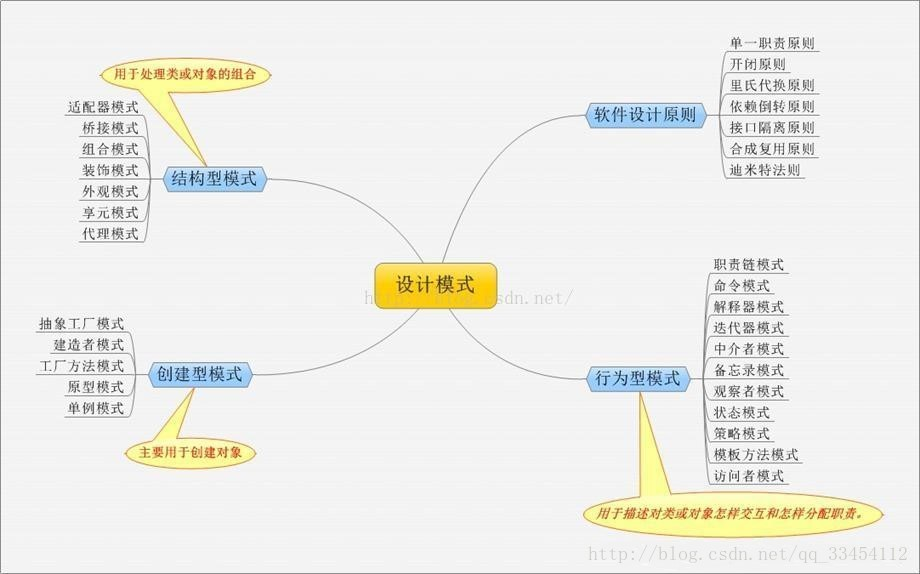
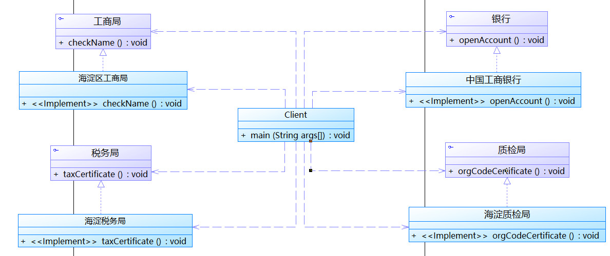
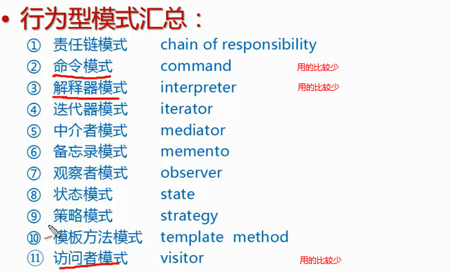
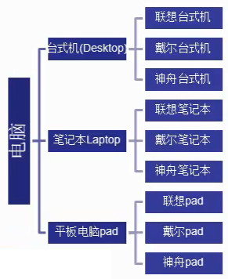
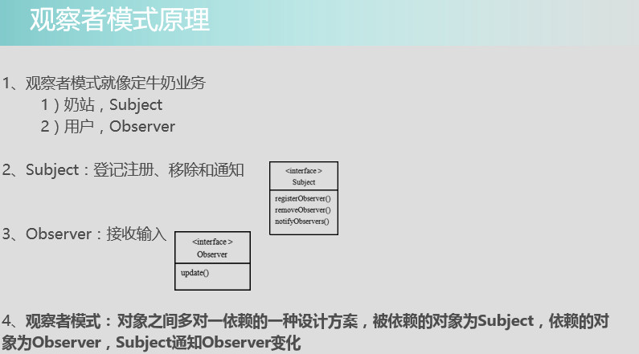
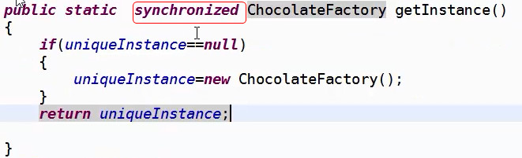
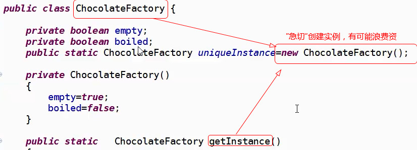
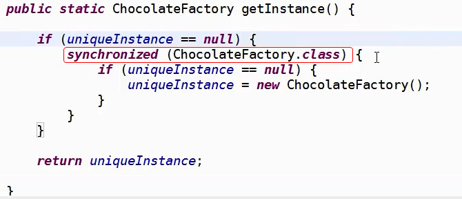

# 您真的懂--设计模式

> 设计模式（三类）

 |- 创建者模式

&emsp;&emsp;`创建者模式`是创建型模式中最负责的一个设计模式了，创建者负责构建一个对象的各个部分，并且完成组装的过程，我们可以这么理解创建者模式，创建者模式类似与一个步骤基本固定，但是每个步骤中的具体形式却又可以变化的这类对象的创建。创建者模式主要是用于创建复杂的一些对象，这些对象的创建步骤基本固定，但是可能具体的对象的组成部分却又可以自由的变化。

 |- 结构性模式 ( 结构型设计模式是从程序的结构上解决模块之间的耦合问题)

 - (1)适配器模式：		
   `Adapter`模式通过类的继承或者对象的组合侧重于转换已有的接口，类适配器采用“多继承”的实现方式，带来了不良的高耦合，所以一般不推荐使用。对象适配器采用“对象组合”的方式，更符合松耦合精神。

 - (2)桥接模式：		
   将抽象部分与实现部分分离，使它们都可以独立的变化。减少因变化带来的代码的修改量。
 
- (3)组合模式：		
   将对象组合成树形结构以表示“部分-整体”的层次结构。Composite模式使得客户对单个对象和组合对象的使用具有一致性。从而解决了解决客户程序与复杂对象容器的解耦，即：通过继承统一的接口，我们可以将容器对象及其子对象看成同一类对象使用，以减少对象使用中的复杂度。

- (4)装饰模式：		
   动态地给一个对象添加一些额外的职责。就增加功能来说，Decorator模式相比生成子类更为灵活。Decorator模式采用对象组合而非继承的手法，实现了在运行时动态的扩展对象功能的能力，而且可以根据需要扩展多个功能，避免了单独使用继承带来的“灵活性差”和“多子类衍生问题”。同时它很好地符合面向对象设计原则中“优先使用对象组合而非继承”和“开放-封闭”原则。

- (5)外观模式：  
   为子系统中的一组接口提供一个一致的界面，简化接口。

- (6)享元模式：		
   运用共享技术有效地支持大量细粒度的对象。 解决：　面向对象的思想很好地解决了抽象性的问题，一般也不会出现性能上的问题。但是在某些情况下，对象的数量可能会太多，从而导致了运行时的代价。那么我们如何去避免大量细粒度的对象，同时又不影响客户程序使用面向对象的方式进行操作，享元模式的出现恰好解决了该问题。

- (7)代理模式：		
   为其他对象提供一种代理以控制这个对象的访问。解决直接访问某些对象是出现的问题。

 |- 行为性模式
   行为型模式设计到算法和对象间的职责分配，不仅描述对象或类的模式，还描述它们之间的通信方式，刻划了运行时难以跟踪的复杂的控制流，它们将你的注意力从控制流转移到对象间的关系上来。行为型类模式采用继承机制在类间分派行为，例如Template Method 和Interpreter；行为对象模式使用对象复合而不是继承。一些行为对象模式描述了一组相互对等的对象如何相互协作以完成其中任何一个对象都单独无法完成的任务，如Mediator、Chain of Responsibility、Strategy；其它的行为对象模式常将行为封装封装在一个对象中，并将请求指派给它。
  常见行为型模式有11种：
    - CCIIMM
    
	 - Chain of Responsibility职责链
     - Command命令
     - Interpreter解释器
     - Iterator迭代
     - Mediator中介者
     - Memento备忘录			
     		
    - OSSTV
     - Observer观察者
     - State状态
     - Strategy策略
     - Template Method模版方法
     - Visitor访问者）。

## 

【总结：】		    
&emsp;&emsp;1、模式是相关的，但是只有知道了每个模式的区别点，才能更好的根据需求选择使用哪个模式。      
&emsp;&emsp;2、设计模式并不是"用OO的封装来封装所有的东西"。      

=================== **求同存异** ==================================

桥接模式 VS 适配器模式 VS 门面模式(外观模式)

> Facade模式是为一个复杂系统提供一个简单的接口。      
  
  目的：Facade 模式使用在给一个复杂的系统提供统一的门面(接口),目的是简化客户端的操作,但并没有改变接口           
  使用场合：
   
出现较多是这样的情况,你有一个复杂的系统,对应了各种情况,客户看了说功能不错,但是使用太麻烦.你说没问题,我给你提供一个统一的门面.所以Facade使用的场合多是对系统的"优化".

  需求程度：         
  Facade的需求程度是 `"中等"`,因为你不提供Facade程序照样能工作,只是不够好. 

> 适配器模式是把一个类的接口变换成客户端所期待的另一种接口，从而使原本因接口不匹配而无法工作的两个类能够工作到一起。(改变已有的两个接口，让他们相容)            

  目的： Adapter 模式使用在两个部分有不同的接口的情况,目的是改变接口,使两个部分协同工作                

  使用场合：     
  
出现是这样的情况,你有一个类提供接口A,但是你的客户需要一个实现接口B的类,这个时候你可以写一个Adapter让把A接口变成B接口,所以Adapter使用的场合是指鹿为马.就是你受夹板气的时候,一边告诉你我只能提供给你A(鹿),一边告诉你说
我只要B(马),他长了四条腿,你没办法了,把鹿牵过去说,这是马,你看他有四条腿.(当然实现指鹿为马也有两种方法,一个方法是你只露出鹿的四条腿,说你看这是马,这种方式就是封装方式的Adapter实现,另一种方式是你把鹿牵过去,但是首先介绍给他说这是马,因为他长了四条腿这种是继承的方式.)

  需求程度：       
  Adapter的需求程度是 `"必须"`,因为你不这么做就不能工作,除非你自己从头实现一个.  

> 桥梁模式的用意是"将抽象化与实现化脱耦，使的二者可以独立变化。                 

  目的：桥接模式 是为了分离抽象和实现                   

  使用场合：       
  
在一般的开发中出现的情况并不多,AWT是一个,SWT也算部分是,如果你的客户要求你开发一个系统,这个系统在Windows下运行界面的样子是Windows的样子.在Linux下运行是Linux下的样子.在Macintosh下运行要是Mac Os的样子.怎么办? 定义一系列的控件Button,Text,radio,checkBox等等.供上层开发者使用,他们使用这些控件的方法,利用这些控件构造一个系统的GUI,然后你为这些控件写好Linux的实现,让它在Linux上调用Linux本地的对应控件,在Windows上调用Windows本地的对应控件,在Macintosh上调用Macintosh本地的对应控件

  需求程度：          
  Bridge的需求程度是 `"一般"` ,适合精益求精的人,因为你可以写三个程序给客户.    

- Facade很多时候是  `1:m` 的关系，出现在项目中期，再优化
- Adapter很多是候是 `1:1` 的关系，出现在项目后期，大部分都有了,差的仅仅是接口不同
- Bridge很多时候是  `m:n` 的关系，出现在项目前期，你想让你的系统更加灵活,更酷

简单工厂模式 VS 工厂方法模式 VS 抽象工厂模式

+ **简单工厂模式：** 客户端只与工厂类和产品接口发生耦合，而工厂类与所有实现产品接口的产品类耦合，工厂类根据客户端传入的参数返回对应的产品类的实例对象，产品的种类在不修改工厂类原码的情况下不能增加；

+ **工厂方法模式：** 客户端与一个工厂接口和一个产品接口耦合，一个工厂接口的实现类对应一个产品接口的实现类，即每种产品都有一个对应的工厂类，产品的种类在不修改原码的情况下可以随意添加；

+ **抽象工厂模式：** 客户端与一个工厂接口和多个产品接口耦合，一个工厂接口的实现类对应多个产品接口的实现类，每个系列产品的种类在不修改工厂类原码的情况下无法增加；

建造者模式 VS 抽象工厂模式 VS 工厂模式

建造者模式 VS 工厂模式 VS 中介者模式

策略模式 VS 简单工厂模式

+ **策略模式：** 客户端使用的是自己生成的对象进行操作，正如原例子中军师给的锦囊（对象），是客户端自己已经有的，策略模式仅仅是根据不同情况使用不同对象的方法；

+ **简单工厂模式：** 同样是根据传入参数执行不同的操作，但简单工厂模式是传入信号（不一定是对象），返回的是产品对象，客户端根据工厂对象生成的产品对象进行操作；

 策略模式 VS 状态模式 

+ **策略模式：** 往往针对单个方法，给什么参数对象，用什么参数对象的方法，没有状态这一说；

+ **状态模式：** 将不同状态对应的操作完全分开，在已有状态下（默认状态），发现传入参数与当前状态不符，则切换状态；

装饰模式 VS 代理模式

+ **装饰模式：** 装饰类以组合的方式耦合被装饰类，主要目的是增加被装饰类的方法，而不能改变原有的方法（无决定权），它比直接继承被装饰类来扩展功能减少了类的数量和类之间的耦合度；

+ **代理模式：** 代理类能够决定消息是否发送给被代理类，拥有过滤性质；

装饰模式 VS 代理模式 VS 外观模式 VS 适配器模式

> 适配器模式: 一个适配允许通常因为接口不兼容而不能在一起工作的类工作在一起，做法是将类自己的接口包裹在一个已存在的类中。

 特征：适配器类则是匹配新接口，从代码上的特点来说，适配类持有新的目标对象（对象适配器）。

 目的：

 使用场合：

> 装饰器模式: 原有的不能满足现有的需求，对原有的进行增强。

 特征：装饰模式的一定是从外部传入，并且可以没有顺序，按照代码的实际需求随意挑换顺序。当我们使用装饰器模式的时候，我们通常的做法是将原始对象作为一个参数传给装饰者的构造器。

 目的：

 使用场合：装饰模式注重的是功能的拓展，关注于在一个对象上动态的添加方法，在同一个方法下实现更多的功能。装饰者能够在运行时递归地被构造。 
适配器模式注重的是接口的兼容。 

> 代理模式: 同一个类而去调用另一个类的方法，不对这个方法进行直接操作。

特征：代理模式是与原对象实现同一个接口，必须要实现原接口和持有真实的对象，才能称之为代理类。代理模式一定是自身持有这个对象，不需要从外部传入。用代理模式，代理类可以对它的客户隐藏一个对象的具体信息。因此，当使用代理模式的时候，我们常常在一个代理类中创建一个对象的实例

目的：

使用场合：代理模式注重的是隔离限制，关注于控制对对象的访问，让外部不能访问你实际的调用对象，比如权限控制。代理和真实对象之间的的关系通常在编译时就已经确定了。

需求程度：

> 外观模式: 我们通过外观的包装，使应用程序只能看到外观对象，而不会看到具体的细节对象，这样无疑会降低应用程序的复杂度，并且提高了程序的可维护性。

目的：

使用场合：外观模式注重的是多个类的集成、统一适配。

装饰模式 VS 代理模式

装饰模式 VS 桥接模式

两个模式都是为了解决过多子类对象问题，但他们的诱因不一样。桥接模式是对象自身现有机制 沿着多个维度变化，是 既有部分不稳定。装饰模式是为了增加新的功能。

外观模式 VS 中介者模式

## Proxy pattern（代理模式）：
	
- 核心作用
	- 通过代理，控制对对像的访问！
	`可以详细控制访问某个（某类）对象的方法，在调用这个方法前做前置处理，调用这个方法后做后置处理。（即AOP的微观实现！）`
	
- AOP （面向切面编程）的核心实现机制！

### 应用场景：
（任何大型框架都会使用代理模式）

	- 安全代理：屏蔽对真实角色的直接访问
	- 远程代理：通过代理类处理远程方法调用（RMI）
	- 延迟加载：先加载轻量级的代理对象，真正需要再加载真实对象

【分类】
 
- 静态代理（静态定义代理类）
- 动态代理（动态生成代理类）-- `这个用的更多`
  - JDK自带的动态代理
  	 - `java.lang.reflect.Proxy`
  	     - `作用：动态生成代理类和对象`
  	 - `java.lang.reflect.InvocationHandler(处理接口)` --这个很重要
  	 	 - `可以通过invoke方法实现对真实角色的代理访问`
  	 	 - `每次通过Proxy生成代理类对象时都要指定对应的处理器对象`
  - javaassist字节码操作库实现
  - CGLIB
  - ASM(底层使用指令，可维护性较差)

## Composite（组合模式）

### 使用组合模式的场景：(树形结构的时候使用)
- 把部分和整体的关系用树形结构来表示，从而使客户端可以使用同一的方式处理部分对象和整体对象。

### 开发中的应用场景：

- 操作系统的资源管理器
- GUI中的容器层次
- XML文件解析
- OA 系统中，组件结构的处理
- Junit单元测试框架
	- 底层设计就是典型的组合模式，TestCase（叶子）、TestUnite（容器）、Test接口（抽象）

## Facade pattern 门面模式（外观模式） 

潜移默化使用它

### 核心：为了系统提供统一的入口，封装子系统的复杂性，便于客户端调用。

### 应用场景
【案例】注册公司流程（不使用外观模式）

### 开发中常见的场景
- 频率很高。哪里都会遇到。各种技术和框架中都有外观模式的使用。如：
	- JDBC封装后的，commons提供的DBUtils类，Hibernate提供的工具类、Spring JDBC工具类等

## FlyWeight pattern（享元模式）

### 场景
- 内存属于稀缺资源，不要随便浪费。如果有很多个完全相同或相似的对象，我们可以通过享元模式，节省内存。

### 核心

- 享元模式一共享的方式高效地支持大量细粒度对象的重用。

- 享元模式对象能 做到共享的关键是区分内部状态和外部状态。
    - 内部状态：可以共享，不会随环境变化而变化。
    - 外部状态：不可以共享，会随着环境变化而改变。

【关键三点】享元类工厂、外部状态（单类来处理）、内部状态（享元类来处理）

### 享元模式开发中应用的场景：
- 享元模式由于其他共享的特性，可以在任何“池”中操作，`比如：线程池、数据库连接池`。
- String类的设计也是享元模式

优点：
 - 极大减少内存中对象的数量
 - 相同或相似u地想内存中只存一份，极大的节约资源，提高系统性能
 - 外部状态相对独立，不影响内部状态

缺点：
 - 模式叫复杂，使程序逻辑复杂化
 - 为了节省内存，共享了内部状态，分离出外部状态，而读取外部状态，使运行时间变长。用时间换取了空间。

行为型
------
## Bridge pattern（桥接模式）： `多个变化的维度的场景适合使用桥接模式`

### 应用场景

例如：应用商城中常见的商品分类，以电脑为类，如何良好的处理商品分类销售的问题？

`我们可以用多层继承结构实现下图的关系，但扩展性不好`

	不用桥接模式，会出现的问题：
		- 扩展性问题（类个数膨胀问题）
			- `如果要增加一个新的电脑类型：智能手机，则要增加各个品牌下面的类`
			- `如果要增加一个新的品牌，也要增加各种电脑类型的类`
		- 违反单一职责原则
			- `一个类：联想笔记本，有两个引起这个类变化的原因`
	
### 桥接模式核心要点：
	- 处理多层继承结构，处理多维度变化的场景，将各个维度设计成独立的继承结构，使各个维度可以独立的扩展在抽象层建立关联。
	
### 桥接模式实际开发中应用场景
	- JDBC驱动程序
	- AWT中的Peer架构
	- 银行日志管理：
		- 格式分类：操作日志、交易日志、异常日志
		- 距离分类：本地记录日志、异地记录日志
	- 人力资源系统中的奖金计算模块：
		- 奖金分类：个人奖金、团体奖金、激励奖金
		- 部门分类：人事部门、销售部门、研发部门
	- OA系统中的消息处理：
		- 业务类型：普通消息、加急消息、特急消息
		- 发送消息方式：系统内消息、手机短信、邮件

## Decorator pattern(装饰模式) --包装模式

### 职责：
- 动态的为一个对象增加新的功能。
- 装饰模式是一个用于代替继承的技术，`无须通过继承增加子类就能扩展对象的新功能`，使用对象的关联关系代替继承关系，更加灵活，`同时避免类型体系的快速膨胀`。

### 开发中使用的场景
- IO 中输入流和输出流的设计
- Swing包中图形界面构件功能
- Servlet API中提供了一个request对象的Decorator设计模式的默认实现类HttpServletRequestWrapper，HttpServletRequestWrapper类，增强了request对象的功能。
- Struts2中，request，response，session对象的处理

`看到Wrapper后缀名字类 一般都是装饰类`

### 总结
- 装饰模式（Decorator）也叫包装器模式（Wrapper）
- 装饰器模式降低系统的耦合度，可以动态的增加或删除对象的职责，并使得需要装饰的具体构建类和具体装饰类可以独立变化，以便增加新的具体构建类和具体装饰类。

### 优点
- 扩展对象功能，比继承灵活，不会导致类个数急剧增加
- 可以对一个对象进行多次装饰，创造出不同行为的组合，得到功能更加强大的对象
- 具体构建类和具体装饰类可以独立变化，用户可以根据需要自己增加新的具体构件子类和具体装饰子类

### 缺点
- 产生很多小对象。大量小对象占据内存，一定程度上影响性能。
- 装饰模式易于出错，调试排查比较麻烦

### 装饰模式和桥接模式的区别：
- 两个模式都是为了解决过多子类对象问题。但他们的诱因不一样。桥接模式是对象自身现有机制沿着多个维度变化，是既有部分不稳定。装饰模式是为了增加新的功能。	

## chain of responsibility （责任链模式）

- 将能够处理同一类请求的对象连成一条链，所提交的请求将沿着链传递，链上的对象逐个判断是否有能力处理该请求，如果能则处理，如果不能则传递给链上的下一个对象。

### 开发中常见的场景：
- Java中，异常机制就是一种责任链。一个try可以对应多个catch，当第一个catch不匹配类型，则自动跳到第二个catch。
- Javascript语言中，事件的冒泡和铺货机制。Java语言中，事件处理采用观察者模式。
- Servlet开发中，过滤器的链式处理
- Struts2中，拦截器的调用也是典型的责任链模式。

----------------------------------------------

> 001 策略模式

###### 多用组合少用继承（用行为类组合，而不是行为类的继承，更有弹性）

策略模式：
&emsp;&emsp;分别封装行为接口，实现算法族，超类里放行为接口对象，在子类里具体设定行为对象。原则就是：分离变化部分，封装接口，基于接口编程各种功能。此模式让行为算法的变化独立于算法的使用者。

如何设计：（应对项目的扩展性，降低复杂度）		
 分析项目变化与不变化部分，提取变化部分，抽象成接口+实现；（好处：新增行为简单，行为类更好的复用，组合方便。既有继承带来的复用好处，没有挖坑）

###### 分析原因：
 解决项目的新需求，采用OO思维里的继承方式解决方案的话，就会出现问题（也就是继承的问题：对类的局部改动，尤其超类的局部改动，会影响其他部分。影响会有溢出效应）

 也就是说尝试用OO原理来解决，覆盖的话。会出现超类挖的一个坑，每个子类都要来填，增加工作量，复杂度O(N^2)。不是好的设计方式

> 002 观察者模式

###### 松耦合、高内聚、隔离影响

###### java内置观察者
 - Observable（就是subject功能：注册观察者、移除观察者、通知观察者）-- 是类不是接口
  - notify() 
  - notifyAll()
  - notityObservers() -> 拉信息(常用)
  - notifyObservers(Object arg0) -同步（推）信息（常用）		
  
 - Observer(观察者) --接口

> 003 装饰者模式

###### 装饰者模式：	动态的将新功能附加到对象上。在对象功能扩展方面，它比继承更有弹性。

> 004 单例模式

###### 有些对象我们只需要一个：线程池、缓存、硬件设备等。

如果多个实例对象会有造成冲突、结果不一致性等问题。（可以用静态变量方式来实现或者可以程序员之间协商一个全局变量）

##### 单例模式：确保一个类最多只有一个实例，并提供一个全局访问点

经典单例模式，涉及多线程问题
优化方案：
   - 方案1：同步（synchronized）getInstantce方法（经常调用getInstantce非常耗资源）

   - 方案2：“急切”创建实例

   - 方案3：双重检查加锁 （推荐使用）

> 005 工厂模式

- 简单工厂
 简单工厂模式：定义了一个创建对象的类，由这个类来封装实例化对象的行为		

- 工厂方法模式			
 工厂方法模式：定义了一个创建对象的抽象方法，由子类决定要实例化的类。 工厂方法模式将对象的实例化推迟到子类		

- 抽象工厂模式		
 抽象工厂模式：定义了一个接口用于创建相关或有依赖关系的对象族，而无需明确 指定具体类			
> 006 命令模式

> 007 适配器模式

###### 适配器模式：将一个类的接口转换成另一种接口.让原本接口不兼容的类可以兼容

适配器模式原理

对象适配器与类适配器

从枚举器到迭代的适配器
