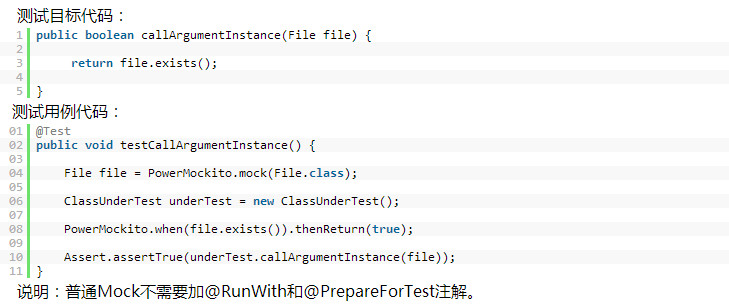
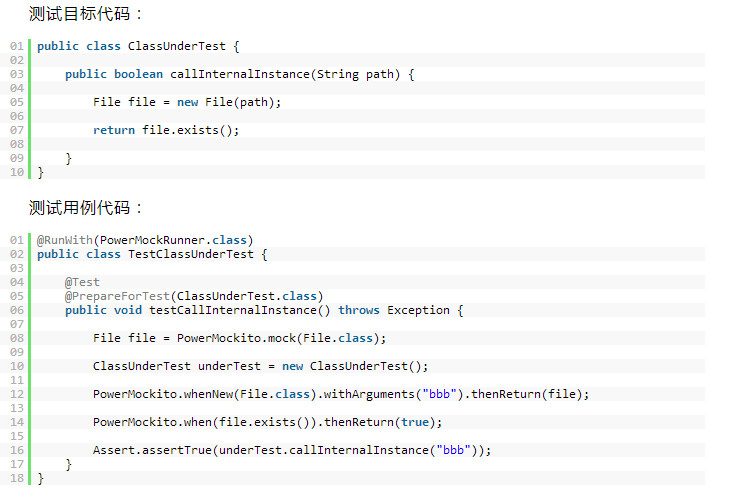
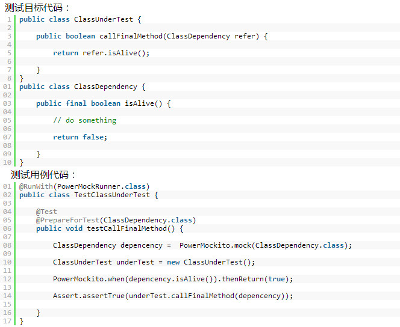
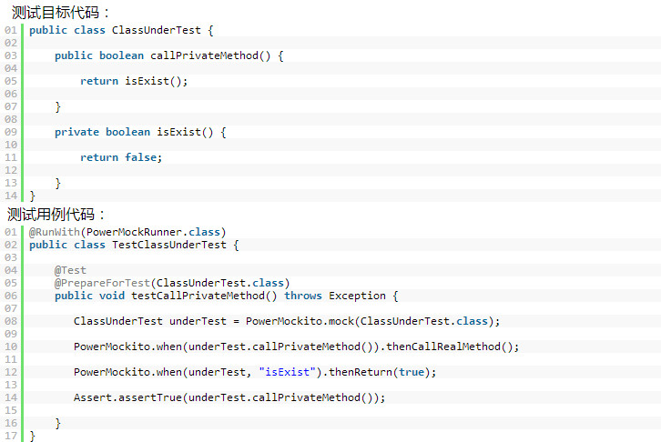
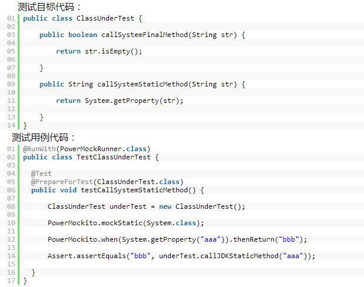

# PowerMock 使用教程

 一、为什么要使用Mock工具
  
在做单元测试的时候，我们会发现我们要测试的方法会引用很多外部依赖的对象，比如：（发送邮件，网络通讯，远程服务, 文件系统等等）。 而我们没法控制这些外部依赖的对象，为了解决这个问题，我们就需要用到Mock工具来模拟这些外部依赖的对象，来完成单元测试。
      
二、为什么要使用PowerMock
      
现如今比较流行的Mock工具如jMock 、EasyMock 、Mockito等都有一个共同的缺点：不能mock静态、final、私有方法等。而PowerMock能够完美的弥补以上三个Mock工具的不足。
      
三、PowerMock简介
      
PowerMock是一个扩展了其它如EasyMock等mock框架的、功能更加强大的框架。PowerMock使用一个自定义类加载器和字节码操作来模拟静态方法，构造函数，final类和方法，私有方法，去除静态初始化器等等。通过使用自定义的类加载器，简化采用的IDE或持续集成服务器不需要做任何改变。熟悉PowerMock支持的mock框架的开发人员会发现PowerMock很容易使用，因为对于静态方法和构造器来说，整个的期望API是一样的。PowerMock旨在用少量的方法和注解扩展现有的API来实现额外的功能。目前PowerMock支持EasyMock和Mockito。
      
四、PowerMock入门    
      
PowerMock有两个重要的注解：
–@RunWith(PowerMockRunner.class)
–@PrepareForTest( { YourClassWithEgStaticMethod.class })
如果你的测试用例里没有使用注解@PrepareForTest，那么可以不用加注解@RunWith(PowerMockRunner.class)，反之亦然。当你需要使用PowerMock强大功能（Mock静态、final、私有方法等）的时候，就需要加注解@PrepareForTest。
五、PowerMock基本用法
(1) 普通Mock： Mock参数传递的对象

(2)  Mock方法内部new出来的对象

说明：当使用PowerMockito.whenNew方法时，必须加注解@PrepareForTest和@RunWith。注解@PrepareForTest里写的类是需要mock的new对象代码所在的类。

(3) Mock普通对象的final方法

说明： 当需要mock final方法的时候，必须加注解@PrepareForTest和@RunWith。注解@PrepareForTest里写的类是final方法所在的类。 

(4) Mock普通类的静态方法

   
说明：当需要mock静态方法的时候，必须加注解@PrepareForTest和@RunWith。注解@PrepareForTest里写的类是静态方法所在的类。
      
(5) Mock 私有方法

说明：和Mock普通方法一样，只是需要加注解@PrepareForTest(ClassUnderTest.class)，注解里写的类是私有方法所在的类。 

(6) Mock系统类的静态和final方法 

说明：和Mock普通对象的静态方法、final方法一样，只不过注解@PrepareForTest里写的类不一样 ，注解里写的类是需要调用系统方法所在的类。

六 、无所不能的PowerMock

(1) 验证静态方法：
PowerMockito.verifyStatic();
Static.firstStaticMethod(param);
(2) 扩展验证:
PowerMockito.verifyStatic(Mockito.times(2)); //  被调用2次                                
Static.thirdStaticMethod(Mockito.anyInt()); // 以任何整数值被调用
(3) 更多的Mock方法
http://code.google.com/p/powermock/wiki/MockitoUsage13

七、PowerMock简单实现原理

•  当某个测试方法被注解@PrepareForTest标注以后，在运行测试用例时，会创建一个新的org.powermock.core.classloader.MockClassLoader实例，然后加载该测试用例使用到的类（系统类除外）。

•   PowerMock会根据你的mock要求，去修改写在注解@PrepareForTest里的class文件（当前测试类会自动加入注解中），以满足特殊的mock需求。例如：去除final方法的final标识，在静态方法的最前面加入自己的虚拟实现等。

•   如果需要mock的是系统类的final方法和静态方法，PowerMock不会直接修改系统类的class文件，而是修改调用系统类的class文件，以满足mock需求。