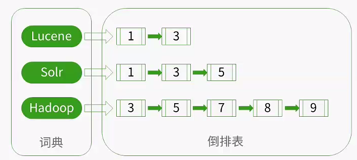
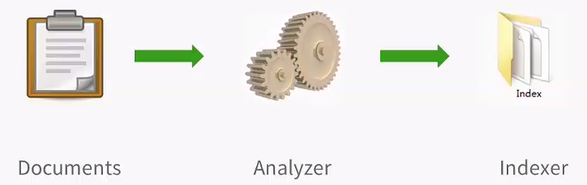
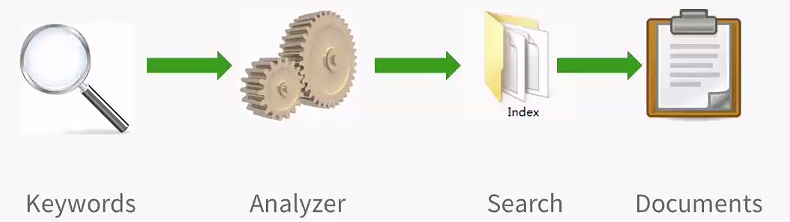

# 搜索引擎

**前文检索数据分类**
+ 结构化数据：具有固定格式或者长度有限的数据，例如数据库中的表。【SQL语句】

+ 非结构化数据：与结构化数据对立，例如：邮件、网页、word文档。【数据扫描、全文检索】

+ 半结构化数据：介于两者之间，例如xml或者json格式的数据。

**反向索引(倒排表)**：由字符串到文件的映射是文件到字符串映射的反向过程。

### 索引创建

### 索引检索

Lucene 不是一个完整的搜索应用程序，而是为你的应用程序提供`索引`和`搜索`功能。
