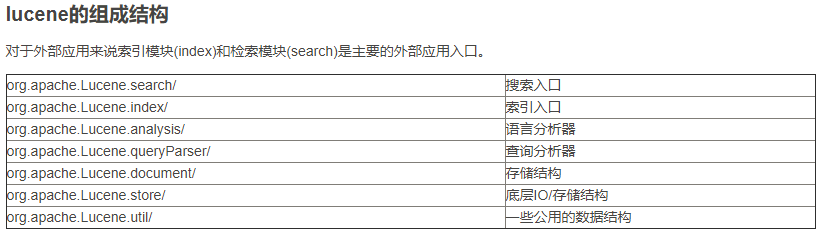
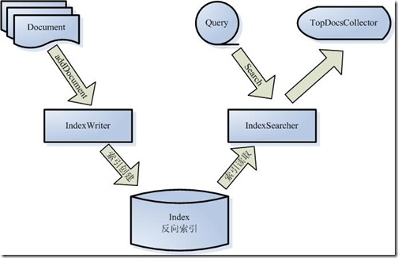
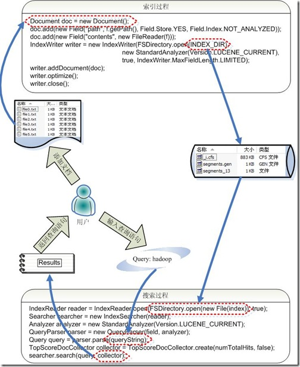

# Lucene

+ 一个`高效的`，`可扩展的`，`全文检索库`。
+ 全部用Java实现，无须配置。
+ **仅支持纯文本文件的索引(Indexing)和搜索(Search)**。
+ 不负责由其他格式的文件抽取纯文本文件，或从网络中抓取文件的过程。

## Lucene 的总体架构

说明 Lucene 是有索引和搜索的两个过程，包含索引创建，索引，搜索三个要点。

下面是一些 Lucene 的各组件：

**Lucene API 的调用实现索引和搜索过程**

