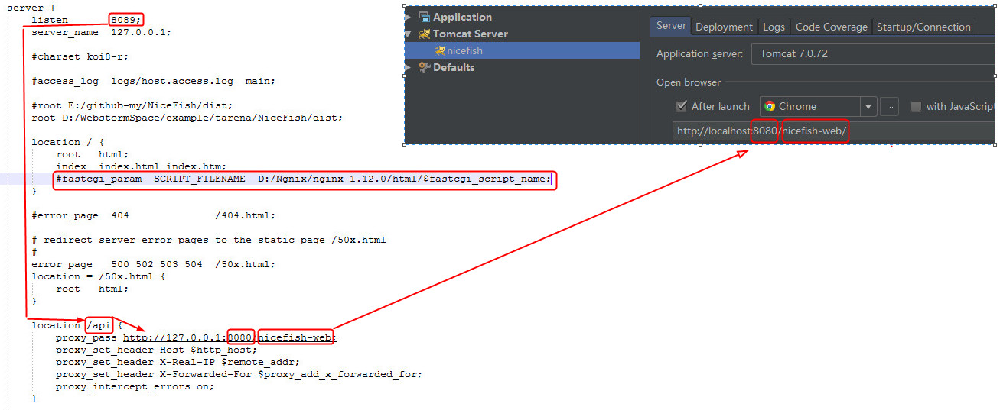
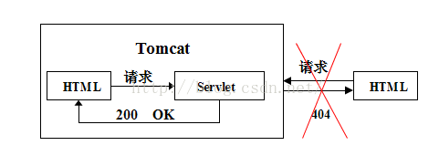
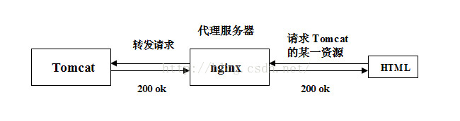
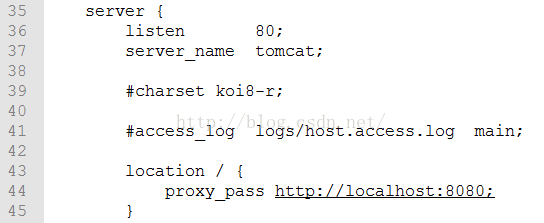
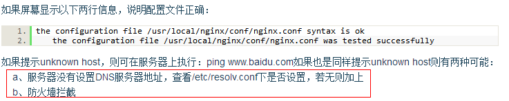

# Nginx web服务器及反向代理

Nginx是一款面向性能设计的HTTP服务器，相较于Apache、lighttpd具有占有内存少，稳定性高等优势。

# Nginx + Keepalived

## keepalived

[keepalived下载](http://www.keepalived.org/download.html) 


## window安装Nginx 

`配置出错：`
类似这样<font size=2 face="黑体" color=red>[error] 9404#1740: *3 CreateFile() "D:\Ngnix\nginx-1.12.0/html/favicon.ico" failed (2: The system cannot find the file specified), client: 127.0.0.1, server: 127.0.0.1, request: "GET /favicon.ico HTTP/1.1", host: "127.0.0.1:8089", referrer: "http://127.0.0.1:8089/posts/page/1"</font>


<font size=3 color=red face="黑体">解决方案:</font>
 
<font size=3 face="黑体">
只需修改一行（nginx/conf/nginx.conf）

  `fastcgi_param  SCRIPT_FILENAME  d:/nginx/html/$fastcgi_script_name;`

找到大概这一行修改路径最好是绝对路径（相对路径可以自行探讨）</font>



window 关闭Nginx `taskkill -f -t -im nginx.exe`


## 前后端分离要解决的问题

Web项目最头疼的就是无状态导致会话问题，传统的Web项目都使用`Session/Cookie`，但在前后端分离，集群部署模式下这Session明显缺陷太多。<font size=3 face="黑体" color=red>token方式已经是当前Web端解决会话的主流，并且有henduo开源好用的token生成管理程序，基本上拿来就能用。</font>

1、谈谈为什么会用到nginx？

首先明确一件事，浏览器可以发出请求吗？可以！那我们为什么要用到服务器呢？因为我们的前端如果不依赖服务器，页面就只能访问本地资源而不能访问服务器上的资源，而我们的后台一定是写在服务器上的。所以举个例子，我们在使用Tomcat服务器时，就必须把前端资源架在Tomcat上，才能访问后台的servlet。如下图所示：



所以当我们希望前后端分离时，前端的资源就不能放在Tomcat上面，那如何获得Tomcat的资源的？这就用到了nginx，如下图所示：



2、谈谈nginx的反向代理

有反向代理必有正向代理，先谈谈**正向代理**：一般默认的代理都是正向代理，用户访问不了一个资源，然后通过代理服务器去访问这个资源，将响应带回给用户。关键在于用户知道自己访问的是其他服务器的资源，代理服务器不会掩饰URL。

而**反向代理**是，代理服务器也是在中间层，但是用户不知道自己访问的资源是其他服务器的资源，代理服务器会掩饰URL。

3、谈谈如何使用nginx反向代理tomcat

修改配置反向代理Tomcat，打开conf目录下的nginx.conf文件，主要看35行左右开始的代码。

主要修改`lacation`属性，使所有的请求都被转发到`http://localhost:8080`的Tomcat服务器下处理：



**listen**：是监听的端口，即用户访问nginx服务的端口

**server_name**：服务名，经过测试并不会影响到什么

**location**：定义资源类型与服务器中资源地址url的映射关系，可在/后面定义资源类型，可设置多个location

其中`proxy_pass`代表要反向代理的服务器资源url，只要资源类型匹配，在这个url下的子路径资源都可以访问到，

其中`root`代表本地的资源路径，同样只要资源类型匹配，这个路径下的子目录资源都可以被访问到，

**一个location中只能配置一个root或proxy_pass。**


# Nginx+Tomcat 整合的安装与配置

**安装tomcat略**
```
新建文件目录/home/www为网站存放目录，设置server.xml文件，
在Host name="localhost"处将appBase=的指向路径改为/home/www/web

创建index.jsp至/home/www/web/ROOT，内容为：“My web!”   
```

**安装Nginx**

1、上传nginx-0.7.63.tar.gz至`/usr/local`

2、执行如下命令解压nginx：
```
#cd /usr/local

#tar zxvf  nginx-0.7.63.tar.gz
```

3、编译安装nginx
```
#cd nginx-0.7.63

#./configure --with-http_stub_status_module --with-http_ssl_module  #启动server状态页和https模块
```
执行完后会提示一个错误，说缺少PCRE library 这个是HTTP Rewrite 模块，也即是url静态化的包
可上传pcre-7.9.tar.gz，输入如下命令安装：
```
#tar zxvf pcre-7.9.tar.gz
#cd pcre-7.9
#./configure
#make
#make install
```
安装pcre成功后，继续安装nginx
```
#cd nginx-0.7.63
#./configure
#make
#make install
```

4、nginx安装成功后的安装目录为`/usr/local/nginx`
在conf文件夹中新建proxy.conf，用于配置一些代理参数，内容如下：
```
#!nginx (-)
# proxy.conf
proxy_redirect          off;
proxy_set_header        Host $host;
proxy_set_header        X-Real-IP $remote_addr;  #获取真实ip
#proxy_set_header       X-Forwarded-For   $proxy_add_x_forwarded_for; #获取代理者的真实ip
client_max_body_size    10m;
client_body_buffer_size 128k;
proxy_connect_timeout   90;
proxy_send_timeout      90;
proxy_read_timeout      90;
proxy_buffer_size       4k;
proxy_buffers           4 32k;
proxy_busy_buffers_size 64k;
proxy_temp_file_write_size 64k;
```
编辑安装目录下`conf`文件夹中的`nginx.conf`，输入如下内容
```

```

5、修改`/usr/local/nginx/conf/nginx.conf`配置文件后，请执行以下命令检查配置文件是否正确：
```
#/usr/local/nginx/sbin/nginx -t
```


6、启动nginx的命令`#/usr/local/nginx/sbin/nginx`

这时，输入以下命令查看Nginx主进程号：
```
ps -ef | grep "nginx: master process" | grep -v "grep" | awk -F ' ' '{print $2}'
```

7、停止nginx的命令`#/usr/local/nginx/sbin/nginx -s stop`

8、在不停止Nginx服务的情况下平滑变更Nginx配置

a、修改`/usr/local/nginx/conf/nginx.conf`配置文件后，请执行以下命令检查配置文件是否正确：`/usr/local/nginx/sbin/nginx -t`

如果屏幕显示以下两行信息，说明配置文件正确：


b、这时，输入以下命令查看Nginx主进程号：
```
ps -ef | grep "nginx: master process" | grep -v "grep" | awk -F ' ' '{print $2}'
```

屏幕显示的即为Nginx主进程号，例如：
　　6302
　　这时，执行以下命令即可使修改过的Nginx配置文件生效：`kill -HUP 6302`

或者无需这么麻烦，找到Nginx的Pid文件：kill -HUP `cat /usr/local/nginx/nginx.pid``

9、nginx启动好后启动tomcat，此时输入http://主机ip地址即可看到“My web!” 

## nginx+tomcat+java

使用两种部署方式，一种是源码部署，一种是war部署

+ java源码部署总结：

```
java源码部署总结：
环境：nginx+tomcat
部署方式：源码部署
源码目录
  /chroot2/test/schedule 目录下面就是所有源码了
tomcat
  位置: /usr/local/tomcat/apache-tomcat-scheduleweb-test
  主要配置文件server.xml
  <Host name="localhost" appBase="/chroot2/test/schedule" deployOnStartup ="false" autoDeploy="false" unpackWARs="true">
         <Context path="/schedule"  docBase="."/>
         <Valve   className="org.apache.catalina.valves.AccessLogValve"   
                 directory="logs"     prefix="schedule-web-test.cn-access_log."   suffix=".log"   
                 pattern="common"   resolveHosts="false"/>
     </Host>
   主要注意: <Context path="/schedule"  docBase="."/>的配置
nginx配置
  upstream配置：
  upstream tomcat_schedule_web_test{
      server localhost:8291 weight=10;
  }

  server配置：
        server
        {
                listen       80;
                server_name test.schedule.toys178.com;
                index index.jsp index.htm index.php;
        root /chroot2/test;

                fastcgi_connect_timeout 600;
                fastcgi_send_timeout 600;
                fastcgi_read_timeout 600;
                 
                                        
                location /schedule {     
                      proxy_pass http://tomcat_schedule_web_test;
                }

                location ~ .*\.(gif|jpg|jpeg|png|bmp|swf|apk|tar.gz)$
                {
                                expires      30d;
                }

                location ~ .*\.(js|css)?$
                {
                                expires      12h;
                }
                access_log  /chroot/wwwlogs/tomcat_schedule_web_test-access.log  access;
        }

```

+ 部署方式：war包部署
```
部署方式：war包部署
war包目录
  /chroot2/test/schedule 目录下面放的是war包，如:ScheduleManage.war
tomcat
  位置: /usr/local/tomcat/apache-tomcat-scheduleweb-test
  主要配置文件server.xml
  <Host name="localhost" appBase="/chroot2/test/schedule" deployOnStartup ="false" autoDeploy="false" unpackWARs="true">
    <Context path="/schedule"  docBase="ScheduleManage.war"/>
       <Valve   className="org.apache.catalina.valves.AccessLogValve"   
              directory="logs"     prefix="schedule-web-test.cn-access_log."   suffix=".log"   
                 pattern="common"   resolveHosts="false"/>
   </Host>
   主要注意: <Context path="/schedule"  docBase="ScheduleManage.war"/>的配置
nginx配置
  upstream配置：
  upstream tomcat_schedule_web_test{
      server localhost:8291 weight=10;
  }

  server配置：
  server
  {
    listen       80;
    server_name test.schedule.toys178.com;
    index index.jsp index.htm index.html;
    root /chroot2/test;
    location /schedule {     
          proxy_pass http://tomcat_schedule_web_test;
    }
    location ~ .*\.(gif|jpg|jpeg|png|bmp|swf|apk|tar.gz)$
    {
          expires      30d;
    }
    location ~ .*\.(js|css)?$
    {
          expires      12h;
    }
    access_log  /chroot/wwwlogs/tomcat_schedule_web_test-access.log  access;
  }
```


