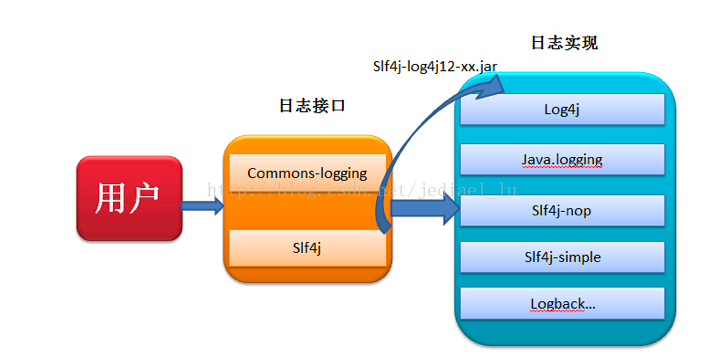
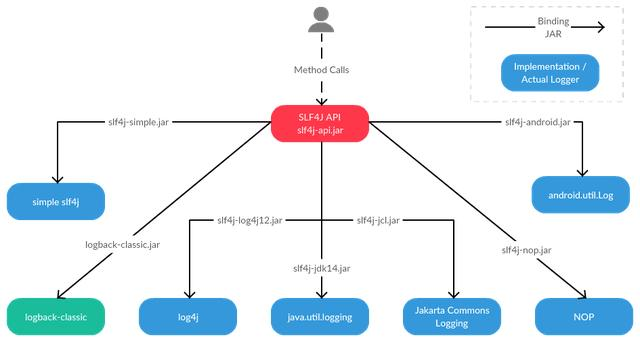
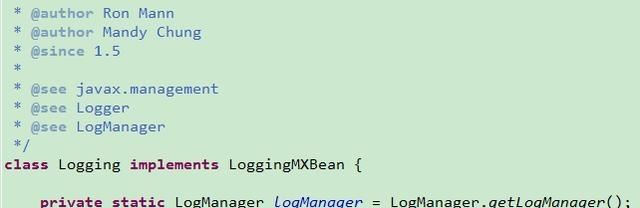
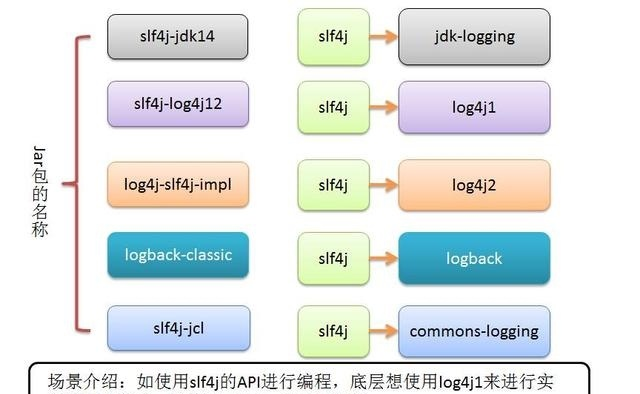
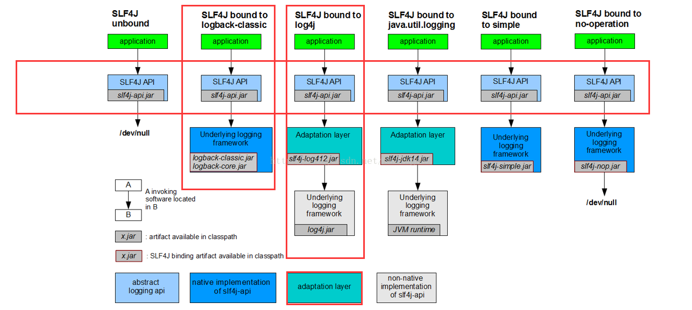

# 日志详情

## slf4 



**通过上面的图，可以简单的理清关系！**

> commons-logging和slf4j都是日志的接口，供用户使用，而没有提供实现！
>
>log4j,logback等等才是日志的真正实现。
>
> 当我们调用接口时，接口的工厂会自动寻找恰当的实现，返回一个实现的实例给我服务。这些过程都是透明化的，用户不需要进行任何操作！

	这里有个小故事，当年Apache说服 log4j以及其他的日志来按照commons-logging的标准编写，但是由于
	commons-logging的类加载有点问题，实现起来也不友 好，因此log4j的作者就创作了slf4j，也因此而
	与commons-logging两分天下。至于到底使用哪个，由用户来决定吧。

> 这样，slf4j出现了，它通过简单的实现就能找到符合自己接口的实现类，如果不是满足自己标准的日志，可以通过一些中间实现比如上面的slf4j-log4j12.jar来进行适配。


## commons-logging

&emsp;&emsp; **commons-logging**是apache最早提供的日志的门面接口。它的主要作用是提供一个日志门面，使用者可以使用不同的日志实现。用户可以自由选择第三方的日志组件作为具体实现，像log4j，或者jdk自带的logging， common-logging会通过动态查找的机制，在程序运行时自动找出真正使用的日志库。common-logging内部有一个Simple logger的简单实现，但是功能很弱。

官网：[https://commons.apache.org/proper/commons-logging/](https://commons.apache.org/proper/commons-logging/)

##### slf4j (Simple Logging Facade for Java)


&emsp;&emsp;** slf4j** 只是一种日志的门面和日志抽象框架，而java.util.logging,log4j,logback都是slf4j抽象框架的具体实现，只要调用slf4j的API就可以集成任何的实现框架在一起。

官网：[https://www.slf4j.org/](https://www.slf4j.org/)


##### logging

&emsp;&emsp; Java内部自带的日志工具，java.util包下。



## log4j

&emsp;&emsp; Apache下的一个开源日志框架，也是目前应用最广的一个日志框架。

官网：[https://logging.apache.org/log4j/2.x/](https://logging.apache.org/log4j/2.x/)


>延伸：Log4j 和Log4j2 的区别

1) 配置文件类型

log4j --> 通过`.properties`文件作为主配置文件（<font color=red size=3>properties文件的可阅读性差</font>）

log4j2 --> 摈弃之前版本1的写法，<font color=#279F43 size=4>采用`.xml`,`.json`或者`.jsn`这种方式</font>

2) 核心包

log4j --> 只引入一个jar包（目前官方版本1.2.17，没有维护了）

```xml
<dependency>
    <groupId>log4j</groupId>
    <artifactId>log4j</artifactId>
    <version>1.2.17</version>
</dependency>
```

log4j2 --> 需要引入2个核心包
```xml
<dependency>
    <groupId>org.apache.logging.log4j</groupId>
    <artifactId>log4j-core</artifactId>
    <version>2.5</version>
</dependency>
<dependency>
    <groupId>org.apache.logging.log4j</groupId>
    <artifactId>log4j-api</artifactId>
    <version>2.5</version>
</dependency>
```
**log4j和log4j 2的包路径是不同的**

3) 文件渲染 

log4j --想要生效，我们需要在web.xml中进行配置
```xml
<listener>
  <listener-class>
    org.springframework.web.util.Log4jConfigListener
  </listener-class>
</listener> 
<context-param>
  <param-name>log4jConfigLocation</param-name>
  <param-value>classpath:config/log4j.properties</param-value>
</context-param>
<context-param>
  <param-name>log4jRefreshInterval</param-name>
  <param-value>60000</param-value>
```

log4j2 只需要把log4j2.xml放到工程resource目录下

4) Log调用 

**log4j**
```java
import org.apache.log4j.Logger;

private final Logger LOGGER = Logger.getLogger(Test.class.getName());
```

**log4j2**
```java
import org.apache.logging.log4j.Level;
import org.apache.logging.log4j.LogManager;
import org.apache.logging.log4j.Logger;

private static Logger logger = 
                     LogManager.getLogger(Test.class.getName());
```

5) 配置文件方式 (最关键的最大的不同，那就是配置文件的区别了)

**log4j**
```xml
##Log4J配置文件的基本格式
#配置根Logger
log4j.rootLogger  =   [ level ]   ,  appenderName1 ,  appenderName2 ,  …

#配置日志信息输出目的地Appender
log4j.appender.appenderName  =  fully.qualified.name.of.appender.class 
　　log4j.appender.appenderName.option1  =  value1 
　　… 
　　log4j.appender.appenderName.optionN  =  valueN 

#配置日志信息的格式（布局）
log4j.appender.appenderName.layout  =  fully.qualified.name.of.layout.class 
　　log4j.appender.appenderName.layout.option1  =  value1 
　　… 
　　log4j.appender.appenderName.layout.optionN  =  valueN 
```
其中 [level] 是日志输出级别，共有5级
```xml
FATAL      0  
ERROR      3  
WARN       4  
INFO       6  
DEBUG      7 
```
Appender 为日志输出目的地，Log4j提供的appender有以下几种：
```xml
org.apache.log4j.ConsoleAppender（控制台），
org.apache.log4j.FileAppender（文件），
org.apache.log4j.DailyRollingFileAppender（每天产生一个日志文件），
org.apache.log4j.RollingFileAppender（文件大小到达指定尺寸的时候产生一个新的文件），
org.apache.log4j.WriterAppender（将日志信息以流格式发送到任意指定的地方）
```
Layout：日志输出格式，Log4j提供的layout有以下几种：
```xml
org.apache.log4j.HTMLLayout（以HTML表格形式布局），
org.apache.log4j.PatternLayout（可以灵活地指定布局模式），
org.apache.log4j.SimpleLayout（包含日志信息的级别和信息字符串），
org.apache.log4j.TTCCLayout（包含日志产生的时间、线程、类别等等信息）
```
打印参数: Log4J采用类似C语言中的printf函数的打印格式格式化日志信息，如下:
```xml
　  %m   输出代码中指定的消息
　　%p   输出优先级，即DEBUG，INFO，WARN，ERROR，FATAL 
　　%r   输出自应用启动到输出该log信息耗费的毫秒数 
　　%c   输出所属的类目，通常就是所在类的全名 
　　%t   输出产生该日志事件的线程名 
　　%n   输出一个回车换行符，Windows平台为“\r\n”，Unix平台为“\n” 
　　%d   输出日志时间点的日期或时间，默认格式为ISO8601，也可以在其后指定格式，比如：%d{yyy MMM dd HH:mm:ss , SSS}，输出类似：2002年10月18日  22 ： 10 ： 28 ， 921  
　　%l   输出日志事件的发生位置，包括类目名、发生的线程，以及在代码中的行数。举例：Testlog4.main(TestLog4.java: 10 ) 
```
**在代码中初始化Logger**
```
1）在程序中调用`BasicConfigurator.configure()`方法：给根记录器增加一个ConsoleAppender，输出格式通过PatternLayout设为"%-4r [%t] %-5p %c %x - %m%n"，还有根记录器的默认级别是`Level.DEBUG`. 
2）配置放在文件里，通过命令行参数传递文件名字，通过`PropertyConfigurator.configure(args[x]`)解析并配置；
3）配置放在文件里，通过环境变量传递文件名等信息，利用log4j默认的初始化过程解析并配置；
4）配置放在文件里，通过应用服务器配置传递文件名等信息，利用一个特殊的servlet来完成配置。
```
**为不同的 Appender 设置日志输出级别：**

**log4j2**
```xml
<?xml version="1.0" encoding="UTF-8"?>    
<configuration status="error">  
<!--     先定义所有的appender -->  
    <appenders>  
<!--         这个输出控制台的配置 -->  
        <Console name="Console" target="SYSTEM_OUT">  
<!--             控制台只输出level及以上级别的信息（onMatch），其他的直接拒绝（onMismatch） -->  
            <ThresholdFilter level="trace" onMatch="ACCEPT" onMismatch="DENY"/>  
<!--             这个都知道是输出日志的格式 -->  
            <PatternLayout pattern="%d{HH:mm:ss.SSS} %-5level %class{36} %L %M - %msg%xEx%n"/>  
        </Console>  

<!--         文件会打印出所有信息，这个log每次运行程序会自动清空，由append属性决定，这个也挺有用的，适合临时测试用 -->  
<!--         append为TRUE表示消息增加到指定文件中，false表示消息覆盖指定的文件内容，默认值是true -->  
        <File name="log" fileName="log/test.log" append="false">  
            <PatternLayout pattern="%d{HH:mm:ss.SSS} %-5level %class{36} %L %M - %msg%xEx%n"/>  
        </File>  

<!--          添加过滤器ThresholdFilter,可以有选择的输出某个级别以上的类别  onMatch="ACCEPT" onMismatch="DENY"意思是匹配就接受,否则直接拒绝  -->  
        <File name="ERROR" fileName="logs/error.log">  
            <ThresholdFilter level="error" onMatch="ACCEPT" onMismatch="DENY"/>  
            <PatternLayout pattern="%d{yyyy.MM.dd 'at' HH:mm:ss z} %-5level %class{36} %L %M - %msg%xEx%n"/>  
        </File>  

<!--         这个会打印出所有的信息，每次大小超过size，则这size大小的日志会自动存入按年份-月份建立的文件夹下面并进行压缩，作为存档 -->  
        <RollingFile name="RollingFile" fileName="logs/web.log"  
                     filePattern="logs/$${date:yyyy-MM}/web-%d{MM-dd-yyyy}-%i.log.gz">  
            <PatternLayout pattern="%d{yyyy-MM-dd 'at' HH:mm:ss z} %-5level %class{36} %L %M - %msg%xEx%n"/>  
            <SizeBasedTriggeringPolicy size="2MB"/>  
        </RollingFile>  
    </appenders>  

<!--     然后定义logger，只有定义了logger并引入的appender，appender才会生效 -->  
    <loggers>  
<!--         建立一个默认的root的logger -->  
        <root level="trace">  
            <appender-ref ref="RollingFile"/>  
            <appender-ref ref="Console"/>  
            <appender-ref ref="ERROR" />  
            <appender-ref ref="log"/>  
        </root>  

    </loggers>  
</configuration>  
```
**为不同的 Appender 设置日志输出级别:**

**场景：** 

&nbsp;&nbsp; 当调试系统时，我们往往注意的只是异常级别的日志输出，但是通常所有级别的输出都是放在一个文件里的，如果日志输出的级别是BUG！？那就慢慢去找吧。这时我们也许会想要是能把异常信息单独输出到一个文件里该多好啊。当然可以，Log4j已经提供了这样的功能，我们只需要在配置中修改Appender的Threshold 就能实现,比如下面的例子：
[配置文件]
```xml
 ### set log levels ###
log4j.rootLogger = debug ,  stdout ,  D ,  E

### 输出到控制台 ###
log4j.appender.stdout = org.apache.log4j.ConsoleAppender
log4j.appender.stdout.Target = System.out
log4j.appender.stdout.layout = org.apache.log4j.PatternLayout
log4j.appender.stdout.layout.ConversionPattern =  %d{ABSOLUTE} %5p %c{ 1 }:%L - %m%n

### 输出到日志文件 ###
log4j.appender.D = org.apache.log4j.DailyRollingFileAppender
log4j.appender.D.File = logs/log.log
log4j.appender.D.Append = true
log4j.appender.D.Threshold = DEBUG ## 输出DEBUG级别以上的日志
log4j.appender.D.layout = org.apache.log4j.PatternLayout
log4j.appender.D.layout.ConversionPattern = %-d{yyyy-MM-dd HH:mm:ss}  [ %t:%r ] - [ %p ]  %m%n

### 保存异常信息到单独文件 ###
log4j.appender.D = org.apache.log4j.DailyRollingFileAppender
log4j.appender.D.File = logs/error.log ## 异常日志文件名
log4j.appender.D.Append = true
log4j.appender.D.Threshold = ERROR ## 只输出ERROR级别以上的日志!!!
log4j.appender.D.layout = org.apache.log4j.PatternLayout
log4j.appender.D.layout.ConversionPattern = %-d{yyyy-MM-dd HH:mm:ss}  [ %t:%r ] - [ %p ]  %m%n
```


## logback

&emsp;&emsp; **logback** 是slf4j的原生实现框架，同样是log4j同一个人之手，但拥有比log4j更多的优点和更多的特性，用来代替log4j。

官网：[https://logback.qos.ch/](https://logback.qos.ch/)

基于我们先前在log4j上的工作，logback 重写了内部的实现，在某些特定的场景上面，甚至可以比之前的速度快上10倍。在保证logback的组件更加快速的同时，同时所需的内存更加少。

为什么要推荐logback作为首推的日志框架，仅看上面这一点，就觉得logback的强悍和优秀！



### 使用slf4j快速入门

首先，项目中必须要包括slf4j-api.jar，此外，还应该包括slf4j为具体实现所提供的适配器（如slf4j-log4j12.jar)，以及那个具体实现的jar包（如log4j-1.**.jar)。slf4j只是一种日志的门面和日志抽象框架，而java.util.logging,log4j,logback都是slf4j抽象框架的具体实现，只要调用slf4j的API就可以集成任何的实现框架在一起


```

	import org.slf4j.Logger;
	import org.slf4j.LoggerFactory;
	
	public class Slf4jDemo {
	    private static final Logger LOG = LoggerFactory.getLogger(Slf4jDemo.class);
	
	    public static void main(String[] args) {
	        LOG.error("Error Message!");
	        LOG.warn("Warn Message!");
	        LOG.info("Info Message!");
	        LOG.debug("Debug Message!");
	        LOG.trace("Trace Message!");
	    }
	}

```
由于所使用的具体实现不同，日志输出也有不同的结果。这也反应了通过使用slf4j，使得可以方便的替换日志系统。

### Slf4j-simple 实现

slf4j自带的一个简单实现，可用于小项目中，但无法配置日志级别等。

官方文档中的描述为：Binding for Simple implementation, which outputs all events to System.err. Only messages of level INFO and higher are printed. This binding may be useful in the context of small applications.

在项目的build_path中加入 `slf4j-1.6.6.jar` 与 `slf4j-simple-1.6.6.jar` 。

输出结果如下：

	[main] ERROR Slf4jDemo - Error Message!
	[main] WARN Slf4jDemo - Warn Message!
	[main] INFO Slf4jDemo - Info Message!

### slf4j-jdk 实现

使用jkd自带的日志系统，在项目的build_path中加入 `slf4j-1.6.6.jar` 与 `slf4j-jdk14-1.6.6.jar`。

输出结果如下：

	二月 16, 2015 11:09:36 下午 Slf4jDemo main
	严重: Error Message!
	二月 16, 2015 11:09:36 下午 Slf4jDemo main
	警告: Warn Message!
	二月 16, 2015 11:09:36 下午 Slf4jDemo main
	信息: Info Message!

### slf4j-log4j 实现

log4j是目前用得最多的日志系统，它更适用于大型项目。
在项目的build_path中加入 `slf4j-1.6.6.jar` 与	`slf4j-log4j-1.6.6.jar`，以及log4j的具体实现，如 `log4j-1.2.16.jar`。

输出结果如下：

	og4j:WARN No appenders could be found for logger (Slf4jDemo).
	log4j:WARN Please initialize the log4j system properly.
	log4j:WARN See http://logging.apache.org/log4j/1.2/faq.html#noconfig for more info.

可以通过配置文件配置输出日志的级别。

【总结（注意事项）：】

1、注意build_path中不能有多个日志实现，否则会导致slf4j不知道该使用哪个实现，从而出现以下错误

	SLF4J: Class path contains multiple SLF4J bindings.
	SLF4J: Found binding in [jar:file:/Users/liaoliuqing/99_Project/1_myCodes/5_JavaEEDemo/lib/slf4j-log4j12-1.6.6.jar!/org/slf4j/impl/StaticLoggerBinder.class]
	SLF4J: Found binding in [jar:file:/Users/liaoliuqing/99_Project/1_myCodes/5_JavaEEDemo/lib/slf4j-jdk14-1.6.6.jar!/org/slf4j/impl/StaticLoggerBinder.class]
	SLF4J: See http://www.slf4j.org/codes.html#multiple_bindings for an explanation.
	SLF4J: Actual binding is of type [org.slf4j.impl.Log4jLoggerFactory]
	log4j:WARN No appenders could be found for logger (Slf4jDemo).
	log4j:WARN Please initialize the log4j system properly.
	log4j:WARN See http://logging.apache.org/log4j/1.2/faq.html#noconfig for more info.

2、log4j的配置请见？？？


### 总结

* 1、commons-loggin,slf4j只是一种日志抽象门面，不是具体的日志框架。
* 2、log4j,logback是具体的日志框架。
* 3、一般首选使用slf4j+logback，或者slf4j+log4j,commons-logging+log4j。

