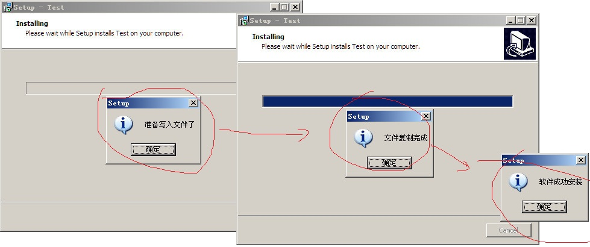
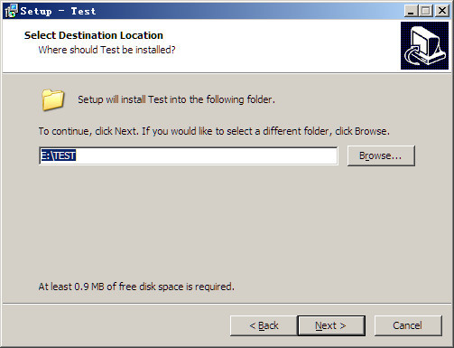
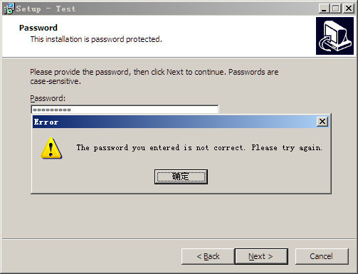
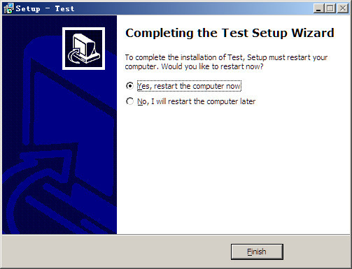
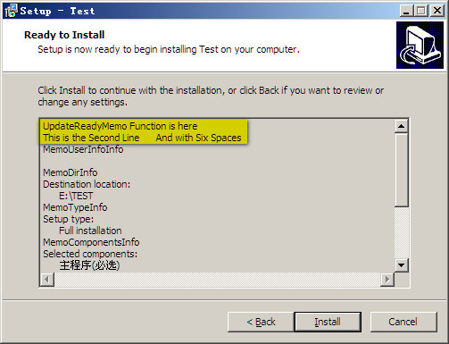
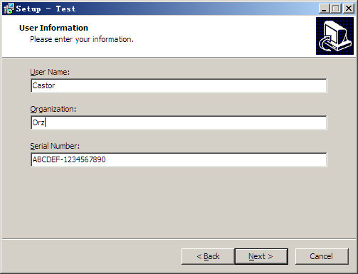
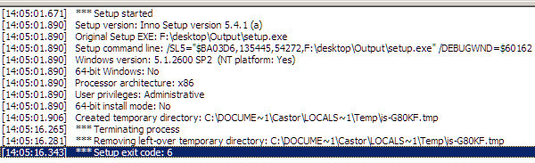

# Inno setup 使用到的Pascal脚本

## 事件函数

1、`function InitializeSetup(): Boolean;`该函数在安装程序初始化时调用，返回False 将中断安装，True则继续安装，测试代码如下：

```Pascal
function InitializeSetup(): Boolean;
begin
	Result := MsgBox('安装程序正在初始化，你确定要安装吗？', mbConfirmation, MB_YESNO) = idYes;
if Result = False then
	MsgBox('你放弃了安装，程序直接退出', mbInformation, MB_OK);
end;
```

2、`procedure InitializeWizard();` 该过程在开始的时候改变向导或者向导页，不要指望使用InitializeSetup函数实现改变向导页的功能，因为InitializeSetup函数触发时向导窗口并不存在。

3、`procedure DeinitializeSetup();`该过程在安装终止时被调用，注意及时在用户没有安装任何文件之前退出也会被调用。测试代码如下：
```Pascal
procedure DeinitializeSetup();
begin
	msgbox('DeinitializeSetup is called',mbInformation, MB_OK);
end;
```

4、`procedure CurStepChanged(CurStep: TSetupStep);` 该过程提供用户完成预安装和安装之后的任务，更多的是提供了安装过程中的状态。参数`CurStep=ssInstall`是在程序实际安装前（所有的路径等都配置好之后准备写入文件前），`CurStep=ssPostInstall`是实际安装完成后，而`CurStep=ssDone`是在一次成功的安装完成后、安装程序终止前（即点击finish按钮后执行）。测试代码如下：
```Pascal
procedure CurStepChanged(CurStep: TSetupStep);
begin
	if CurStep=ssinstall then
		MsgBox('准备写入文件了', mbInformation, MB_OK);
	if CurStep=ssPostinstall then
		MsgBox('文件复制完成', mbInformation, MB_OK);
	if CurStep=ssDone then
		MsgBox('软件成功安装', mbInformation, MB_OK);
end;
```


5、`function NextButtonClick(CurPageID: Integer): Boolean;` 当用户单击下一步按钮时调用。如果返回True，向导将移到下一页；如果返回False，它仍保留在当前页。测试代码如下：
```Pascal
function NextButtonClick(CurPageID: Integer): Boolean;
begin
	Result := MsgBox('到下一页去吗？', mbConfirmation, MB_YESNO) = idYes;
end;
```

6、`function BackButtonClick(CurPageID: Integer): Boolean;` 和前面的NextButtonClick函数相反，当用户单击返回按钮时调用。如果返回True，向导将移到前；如果返回False，它仍保留在当前页.

7、`procedure CancelButtonClick(CurPageID: Integer; var Cancel, Confirm: Boolean);` 当用户单击取消按钮或单击窗口中的关闭按钮时调用。Cancel参数指定取消进程是否该发生；默认为True。Confirm参数指定是否显示“退出安装程序吗？”的消息框；默认为True。如果Cancel设为False，那么Confirm的值将被忽略。测试代码如下：
```Pascal
procedure CancelButtonClick(CurPageID: Integer; var Cancel, Confirm: Boolean);
begin
	cancel:=False;
end;
```
和你所预料的一样，本段代码将会导致Cancel按钮失效，即逼迫用户完成安装或者采用非正常方式终止安装程序。
```Pascal
procedure CancelButtonClick(CurPageID: Integer; var Cancel, Confirm: Boolean);
begin
	Confirm:=false;
end;
```
而上面的这段代码将会在用户点击Cancel按钮之后直接退出，不需要做进一步的确认。

8、`function ShouldSkipPage(PageID: Integer): Boolean;` 向导调用这个事件函数确定是否在所有页或不在一个特殊页 (用PageID指定) 显示。如果返回True，将跳过该页；如果你返回False，该页被显示。注意:这个事件函数不被`wpWelcome`、`wpPreparing`和`wpInstalling` 页调用，还有安装程序已经确定要跳过的页也不会调用 (例如，没有包含组件安装程序的`wpSelectComponents`)。测试代码如下：
```Pascal
function ShouldSkipPage(PageID: Integer): Boolean;
begin
	if PageID=wpSelectDir then
	Result:=True;
end;
```
本段代码将会使得安装程序跳过选择安装目录的页面，即如下页面是不会被显示的：



可用的PageID有： `wpLicense, wpPassword, wpInfoBefore, wpUserInfo, wpSelectDir, wpSelectComponents, wpSelectProgramGroup, wpSelectTasks, wpReady, wpInfoAfter, wpFinished`

9、`procedure CurPageChanged(CurPageID: Integer);` 在新向导页 (由CurPageID 指定)显示后调用。测试代码如下：
```Pascal
procedure CurPageChanged(CurPageID: Integer);
begin
	Msgbox('ha,new page!',mbInformation, MB_OK);
end;
```
该段代码将会导致每出现一个新的一面的时候就会弹出一个消息框。

10、`function CheckPassword(Password: String): Boolean;`如果安装程序在Pascal 脚本中发现该函数，它自动显示密码页并调用CheckPassword检查密码。返回True 表示接受密码，返回False拒绝。测试代码如下：
```Pascal
function CheckPassword(Password: String): Boolean;
begin
	if Password='castor' then
	result:=true;
end;
```
在安装过程中将会出现询问安装密码的页面，如果输入错误将会出现下面的对话框：



为了避免在 `[Code]` 段内部贮存真实的密码，最好使用其他的信息进行比较，例如使用GetMD5OfString(Password)计算实际密码的MD5值保护实际密码。

11、`function NeedRestart(): Boolean;` 如果返回True，安装程序在安装结束时提示用户重启系统，False则不提示。测试代码如下：
```Pascal
function NeedRestart(): Boolean;
begin
	result:=True;
end;
```
在安装完成之后的finish页面，将会出现如下的选项：



12、`function UpdateReadyMemo(Space, NewLine, MemoUserInfoInfo, MemoDirInfo, MemoTypeInfo, MemoComponentsInfo, MemoGroupInfo, MemoTasksInfo: String): String;`
如果脚本中存在该函数，则在Ready to Install页面变为活动页的时候自动调用该函数，该函数返回一段文本，该文本显示于Ready to Install页面中的设置备注中，并且该文本将用NewLine参数分割为一个单独的多行字符串，参数`Space`指代空格，测试是六个，其它参数将包含安装程序用于设置段的字符(可能是空的)。例如MemoDirInfo参数包含选择目录段的字符串。测试代码如下：
```Pascal
function UpdateReadyMemo(Space, NewLine, MemoUserInfoInfo, MemoDirInfo, MemoTypeInfo, MemoComponentsInfo, MemoComponentsInfo, MemoTasksInfo: String): String;

var
 res: String;
begin
 res:='UpdateReadyMemo Function is here'+NewLine+'This is the Second Line';
 res:=res+Space+'And with Six Spaces';
 res:=res+NewLine+'MemoUserInfoInfo'+MemoUserInfoInfo;
 res:=res+NewLine+'MemoDirInfo'+MemoDirInfo;
 res:=res+NewLine+'MemoTypeInfo'+MemoTypeInfo;
 res:=res+NewLine+'MemoComponentsInfo'+MemoComponentsInfo;
 res:=res+NewLine+'MemoComponentsInfo'+MemoComponentsInfo;
 res:=res+NewLine+'MemoTasksInfo'+MemoTasksInfo;
 Result:=res;
end;
```
运行后在安装前会出现确认页面：标记黄色文字下面是各个参数的内容。



13、`procedure RegisterPreviousData(PreviousDataKey: Integer);`本过程实现在自定义向导页中贮存用户输入的设置，在脚本中放入本函数，并调用SetPreviousData(PreviousDataKey, ...)替换它，每次设置一个。

14、`function CheckSerial(Serial: String): Boolean;`该函数将在用户信息向导页中自动出现一个序列号对象 (前提是`[Setup]`段中使用`UserInfoPage=yes`)。返回`True`表示接受序列号，返回`False`拒绝。注意：当使用序列号时，该软件并没有被加密，而且Inno Setup源代码是免费获取的，有经验的人从安装程序中删除序列号保护并不是很困难的事。本函数只是方便用户在你的应用程序中仔细检查输入的序列号 (贮存在`{userinfoserial}`常量)。测试代码如下：
```Pascal
function CheckSerial(Serial: String): Boolean;
begin
	if Serial='ABCDEF-1234567890' then
	Result:=True;
end;
```
在安装过程中将会出现一个页面，如下：


如果Serial Number不正确，Next按钮将会无效，只有正确的序列号才能使得Next按钮有效，再次说明：不要指望使用这种方法保护你的软件。

15、`function GetCustomSetupExitCode: Integer;`返回一个非零值，命令安装程序返回一个自定义退出代码，本函数只在安装程序运行完成并且退出代码已是零时才调用。常见的退出代码如下：

代码 | 说明
-----|-----
0 | 安装程序成功完成
1 | 安装程序初始化失败
2 | 用户在实际安装前点击取消，或者在开始的“这将安装……”时选择否
3 | 当准备到下一个安装阶段的时候发生致命错误，只有在比较极端的情况下发生这种错误，例如内存耗尽。
4 | 实际安装过程中发生致命错误
5 | 用户在实际安装过程中点击取消或者在“终止-重试-忽略”对话框中点击了终止
6 | 安装程序被调试器强制终止
7 | 准备安装阶段发现安装无法进行
8 | 准备安装阶段发现安装无法进行，并且系统需要重启来解决问题

例如在用Inno Setup调试编译后的安装文件时，按下`Ctrl+F2`后，下面的调试输出将会提示如下：



退出代码为6，可见安装程序被调试器强制终止。

16、`function PrepareToInstall(var NeedsRestart: Boolean): String;`在与安装阶段返回一个非空字符串命令安装程序停止，该字符串将会作为错误消息，设置NeedsRestart为True将要求用户重启系统，该函数只在安装程序发现不能继续下去的时候才被调用。