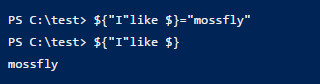

# powershell脚本

## Powershell管道和重定向

>管道

`ls | sort -Descending Name | Format-Table Name,Mode` 

&emsp;&emsp;通过ls获取当前目录的所有文件信息，然后通过Sort -Descending对文件信息按照Name降序排列，最后将排序好的文件的Name和Mode格式化成Table输出。

>重定向 `把命令的输出保存到文件中，‘>’为覆盖，’>>’追加`

## 变量

> 定义变量

powershell 不需要显示地去声明，可以自动创建变量，只须记住变量的前缀为 $. 
创建好了变量后，可以通过变量名输出变量，也可以把变量名存在字符串中。但是有个例外单引号中的字符串不会识别和处理变量名。

在powershell中变量名均是以美元符”$”开始，剩余字符可以是数字、字母、下划线的任意字符，并且powershell变量名大小写不敏感（$a和$A 是同一个变量)。

某些特殊的字符在powershell中有特殊的用途，一般不推荐使用这些字符作为变量名。当然你硬要使用，请把整个变量名后缀用花括号括起来。

### 查看正在使用的变量 `ls variable:`

### 查找变量 `ls variable:value*`  <-- 例如要查询以value打头的变量名

### 验证变量是否存在  `Test-Path variable:value1`

### 删除变量 `del variable:value1`

因为变量会在powershell退出或关闭时，自动清除。一般没必要删除，但是你非得删除，也可以象删除文件那样删除它。
