# IntelliJ  IDEA Default Keymap
## Edit(编辑)
> Ctrl + Alt + S 

> 认识idea结构

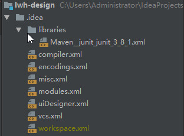

> 最近操作的文件 Ctrl+E (Ctrl+E(Cmd+E In OSX)：)

 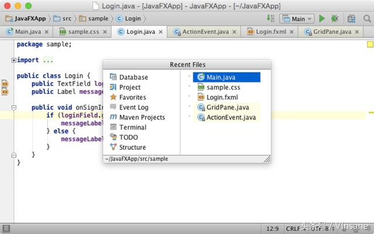

需要注意的是这个导航操作默认选中的是最后一次操作的那个文件，所以要操作最后一次操作的文件，一次操作就够了。要想过滤列出的最近操作文件，可以直接在弹框上输入要过滤的关键词。你只需要输入目标文件名字的部分内容，IDE就会高亮你搜索的关键词。
 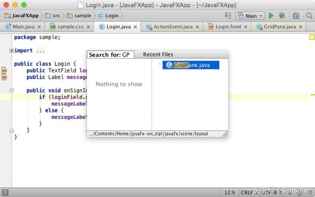

> 结构弹框 Ctrl+F12

另一个常用到导航功能的场景是当前编辑的文件。每一个文件都有自己的结构：Java类文件包含成员，比如属性、方法等等；XML与HTML文件包含一组标签树。要想在这些结构中快速定位到某个位置，只需要按下Ctrl+F12（Cmd+F12 for OSX）然后选中目标结构（这里同样可以使用关键词搜索来过滤列表）。
 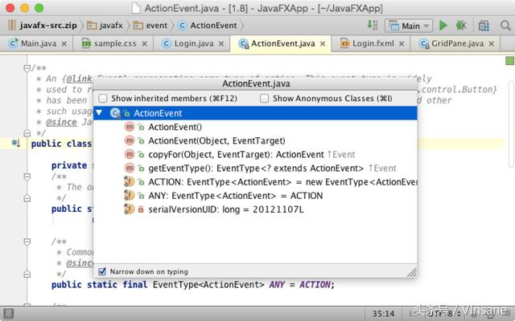

某些情况下，文件结构会根据你查看方式的不同而有所差别。比如对于Java类文件可能会包含父类或者接口的结构。默认情况下IntelliJ IDEA并不会展示父类以及接口的结构。然而，我们可以<font color=red>按下两次Ctrl+F12</font>来开启父类以及接口的结构展示：
 
当你下一次再触发结构导航功能，IDE就会记住你的使用习惯了，赞不赞！

> 跳到导航条 (Ctrl+向上箭头)

你开发过程中的大部分时间界面上只显示编辑框（以及代码），接受这个事实对于你的开发将有很大帮助。有的人可能会说，我还需要关注工程结构，以及上下文，或者得有办法去快速的切换它们。事实上，在IntelliJ IDEA中实现工程结构树与编辑区快速切换是非常方便的。然后工程结构树并不是最好的选择。高级的IntelliJ IDEA用户知道一个更合适的选项：导航条。新用户通常会认为导航条只是个面包屑，告诉我当前文件的路径结构。而更有经验的用户会从导航条上获取它们任何想要的信息，任何想做的事情。要想唤醒导航条的强大功能，只需要按下Ctrl+向上箭头（Cmd+向上箭头），使用这个操作，你几乎可以导航工程中的任何位置。创建修改文件，查看内容，以及其他有用的功能。
 
 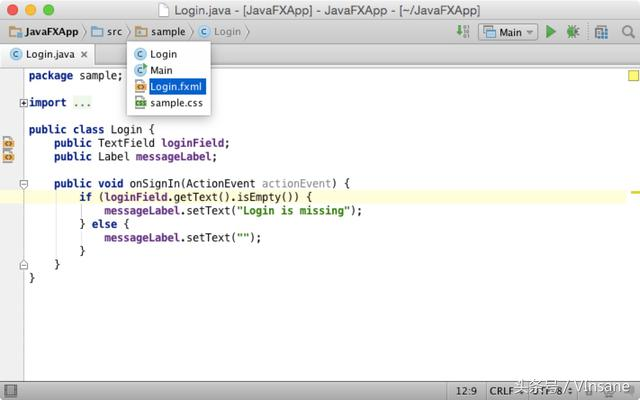

值得注意的是，即使在导航条隐藏的情况下，也可以通过这个快捷键来唤起它。

 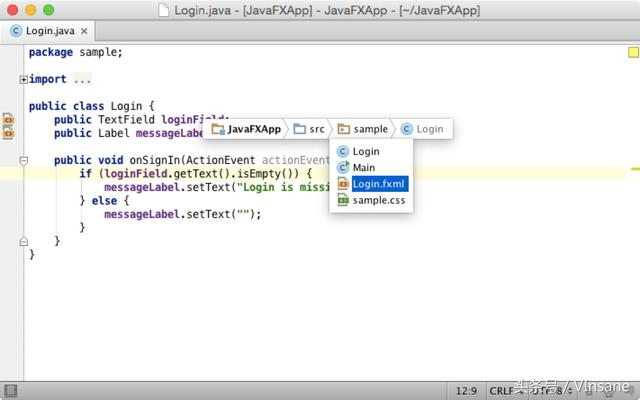

> 定位到某个类 Ctrl+N

那么最基本的操作：定位到某个类呢？每一次你按下Ctrl+N(Cmd+N for OSX)，你都无法想象，这个功能是多么强大。它比它看起来聪明多了。除了简单的通配符、驼峰写法、包前缀等其他IDE也支持的功能，IntelliJ IDEA也提供类名中间字符的匹配，以及文件行后号定位的支持，还有文档及定义的快速查询：

 

默认情况下，IDE会列出匹配度最高的类，如果没有找到匹配项，IDE会扩大搜索范围到整个工程依赖包，要切换搜索域，可以再次按下Ctrl+N。

IntelliJ IDEA中Actions操作最牛的一点就是，所有操作可以无需鼠标的介入就可以完成：弹框显示出来之后，你就可以输入或者改变你的查询任务，使用上下箭可以选择查询结果。

> 定位到某个文件或者目录 Ctrl+Shift+N

定位到某个文件的快捷键是Ctrl+Shift+N，它是另一个可以巨幅节约时间的快捷键。当你需要快速打开工程中的某个文件的时候，除了可以使用常见的通配符、驼峰写法、目录前缀等等，比如下面这个例子，定位到一个目录：
 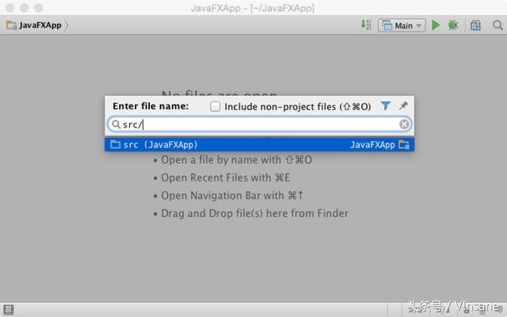

> 定位到某个标识符 Ctrl+Shift+Alt+N

最后，定位功能家族的最重要的一位成员，定位到标识符的快捷键：Ctrl + Shift + Alt + N (Cmd + Shift +Alt + N for OS X)，正如它名字一样，可以帮助你不需要输入标识符全称就可以定位到目标标识符。因为IDE中已经维护了一份你整个工程所有标识符的索引，你只需输入一个表达式，IDE就会在几秒之后找到相关联的方法或者属性，即使你的工程非常大，它的搜索也不在话下，毕竟已经索引了所有标识符！

 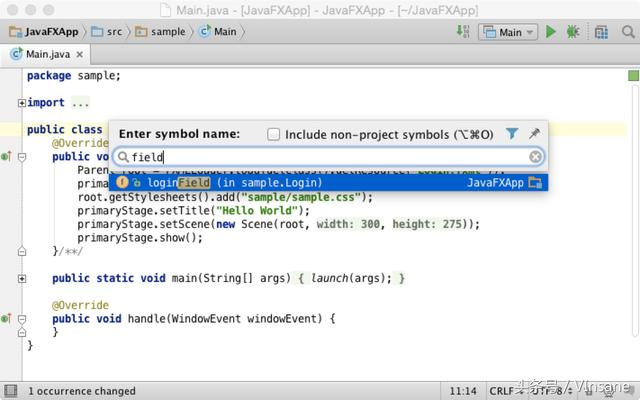

> 指定工具窗口中搜索指定文件

比如现在需要在特定工具窗口中搜索某个文件，比如在工程文件或者是改变列表中，或者是资源浏览器或者Finder中等搜索指定文件的时候，Select In就派上用场了：可以通过Alt+F1来操作：

 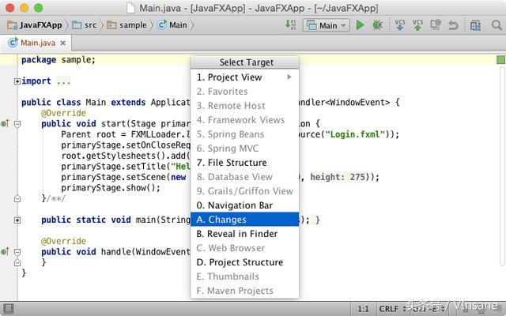

> 快速切换工具窗口

IntelliJ IDEA中的大部分工具窗口都分配来快捷键。按下相关快捷键，相关的工具窗口就会出现并获取焦点。如果相关工具窗口已经出现在界面上，那按下快捷键就会因此相关工具窗口并回到编辑区。这个功能太有用了，这样我们可以完全不需要鼠标了：不管你什么时候需要什么工具窗口或者回到编辑区，按下快捷键，Duang，愿望达成：

咱起码记住下面几个快捷键：

 + 工程窗口：Alt + 1 (Cmd + 1 for OS X)
 + 版本控制窗口：Alt + 9 (Cmd + 9 for OS X)
 + 命令行窗口：Alt + F12

> 快速切换到编辑区

有一个特性，可能大多数人都没有注意到，那就是可以通过Esc来快速切换到编辑区，不管你在什么地方。这个功能会保留你当前的工具窗口现状，哪些隐藏，哪些显示，都保持当前的状态。如果需要切换回编辑区同时隐藏所有工具窗口，可以通过：Ctrl + Alt + F12 (Cmd+ Alt + F12 for OS X)来实现。


## 使用MAC IDEA
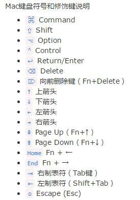
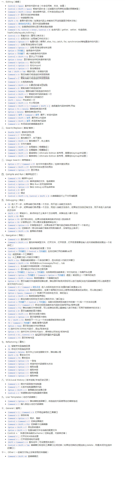

## mac pro 开发常用组合键

```
在Mac系统中几个键位组合可以使Terminal的操作更加灵活方便。

1、将光标移动到行首：ctrl + a

2、将光标移动到行尾：ctrl + e

3、清除屏幕：            ctrl + l

4、搜索以前使用命令：ctrl + r

5、清除当前行：         ctrl + u

6、清除至当前行尾：   ctrl + k

7、单词为单位移动：option + 方向键

8、多tab支持

   1)terminal y也是支持多tab的, Cmd+T可以打开一个新的tab

   2) cmd + shift + { / } 可以在tab间切换

9、 termial中打开外部app
  1) 使用 open yourfile 可以直接把你的文件用默认程序打开
   2) 使用 open -a safari 可以打开safari应用 

10、打开新widown
   1)使用cmd + n 可以打开新窗口

11、查看对应端口号的进程
lsof -i:端口号   （查找对应端口号的进程）
kill PID（杀死端口号对应PID的进程）


12、程序窗口最小化

cmd+m

Mac下打开文件时要进入其他目录（如根目录）的快捷方式 cmd+shift+G
```
