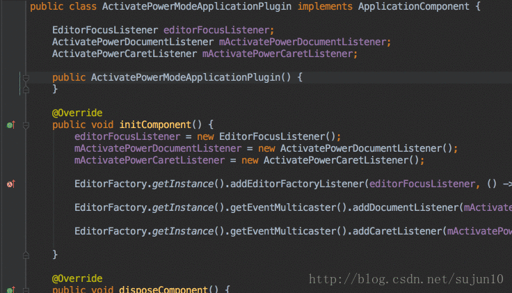
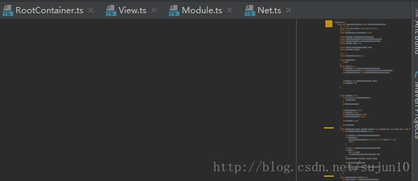
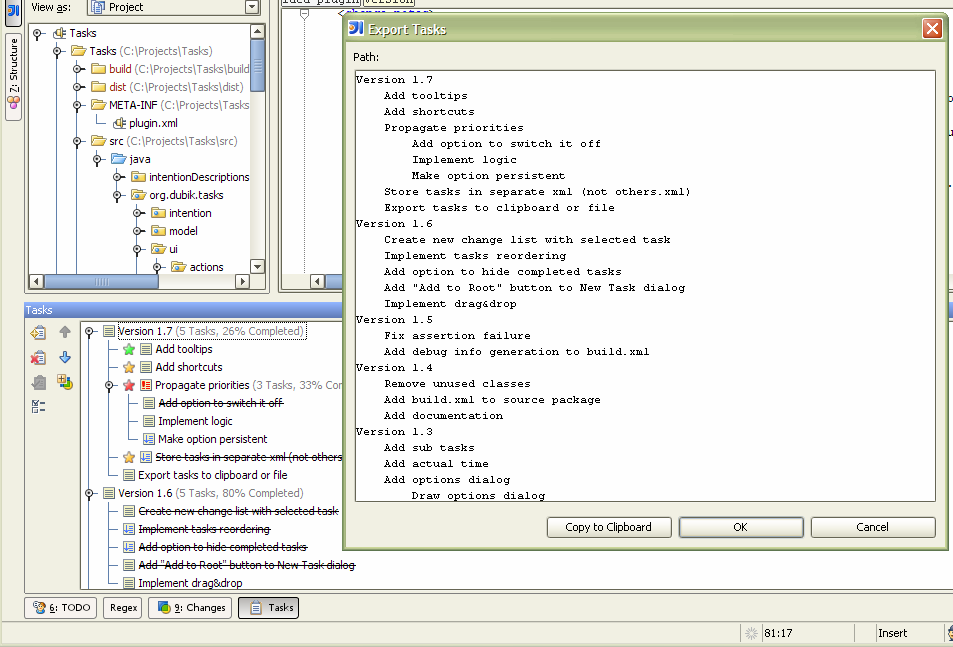
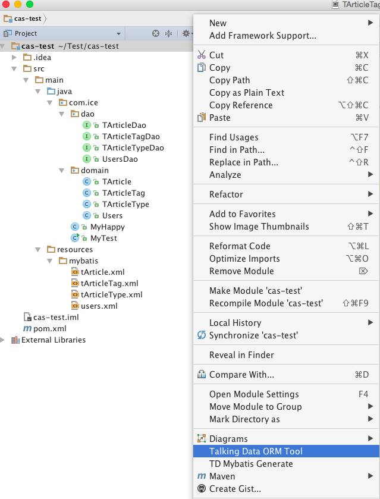
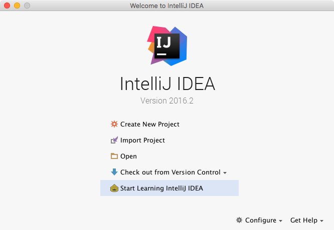
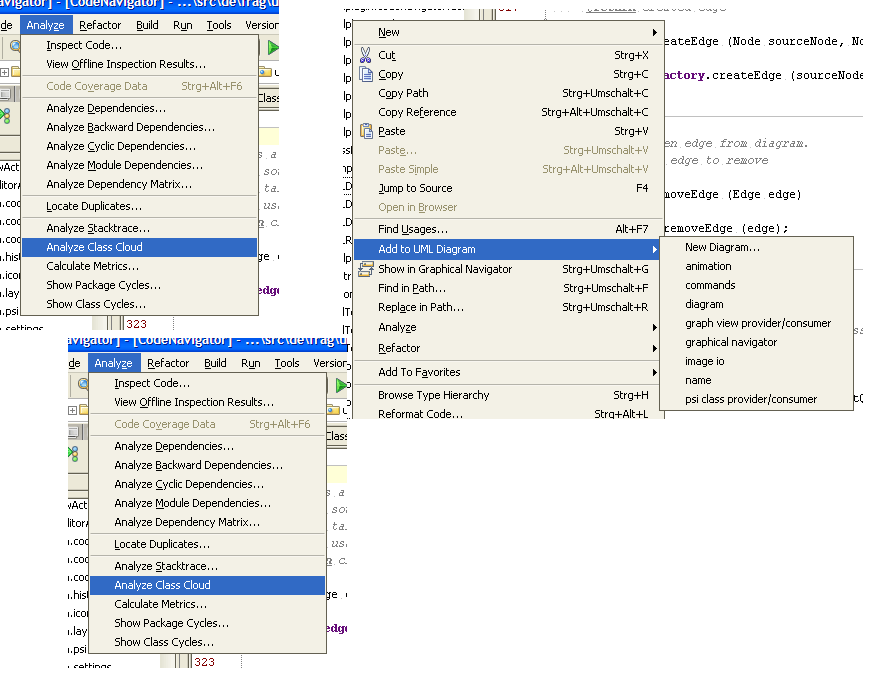

# 常用插件

- **Key Promoter X** 是一个提示插件

- **sonar-intellij-plugin**

- **SonarLint**

- **LiveEdit**

- **plantuml4idea**(PlantUML)

```
画UML的
```

- **activate-power-mode**(装逼插件)



- **CodeGlance**(类似SublimeText的Mini Map插件 )



- **Background Image Plus**

```
这又是一款装备B插件了，想想别人看到你的IDE有个美女或者异次元背景是怎样的，安装之后，在打开View选项，就可以看到Set Background Image选项了。 
```

- **FindBugs-IDEA**

- **RestfulToolkit**

```
一套 RESTFul 服务开发辅助工具集。
1.根据 URL 直接跳转到对应的方法定义 ( Ctrl \ or Ctrl+Alt+N );
2.提供了一个 Services tree 的显示窗口;
3.一个简单的 http 请求工具;
4.在请求方法上添加了有用功能: 复制生成 URL;,复制方法参数...
5.其他功能: java 类上添加 Convert to JSON 功能，格式化 json 数据 ( Windows: Ctrl + Enter; Mac: Command + Enter )。
支持 Spring 体系 (Spring MVC / Spring Boot)

支持 JAX-RS

支持 Java 和 Kotlin 语言。
```

- **MyBatis Log Plugin**


```
把 mybatis 输出的sql日志还原成完整的sql语句。 
将日志输出的sql语句中的问号 ? 替换成真正的参数值。 
通过 "Tools -> MyBatis Log Plugin" 菜单或快捷键 "Ctrl+Shift+Alt+O" 启用。 
点击窗口左边的 "Filter" 按钮，可以过滤不想要输出的sql语句。 
点击窗口左边的 "Format Sql" 按钮，可以格式化输出的sql语句。 
选中console的sql日志，右击 "Restore Sql from Selection" 菜单可以还原sql语句。 
前提条件：输出的sql日志必须包含"Preparing:"和"Parameters:"才能正常解析。 
```

- **grep console**
```
grep console 可以对控制台日志进行高亮和正则搜索
```

- **Tasks**（开发任务导航）



```
设置每天的开发任务
```

- Java Stream Debugger

- TalkingData ORM Tool

```
根据选择的数据库，匹配数据库中的所有表，自动生成domain类、dao接口和mapping文件。 
```



- GsonFormat


- IDE Features Trainer(idea教程)



- Alibaba Java Coding Guidelines（阿里）

- Java Decompiler IntelliJ Plugin（反编译插件）

- QAPlug

```
QAPlug is an Intellij IDEA plugin to manage code quality which integrates tools such as PMD, Checkstyle and Findbugs.
```

- Code Navigator

```
1) class cloud diagram
2) graphical navigation between dependent classes
3) creation of UML diagrams
```



- RoboPOJOGenerator

```
Generate Java and Kotlin POJO files from JSON: GSON, FastJSON, AutoValue (GSON), Logan Square, Jackson, empty annotations template. 
```

- Swagger Codegen

- 360 FireLine Plugin

```
火线是360旗下的一款免费的代码静态分析产品，适用于Android和Java代码。
主打的安全检查规则是根据360业务多年技术沉淀而来。内存类检查的精确度业内领先。
```

- idea-mybatis-generator

```
mybatis 生成器 
注意：url中需要使用jdbc:mysql://xxxx:3306的形式 
mybatis-generate 
To generate sql template for mybatis 
Tips: the example of url like this jdbc:mysql://xxxx:3306 
```

- MyBatisCodeHelperPro

```
特性

支持mysql和oracle和sqlite
根据java对象生成mybatis crud代码和建表sql

根据mybatis接口中的方法名生成mybatis的sql 支持find,update,delete,count方法 只需定义一个方法名就可以得到完整mybatis xml代码 可生成大部分单表操作sql 极大提升效率

mybatis接口文件的mapper xml之间的相互跳转

支持生成if-test

方法名生成sql支持生成到service和service接口

数据库对象更新后一键更新对应的Sql和mybatis xml文件

默认提供insert，insertSelective，insertList，update。因为delete可以由方法名生成 默认不提供

提供mybatis接口方法名的重构

refid, resultMap跳转到到定义，支持重命名
refid,resultMap,keyProperty,property的自动补全
支持更换图标
mybatis mapper xml文件sql的自动补全

使用方法

在数据库对象上使用alt+insert (generate mybatis files)来生成crud代码和建表sql(mac上使用ctrl+N)

数据库对象添加字段后使用alt+insert (generate mybatis files) 来生成更新sql,mapper xml中的字段

在mybatis接口的方法名上使用alt+enter来生成对应的mapper sql

详细配置: https://github.com/gejun123456/MyBatisCodeHelper-Pro
```

- Bytecode Editor

```
Provides View | Edit Bytecode action for those who learns JVM internals.

Based on ByteCode Viewer by JetBrains but is better:
```

- 1024 Tools
```
这是汇集全网优质网址及资源的编程导航工具，主要面向中国用户。
及时收录编程、算法、工具、学习等分类的网址导航和内容,让您的编程更简单
```
- Swagger Plugin


- **Jenkins Control Plugin**


- **lombok**

地址：[https://plugins.jetbrains.com/plugin/6317-lombok-plugin](https://plugins.jetbrains.com/plugin/6317-lombok-plugin)
支持lombok的各种注解，从此不用写getter，setter这些，可以把注解还原为原本的java代码

**常用注解介绍**

- @Getter / @Setter

  可以作用在类上和属性上，放在类上，会对所有的非静态(non-static)属性生成Getter/Setter方法，放在属性上，会对该属性生成Getter/Setter方法。并可以指定Getter/Setter方法的访问级别。

- @EqualsAndHashCode

  默认情况下，会使用所有非瞬态(non-transient)和非静态(non-static)字段来生成equals和hascode方法，也可以指定具体使用哪些属性。

- @ToString

  生成toString方法，默认情况下，会输出类名、所有属性，属性会按照顺序输出，以逗号分割。

- @NoArgsConstructor, @RequiredArgsConstructor and @AllArgsConstructor

  无参构造器、部分参数构造器、全参构造器，当我们需要重载多个构造器的时候，Lombok就无能为力了。

- @Data

  @ToString, @EqualsAndHashCode, 所有属性的@Getter, 所有non-final属性的@Setter和@RequiredArgsConstructor的组合，通常情况下，我们使用这个注解就足够了。

Lombok原理

  了解了简单的使用之后，现在应该比较好奇它是如何实现的。整个使用的过程中，只需要使用注解而已，不需要做其它额外的工作，那玄妙之处应该是在注解的解析上。JDK5引入了注解的同时，也提供了两种解析方式。

运行时解析

  运行时能够解析的注解，必须将@Retention设置为RUNTIME，这样可以通过反射拿到该注解。java.lang.reflect反射包中提供了一个接口AnnotatedElement，该接口定义了获取注解信息的几个方法，Class、Constructor、Field、Method、Package等都实现了该接口，大部分开发者应该都很熟悉这种解析方式。

- **p3c**

阿里巴巴出品的java代码规范插件，可以扫描整个项目 找到不规范的地方 并且大部分可以自动修复，更多可看: [https://github.com/alibaba/p3c/tree/master/idea-plugin](https://github.com/alibaba/p3c/tree/master/idea-plugin)

- **FindBugs-IDEA**
 
地址：[https://plugins.jetbrains.com/plugin/3847-findbugs-idea](https://plugins.jetbrains.com/plugin/3847-findbugs-idea)
检测代码中可能的bug及不规范的位置，检测的模式相比p3c更多
写完代码后检测下 避免低级bug，强烈建议用一下，一不小心就发现很多老代码的bug

- **GsonFormat**
 
地址：[https://plugins.jetbrains.com/plugin/7654-gsonformat](https://plugins.jetbrains.com/plugin/7654-gsonformat)
一键根据json文本生成java类  非常方便

- **Maven Helper** 
 
地址：[https://plugins.jetbrains.com/plugin/7179-maven-helper](https://plugins.jetbrains.com/plugin/7179-maven-helper)
一键查看maven依赖，查看冲突的依赖，一键进行exclude依赖，对于大型项目 非常方便

- **VisualVM Launcher**

地址：[https://plugins.jetbrains.com/plugin/7115-visualvm-launcher](https://plugins.jetbrains.com/plugin/7115-visualvm-launcher)
IDEA中搜索VisualVM Launcher可以直接下载
运行java程序的时候启动visualvm，方便查看jvm的情况 比如堆内存大小的分配
某个对象占用了多大的内存，jvm调优必备工具

- **GenerateAllSetter**
 
地址：[https://plugins.jetbrains.com/plugin/9360-generateallsetter](https://plugins.jetbrains.com/plugin/9360-generateallsetter)
一键调用一个对象的所有set方法并且赋予默认值 在对象字段多的时候非常方便

- **MyBatisCodeHelperPro**

地址：[https://plugins.jetbrains.com/plugin/9837-mybatiscodehelperpro](https://plugins.jetbrains.com/plugin/9837-mybatiscodehelperpro)
mybatis代码自动生成插件，大部分单表操作的代码可自动生成  减少重复劳动 大幅提升效率

- **Translation** 

地址：[https://plugins.jetbrains.com/plugin/8579-translation](https://plugins.jetbrains.com/plugin/8579-translation)
最好用的翻译插件，功能很强大，界面很漂亮