# 常用知识点

**IDEA如何导入导出settings配置文件**

- 导出：`File- -->Export Settings ->选择导出目录，会出现一个settings.jar的文件`

- 导入方法：`File->Import Settings ->选择需要导入的settings.jar即可`

**隐藏开发工具的配置目录 例如 .idea;.iml**

`File | Settings | File Types | 在末尾加上 .idea;.iml`

**收起注释，让源码阅读更为清爽！**

`File -> Settings -> Editor -> General -> Code Folding -> Documentation comments` 勾选。

如何想快速一键打开全部注释，则单击鼠标右键，选择`Folding -> Expand Doc comments`

**IDEA如何删除项目工程？**

1、点击`File-> Close Project` 即可快速关闭当前项目(逻辑删除)；
2、右键`Show In Explorer` ，删掉文件夹即可（物理删除）;

建议还是直接Close关掉就好啦，万一以后用得上呢

<font size=3 color=#009300 face="黑体">缓存和索引
&emsp;&emsp;IntelliJ IDEA 的缓存和索引主要是用来加快文件查询，从而加快各种查找、代码提示等操作的速(上图中的图标能这样显示也是靠索引)。某些特殊条件下，IntelliJ IDEA 的缓存和索引文件也是会损坏的，比如断电、蓝屏引起的强制关机，当你重新打开 IntelliJ IDEA，基本上百分八十的可能 IntelliJ IDEA 都会报各种莫名其妙错误，甚至项目打不开，IntelliJ IDEA 主题还原成默认状态。</font>

1、清理缓存和索引。
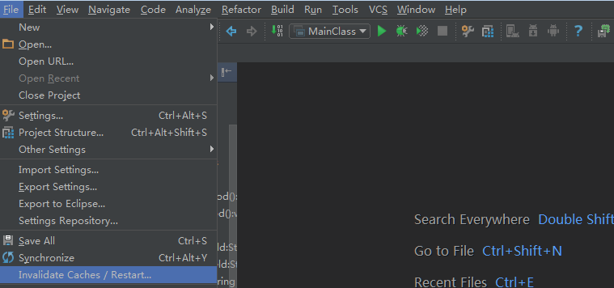
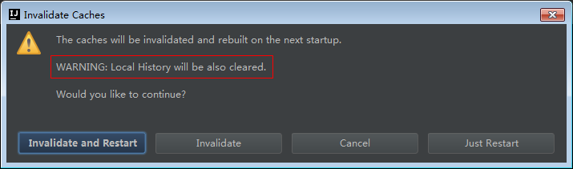

一般点击Invalidate and Restart，这样会比较干净。

<font size=3 color=red face="黑体">注：如上图红圈标注的地方：清除索引和缓存会使得 IntelliJ IDEA 的Local History丢失，所以如果你项目没有加入到版本控制，而你又需要你项目文件的历史更改记录，那你最好备份下你的LocalHistory目录。目录地址在：C:\Users\Administrator(当前登录的系统用户名)\.IntelliJIdea2016.2(版本信息)\system\LocalHistory。</font>通过上面方式清除缓存、索引本质也就是去删除 C 盘下的system目录下的对应的文件而已，也可自己手动删除。


<font size=3 color=#009300 face="黑体">若intellij 无缘无故没有了项目目录结构，就是.idea文件下里的modules.xml文件丢失了，把它恢复回来，修改相应的参数即可。		</font>
<br/>
<font size=3 color=#009300 face="黑体">【注意】热部署的时候，有选择</font><font size=3 color=red face="黑体">普通包还是exploded包，只有exploded包才能热部署资源文件。   </font>


war 和war exploded 的区别：
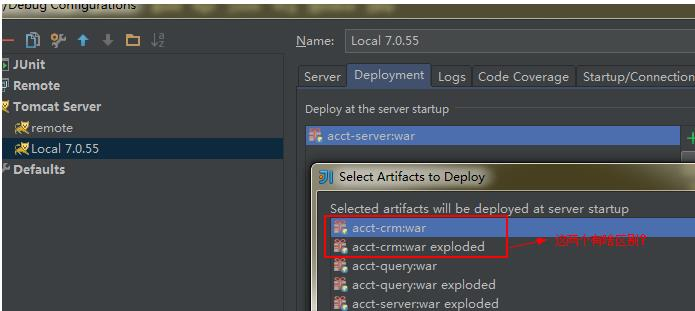
 【透析：】区别就是一个通过war包部署，一个展开后部署。部署项目的时候一般选第一个。选exploded 才能让调试的时候及时修改的资源重载

<br/>
<font size=3 color=#009300 face="黑体">IDEA 部署的tomca项目，是把tomcat相应的配置复制到默认在</font> <font size=3 color=red face="黑体">.IntelliJIdea --> system --> tomcat </font><font size=3 color=#009300 face="黑体">文件夹下</font>

 即：CATALINA_BASE 的路径 <font size=3 color=#009300 face="黑体">（如我本机的路径：D:\Program Files\JetBrains\IdeaConfig\.IntelliJIdea\system\tomcat）</font>

如何把错误提示代码提示调出来？没有代码错误提示了，也就是红色波浪线，每次编译之后才看到错误，非常不便！
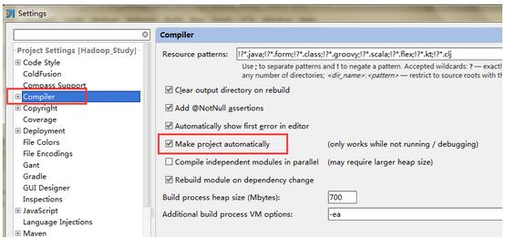

**为什么有了当前项目配置，还需要默认配置呢？**

因为IDEA没有工作空间的概念，所以每个新项目（Project）都需要设置自己的JDK和MAVEN等相关配置，这样虽然提高了灵活性，但是却要为每个新项目都要重新配置，这显然不符合我们的预期。在这个背景下，默认配置给予当前项目配置提供了Default选项，问题自然就迎刃而解了。

- 初始化步骤
 - 打开默认配置：`顶部导航栏 -> File -> Other Settings -> Default Settings /ProjectStructs`
 - 打开当前配置：`顶部导航栏 -> File -> Settings / ProjectStructs`

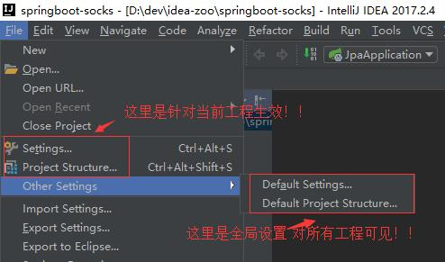

**全局JDK（默认配置）**

具体步骤：顶部工具栏 `File ->Other Settings -> Default Project Structure -> SDKs -> JDK`

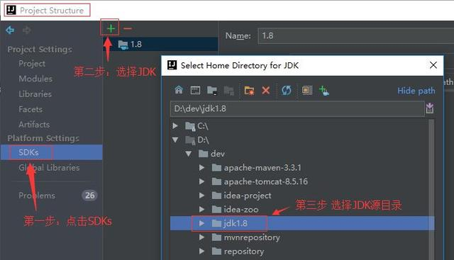

**全局Maven（默认配置）**

具体步骤：顶部工具栏 `File ->Other Settings -> Default Settings -> Build & Tools -> Maven`

理论上只要配置了Maven主目录即可，实际开发推荐采用User Settins file。

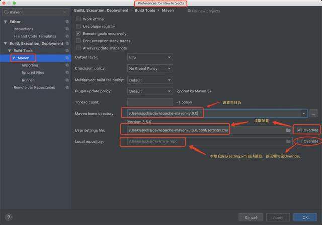

右侧工具栏 Maven -> 点击展开某工程或模块 ->快速执行Maven命令。


**自动导包和智能移除 （默认配置）**

具体步骤：顶部工具栏` File ->Other Settings -> Default Settings -> Auto Import`

使用说明：在网上看到很多人在提问IDEA为什么不能优化导包而Eclipse可以，这不是低端黑嘛， 所以特意抽出来跟大家分享IDEA如何优化导包。

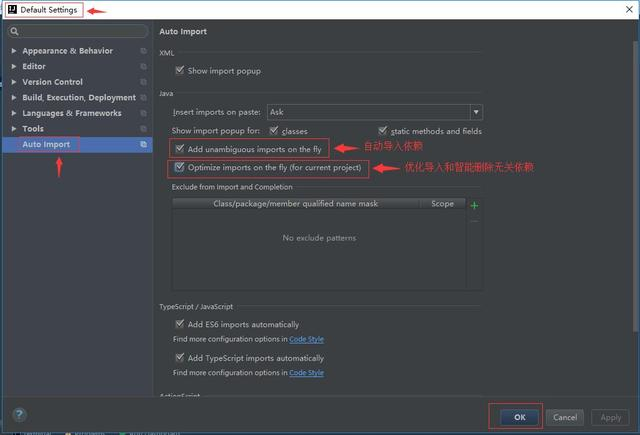

**Tomcat Server（当前项目配置）**

很多小伙伴刚开始都找不到Tomcat的配置，其实很简单，Tomcat或者Jetty这些都是部署的容器，自然会联想到Deployment ，打开部署配置，可以看到应用服务器的配置。

配置Tomcat方法：`File -> Settings -> Deployment -> Application Servers -> Tomcat Server`

具体配置方法，如下图：

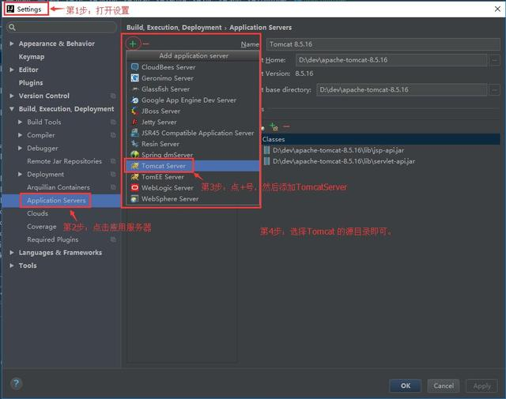

**自动编译**

具体步骤：顶部工具栏` File ->Other Settings -> Default Settings -> Compiler->Build Project automatically`

说明：开启自动编译之后，结合`Ctrl+Shift+F9` 会有热更新效果。

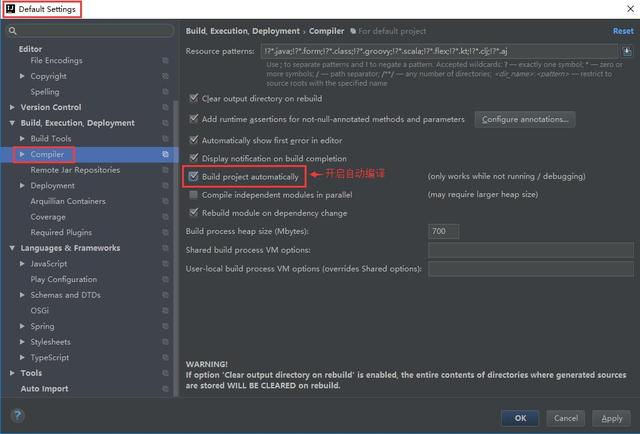

自动编译（Runtime）

具体步骤：敲击 `Ctrl + Shift + Alt + /` 然后双击Shift搜索进入Registry ，找到compiler.automake.allow.when.app.running ，然后勾选上。
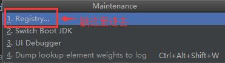
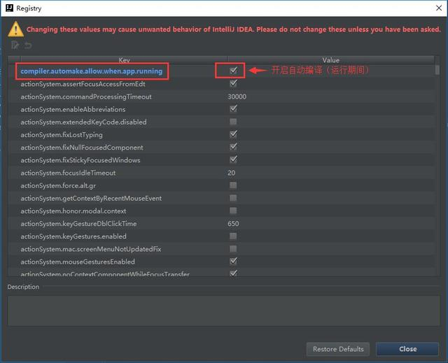

## 常用设置

**多页面显示和多TAB页显示**

- tab多行显示

IntelliJ IDEA 默认是把所有打开的文件名 Tab 单行显示的，且因为单行会隐藏超过界面部分 Tab，这样找文件不方便。这导致我很难受。查阅了一些资料之后发现IDEA 是可以多行显示的，自从设置了之后，妈妈再也不用担心我找文件不方便了。下面看看多行显示是怎么设置的吧。步骤如下:`File -> Setting -> Editor -> General -> Editor Tabs`下设置，如图

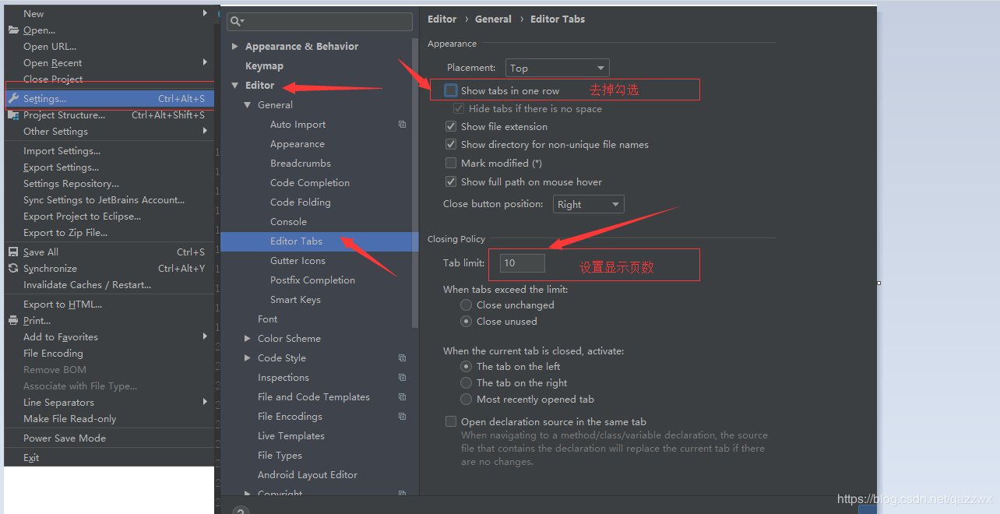

查看效果图:

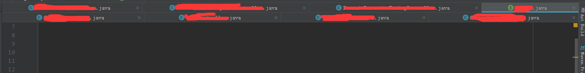

- 多页面显示

intellij idea在同一个界面显示2个窗口或多个窗口，没有快捷键，只能用鼠标在窗口标签上点右键操作。下面介绍具体的操作方法。

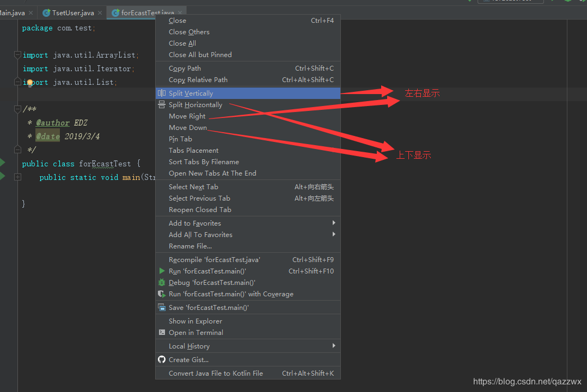

查看效果图:

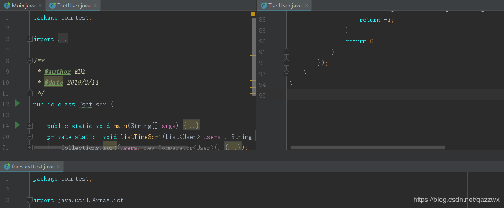

**Alt + F7可以知道谁调用该方法，看源码很好用**

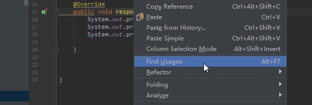

**查看类的diagrams** 时，按住alt 键会出现放大镜

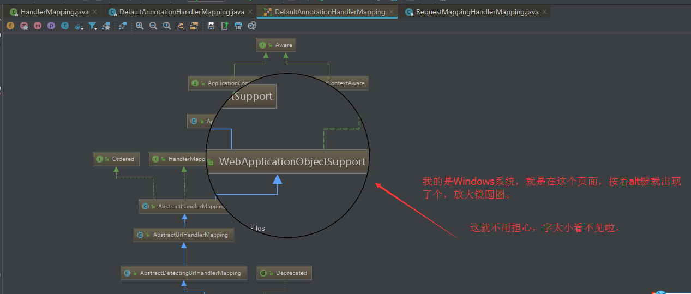

**使用IntelliJ IDEA查看类的继承关系图形**

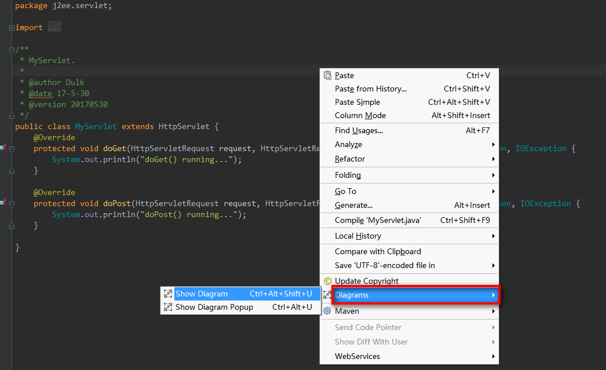
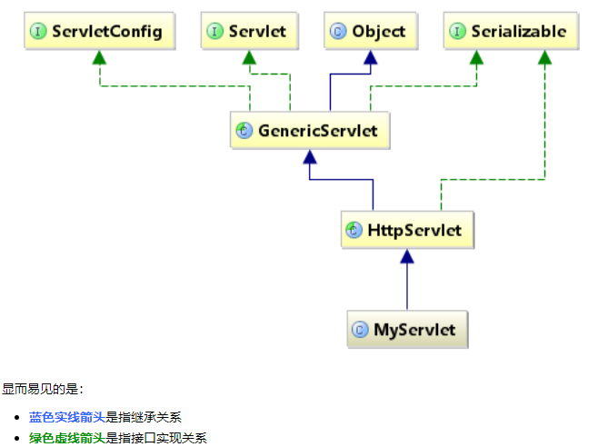


**双击某个类后，你就可以在其下的方法列表中游走，对于你想查看的方法，选中后点击右键，选择 Jump to Source 或 F4**

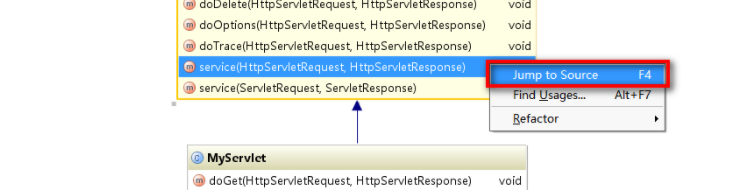

**让IDEA不去校验javadoc中的错误**

idea默认是会校验注释中的合法性的，如果有个方法里的参数删除了，但注释忘记删除了，这时IDEA会提示注释有错，如果想忽略这个，可以按如下方式修改：
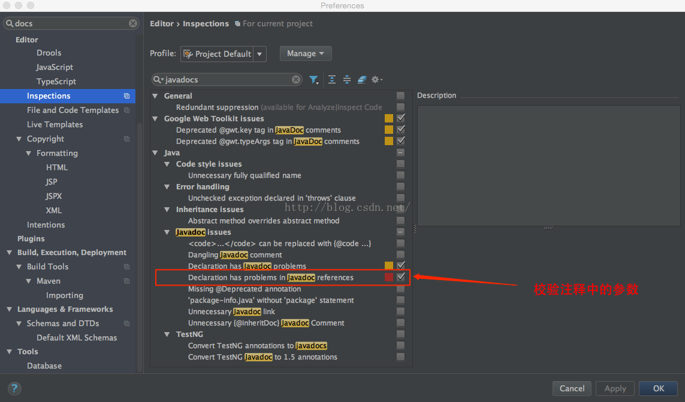
 
**提示实现Serializable接口**

使用 Eclipse 或 MyEclipse 的同学可能知道，如果 implements Serializable 接口时，会提示你生成 serialVersionUID。但 Intellij IDEA 默认没启用这个功能。Preferences->IEditor->nspections->Serialization issues->Serializable class without ’serialVersionUID’，选中以上后，在你的class中：光标定位在类名前，按 Alt+Enter 就会提示自动创建 serialVersionUID了
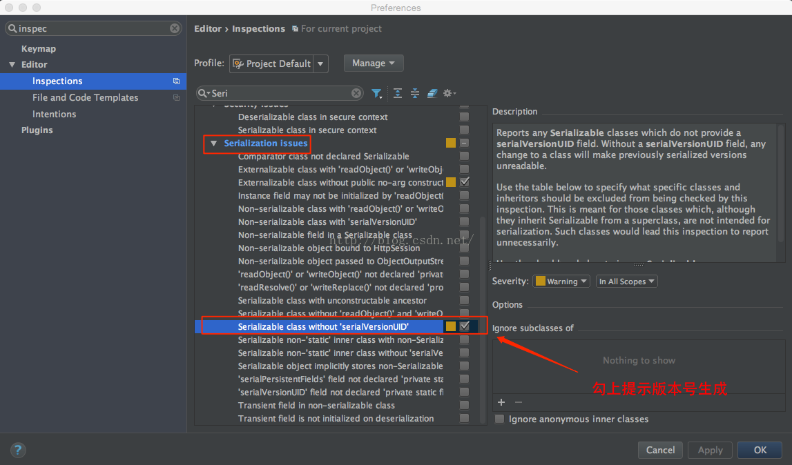

**设置显示行数**   
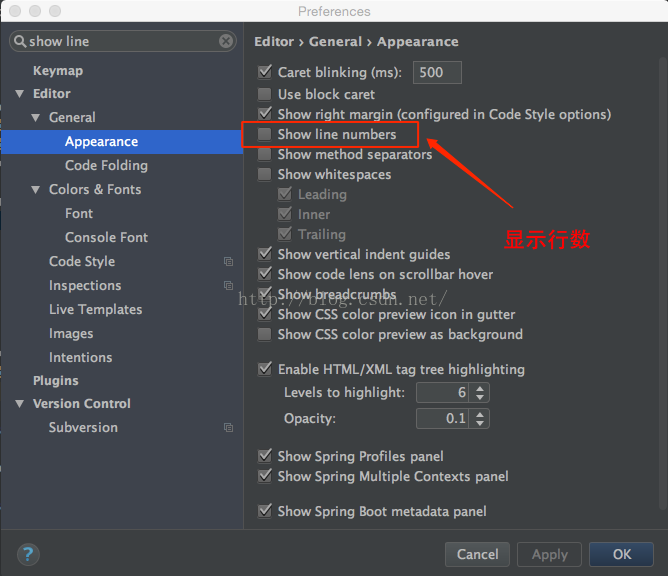

**设置编码**
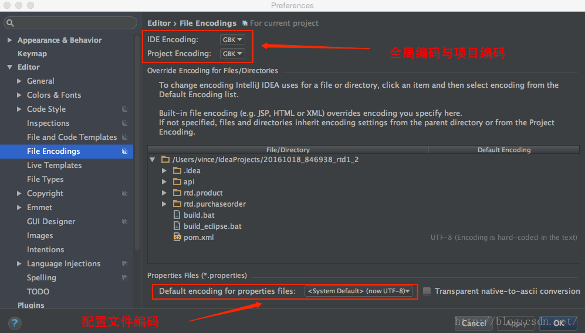

**设置启动可选择打开项目**

每次启动打开上次关闭的项目，默认是勾选的

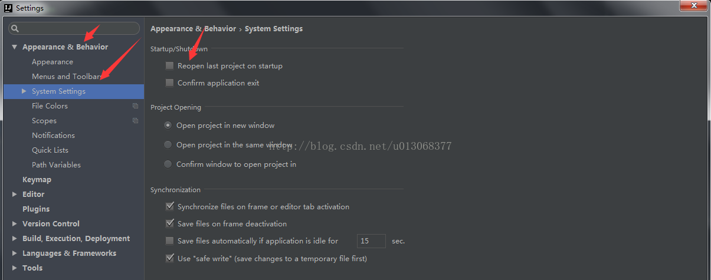

**开启自动 import 包的功能**

Java 就是这种包组合在一个的一个东西, 我们在写代码时常常需要引入一些类, 一些第三方的包. 在 eclipse 时我们使用快捷键引入, IDEA 也可以使用 `Alt + Enter` 进行导入包.

如果我们在写代码时IDE自动帮我们引入相关的包, 是不是很酷的意见事情. IDEA 提供了这个功能, 不过默认是关闭的. 打开自动导入包设置如下:

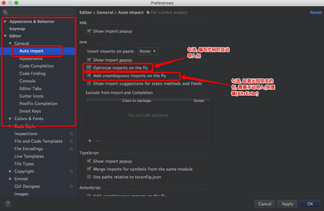

**左侧项目显示类方法**

IDEA 左侧项目:evergreen_tree:默认不显示方法列表, 只显示类名这样我们很不方便查看方法, 快速定位, 显示方法列表设置如下:

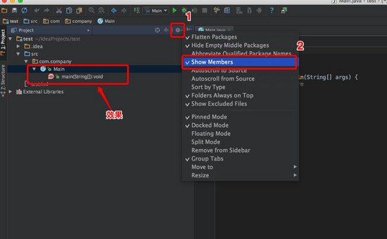

**代码提示不区分大小写**

代码提示是一个很重要的功能, 如果没有此功能一些较长的方法名, 类等, 很难记住. IDEA 代码提示功能很棒, 但是默认是区分大小写的, 我们记不清一些东西是大写还是小写, 这就比较尴尬了. 所以我们要把这个区分去掉, 设置如下: <font color=red size=3>将 Case sensitive completion 设置为 None 就可以了</font>

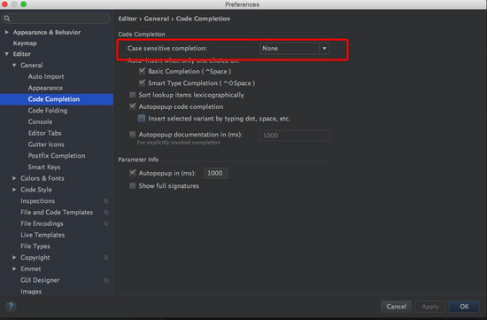


**设置字体大小**    
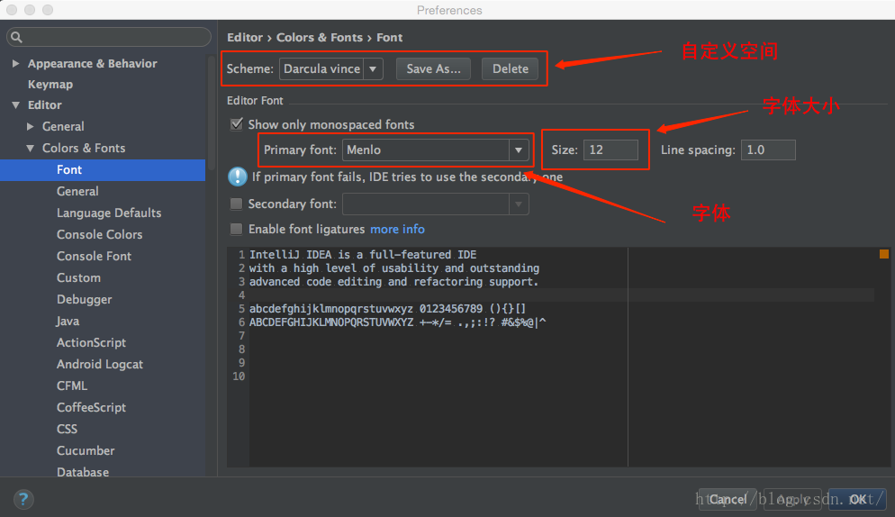

**有时我们打开.properties文件时，中文显示为utf8编码格式，可以在file->setting->editor->file encodings下把transparent native-to-ascll conversion勾选上就行了。**
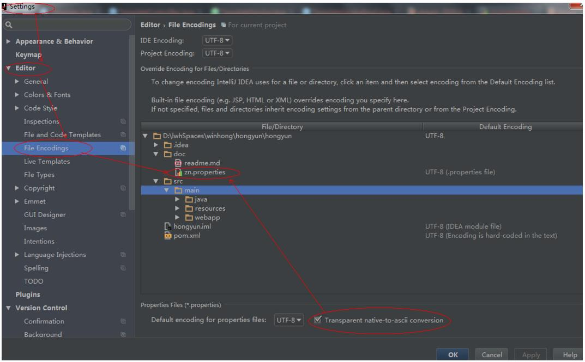


**IntelliJ IDEA 自带模拟请求工具 Rest Client，在开发时用来模拟请求是非常好用的。**


**IntelliJ IDEA 自带了代码检查功能，可以帮我们分析一些简单的语法问题和一些代码细节。**


**我们可以根据选择的代码，查看该段代码的本地历史，这样就省去了查看文件中其他内容的历史了。除了对文件可以查看历史，文件夹也是可以查看各个文件变化的历史。**


**即使我们项目没有使用版本控制功能，IntelliJ IDEA 也给我们提供了本地文件历史记录。除了简单的记录之外，我们还可以给当前版本加标签。**


**我最爱的【演出模式】**

我们可以使用【`Presentation Mode`】，将IDEA弄到最大，可以让你只关注一个类里面的代码，进行毫无干扰的coding。

这个模式的好处就是，可以让你更加专注，因为你只能看到特定某个类的代码。可能读者会问，进入这个模式后，我想看其他类的代码怎么办？这个时候，就要考验你快捷键的熟练程度了。你可以使用CTRL+E弹出最近使用的文件。又或者使用`CTRL+N`和`CTRL+SHIFT+N`定位文件。

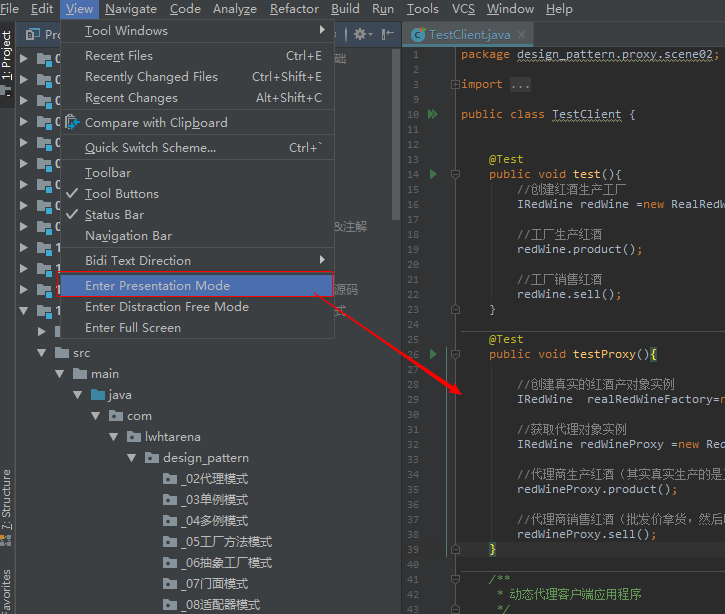

**神奇的Inject language**

如果你使用IDEA在编写JSON字符串的时候，然后要一个一个去转义双引号的话，就实在太不应该了，又烦又容易出错。在IDEA可以使用Inject language帮我们自动转义双引号。 

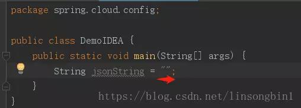

先将焦点定位到双引号里面，使用alt+enter快捷键弹出inject language视图，并选中 Inject language or reference。 

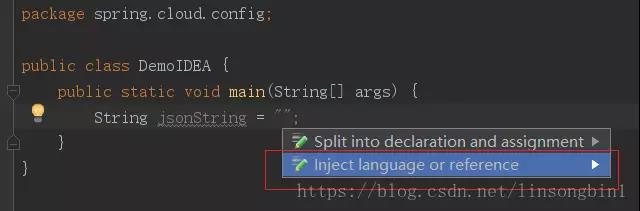

选择后,切记，要直接按下enter回车键，才能弹出inject language列表。在列表中选择 json组件。 

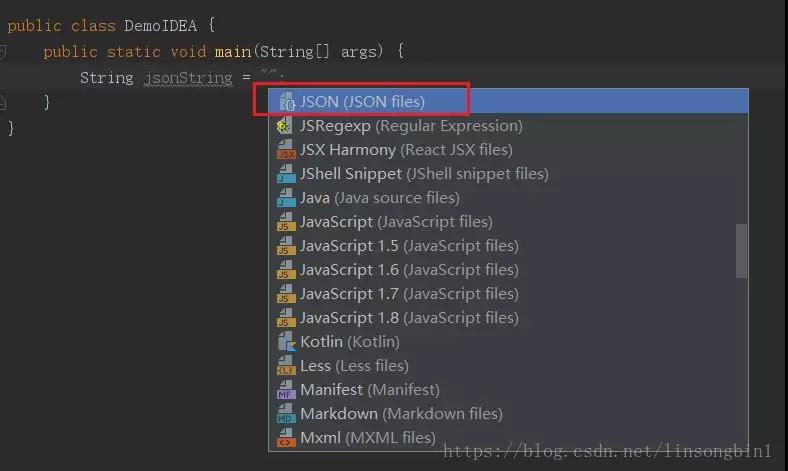

选择完后。鼠标焦点自动会定位在双引号里面，这个时候你再次使用alt+enter就可以看到 

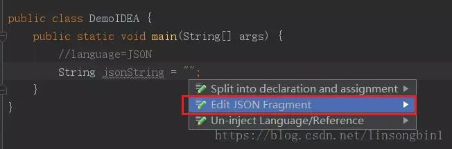

选中Edit JSON Fragment并回车，就可以看到编辑JSON文件的视图了。

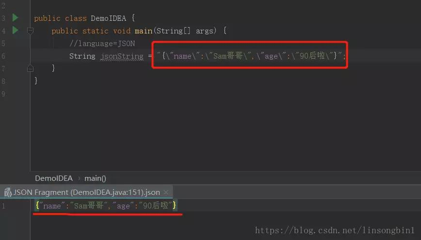

可以看到IDEA确实帮我们自动转义双引号了。如果要退出编辑JSON信息的视图，只需要使用ctrl+F4快捷键即可。

**使用快捷键移动分割线**


你想完整的看到类的名字，该怎么做。一般都是使用鼠标来移动分割线，但是这样子效率太低了。可以使用alt+1把鼠标焦点定位到project视图里，然后直接使用ctrl+shift+左右箭头来移动分割线。

**ctrl+shift+enter不只是用来行尾加分号的**

`ctrl+shift+enter`其实是表示为您收尾的意思，不只是用来给代码加分号的。比如说：

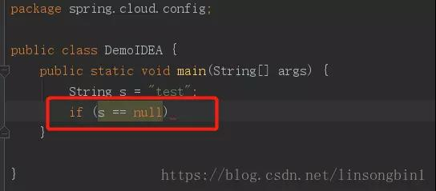

这段代码，我们还需要为if语句加上大括号才能编译通过，这个时候你直接输入ctrl+shift+enter，IDEA会自动帮你收尾，加上大括号的。

**不要动不动就使用IDEA的重构功能**

IDEA的重构功能非常强大，但是也有时候，在单个类里面，如果只是想批量修改某个文本，大可不必使用到重构的功能。比如说： 

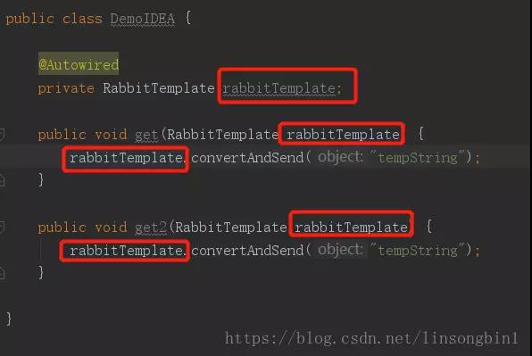

上面的代码中，有5个地方用到了rabbitTemplate文本，如何批量修改呢？ 首先是使用ctrl+w选中rabbitTemplate这个文本,然后依次使用5次alt+j快捷键，逐个选中，这样五个文本就都被选中并且高亮起来了，这个时候就可以直接批量修改了。

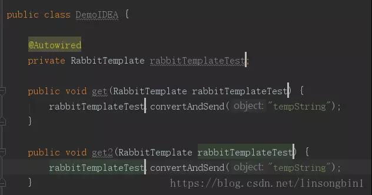

**去掉导航栏**

去掉导航栏，因为平时用的不多。

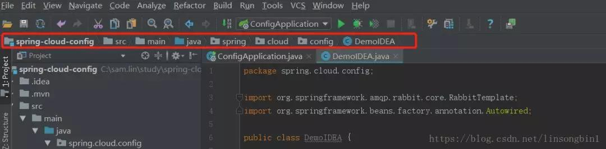

可以把红色的导航栏去掉，让IDEA显得更加干净整洁一些。使用alt+v，然后去掉Navigation bar即可。去掉这个导航栏后，如果你偶尔还是要用的，直接用alt+home就可以临时把导航栏显示出来。  

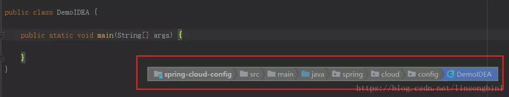

如果想让这个临时的导航栏消失的话，直接使用esc快捷键即可。

**把鼠标定位到project视图里**

当工程里的包和类非常多的时候，有时候我们想知道当前类在project视图里是处在哪个位置。 

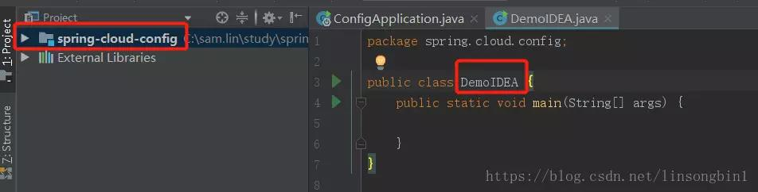

上面图中的DemoIDEA里，你如何知道它是在spring-cloud-config工程里的哪个位置呢？ 可以先使用alt+F1，弹出Select in视图，然后选择Project View中的Project，回车，就可以立刻定位到类的位置了。

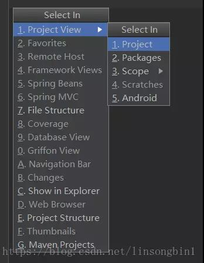

那如何从project跳回代码里呢？可以直接使用esc退出project视图，或者直接使用F4,跳到代码里。

**强大的symbol**
如果你依稀记得某个方法名字几个字母，想在IDEA里面找出来，可以怎么做呢？ 直接使用`ctrl+shift+alt+n`，使用symbol来查找即可。 比如说： 

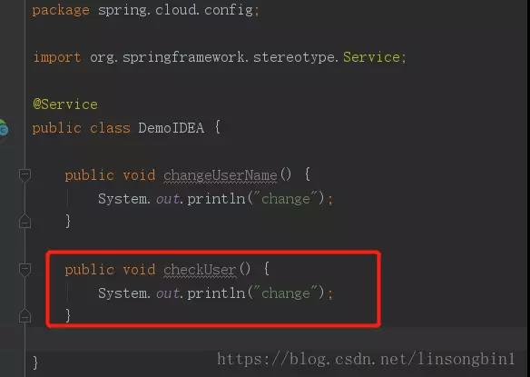

你想找到checkUser方法。直接输入user即可。 

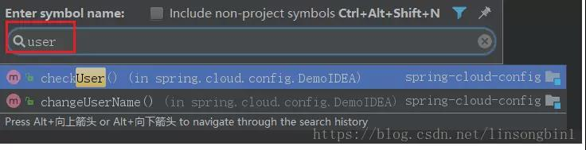

如果你记得某个业务类里面有某个方法，那也可以使用首字母找到类,然后加个.，再输入方法名字也是可以的。 

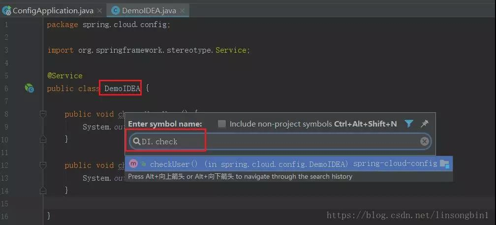

**如何找目录**

使用`ctrl+shift+n`后，使用/，然后输入目录名字即可。

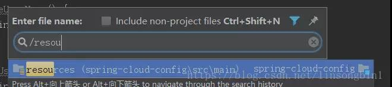

**自动生成not null判断语句**

自动生成not null这种if判断，在IDEA里有很多种办法，其中一种办法你可能没想到。

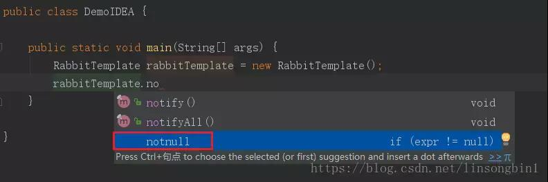

当我们使用rabbitTemplate. 后，直接输入notnull并回车，IDEA就好自动生成if判断了。

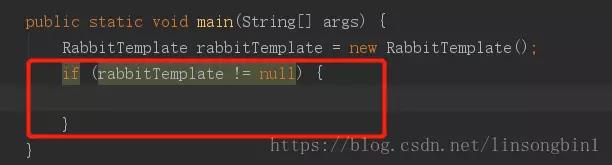

**按照模板找内容**

这个也是我非常喜欢的一个功能，可以根据模板来找到与模板匹配的代码块。比如说：
想在整个工程里面找到所有的try catch语句,但是catch语句里面没有做异常处理的。

catch语句里没有处理异常，是极其危险的。我们可以IDEA里面方便找到所有这样的代码。 


首先使用ctrl+shift+A快捷键弹出action框，然后输入Search Struct。


选择Search Structurally后，回车，跳转到模板视图。 


点击Existing Templates按钮，选择try模板。为了能找出catch里面没有处理异常的代码块，我们需要配置一下CatchStatement的Maximum count的值，将其设置为1。

点击Edit Variables按钮，在界面修改Maximum count的值。 


最后点击find按钮，就可以找出catch里面没有处理异常的代码了。 


**加载大量JS卡死问题**

idea也有卡死的时候，一定要选择项目名，右击，出现菜单，具体选择如下


**远程debug无效分析**

+ 确认好域名和调试端口对不对
+ 其他人是否正是调试，占用了
+ 实在不行，可以重启服务器试试或把本地java进程杀掉试试

上述办法还搞不定，请打日志吧

**debug动态改值**

演示个改String的操作，程序员经常定位到问题但又不想改代码，其实可以动态改值，方便调试的。


**Ctrl+Alt+left/right**

Ctrl+Alt+left/right 返回至上次浏览的位置 【非常好用啊】

**Ctrl+ Alt+B** 进入接口方法的具体实现

**使用ctrl+alt+h要小心** （ 查找方法被调用的地方 ）

菜单操作如下，这个功能我一般就菜单操作，选中方法，然后`【Navigate】`->`【Call Hierarchy】`->`【调用的地方列表就出来了】`

`ctrl+alt+h`非常好用,但是有个坑,当同一个方法里,调用某个方法多次的时候,比如说下面的代码：
```java
public class TestService {   
	 public void test1() {
        System.out.println("aa");  
 	 }    
	public void test2() {    
  	  test1();    
	}    
	public void test3() {    
    	test1();       
		 //无数业务操作后,再次电影test1()方法        
		test1();    
	}
}
```
如果我们想知道有哪些地方调用了test1()方法，使用`ctrl+alt+h`无法正确列出来的。因为`ctrl+alt+h`只能告诉你调用的层次。 


ctrl+alt+h只是会在某个隐蔽的地方，告诉你，test3()方法调用了test1（）方法两次。这样就很容易坑到开发者，因为大部分人可能不太注意后面的调用次数，导致改bug的时候，以为全部都改了呢？

如果你想精确的列出到底哪些地方调用了test1（）方法，你需要使用alt+f7这个快捷键。


尤其是我们在阅读极其复杂的业务代码时，使用**alt+f7**就非常合适。
当然alt+f7也可以作用在变量上，列出某个类里，哪些地方使用了该变量。

**ctrl+alt+h被问的最多的两个问题**

> 使用ctrl+alt+h怎么跳转到源代码，又如何重新回到ctrl+alt+h对应的视图里面。

+ 调转到源代码


其实很简单，当你使用ctrl+alt+h后，使用向下或者向上箭头，选择某个调用，然后按下f4即可跳转到源代码。

+ 如何回到ctrl+alt+h视图

这个真心被问了好几百遍，其实很简单，当你使用f4跳转到源代码后，直接使用alt+8就可以跳回去了。就又可以继续看下一个调用的地方了。

**快速找到Controller方法**

如果你的项目里有非常多的controller，里面有非常多的http或者resful方法。如何快速找到这些方法呢？这个时候，ctrl+alt+shift+n就可以派上用场了。

比如说，你依稀记得入账单相关的接口，都有个bill的url路径，那么使用ctrl+alt+shift+n后，直接输入/bill即可。


当你在成千上万的Controller里寻找方法时，这一招就可以大大提高效率。

**如何阅读又长又臭的代码**
由于历史原因，项目里总会存在那种无法理解的，又长又臭的业务代码。阅读这种代码，简直就是一种煎熬。但是在IntellIJ IDEA里，只要使用5个小技巧，便可大大提高阅读质量和速度。

- 创建任意代码折叠块


像上面的for循环，我想直接将其折叠起来，因为代码太长的时候，使用折叠块，可以帮助你快速理清代码的主脉络。

可以将光标定位在for循环的左大括号里，然后使用ctrl+shift+. 即可。 


如果你想让这个折叠快消失，直接使用ctrl 加上一个+即可。

- 大括号匹配

这个也非常有用，因为代码太长，某个for循环，可能已经撑满整个屏幕了。这个时候，找到某个大括号对应的另外一边就很费劲。你可以将光标定位在某个大括号一边，然后使用`ctrl+]`或者`ctrl+[`来回定位即可。

- ctrl+shift+f7结合f3

`ctrl+shift+f7`可以高亮某个变量，而且随着鼠标的移动，这个高亮是不会消失的(这个很重要)。然后使用`f3`找到下一个使用该变量的地方。

-  使用ctrl+shift+i

这个也是阅读长段代码的法宝，当你阅读的代码很长的时候，突然想看代码里某个类的定义，那么直接使用`ctrl+shift+i`,就可以在当前类里再弹出一个窗口出来。比如说： 


在这个代码块里，你想看看TestTemp类的定义，那么将光标定位在TestTemp上，然后直接使用ctrl+shift+i，就会弹出如下的窗口。 


按下esc，可以关闭这个窗口。

- 使用alt+f7
这个我在上面已经介绍过了。可以列出变量在哪些地方被使用了。
结合这5个技巧，相信可以大大提高长段代码的阅读效率。

- 跳到父类接口

我们经常会定义一个service 接口，比如说UserService,然后使用一个UserServiceImpl类去实现UserService里面的接口。
```java
public interface UserService {
    void test1();
}
```
```
public class UserServiceImpl implements UserService {
    @Override
    public void test1() {

    }
}
```
那么在UserServiceImpl里的test1()方法上，如何跳转到UserService的test1(),直接使用`ctrl+u`即可。


 


线程类型


# 常用图标


# 各类文件类型图标介绍


# IDEA 使用SVN


这里的忽略一直灰色的，可以进入


这里的版本控制里进行忽略选择


或


这里进行添加


这里有三个选择，按照顺序

1、忽略指定的文件

2、忽略文件夹下所有文件

3、忽略符合匹配规则的文件

到Commit Changes 这里有几个选项需要了解的:

	Auto-update after commit :自动升级后提交
	keep files locked :把文件锁上，我想这应该就只能你修改其他开发人不能修改不了的功能
	在你提交之前：before commit
	Reformat code:重新格式化代码
	Rearrange code:重新整理代码
	Optimize imports：优化导入
	Perform code analysis：执行代码分析[ 默认选择]
	Check TODO(show all)：检测需要修改的代码[显示所有默认选择]
	clean up: 清除所有
	Update copyright:更新版权


具体看情况选择功能点：比如不想其他人修改这些代码可以选择keep files locked

在Commit Message 添加修改信息


修改成功：

在commit 按钮下面还有一个是create patch这个选项试一下其作用：


应该明白是创建一个补丁文件主要的作用就是可以查看修改的地方：


## SVN代码冲突的解决

在使用SVN更新服务器上的代码时，有时会弹出代码冲突的对话框，问你是否进行合并，并提供了三种合并方案：accept yours(使用你的)、accept theirs(使用别人的)和merge(合并)；


前两个都是进行的覆盖操作，就不多做解释了；当你选择merge合并时，会弹出代码合并对照窗口，一共有三个屏，左右两侧时你和服务器不同的代码并高亮显示不同的部分，带有箭头和叉号，通过点击箭头将两边冲突的代码添加到中间的合并区域中去，点击叉号则辨识放弃那一段代码，待所有冲突处理完成后merge就成功了。


> 1、查看代码历史纪录，看看谁修改了。


> 2、改代码上传更新，解决冲突中等操作

> 使用tags 和 branch


> (服务器ip地址更新 选择此项目，然后点击：【VCS】->【Subversion】->【Relocate】) 切换svn路径


> 在idea中svn切换到新分支：【vcs】 -> 【subversion】 -> 【update file】。 修改其中的svn路径即可
>> 更新/切换svn的快捷键是ctrl+T,也可以点击工具栏，vcs —- update project(ctrl+T)—-勾选update/switch to specific url 

查看自己开发的分支


> 合并branch（分支的代码）到 truck（主干下）


======== 调试 ===============

| 快捷键 | 作用 |
| ------ | ------ | 
|F9      |      resume programe 恢复程序|
|Atl+F9   |     Run To Cursor 运行到光标处|
|Alt+F10  |     show execution point 显示执行断点 |
|alt+ f8  | debug时选中查看值  |
|f8      |    相当于eclipse的f6跳到下一步  （使用比较多）|
|shift+f8 | 相当于eclipse的f8跳到下一个断点，也相当于eclipse的f7跳出函数  （使用比较多）|
|f7      |      相当于eclipse的f5就是进入到代码  |
|alt+shift+f7 |   这个是强制进入代码  |
|ctrl+shift+f9 |  debug运行java类  |
|ctrl+shift+f10 | 正常运行java类  （使用比较多）|
|win+f2 | 停止运行  |

出现这样的情况，如何设置？


**断点分类**

1.条件断点
  就是一个有一定条件的断点，只有满足了用户设置的条件，代码才会在运行到断点处时停止。
2.变量断点
  在变量的值初始化，或是变量值改变时可以停止，当然变量断点上也是可以加条件的
3.方法断点
  方法断点的特别之处在于它可以打在 JDK的源码里，由于 JDK 在编译时去掉了调试信息，所以普通断点是不能打到里面的，但是方法断点却可以，可以通过这种方法查看方法的调用栈


如果在调试的时候你进入了一个方法，并觉得该方法没有问题，你就可以使用stepout跳出该方法，返回到该方法被调用处的下一行语句。值得注意的是，该方法已执行完毕。


点击该按钮后，你将返回到当前方法的调用处（如上图，程序会回到main()中）重新执行，并且所有上下文变量的值也回到那个时候。只要调用链中还有上级方法，可以跳到其中的任何一个方法。


**条件断点**

右击鼠标debug断点，设置条件


如果你想debug数字10这种情况,如果你不知道条件断点,那么你可能要一直点9次跳过.我们来看一下条件断点的使用

**强制返回值**

想调试多种情况.就可以利用这个Force Return,这样方便我们调试源码中的多种分支流程


**模拟异常**

在做业务开发中,我们有时需要模拟某个方法抛出异常,看看自己的代码是不是像肥朝一样可靠得一逼.但是你每次去写死一个异常,然后再删掉,这种低效的方式有违极客精神.那么我们如果让一个方法抛出异常呢?


**Evaluate Expression**

看源码时遇到这个一个场景,这里有一个byte[],但是我们就想看一下这个的值到底是啥.


# IDEA 常用快捷键

> Intellij idea中搜索Jar包里面的内容


> IDEA ctrl +shift+f 快捷键与win10输入发快捷键冲突

[参考设置](http://m.blog.csdn.net/tuntun1120/article/details/53283268)

> 复制  ctrl+c

> 粘贴  ctrl+v

> 剪切  ctrl+x

> 查找替换文本：Ctrl+R

> 查找文本：Ctrl+F

> 快速打开光标处的类或方法 Ctrl+B (类似myeclipse 的 ctrl+T)

> Intellij IDEA 移动到上一个光标处： WIN +Alt + 上下 (我的联想thinkpad e430)
                    Ctrl + Alt + 左右（一般电脑） 在 Mac下是 Command+ Alt + 左右键
命令终端：Alt+F12

> 搜索所有文件：Shift 按两下

> 移动行 上： shift + alt + 向上箭头 
> 移动行 下： shift + alt + 向下箭头 

> 重命名  shift +F6     /  Fn+shift +F6 （联想电脑加功能键）

> 编译  shift+alt+Fn +F10

> 创建 包、类 用  alt+insert

> 定位具体的类  shift+ctrl +N （若定位文件夹：文件夹以 / 结束）

> 智能提示  ctrl +"."

> 智能补全 ctrl +","

> 代码块输出： 字符串 +ctrl+J

> 预览浏览器：Fn+alt+F2

> JavaDoc的预览功能（多用）：  Ctrl+q

> (视图|最近文件)带来一个弹出最近访问的文件列表：  Ctrl + E  选择所需的文件,并按Enter键打开它   

> 快速回顾你的最近修改的项目： Alt + Shift + C

> 找所有的子类：Ctrl + Alt  + B

> 查看类（继承和实现）父 Ctrl + Alt + U 或 Ctrl + Sift + Alt + U

> 快速查找一个类的继承关系：ctrl+H

> 显示方法层次结构：Ctrl + Shift + H

> 编辑回退：Ctrl + z
> 编辑前进：Ctrl + Shift + z

> 字母切换大小写：选中字符 ctrl + shift +u

> 屏幕颠倒：Ctrl + Alt + ↑ 或 Ctrl + Alt + ↓或 Ctrl + Alt +  ← 或 Ctrl + Alt + → 。
> 光标移到上一个光标处： WIN + Alt + ↑ 或 WIN + Alt + ↓

> 导入相关的包： ctrl + alt + o

> 类名和接口名提示：ctrl + alt +space

> 当前文件快速定位弹出框（成员，方法）： Ctrl + F12

> 编辑静态html时,需要及时查看效果： Ctrl+shift+F9

> 格式化代码：Ctrl + Alt + L

> 在子类方法里，通过点击 Ctrl+U  打开父类

> 代码记录书签：Ctrl+ 鼠标点击的代码的函数

> 全文搜索功能： ctrl + shift + f （全局搜索很好用哦）                                                       > 查找替换：ctrl +shift +r


> alt +F1  选项  &emsp;alt + F7 查找project 所有的相关方法

> jrebel 热部署时web应用，Ctrl + F10


# idea debug

> 认识控制台


> 常用快捷键


下图表示设置 Debug 连接方式，默认是 Socket。<font color=red>Shared memory</font> 是 Windows 特有的一个属性，一般在 Windows 系统下建议使用"Shared memory"设置，相对于 Socket 会快点。


<font size=3 face="黑体" color=green>
F7　在 Debug 模式下，进入下一步，如果当前行断点是一个方法，则进入当前方法体内，如果该方法体还有方法，则不会进入该内嵌的方法中 (必备)
F8　在 Debug 模式下，进入下一步，如果当前行断点是一个方法，则不进入当前方法体内 (必备)
F9　在 Debug 模式下，恢复程序运行，但是如果该断点下面代码还有断点则停在下一个断点上  (必备)
Alt + F8　在 Debug 的状态下，选中对象，弹出可输入计算表达式调试框，查看该输入内容的调试结果  (必备)
Ctrl + F8　在 Debug 模式下，设置光标当前行为断点，如果当前已经是断点则去掉断点
Shift + F7　在 Debug 模式下，智能步入。断点所在行上有多个方法调用，会弹出进入哪个方法
Shift + F8　在 Debug 模式下，跳出，表现出来的效果跟 F9 一样
Ctrl + Shift + F8　在 Debug 模式下，指定断点进入条件
Alt + Shift + F7　在 Debug 模式下，进入下一步，如果当前行断点是一个方法，则进入当前方法体内，如果方法体还有方法，则会进入该内嵌的方法中，依此循环进入
有时候我们可以这样粗鲁地认为 Debug 的使用就是等同于这几个快捷键的使用，所以上面的 必备 快捷键是我们必须牢记的，这些也是开发很常用的。</font>


Debug使用

　　① 如下图 Gif 所示，查看所选对象的方法常用有三种方式：

   - 选中对象后，使用快捷键 Alt + F8。
   - 选中对象后，拖动对象到 Watches。
   - 选中对象后，鼠标悬停在对象上 2 秒左右

　　② 如下图 Gif 所示，在弹出表达式输入框中 IntelliJ IDEA 也是能帮我们智能提示。

   ③ 如下图 Gif 所示，当我们需要过掉后面的所有断点的时候，我们不需要去掉这些断点，只需要点击左下角那个小圆点，点击小圆点之后，所有断点变成灰色，然后我们再在按快捷键 F9 即可过掉当前和后面所有的断点。

   ④ 如下图 Gif 所示，我们可以给断点设置进入的条件，因为变量 temp3 不等于 200 所以该断点没有被进入直接跳过。

　　⑤ 如 下图Gif 演示，有时候当我们步入方法体之后，还想回退到方法体外，断点进入 addNum 方法后，点击 Drop Frame 按钮之后，断点重新回到方法体之外。


# IDEA 远程调试tomcat项目	

```
-Xdebug  启用调试特性
-Xrunjdwp  启用JDWP实现，它包含若干子选项：
transport=dt_socket
     JPDA front-end和back-end之间的传输方法。dt_socket表示使用套接字传输。
address=8000     JVM在8000端口上监听请求。
server=y         y表示启动的JVM是被调试者。如果为n，则表示启动的JVM是调试器。
suspend=y        y表示启动的JVM会暂停等待，直到调试器连接上。suspend=y这个选项很重要。如果你想从Tomcat启动的一开始就进行调试，那么就必须设置suspend=y。
```	
	

注意：

<font color=red>还有一点要说明的是，这种方式你用socket的方式去连远程tomcat的。你需要把端口对外开放。并且他是堵塞式的，同一时间只能支持一台客户端去调适。

你如果需要在本地打短点，去debug，把本地代码打包部署到服务器tomcat，启动服务器tomcat即可。如果代码有改动需要重新部署服务器代码。</font>

> 场景如下：		

&emsp;&emsp;本地开发好代码之后，到qa那边提测，qa把同一份代码部署到自己的linux测试机。

> 远程调试的步骤如下：

1.　　首先在IDEA中打开项目代码，并保证远程调试机器，也是同一份代码。

2.　　因为我们用的是Tomcat，所以在IDEA中点击右上角那个“Edit Configurations”按钮，然后在弹出的界面中点击左上角的加号，选择tomcat server->remote

3.　　在弹出的的界面中填写服务器的ip和工程的端口。


4.　　然后点击那个弹出框的Starup/Connection选项卡，点击debug按钮，可以看到下面的文本框中有一段类似于下面的文字：
```
-agentlib:jdwp=transport=dt_socket,address=57716,suspend=n,server=y
```
这里这段文字，即说明，启动远程调试方式为socket，端口为57716。在这一步，网上有很多说法，有的说，把这一段配置到tomcat，有的说不对，tomcat原本有这一段，应该把tomcat这一段配置到本地；而且各自都有成功调试的例子。不过到底用哪一种，让我们看一下tomcat下的catalina.bat就知道了。


由上图可知，idea中给出的
```
-agentlib:jdwp=transport=dt_socket,address=57716,suspend=n,server=y
```
这段配置，在tomcat中，是有的；如果，你将idea中的这段放到tomcat里来那么就是让tomcat跟idea保持一致；缺点很明显，idea的端口是自己指定的。如果调试另外的程序，下次你还是只能使用这个端口；假使使用tomcat的8000的这个端口，那么优点有2处，tomcat无需任何改动；第二移植到其他的地方时，别的tomcat下仍是这个默认值。
其实二种都对，无非是保证二者在联调时，能正确的通过socket链接。这里，这两种我都分别介绍一下使用方法，我本地已经测试通过，配置无非多一点，即在第四步时，弹出框的Starup/Connection选项卡


5.　　当你选择用idea的配置时（`-agentlib:jdwp=transport=dt_socket,address=57716,suspend=n,server=y`），点击debug，将文本框中的这段话复制，然后登陆自己的远程机器，修改配置，在JAVA_OPTS属性中增加上面的那段话。并重启tomcat。假使重启无效，则修改startup.sh中的最后一行， 
，将原来的exec注释掉，使用exec jpad方式start；修改后重启tomcat，即可。

6.　　当使用tomcat的配置时，则无需修改tomcat任何配置，只需要在弹出框的Starup/Connection选项卡中，选中debug，然后将默认的

```
-agentlib:jdwp=transport=dt_socket,address=57716,suspend=n,server=y
```

改成tomcat下默认的配置即可。

```
-agentlib:jdwp=transport=dt_socket,address=8000,suspend=n,server=y
```

然后重启tomcat，使用idea连接，然后debug。如果无法debug，则参考第5步，修改startup.sh，使用exec jpad方式start；修改后重启tomcat，即可。 

7.　　然后回到自己的idea点击debug就可以加断点调试了。以上2种方式测过之后，还是觉得麻烦，因为有时还是要改动tomcat，后来终于找到一个方法，可以不用动所有的配置文件。即使用另外的命令行启动tomcat，而不是<font size=3 color=red face="黑体">./startup.sh</font>。具体的步骤即是在第6步的时候，启动tomcat，使用<font size=3 color=red face="黑体">./catalina.sh jpda start</font>方式启动即可。

<font size=4 face="黑体" color=green>【总结】：</font>

- 配置Tomcat7

 Tomcat 7默认远程调试的端口是8000，Tomcat 7已经把<font size=3 color=red>jpda</font>配置的属性在<font size=3 color=red>catalina.sh/catalina.bat</font>里面已经写好了

- 方案一：
-
  - window系统
    - 启动：`catalina.bat jpda start`
	- 修改端口号，文件<font size=3 face="黑体" color=red>catalina.bat</font>`首行加入以下代码`set JPDA_ADDRESS=58000`
  - linux系统
   - 启动：catalina.sh jpda start
   - 修改端口号，文件catalina.sh首行加入以下代码`JPDA_ADDRESS="58000"`
   - 开放端口号，修改/etc/sysconfig/iptables增加一行代码，然后再重启iptables服务/etc/init.d/iptables restart
   - `-A INPUT -m state --state NEW -m tcp -p tcp --dport 58000 -j ACCEPT`

- 方案二：
-
  - window系统
   - 文件catalina.bat首行加入以下代码`set "JAVA_OPTS=%JAVA_OPTS% -Xdebug -Xrunjdwp:transport=dt_socket,address=58000,server=y,suspend=n"`
   - 启动：`startup.bat`

  - linux系统
   - 文件catalina.sh首行加入以下代码`JAVA_OPTS="${JAVA_OPTS} -Xdebug -Xrunjdwp:transport=dt_socket,address=58000,server=y,suspend=n"`
   - 启动：`./startup.sh`
   - 开放端口号，修改/etc/sysconfig/iptables增加一行代码，然后再重启iptables服务/etc/init.d/iptables restart
   - `-A INPUT -m state --state NEW -m tcp -p tcp --dport 58000 -j ACCEPT`

# 使用FindBugs-IDEA插件找到代码中潜在的问题


可以分析单个文件，包下面的所有文件，整个module下的文件，整个project下的文件，右键想要分析的文件名/包名/module名/project


静静等待一会,在下方生成分析结果


##### 简单介绍一下这几类bug

> 1->Bad pratice编程的坏习惯     

主要是命名问题,比如类名最好以大写开头,字符串不要使用等号不等号进行比较,可能会有异常最好用try-catch包裹的代码,方法有返回值但被忽略等等,这些如果不想改可以直接忽略.

> 2->Malicious code vulnerability 恶意代码漏洞 

听起来很吓人呀,主要是一些属性直接使用public让别的类来获取,建议改为private并为其提供get/set方法. 
还有一些public的静态字段,可能会被别的包获取之类的. 
这些也需要根据项目具体情况来,个人意见,在有的不重要类,有时直接公开使用属性,可能更为便捷.如果你认为这些不需要修改,完全可以忽略.


	Class names should start with an upper case letter 主要包括类名的命名，以大写字母开头 
	Method names should start with a lower case letter 方法名以小写字母开头 
	Field names should start with a lower case letter 字段名以小写字母开头 
	equals()method does not check for null argument equals()方法应该检查非空 
	Class defines equals() and uses Object.hashCode() 一个类覆写了equals方法，没有覆写hashCode方法，使用了Object对象的hashCode方法 
	Method ignores exceptional return value 方法忽略返回值的异常信息 
	Equals method should not assume anything about the type of its argument equals(Object o)方法不能对参数o的类型做任何的假设。比较此对象与指定的对象。当且仅当该参数不为 null，并且是表示与此对象相同的类型的对象时，结果才为 true。 
	Comparison of String objects using == or != 用==或者！=去比较String类型的对象 
	Method might ignore exception 方法可能忽略异常 
	Method invokes System.exit() 在方法中调用System.exit(…)语句，考虑用RuntimeException来代替 
	Method ignores result of InputStream.read() InputStream.read方法忽略返回的多个字符，如果对结果没有检查就没法正确处理用户读取少量字符请求的情况。 

> 3->Dodgy code 糟糕的代码 

·比如一个double/float被强制转换成int/long可能会导致精度损失,一些接近零的浮点数会被直接截断,事实上我们应该保留. 
这里顺便提一点,这两天看了《app研发录》,在规范代码,尽量规避错误这方面我也有了一些收获. 
在类型转换的时候,我们应该为类型转换提供一个安全的转换方法,因为我们永远不会知道,我们的app在用户手里会发生什么,所以我们要尽可能的去减少这种发生错误的可能.

·比如使用switch的时候没有提供default。

·多余的空检查，就是不可能为空的值，增加了不为空判断，这是没有必要的。属于代码冗余

·不安全的类型转换等等。 
这项太多了，就不一一列举了。

	Switch statement found where default case is missing Switch没有默认情况下执行的case语句 
	Switch statement found where one case falls through to the next case Switch语句中一个分支执行后又执行了下一个分支。通常case后面要跟break 或者return语句来跳出。 
	Dead store to local variable 该指令为局部变量赋值，但在其后的没有对她做任何使用。通常，这表明一个错误，因为值从未使用过。 
	Write to static field from instance method 在实例方法写入静态字段 
	Redundant nullcheck of value known to be non-null 方法中对不为空的值进行为空的判断。 
	Method uses the same code for two branches 此方法使用相同的代码，以实现两个有条件的分支。检查以确保这是不是一个编码错误 
	Exception is caught when Exception is not thrown 在try/catch块中捕获异常，但是异常没有在try语句中抛出而RuntimeException又没有明确的被捕获 
	Integral division result cast to double or float 整形数除法强制转换为double或者float类型。 
	Possible null pointer dereference due to return value of called method 方法的返回值没有进行是否为空的检查就重新赋值，这样可能会出现空指针异常。 
	Useless object created 对象创建了并没有用 
	Unread public/protected field 没有用到的字段 
	Internationalization 关于代码国际化相关方面的
	
	Consider using Locale parameterized version of invoked method 
	使用平台默认的编码格式对字符串进行大小写转换，这可能导致国际字符的转换不当。使用以下方式对字符进行转换 

> 4->performance 性能 

主要是一些无用的代码,比如声明了没有用到的属性等等

	Boxing/unboxing to parse a primitive 类型转换 比如字符串转换成int 应该使用Integer.parseInt(“”) 代替Integer.valueOf(“”) 
	Method concatenates string using + in aloop 
	每次循环里的字符串+连接，都会新产生一个string对象，在Java中，新建一个对象的代价是很昂贵的，特别是在循环语句中，效率较低 
	解决办法：使用StringBuffer或者StringBuilder重用对象。 
	Private method is never called 私有方法没有被调用 
	Explicit garbage collection;extremely dubious except in benchmarking code 
	在代码中显式的调用垃圾回收命名，这样做并不能起作用。在过去，有人在关闭操作或者finalize方法中调用垃圾回收方法导致了很多的性能浪费。这样大规模回收对象时会造成处理器运行缓慢。 
	Unread field:should this field be static? 没有用到的static 字段 
	should be a static inner class 此内部类应该使用static修饰 

> 5->correctness 代码的正确性 这一项应该算是最重要的了 (Correctness 关于代码正确性相关方面的)

主要是没有对变量进行不为空判定,在特殊情况可能发生空指针异常.

	Nullcheck of value previously dereferenced 此代码之前废弃null值检查。解决办法 进行null检查 
	Possible null pointer dereference 可能为null 
	Null pointer dereference 对象赋为null值后 没有被重新赋值 
	Possible null pointer dereference in method on exception path 在异常null值处理分支调用的方法上，可能存在对象去除引用操作 
	value is null and guaranteed to be dereferenced on exception path exception分支上，存在引用一个null对象的方法，引发空指针异常。 
	Self comparison of value with itself 方法中对一个局部变量自身进行比较运算，并可说明错误或逻辑错误。请确保您是比较正确的事情。 
	An apparent infinite recursive loop 明显的无限迭代循环,将导致堆栈溢出.

> 6-> Experimental

	Method may fail to clean up stream or resource on checked exception 
	这种方法可能无法清除（关闭，处置）一个流，数据库对象，或其他资源需要一个明确的清理行动 
	解决方法：流的关闭都写在finally里面 
	Malicious code vulnerability 关于恶意破坏代码相关方面的
	
	May expose internal representation by incorporating reference to mutable object 
	此代码把外部可变对象引用存储到对象的内部表示。如果实例受到不信任的代码的访问和没有检查的变化危及对象和重要属性的安全。存储一个对象的副本，在很多情况下是更好的办法。 
	Field isn’t final but should be 此字段前应该加final 
	Field isn’t final and can’t be protected from malicious code 此字段前应该加final 
	Field should be package protected 
	一个静态字段是可以被恶意代码或其他的包访问修改。可以把这种类型的字段声明为final类型的以防止这种错误。

> 7-> Multithreaded correctness 关于代码正确性相关方面的

Static DateFormat DateFormat 在多线程中本身就是不安全的，如果在线程范围中共享一个DateFormat的实例而不使用一个同步的方法在应用中就会出现一些奇怪的行为。 
Call to static DateFormat DateFormats多线程使用本事就是不安全的,改进方法：需要创建多实例或线程同步 

> 8-> Experimental
 

点击对应的item在右边会定位到具体的代码(根据需要可以进行更改，其中Correctness这个错误使我们重点关注的对象，这里大多是空指针的错误，根据提示进行处理。)


#  IDEA Maven打包时去掉test


###### idea的默认Maven设置是不会更新下载snapshots的依赖jar包的，所以会出现每次更新代码不是最新的情况，这时需要修改Preferences设置，如图：


**使用IDEA导入工程时无反映的问题处理**

- 1、导入maven工程时才是失败或无反映
排查方法：查看IDEA的日志或event log，检查DNS绑定是否修改过，是否有   127.0.0.1   localhost  ,没有则增加此DNS配置，重新导入即可

- 2、导入Gradle工程时老是失败或无反映
排查方法：查看IDEA是日志或event log，检查工程中要求的gradle的版本与实际安装的是否匹配，如果不匹配的话，更换gradle的版本，重新导入即可


# IDEA 使用npm 


# IDEA 使用Gradle （使用Intellij Idea＋Gradle 搭建Java 本地开发环境）

>  **操纵 Intellj Idea 工具栏 新建项目**


> **使用Gradle创建项目**


> **完善项目信息**


> **设置Gradle**


> **完善项目信息**


需要说明的是，最初创建的项目视图是不完整的，包括webapp文件夹下没有web.xml，以及src包下缺少Java文件夹(放置java源代码文件)，Resources文件夹（放置项目配置文件）。
我们继续做以下操作，使得项目的结构符合web 应用项目的层级标准。

> 新建 web.xml文件


> 重构

+ CTRL + ALT + P 提取写死的参数到方法参数。


+ CTRL + ALT + M 抽取代码块新建一个方法。


> Debug调试

Debug模式下自动显示每个变量的值，还可以选中对某个表达式进行演算（ALT+F８）。


> 全屏预览模式

切换到全屏预览模式。


> 文件修改记录
可以知道一个文件从创建到修改的每一次修改记录。


> 语言注入

ALT +ENTER 可以注入语言，比如上面编写JSON格式的数据，自动对双引号转义。


> 快速补全分号
CTRL + SHIFT + ENTER 在当前行任何地方可以快速在末尾生成分号；


> 快速查找内容

CTRL + SHIFT + F 可以快速查找在文件中的内容并显示。


按两个SHIFT，输入文件夹名，可以快速跳转到具体的文件夹中。


> 类结构图 - 查看一个类的结构图。


> 查看字节码 --查看一个类的字节码。


> CTRL + P 显示所有的类或者方法的同名的类型，废弃的还划线了。


## 工具使用：Idea多线程调试设置

**断点分类**

+ 条件断点    

   就是一个有一定条件的断点，只有满足了用户设置的条件，代码才会在运行到断点处时停止。

+ 变量断点     

	在变量的值初始化，或是变量值改变时可以停止，当然变量断点上也是可以加条件的

+ 方法断点

	方法断点的特别之处在于它可以打在 JDK的源码里，由于 JDK 在编译时去掉了调试信息，所以普通断点是不能打到里面的，但是方法断点却可以，可以通过这种方法查看


 
关于单步的时候忽略哪些系统方法，可以在 IDEA 的配置项 **Settings -> Build, Execution, Deployment -> Debugger -> Stepping** 中进行配置，如下图所
 

IDEA 提供了两种挂起的模式，默认的是All，只需要选中Thread，它就会一直等待到你处理它。

步骤

1、右击断点将Suspend设置为Thread   
   
   右边的Make Default功能会使得之后打上的断点也会是Thread模式的（注意，之前打上的不会变更，需要手工更改）。 

2、打开Threads View   


3、切换Threads进行调试   


**调试窗口的dump**  

  在dump选项卡中，所有线程都进行排序，以便最有意义和最有用的线程位于列表的顶部。为了您的方便，<font size=4 color=red>线程以不同的灰色文本显示，死锁以红色突出显示。</font>

  

| dump图标        | 工具提示和快捷方式        | 描述 |
| ------------- |:-------------:|:-----|
|       |过滤 Ctrl+F | 单击此按钮可启用堆栈跟踪中的单词对线程转储进行筛选。搜索字段显示在线程列表中，您可以在其中键入搜索字符串。注意 Ctrl+F 在所选线程的堆栈跟踪中 |
|         | 按名称排序线程/按类型排序线程      | 单击这些按钮可按字母顺序或按类型对线程进行排序。   |
|   | 复制到剪贴板      |   单击此按钮将整个线程转储复制到剪贴板。 |
| | 	导出到文本文件 Alt+O      |    单击此按钮将当前线程导出到指定的文本文件。 |

**断点状态类型**

| 断点状态图标      | 描述        | 
| ------------- |:-------------|
|      | 线程暂停 |
|      | 线程正在等待监视器锁定 |
|      | 线程正在运行 |
|      | 线程正在执行网络操作，正在等待数据传递。 |
|      | 	线程闲置。 |
|       |事件调度正忙的线程     |
|  | 线程正在执行磁盘操作      |   

 Exception
 	Method
 	Field


当按钮在工具栏中被按下时 调试工具窗口，项目中的所有断点都被静音，并且它们的图标变成灰色。


**线程状态类型**

| 线程状态图标      | 描述        | 
| ------------- |:-------------|
| RUNNING    | 		线程处于活动状态并正在运行 |
| 等待    | 		线程正在等待显示器 |
| 未知    | 		线程的状态无法确定 |

**线程类型**

| 线程图标      | 描述        | 
| ------------- |:-------------|
|      | 	一个线程组或一组可以作为一个单元进行管理的相关线程的集合。 |
|      | 当前线程组 |
|      | 活动的线程 |
|      | 	暂停的线程 |
|      | 	冻结的线程 |
|      | 一个线程在断点处 |
|      | 	当前线程在断点处 |

## IDEA集成JProfiler

JProfiler强大的JAVA性能分析工具，可以详细分析线程、包、类、方法、对象占用内存与占用CPU的情况，从分析结果进行性能调优，使用程序达到最优，集成IDEA分析JAVA项目性能情况。


## 使用IntelliJ IDEA查看类的继承关系图形

1) 查看图像形式的继承链

在你想查看的类的标签页内，点击<font  size=3 face="黑体" color=#FF768C >右键，选择 Diagrams</font>，其中有 `show `和` show ... Popup`，只是前者新建在标签页内，后者以浮窗的形式展示：


实际上，你也可以从左边的项目目录树中，对你想查看的类点击右键，同样选择Diagrams，效果是一样的：


**得到**


2) 优化继承链图形，想我所想

**去掉不关心的类**

得到的继承关系图形，有些并不是我们想去了解的，比如`Object`和`Serializable`，我们只想关心例如：Servlet重要的那几个继承关系，怎么办？

解决方案：简单，删掉。<font  size=3 face="黑体" color=#FF768C >点击选择你想要删除的类，然后直接使用键盘上的delete键</font>就行了。清理其他类的关系后图形如下：


**展示类的详细信息**

在<font  size=3 face="黑体" color=#FF768C >页面点击右键，选择 show categories</font>，根据需要可以展开类中的属性、方法、构造方法等等。当然，第二种方法<font  size=3 face="黑体" color=#FF768C >也可以直接使用上面的工具栏</font>：


方法里你还想筛选，比如说想看`protected`权限及以上范围的？简单，<font  size=3 face="黑体" color=#FF768C >右键选择 Change Visibility Level</font>，根据需要调整即可


你嫌图形太小你看不清楚？IDEA也可以满足你，<font  size=3 face="黑体" color=#FF768C >按住键盘的Alt，竟然出现了放大镜</font>，惊不惊喜，意不意外？


**加入其他类到关系中来**

当我们还需要查看其他类和当前类是否有继承上的关系的时候，我们可以选择加其加入到当前的继承关系图形中来。

在<font  size=3 face="黑体" color=#FF768C >页面点击右键，选择 Add Class to Diagram</font>，然后输入你想加入的类就可以了：


例如我们添加了一个Student类，如下图所示。好吧，并没有任何箭头，看来它和当前这几个类以及接口并没有发生什么不可描述的关系：


**查看具体代码**

如果你想查看某个类中，比如某个方法的具体源码，当然，不可能给你展现在图形上了，不然屏幕还不得撑炸？

但是可以利用图形，或者配合IDEA的structure方便快捷地进入某个类的源码进行查看。

<font  size=3 face="黑体" color=#FF768C >双击某个类后，你就可以在其下的方法列表中游走，对于你想查看的方法，选中后点击右键，选择 Jump to Source：</font>


在进入某个类后，如果还想快速地查看该类的其他方法，还可以利用`IDEA`提供的`structure`功能：


<font  size=3 face="黑体" color=#FF768C >选择左侧栏的structure之后，如上图左侧会展示该类中的所有方法，点击哪个方法，页面内容就会跳转到该方法部分去。</font>


## IDEA中如何给main方法附带参数

1、在终端工具中 

①先编译： javac Test.java 
②再运行： java Test args1 args2 args3 
注：参数之前用空格隔开
如下图所示


2.在idea中添加参数 

①点击Run下的Edit Configurations 
②配置Configuration页中的Program arguments选项，就可以在idea中传入参数，参数之间用空格隔开。 

如下图所示： 


## IDEA 的Spring tool窗口

  在xml文件中声明bean

 通过`@Component`注释声明的可自动发现的bean

  Spring添加的服务bean没有明确的定义


 MVC选项卡允许您查看Spring MVC框架的控制器映射。您还
可以通过HTTP方法过滤映射
 