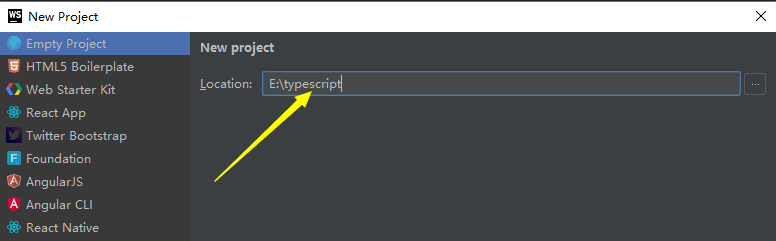
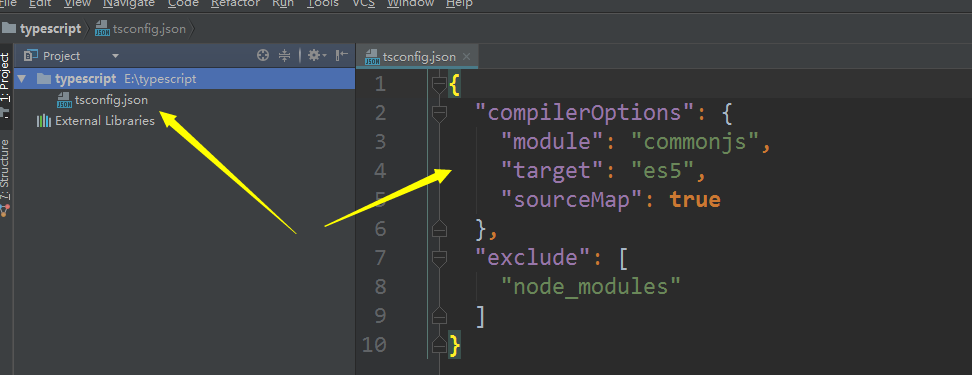
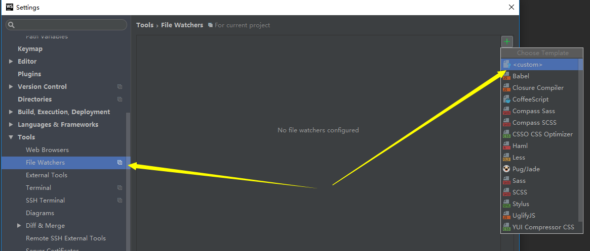
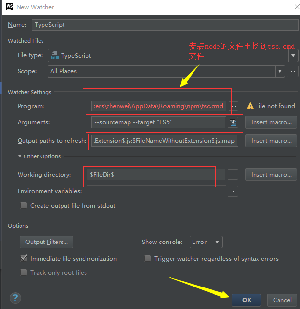
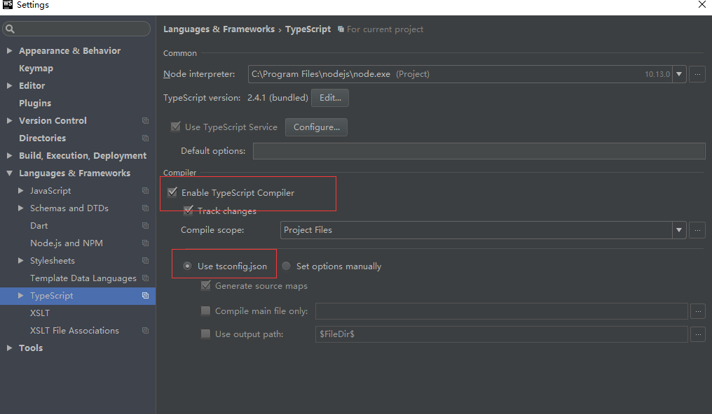
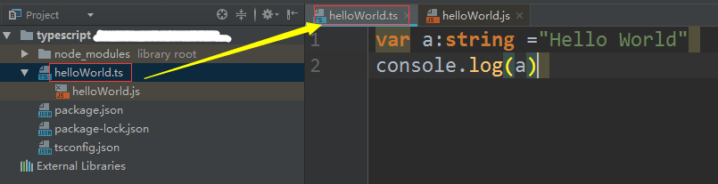

# Webstorm 使用技巧

## WebStorm开发TypeScript的设置

Webstorm IDE 可以开发`TypeScript`，同时支持自动编译成js文件，下面我们来进行一些简单的配置。

1、本地安装TypeScript `npm install typescript -g`

2、打开Webstorm，新建一个空白项目，命名为typescript



3、在Webstorm中右击项目名，选择**new->tsconfig.json File**，创建tsconfig.json文件



4、打开Webstorm,为TypeScript文件更改编译设置，`File->Settings->File Watchers->TypeScript`，这里我们需要选择TypeScript，但是File Watchers下默认是不存在的。需要点击右侧“+”号，选择,弹出 New Watcher，设置好圈红线的部分，点击ok。勾选“TypeScript”，点击ok。





模板如下：
```
Program：‪C:\Users\chenwei\AppData\Roaming\npm\tsc.cmd
Arguments：--sourcemap --target "ES5"
Output paths to refresh：$FileNameWithoutExtension$.js:$FileNameWithoutExtension$.js.map
Working directory：$FileDir$
```

5、设置typescript自动编译，勾选下图圈红线的位置。



  这样，typescript的自动编译功能就设置好了，可以发现我们编写的ts文件会自动转为js文件。
  

