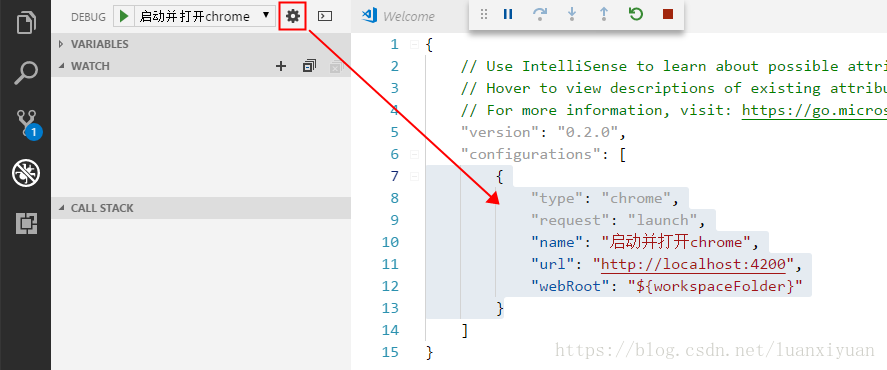
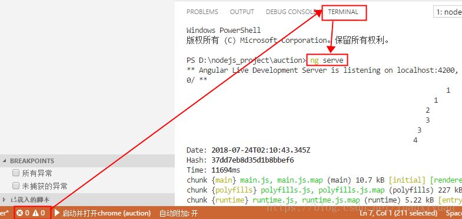
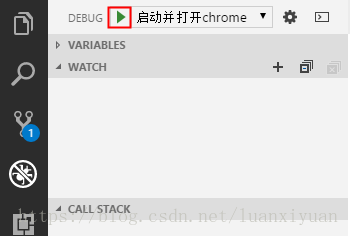
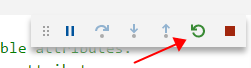
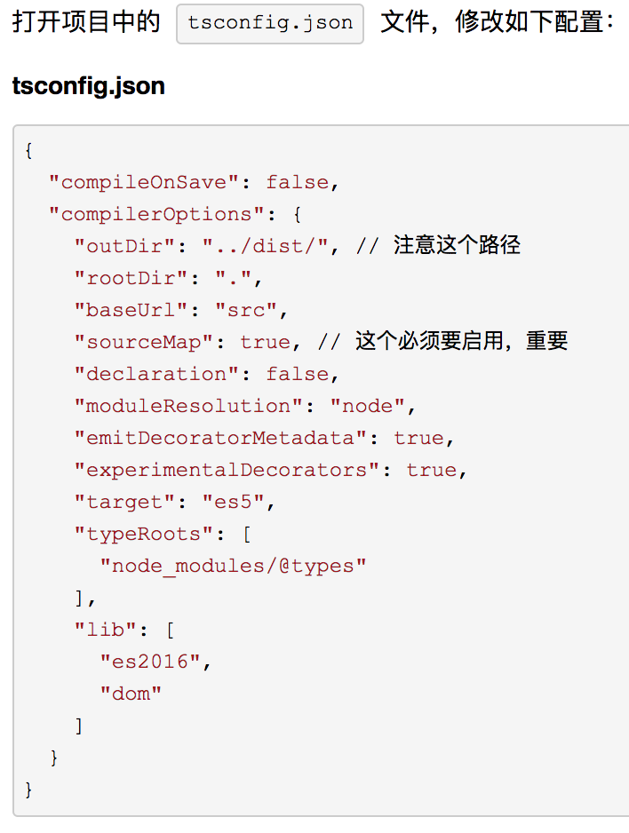

# 1、Visual Studio Code 

只是一个开源的轻量级编辑器。支持typescript语法，且插件功能丰富。

**vscode 的快捷键**

- cmd+shift+P / F1   万能键
- cmd+shift+F  全文搜索
- cmd+P 快速切换文件（比Atom智能）
- cmd+点击指定文件，将此文件在分屏栏打开
- cmd+D 多选
- cmd+E 打开命令行，其他指令其实都是基于命令行的，可直接在输入框输入?来查询指令
- ctrl+G 跳转到指定行
- ctrl+tab 快速切换到上一个文件,多次按(shift)tab可以来回选择,也可以直接点击文件顶部名称来显示历史文件列表进行切换
- alt+↑/↓  调整代码行整体上下移动
- alt+点击多处可以多光标操作，也可以alt+cmd+↑/↓多光标选择，但是不支持直接拖，没sublime方便


**安装几个功能强大的插件：**

+ 1、Debugger for Chrome: 必需插件！！用来调试的，后边调试环节详细介绍 
+ 2、Angular 2,4 and upcoming latest TypeScript HTML Snippets: 支持Angular2.0+的特性及语法 
+ 3、Path Intellisense: 自动路径补全 
+ 4、npm Intellisense: 支持在代码中导入npm模块（require方法）时的自动补全 
+ 5、Auto Close Tag: 输入开始标签后，自动添加结束标签 
+ 6、Auto Rename Tag: 修改html标签时，自动帮你完成尾部闭合标签的同步修改 
+ 7、HTML Snippets：提供对HTML语言的支持 
+ 8、HTML CSS Support：让 html 标签上写class 智能提示当前项目所支持的样式 
+ 9、Bracket Pair Colorizer:给括号加上不同的颜色，便于匹配 
+ 10、vscode-icons：给各种文件都加上图标 
+ 11、TSLint：TS语法检测 
+ 12、beautify : 可以格式化JSON|JS|HTML|CSS|SCSS,比内置格式化好用 
+ 13、emoji:可以在代码中加表情，改善心情~

**VSCode中调试angular**

1、安装Debugger for chrome插件

2、配置启动参数：

在VSCode中，打开调试面板，点击齿轮按钮，VSCode是通过.vscode/launch.json文件来配置管理项目启动的，可以在configurations里面配置多个启动方式，我们这里添加如下代码：

```json
        {
            "type": "chrome",
            "request": "launch",
            "name": "启动并打开chrome",
            "url": "http://localhost:4200",
            "webRoot": "${workspaceFolder}"
        }
或  点击右上角 “齿轮” 按钮，打开 launch.json 文件，添加如下配置：
launch.json
{
    "version": "0.2.0",
    "configurations": [
        {
            "name": "Launch localhost with sourcemaps",
            "type": "chrome",
            "request": "launch",
            "url": "http://localhost:4200",
            "sourceMaps": true,
            "webRoot": "${workspaceRoot}",
            "trace": true,
            "userDataDir": "${workspaceRoot}/.vscode/chrome"
        }
    ]
}
```


3、开始调试

打开控制台面板，Terminal，执行口令：



然后在调试面板里面，点击绿色的启动按钮：



如果想要重启，可以在这个控件上直接点击：



**配置 TypeScript**



```typescript
//tsconfig.json指定了用来编译这个项目的根文件和编译选项
{
    "compilerOptions": {             //compilerOptions:编译选项,可以被忽略，这时编译器会使用默认值
    "allowSyntheticDefaultImports": true,//允许从没有设置默认导出的模块中默认导入。这并不影响代码的显示，仅为了类型检查。
    "baseUrl": "./src",//解析非相对模块名的基准目录
    "emitDecoratorMetadata": true, //给源码里的装饰器声明加上设计类型元数据
    "experimentalDecorators": true,//启用实验性的ES装饰器
        "module": "commonjs",        //指定生成哪个模块系统代码
        "moduleResolution": "node",  //决定如何处理模块。或者是"Node"对于Node.js/io.js，或者是"Classic"（默认）
        "noEmitHelpers": true,//不再输出文件中生成用户自定义的帮助函数代码，如__extends。
                "noImplicitAny": false,     //在表达式和声明上有隐含的any类型时报错
             "sourceMap": true,          //用于debug ,生成相应的.map文件
             "strictNullChecks": false,//在严格的null检查模式下，null和undefined值不包含在任何类型里，只允许用它们自己和any来赋值（有个例外，undefined可以赋值到void）。
        "target": "es5",             //目标代码类型
    "paths": {  //模块名到基于baseUrl的路径映射的列表
    },
       "lib": [  //编译过程中需要引入的库文件的列表
        "dom",
        "es6"
       ],
    "types": [  //要包含的类型声明文件名列表；如果指定了types，只有被列出来的包才会被包含进来
    "hammerjs",
    "node",
    "source-map",
    "uglify-js",
    "webpack"
    ]},
      "exclude": [  //如果"files"和"include"都没有被指定，编译器默认包含当前目录和子目录下所有的TypeScript文件（.ts, .d.ts 和 .tsx），排除在"exclude"里指定的文件。
      "node_modules",
      "dist"
      ],
  "awesomeTypescriptLoaderOptions": {  //Typescript加载选项
  "forkChecker": true,
  "useWebpackText": true
  },
  "compileOnSave": false,
  "buildOnSave": false,
  "atom": { "rewriteTsconfig": false }
}
```

# 2、升级node

升级老项目也比较简单：

windows下使用管理员模式CMD 

1、全局版本 

```
npm uninstall -g @angular/cli 
npm cache clean 
npm install -g @angular/cli@latest 
```

2、项目版本，先删除node_modules 

```
npm install –save-dev @angular/cli@latest 
npm install 
```

3、最麻烦就是可能会一些配置的变更，这个只能看CHANGELOG.md。


## 