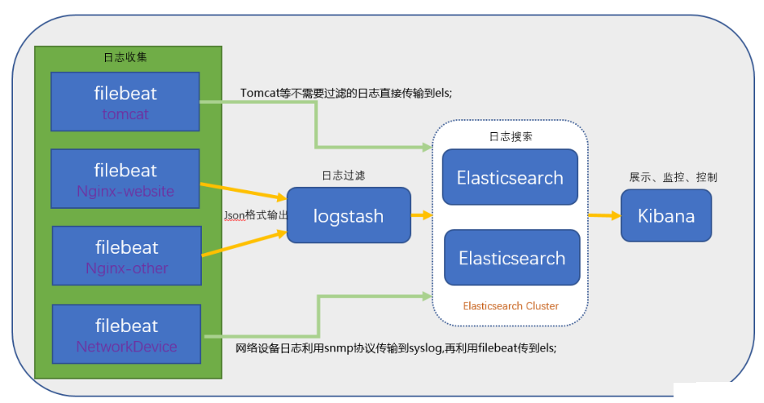

# ELK（Elasticsearch、Logstash、Kibana）安装和配置

ELK,对于大数据处理、信息检索及搜索引擎研发、日志处理与分析、挖掘信息可视化，对于设计高效的大型商业网站，都具有重要的现实意义。

ELK的工作流程：logstash获取日志信息，进行筛选，传给elasticsearch，然后kibana从elasticsearch获取数据，通过web界面展示出来，beat套件是负责收集的一套工具。




## Elasticsearch 部署 （开箱即用）

### 基础知识

**概念对比**

关系型数据库（如SQL Server） | Elasticsearch
---------| -------------
数据库 Database | 索引 Index，支持全文检索
表 Table | 类型 Type
数据行 Row | 文档 Document，但不需要固定结构，不同文档可以具有不同字段集合
数据列 Column | 字段 Field
模式 Schema | 映像 Mapping

**环境**

- CentOS 7.3
- root 用户
- JDK 版本：1.8（最低要求），主推：JDK 1.8.0_121 以上
- 关闭 firewall
	- `systemctl stop firewalld.service` #停止firewall
	- `systemctl disable firewalld.service` #禁止firewall开机启动

安装jdk
```shell
将下载的jdk上传到服务器并解压
tar -zxvf jdk-8u161-linux-x64.tar.gz -C app/
配置环境变量
sudo vi /etc/profile
在末尾加上
export JAVA_HOME=/home/songlj/app/jdk1.8.0_161
export PATH=$PATH:$JAVA_HOME/bin
生效：source /etc/profile
测试是否安装成功java -version
```

**先配置部分系统变量**

- 配置系统最大打开文件描述符数：`vim /etc/sysctl.conf`

```shell
# vim /etc/sysctl.conf
fs.file-max=65535
vm.max_map_count=262144

# sysctl -p　　
```

- 配置进程最大打开文件描述符：`vim /etc/security/limits.conf`

```shell
elasticsearch soft memlock unlimited
elasticsearch hard memlock unlimited
* soft nofile 262144
* hard nofile 262144

##或这样修改/etc/security/limits.conf文件，修改打开文件句柄
*               soft    nofile          100000
*               hard    nofile          100000
*               soft    nproc           100000
*               hard    nproc           100000
```

### 安装Elasticsearch

```shell
tar -zxvf elasticsearch-7.0.0-linux-x86_64.tar.gz
mv elasticsearch-7.0.0-linux-x86_64 /data/elasticsearch
cd elasticsearch/config/
# 备份配置文件
cp elasticsearch.yml elasticsearch.yml.bak

## 编辑配置文件
# cat elasticsearch.yml | grep -v ^#
cluster.name: elk-application
node.name: node-1
path.data: /data/elasticsearch/data
path.logs: /data/elasticsearch/logs
network.host: 172.16.220.248
http.port: 9200
discovery.zen.ping.unicast.hosts: ["node-1"]
discovery.zen.minimum_master_nodes: 1

## 添加elasticsearch用户，不能使用root启动
groupadd -g 1008 elasticsearch
useradd -g 1008 -u 1008 elasticsearch
chown -R elasticsearch:elasticsearch /data/elasticsearch/

## 启动
su -s elasticsearch
cd /data/elasticsearch/bin
./elasticearch &  //后台启动

## 简单的curl测试
curl http://172.16.220.248:9200
```

**添加hosts文件**

```shell
# vim /etc/hosts
172.16.220.248 node-1
```


## 安装Logstash 和 filebeat

filebeat用于在各个服务器上获取数据，发送到logstash上，再由logstash处理数据。(负责收集主机上的数据,依赖环境低，可以将多台filebeat收集到的日志信息，传输给logstash进行处理。)

### 安装logstash

```shell
tar -zxvf kibana-7.0.0-linux-x86_64.tar.gz
mv kibana-7.0.0-linux-x86_64 /data/logstash

## 新建一个logstash的启动指定logstash.conf配置文件，内容如下：
input {
    beats {
      port => "5044"
    }
}
output {
   elasticsearch {
   hosts => "172.16.220.248:9200"
  }
  stdout { codec => rubydebug }   # 这是将输出打印在屏幕上，可以注释掉
}　　

#备注：Logstash默认有input、filter、output三个区域，一般最少需要配置input和output即可！
#logstash的本身默认的logstash.yml配置文件选择不修改即可！

## 指定配置文件启动logstash，开启5044端口和9600端口是否开启
./logstash -f ../config/logstash.conf &
```


### 安装filebeat
下载filebeat并启动，通过它来监听数据源文件的新增内容经过logstash处理后上传到es里面
```shell
tar -zxvf filebeat-7.0.0-linux-x86_64.tar.gz
mv filebeat-7.0.0-linux-x86_64 /data/filebeat
cd /data/filebeat
cp filebeat.yml filebeat.yml.bak

## 启动filebeat服务
cd /data/filebeat
./filebeat &

## 查看启动，filebeat没有监听端口，主要看日志和进程
tialf logs/filebeat
ps -ef | grep filebeat
```

**编辑filebeat.yml文件**
```shell
## 编辑filebeat.yml文件
filebeat.prospectors:
- input_type: log
  paths:
    - /var/log/message-log  # 测试本机的一个log文件
output.logstash:
  hosts: ["172.16.220.248:5044"]
```
filebeat监听的文件记录信息在/data/filebeat/data/registry

**filebeat配置简介**
```shell
#收集配置(input_type可以设置多个)
# 定义一个挖矿者
filebeat.prospectors:
# 
- input_type: log
  paths:
    - /data/trade/app/tradeserver/logs/*.log
    - /data/trade/app/scheduleserver/logs/*.log
    - /data/trade/app/bankprocessor/logs/*.log
    - /data/trade/app/orgmanageserver/logs/*.log
    - /data/trade/app/manageserver/logs/*.log
    
# 定义日子文件字符集，默认UTF8
  encoding: gbk
  # 指定不采集关键字的列
  exclude_lines: ["DBG", "反序列化报文", "返回文本回应", "解密失败"]
  # 指定采集关键字
  include_lines: ["ERR", "WARN", "失败"]
  # 顶多不采集文件
  exclude_files: [".zip$", ".out$"]
 
# 定义日志的type，可以在es中根据type进行判断
  document_type: app
 
# 对日志中添加新的行
  #fields:
    #  level: debug
    #  review: 1
   #如果添加此字段，fields会和type同级，否则默认为"fields":{ "level":"debug" }
   #fields_under_root: true
 
- input_type: log
  paths:
    - /data/trade/www/tomcat_trade/logs/catalina.out
  document_type: tomcat
 
  # 合并行
  multiline:
    pattern: '^[0-9]{4}\-[0-9]{2}\-[0-9]{2}'      # 将不是以日期开头的行合并
    negate: true
    match: after
    max_lines: 50                    # 最大合并行
    timeout: 5s                    # 合并时间，防止堵塞
 
# 输出设置
## 备注：这里redis是用来做消息队列，所有不存在大量日志撑爆你的内存。
output.redis:
  hosts: ["192.168.30.135"]
  key: "tradeserver"
  db: 0
  timeout: 5

```


## Kibana 部署

### 安装 Kibana

```shell
tar -zxvf kibana-7.0.0-linux-x86_64.tar.gz
mv kibana-7.0.0-linux-x86_64 /data/kinbana
cd /data/kinbana/config/
cp kibana.yml kibana.yml.bak //备份配置

## 编辑kibana.yml配置文件
server.port: 5601                                    #端口
server.host: "172.16.220.248"                        #访问ip地址
elasticsearch.url: "http://172.16.220.248:9200"      #连接elastic 
kibana.index: ".kibana"                              #在elastic中添加.kibana索引

## 启动kinbana
cd /data/kibana/bin
 ./kibana & //后台启动
```

## 获取Nginx access日志

Nginx日志格式在logstash的grok里面默认是没有的，需要我们手动配置，可以通过http://grokdebug.herokuapp.com/ 在线工具来判断配置是否正确。

### 在nginx服务器上安装filebeat

```shell
# 例如服务器：172.16.200.160　
tar -zxvf filebeat-5.6.3-linux-x86_64.tar.gz
mv filebeat-5.6.3-linux-x86_64 /data/filebeat
cd /data/filebeat
cp filebeat.yml filebeat.yml.bak

#　修改filebeat配置文件
# cat filebeat.yml | grep -v ^$ | grep -v ^# | grep -v "#"
filebeat.prospectors:
- input_type: log
  paths:
    - /data/nginx/logs/160_access.log
   document_type: nginx_access
output.logstash:
  hosts: ["172.16.220.248:5044"]

# 启动filebeat
./filebeat &
```

### 重新配置logstash启动配置文件
nginx日志格式，根据业务要求，我们这做了一些修改，比如增加cookie等，修改access.log日志时间格式等
```shell
#nginx日志中添加cookie信息
#nginx改变access.log中的时间格式

log_format main
                '[$time_local] - $remote_addr:$remote_port - $upstream_addr $upstream_status $upstream_response_time - '
                '"$request" $status $bytes_sent $request_time '
                '"$http_referer" - "$http_user_agent" - '
                '"$customerTag_cookie" - "$ym_cookie" - "$http_cookie" '
                '"$http_x_forwarded_for"';
 
# 这里只是我们自己的格式，各位可以根据自己要求增删
```


备注：

```shell
##添加自启动
chkconfig --add elasticsearch
##启动命令
systemctl daemon-reload
systemctl enable elasticsearch.service
```

目前主流的一种日志系统 | 作用
---------| -------------
ElasticSearch  | 一个基于 JSON 的分布式的搜索和分析引擎，作为 ELK 的核心，它集中存储数据，用来搜索、分析、存储日志。它是分布式的，可以横向扩容，可以自动发现，索引自动分片
Logstash    |    一个动态数据收集管道，支持以 TCP/UDP/HTTP 多种方式收集数据（也可以接受 Beats 传输来的数据），并对数据做进一步丰富或提取字段处理。用来采集日志，把日志解析为json格式交给ElasticSearch
Kibana     |     一个数据可视化组件，将收集的数据进行可视化展示（各种报表、图形化数据），并提供配置、管理 ELK 的界面
Beats      |     一个轻量型日志采集器，单一用途的数据传输平台，可以将多台机器的数据发送到 Logstash 或 ElasticSearch
X-Pack     |     一个对Elastic Stack提供了安全、警报、监控、报表、图表于一身的扩展包，不过收费