# Linux 笔记

**ps -ef|grep详解**

`ps` 命令将某个进程显示出来。是LINUX下最常用的也是非常强大的进程查看命令

`grep` 命令是查找。是一种强大的文本搜索工具，它能使用正则表达式搜索文本，并把匹配的行打印出来。

中间的 `|` 是管道命令 是指`ps`命令与`grep`同时执行

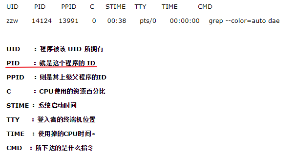

**netstat 工具检测开放端口**

`netstat -ntlp` //查看当前所有tcp端口

> netstat -ntulp |grep 80   //查看所有80端口使用情况·

> netstat -an | grep 3306   //查看所有3306端口使用情况·

**防火墙修改端口**

修改开放端口 `vi /etc/sysconfig/iptables`

重启防火墙才生效 `service iptables restart`


【常识：】

执行文件 ：`/bin`、`/usr/bin`、`/usr/local/bin`

库文件   : `/lib`、`/usr/lib`、`/usr/local/lib`

rpm包安装的可执行文件一般在`/usr/bin`或`/usr/local/bin`

**Linux下查看文件和文件夹大小**

<font color=red size=3>`df` 可以查看一级文件夹大小、使用比例、档案系统及其挂入点，但对文件却无能为力。</font>

```
df -T  //可以用来查看分区的文件系统
df -h  //df命令可以显示目前所有文件系统的可用空间及使用情形
```

<font color=red size=3>`du` 可以查看文件及文件夹的大小。</font>
```
du -sh * 
du -h --max-depth=1 /home   仅列出home目录下面所有的一级目录文件大小


  统计总数大小

    du -sh xmldb/

    du -sm * | sort -n //统计当前目录大小 并安大小 排序

    du -sk * | sort -n

    du -sk * | grep guojf //看一个人的大小

    du -m | cut -d "/" -f 2 //看第二个/ 字符前的文字

    查看此文件夹有多少文件 /*/*/* 有多少文件

    du xmldb/

    du xmldb/*/*/* |wc -l

    40752

    解释：

    wc [-lmw]

    参数说明：

    -l :多少行

    -m:多少字符

    -w:多少字
```

两者配合使用，非常有效。比如用`df`查看哪个一级目录过大，然后用`du`查看文件夹或文件的大小，如此便可迅速确定症结。
```shell
//查看系统中文件的使用情况
df -h
//查看当前目录下各个文件及目录占用空间大小
du -sh *

//方法一：切换到要删除的目录，删除目录下的所有文件
rm -f *

//方法二：删除logs文件夹下的所有文件，而不删除文件夹本身
rm -rf log/*
```


> Linux中设置服务自启动的三种方式

有时候我们需要Linux系统在开机的时候自动加载某些脚本或系统服务

主要用三种方式进行这一操作：

+ ln -s                       在/etc/rc.d/rc*.d目录中建立/etc/init.d/服务的软链接(*代表0～6七个运行级别之一）

+ chkonfig                命令行运行级别设置

+ ntsysv                   伪图形运行级别设置


> 文件的详细说明：
> 
> 
>
> d：开始为d，表示目录 directory
> 
> d: 表示文件夹
> 
> \- : 开始为-，表示普通的二进制文件
> 
> l : 开始为l，表示软连接文件（link）	
> 
> r: read 读权限。  w：write 写权限。  x：execute 执行权限。
> 
> Linux中的文件如：drwxr-xr-x 可以看做三个部分（rwx r-x r-x），分别是文件的所有者rwx（user）的权限、所属组r-x（group）的权限和其他人r-x（others）的权限。


## Linux下文件查找find、whereis、which、locate


> 1) find   

find是linux下很强大的一个查找命令，任何位于参数之前的字符串都将被视为欲查找的目录名。不设置任何参数，则find命令将在当前目录下查找子目录与文件。

**命令格式：find 选项 参数**

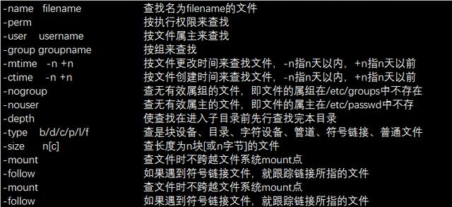


> 2) locate           

locate指定用在搜寻符合条件的档案，它会去储存档案与目录名称的数据库内，寻找合乎范本样式条件的档案或目录录，可以使用特殊字元（如&rdquo;*&rdquo; 或&rdquo;?&rdquo;等）来指定范本样式

**命令格式：locate 文件名**


> 3) which    

用于在PATH变量指定的路径中，搜索某个系统命令的位置，并返回第一个搜索结果。使用which命令，就可以看到系统命令是否存在，以及执行的到底是哪一个位置的命令。

**命令格式：which 可执行文件名称**


> 4) which   

whereis命令是定位可执行文件、源代码文件、帮助文件在文件系统中的位置。这些文件的属性应属于原始代码，二进制文件，或是帮助文件。whereis 程序还具有搜索源代码、指定备用搜索路径和搜索不寻常项的能力。


## 常用命令

> 文件处理命令

	命令：ls（list）
	权限：所有用户（此后如不显示，则为所有用户）
	描述：显示文件目录
	语法：ls 选项 [-al] [文件或目录]
	  	 a：显示所有文件，包括隐藏文件                    
		 l： 显示详细信息

	命令：touch
	语法：touch [文件名]
	描述：创建一个空文件
	
	命令：mkdir
	语法： mkdir [-p选项表示递归创建文件夹] [文件夹名称]
	描述：创建一个文件夹


	命令：cp （copy）
	语法：cp  [源文件] [目标文件]  
	           cp -r [源目录] [目标目录]
	描述：复制文件或目录 
	
	命令：rm（remove）
	语法：rm -f [文件] 
	           rm -r [目录]
	           rm -rf [目录，包含目录下内容]
	描述：删除文件或目录

	命令：cat
	语法：cat [文件名称]
	描述：查看文件内容（内如过多，显示内容可能不全）
	
	命令：more
	语法：more [文件名称]
	描述：查看文件内容，可完全显示
	用法：使用空格进行翻页，回车显示下一行，q退出（或者ctrl+c）

	命令：head
	语法：head -number [文件名]
	描述：查看文件的前多少行
	
	命令：tail
	语法：tail -number [文件名]
	描述：查看文件的后多少行
	
	mv 1 修改文件名称的功能 ： mv [源文件名称] [新文件名称]
		       2  移动文件位置	: mv [源文件名称] [新文件位置+ 新文件名称]
	
	命令：ln（link）
	语法：ln -s [源文件] [目标文件] （硬链接则不需要-s选项）
	描述：创建软链接文件
 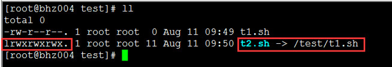

	软链接特点：权限是所有人都可以访问，并且软连接文件指向源文件。
	软链接就像windows系统中的快捷方式一样，特点也都类似。
	硬链接：类似copy，硬链接大小和源文件一样，并且是同步更新的。
 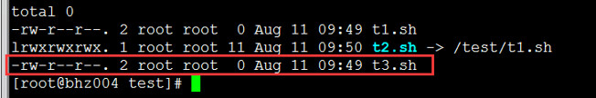

	另外：硬链接不能跨文件系统分区，而软连接可以。

> 权限处理命令

	命令：chmod
	语法：chmod [{ugo}{+-=}{rwx}] [文件或目录]
	           chmod [mode=421] [文件目录]
	描述：改变文件或目录的权限
	形如：chmod g+w filename
	形如：chmod 761 filename

	文件的rwx权限：
	r：可以执行catch、more等读操作。
	w：修改文件的内容等写操作，但是不代表你可以把这个文件删除。
	x：对文件进行执行操作。
	目录的rwx权限：
	r：可读操作，可以列出目录的内容，比如ls命令。
	w：表示可以在目录下创建或删除文件的权限。
	x：表示可以进入这个目录（基本上所以的目录都会有rx权限）。
	所以：删除文件的权限，是拥有你当前文件所在的目录的写权限。
 

	命令：chown
	语法：chown user 文件
	描述：改变文件的所有者
	示例：chown newuser t1.sh
	useradd username 添加用户
	passwd  username 为用户设置密码
	
	命令：chgrp
	语法：chgrp group 文件
	描述：改变文件的所属组 
	示例：chgrp adm t1.sh
	查看系统默认的权限 ：umask -S （umask查看权限掩码值022 使用777-022得到真实权限）

> linux permission denied
[解决方案：]为了获得执行权限，借助chmod指令修改文件权限即可。`chmod 777 test.sh(文件)`

  

	
> 文件搜索命令

	命令：find
	语法：find [搜索范围路径] -name 【文件名称】（根据文件名查找）
	           find [搜索范围路径] -size [（+-）文件大小] （根据文件大小查找，大于+ 小于-）
	           find [搜索范围路径] -user（文件的所有者）
	           find [时间查找] [以天为单位]
	[以天为单位] 1 ctime、atime、mtime 
	[以分钟为单位] 2 cmin、amin、mmin
	           。。。。。			
	描述：查找任何文件或目录（所有）
  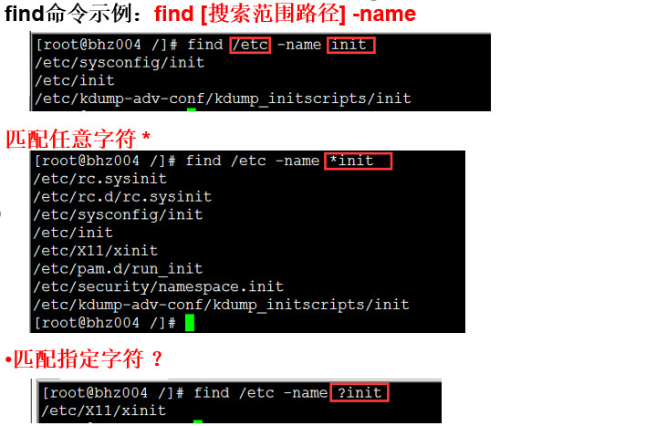

  

  

  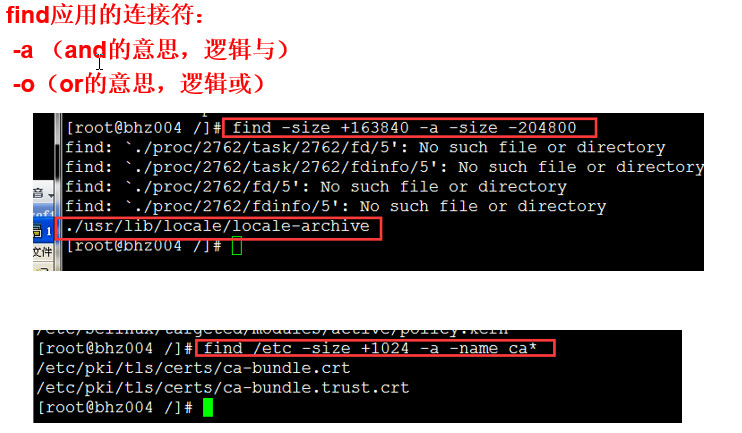

  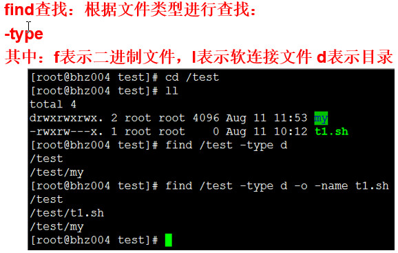

  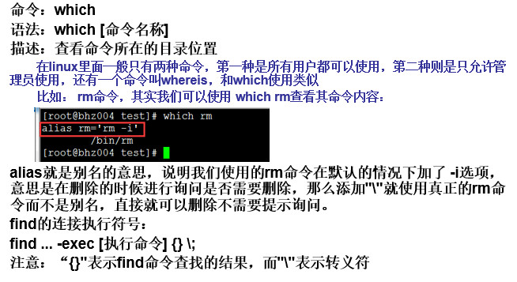

  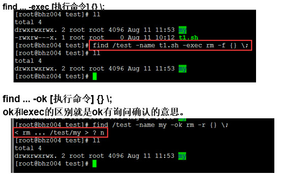

  

  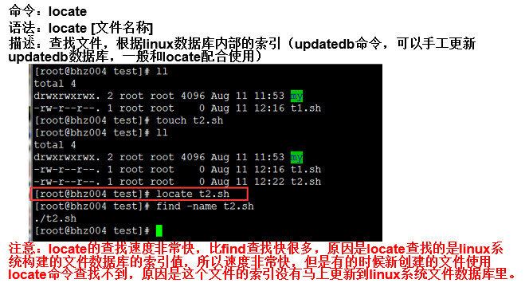

	命令：man
	语法：man [命令或者配置文件]， 
	描述：帮助命令，非常的有用，可以获得命令的帮助文档，如何使用等。
	
	命令：whatis 
	语法：whatis [命令]
	描述：查看命令的描述。
	
	命令：--help
	语法：[命令] --help  
	描述： 查看命令的选项用法。


> 压缩解压缩命令
	
	命令：gzip
	语法：gzip [文件名称]
	描述：压缩的时候不保留原文件，并且只能压缩文件不能压缩目录
	
	命令：gunzip 
	语法：gunzip [已压缩的文件]
	描述：解压缩文件，不不保留源文件

	命令：tar
	语法：tar [zcvf]  [zxvf] [打包文件名.tar.gz] [源文件]
	           -c 产生tar打包文件（必选）
	           -x 产生的解压缩文件（必选）
	           -v 显示详细信息
	           -f 指定压缩后的文件名
	           -z 打包同时压缩
	描述：打包目录 生成的后缀名 .tar.gz，或者进行解压
	最后配置加-C 表示文件解压后存放的路径
	file命令可以查看任何文件的类型

	命令：zip
	语法：zip 选项[-r] [压缩后文件名称] [源文件]
	描述：zip的格式是windows和linux通用的格式，可以压缩文件和目录，压缩目录时需要选项-r。
	
	命令：unzip
	语法：unzip [解压缩的文件]
	描述：进行解压缩
	最后配置加-d 表示文件解压后存放的路径

> 其他命令

	ping 
	（注意：ping 不通对方网络的原因有很多种，需要一步步详细排查）
	（1）首先ping一下回环地址 127.0.0.1 检查自己本机的网络协议是否正确
	（2）再ping一下本机ip 查看自己本机的网络是否正确
	（3）然后检查对方网络设置、防火墙、插件等等
	（4）如果发现丢包率里有丢失数据包，可能是网络、网线的原因
	（5）ping 配置选项 ping -c 6 192.168.80.100（表示ping 6次之后断开）
	（6）ping 配置选项 ping -s  60000 （最大65507）
	
	查看网卡信息：ifconfig
	关机：shutdown -h now 
	重启：reboot
	ctrl + l 清屏。
	ctrl + c 退出应用。
	tab键，信息补全。
	
	过滤：grep，可以将指定内容进行过滤然后输出。
	
	管道：
	将一个命令的输出传送给另一个命令，作为另外一个命令的输入。管道可以连接N个命令。
	ls -l /etc | more （表示将ls -l /etc的输出，当做more命令的输入，即more命令浏览的内容为前面命令的输出结果）
	ls -l /etc | grep init（表示将ls -l /etc的输出结果进行过滤，显示为init的结果）
	ls -l /etc | grep init | wc -l (最后进行统计显示的个数)

	逻辑与（&&） 
	形如：ls && pwd（第一个命令如果执行成功。第二个命令才会执行）
	逻辑或（||）
	形如：ls || pwd （第一个命令执行成功，则第二个不执行，第一个命令执行失败，则执行第二个）
	
  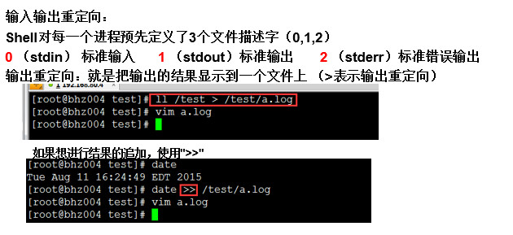
  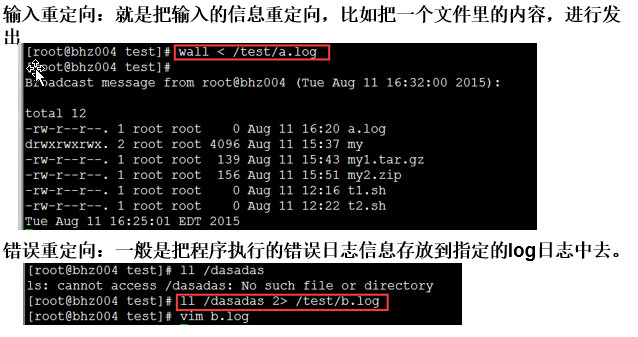


 常用的 linux 命令
==============================================================

## CentOS7使用firewalld打开关闭防火墙与端口

1、firewalld的基本使用
启动： systemctl start firewalld
查看状态： systemctl status firewalld 
停止： systemctl disable firewalld
禁用： systemctl stop firewalld
 
2.systemctl是CentOS7的服务管理工具中主要的工具，它融合之前service和chkconfig的功能于一体。
启动一个服务：systemctl start firewalld.service
关闭一个服务：systemctl stop firewalld.service
重启一个服务：systemctl restart firewalld.service
显示一个服务的状态：systemctl status firewalld.service
在开机时启用一个服务：systemctl enable firewalld.service
在开机时禁用一个服务：systemctl disable firewalld.service
查看服务是否开机启动：systemctl is-enabled firewalld.service
查看已启动的服务列表：systemctl list-unit-files|grep enabled
查看启动失败的服务列表：systemctl --failed

3.配置firewalld-cmd

查看版本： firewall-cmd --version
查看帮助： firewall-cmd --help
显示状态： firewall-cmd --state
查看所有打开的端口： firewall-cmd --zone=public --list-ports
更新防火墙规则： firewall-cmd --reload
查看区域信息:  firewall-cmd --get-active-zones
查看指定接口所属区域： firewall-cmd --get-zone-of-interface=eth0
拒绝所有包：firewall-cmd --panic-on
取消拒绝状态： firewall-cmd --panic-off
查看是否拒绝： firewall-cmd --query-panic
 
那怎么开启一个端口呢
添加
firewall-cmd --zone=public --add-port=80/tcp --permanent    （--permanent永久生效，没有此参数重启后失效）
重新载入
firewall-cmd --reload
查看
firewall-cmd --zone= public --query-port=80/tcp
删除
firewall-cmd --zone= public --remove-port=80/tcp --permanent

==============================================================================

## 安装软件

### 编译安装


### 安装 Nginx


>** 一、安装编译工具及库文件**

	yum -y install make zlib zlib-devel gcc-c++ libtool  openssl openssl-devel
 
> **二、首先要安装 PCRE**

PCRE 作用是让 Nginx 支持 Rewrite 功能。		
1、下载 PCRE 安装包，下载地址： http://downloads.sourceforge.net/project/pcre/pcre/8.35/pcre-8.35.tar.gz		

`[root@bogon src]# wget http://downloads.sourceforge.net/project/pcre/pcre/8.35/pcre-8.35.tar.gz`

2、解压安装包:
[root@bogon src]# tar zxvf pcre-8.35.tar.gz

3、进入安装包目录
[root@bogon src]# cd pcre-8.35

4、编译安装 
[root@bogon pcre-8.35]# ./configure
[root@bogon pcre-8.35]# make && make install

5、查看pcre版本
[root@bogon pcre-8.35]# pcre-config --version

**安装 Nginx**

1、下载 Nginx，下载地址：http://nginx.org/download/nginx-1.13.0.tar.gz
`[root@bogon src]# wget http://nginx.org/download/nginx-1.13.0.tar.gz`

2、解压安装包
`[root@bogon src]# tar zxvf /nginx-1.13.0.tar.gz`

3、进入安装包目录
`[root@bogon src]# cd /nginx-1.13.0`

4、编译安装
`[root@bogon nginx-1.6.2]# ./configure --prefix=/usr/local/webserver/nginx --with-http_stub_status_module --with-http_ssl_module --with-pcre=/usr/local/src/pcre-8.35`
`[root@bogon nginx-1.6.2]# make`
`[root@bogon nginx-1.6.2]# make install`

5、查看nginx版本
`[root@bogon nginx-1.6.2]# /usr/local/webserver/nginx/sbin/nginx -v`

**Nginx 配置**
创建 Nginx 运行使用的用户 www：

`[root@bogon conf]# /usr/sbin/groupadd www `
`[root@bogon conf]# /usr/sbin/useradd -g www www`

配置nginx.conf ，将/usr/local/webserver/nginx/conf/nginx.conf替换为以下内容

		[root@bogon conf]#  cat /usr/local/webserver/nginx/conf/nginx.conf
		
		user www www;
		worker_processes 2; #设置值和CPU核心数一致
		error_log /usr/local/webserver/nginx/logs/nginx_error.log crit; #日志位置和日志级别
		pid /usr/local/webserver/nginx/nginx.pid;
		#Specifies the value for maximum file descriptors that can be opened by this process.
		worker_rlimit_nofile 65535;
		events
		{
		  use epoll;
		  worker_connections 65535;
		}
		http
		{
		  include mime.types;
		  default_type application/octet-stream;
		  log_format main  '$remote_addr - $remote_user [$time_local] "$request" '
		               '$status $body_bytes_sent "$http_referer" '
		               '"$http_user_agent" $http_x_forwarded_for';
		  
		#charset gb2312;
		     
		  server_names_hash_bucket_size 128;
		  client_header_buffer_size 32k;
		  large_client_header_buffers 4 32k;
		  client_max_body_size 8m;
		     
		  sendfile on;
		  tcp_nopush on;
		  keepalive_timeout 60;
		  tcp_nodelay on;
		  fastcgi_connect_timeout 300;
		  fastcgi_send_timeout 300;
		  fastcgi_read_timeout 300;
		  fastcgi_buffer_size 64k;
		  fastcgi_buffers 4 64k;
		  fastcgi_busy_buffers_size 128k;
		  fastcgi_temp_file_write_size 128k;
		  gzip on; 
		  gzip_min_length 1k;
		  gzip_buffers 4 16k;
		  gzip_http_version 1.0;
		  gzip_comp_level 2;
		  gzip_types text/plain application/x-javascript text/css application/xml;
		  gzip_vary on;
		 
		  #limit_zone crawler $binary_remote_addr 10m;
		 #下面是server虚拟主机的配置
		 server
		  {
		    listen 80;#监听端口
		    server_name localhost;#域名
		    index index.html index.htm index.php;
		    root /usr/local/webserver/nginx/html;#站点目录
		      location ~ .*\.(php|php5)?$
		    {
		      #fastcgi_pass unix:/tmp/php-cgi.sock;
		      fastcgi_pass 127.0.0.1:9000;
		      fastcgi_index index.php;
		      include fastcgi.conf;
		    }
		    location ~ .*\.(gif|jpg|jpeg|png|bmp|swf|ico)$
		    {
		      expires 30d;
		  # access_log off;
		    }
		    location ~ .*\.(js|css)?$
		    {
		      expires 15d;
		   # access_log off;
		    }
		    access_log off;
		  }
		
		}

检查配置文件ngnix.conf的正确性命令：`[root@bogon conf]# /usr/local/webserver/nginx/sbin/nginx -t`

**启动 Nginx**
 Nginx 启动命令如下：`[root@bogon conf]# /usr/local/webserver/nginx/sbin/nginx`

**访问站点**
从浏览器访问我们配置的站点ip：


**Nginx 其他命令**
以下包含了 Nginx 常用的几个命令：

	/usr/local/webserver/nginx/sbin/nginx -s reload            # 重新载入配置文件
	/usr/local/webserver/nginx/sbin/nginx -s reopen            # 重启 Nginx
	/usr/local/webserver/nginx/sbin/nginx -s stop              # 停止 Nginx


### MySQL 安装


> **一、安装编译工具及库文件**

`yum -y install gcc gcc-c++ make autoconf libtool-ltdl-devel gd-devel freetype-devel libxml2-devel libjpeg-devel libpng-devel openssl-devel curl-devel bison patch unzip libmcrypt-devel libmhash-devel ncurses-devel sudo bzip2 flex libaio-devel`

> **二、 安装cmake 编译器**
cmake 版本：cmake-3.1.1。

1、下载地址：http://www.cmake.org/files/v3.1/cmake-3.1.1.tar.gz
  $ wget http://www.cmake.org/files/v3.1/cmake-3.1.1.tar.gz

`$ wget http://www.cmake.org/files/v3.1/cmake-3.1.1.tar.gz`

2、解压安装包
`$ tar zxvf cmake-3.1.1.tar.gz`

3、进入安装包目录
`$ cd cmake-3.1.1`

4、编译安装 
`$ ./bootstrap`
`$ make && make install`

> **三、安装 MySQL**

MySQL版本：mysql-5.6.15。

1、下载地址： http://dev.mysql.com/get/Downloads/MySQL-5.6/mysql-5.6.15.tar.gz
$ wget http://dev.mysql.com/get/Downloads/MySQL-5.6/mysql-5.6.15.tar.gz

2、解压安装包
`$ tar zxvf mysql-5.6.15.tar.gz`

3、进入安装包目录
`$ cd mysql-5.6.15`

4、编译安装 
`$ cmake -DCMAKE_INSTALL_PREFIX=/usr/local/webserver/mysql/ -DMYSQL_UNIX_ADDR=/tmp/mysql.sock -DDEFAULT_CHARSET=utf8 -DDEFAULT_COLLATION=utf8_general_ci -DWITH_EXTRA_CHARSETS=all -DWITH_MYISAM_STORAGE_ENGINE=1 -DWITH_INNOBASE_STORAGE_ENGINE=1 -DWITH_MEMORY_STORAGE_ENGINE=1 -DWITH_READLINE=1 -DWITH_INNODB_MEMCACHED=1 -DWITH_DEBUG=OFF -DWITH_ZLIB=bundled -DENABLED_LOCAL_INFILE=1 -DENABLED_PROFILING=ON -DMYSQL_MAINTAINER_MODE=OFF -DMYSQL_DATADIR=/usr/local/webserver/mysql/data -DMYSQL_TCP_PORT=3306`
`$ make && make install`

5、查看mysql版本:
`$ /usr/local/webserver/mysql/bin/mysql --version`

**MySQL 配置**
1、创建mysql运行使用的用户mysql：
`$ /usr/sbin/groupadd mysql`
`$ /usr/sbin/useradd -g mysql mysql`

2、创建binlog和库的存储路径并赋予mysql用户权限
`$ mkdir -p /usr/local/webserver/mysql/binlog /www/data_mysql`
`$ chown mysql.mysql /usr/local/webserver/mysql/binlog/ /www/data_mysql/`

3、创建my.cnf配置文件
将/etc/my.cnf替换为下面内容

		$ cat /etc/my.cnf
		
		[client]
		port = 3306
		socket = /tmp/mysql.sock
		[mysqld]
		replicate-ignore-db = mysql
		replicate-ignore-db = test
		replicate-ignore-db = information_schema
		user = mysql
		port = 3306
		socket = /tmp/mysql.sock
		basedir = /usr/local/webserver/mysql
		datadir = /www/data_mysql
		log-error = /usr/local/webserver/mysql/mysql_error.log
		pid-file = /usr/local/webserver/mysql/mysql.pid
		open_files_limit = 65535
		back_log = 600
		max_connections = 5000
		max_connect_errors = 1000
		table_open_cache = 1024
		external-locking = FALSE
		max_allowed_packet = 32M
		sort_buffer_size = 1M
		join_buffer_size = 1M
		thread_cache_size = 600
		#thread_concurrency = 8
		query_cache_size = 128M
		query_cache_limit = 2M
		query_cache_min_res_unit = 2k
		default-storage-engine = MyISAM
		default-tmp-storage-engine=MYISAM
		thread_stack = 192K
		transaction_isolation = READ-COMMITTED
		tmp_table_size = 128M
		max_heap_table_size = 128M
		log-slave-updates
		log-bin = /usr/local/webserver/mysql/binlog/binlog
		binlog-do-db=oa_fb
		binlog-ignore-db=mysql
		binlog_cache_size = 4M
		binlog_format = MIXED
		max_binlog_cache_size = 8M
		max_binlog_size = 1G
		relay-log-index = /usr/local/webserver/mysql/relaylog/relaylog
		relay-log-info-file = /usr/local/webserver/mysql/relaylog/relaylog
		relay-log = /usr/local/webserver/mysql/relaylog/relaylog
		expire_logs_days = 10
		key_buffer_size = 256M
		read_buffer_size = 1M
		read_rnd_buffer_size = 16M
		bulk_insert_buffer_size = 64M
		myisam_sort_buffer_size = 128M
		myisam_max_sort_file_size = 10G
		myisam_repair_threads = 1
		myisam_recover
		interactive_timeout = 120
		wait_timeout = 120
		skip-name-resolve
		#master-connect-retry = 10
		slave-skip-errors = 1032,1062,126,1114,1146,1048,1396
		#master-host = 192.168.1.2
		#master-user = username
		#master-password = password
		#master-port = 3306
		server-id = 1
		loose-innodb-trx=0 
		loose-innodb-locks=0 
		loose-innodb-lock-waits=0 
		loose-innodb-cmp=0 
		loose-innodb-cmp-per-index=0
		loose-innodb-cmp-per-index-reset=0
		loose-innodb-cmp-reset=0 
		loose-innodb-cmpmem=0 
		loose-innodb-cmpmem-reset=0 
		loose-innodb-buffer-page=0 
		loose-innodb-buffer-page-lru=0 
		loose-innodb-buffer-pool-stats=0 
		loose-innodb-metrics=0 
		loose-innodb-ft-default-stopword=0 
		loose-innodb-ft-inserted=0 
		loose-innodb-ft-deleted=0 
		loose-innodb-ft-being-deleted=0 
		loose-innodb-ft-config=0 
		loose-innodb-ft-index-cache=0 
		loose-innodb-ft-index-table=0 
		loose-innodb-sys-tables=0 
		loose-innodb-sys-tablestats=0 
		loose-innodb-sys-indexes=0 
		loose-innodb-sys-columns=0 
		loose-innodb-sys-fields=0 
		loose-innodb-sys-foreign=0 
		loose-innodb-sys-foreign-cols=0
		
		slow_query_log_file=/usr/local/webserver/mysql/mysql_slow.log
		long_query_time = 1
		[mysqldump]
		quick
		max_allowed_packet = 32M

4、初始化数据库
`$/usr/local/webserver/mysql/scripts/mysql_install_db --defaults-file=/etc/my.cnf  --user=mysql`

5、创建开机启动脚本
`$ cd /usr/local/webserver/mysql/`
`$ cp support-files/mysql.server /etc/rc.d/init.d/mysqld `
`$ chkconfig --add mysqld `
`$ chkconfig --level 35 mysqld on`

6、启动mysql服务器
`$ service mysqld start

7、连接 MySQL
`$ /usr/local/webserver/mysql/bin/mysql -u root -p`

**修改MySQL用户密码**
`mysqladmin -u用户名 -p旧密码 password 新密码`

或进入mysql命令行
`SET PASSWORD FOR '用户名'@'主机' = PASSWORD(‘密码');`

创建新用户并授权:
`grant all privileges on *.* to 用户名@'%' identified by '密码' with grant option;`

其他命令		
	
	启动：service mysqld start
	停止：service mysqld stop
	重启：service mysqld restart
	重载配置：service mysqld reload


### Redis 安装


> 下载源码 wget http://download.redis.io/redis-stable.tar.gz

> 源码安装redis

> `tar -xvzf redis-3.2.9.tar.gz`
> `cd redis-3.2.9`
> `make PREFIX=/usr/local/redis/3.2.9 install`
 
&emsp;&emsp;这里我们需要明白一点，我们在安装redis的时候最好要指定要安装的目录，这样redis
的安装基本上就完成了，此时我们查看/usr/local/redis/3.2.9目录下只有一个bin文件夹，而该文件夹中只有一些二进制文件，其中重点看redis-cli 和redis-server(redis-sentinel是其软连）

我们打算通过redis提供的shell脚本进行redis的相关管理，所以的我们的配置可以基于这个shell进行相关的配置，在`redis-3.2.9/utils`目录下有有一个`redis_init_scrip`t脚本，我们打开查看其启动脚本，里面有些内容我们需要变动一下：

		#!/bin/sh
		
		#
		
		# Simple Redis init.d script conceived to work on Linux systems
		
		# as it does use of the /proc filesystem.
		
		#定义了redis的监听端口
		
		REDISPORT=6379
		
		#下面是redis默认的server执行路径，但是并不符合我们的实际情况,将其注释掉，改为我们需要的配置
		
		#EXEC=/usr/local/bin/redis-server
		
		EXEC=/usr/local/redis/3.2.9/bin/redis-server
		
		#更改redis-cli的启动路径
		
		#CLIEXEC=/usr/local/bin/redis-cli
		
		CLIEXEC=/usr/local/redis/3.2.9/bin/redis-cli
		
		PIDFILE=/var/run/redis_${REDISPORT}.pid
		
		#redis的配置文件， 所以我们需要在/etc目录下创建redis目录用来保存redis的配置文件，并将配置文件拷贝到该目录下，并改名为6379.conf
		
		CONF="/etc/redis/${REDISPORT}.conf"
		
		case "$1" in
		
		start)
		
		if [ -f $PIDFILE ]
		
		then
		
		echo "$PIDFILE exists, process is already running or crashed"
		
		else
		
		echo "Starting Redis server..."
		
		$EXEC $CONF
		
		fi
		
		;;
		
		stop)
		
		if [ ! -f $PIDFILE ]
		
		then
		
		echo "$PIDFILE does not exist, process is not running"
		
		else
		
		PID=$(cat $PIDFILE)
		
		echo "Stopping ..."
		
		$CLIEXEC -p $REDISPORT shutdown
		
		while [ -x /proc/${PID} ]
		
		do
		
		echo "Waiting for Redis to shutdown ..."
		
		sleep 1
		
		done
		
		echo "Redis stopped"
		
		fi
		
		;;
		
		*)
		
		echo "Please use start or stop as first argument"
		
		;;
		
		esac