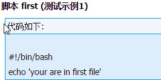
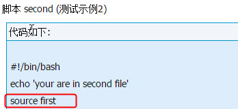
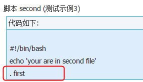
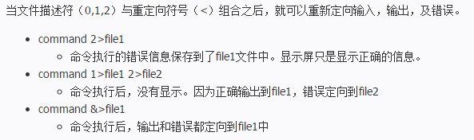

 # shell基础

**chmod u+x file.sh这句中chmod、u、x分别代表什么呢**

	chmod是权限管理命令change the permissions mode of a file的缩写。。
	u代表所有者，x代表执行权限。 + 表示增加权限。
	chmod u+x file.sh 就表示对当前目录下的file.sh文件的所有者增加可执行权限。。。

**压缩**
	tar -czvf ***.tar.gz
	tar -cjvf ***.tar.bz2

**解压缩**
	tar -xzvf ***.tar.gz
	tar -xjvf ***.tar.bz2

**Linux下环境变量设置的三种方法：**

	1、控制台中设置，不赞成这种方式，因为他只对当前的shell 起作用，换一个shell设置就无效了：
	
	$PATH="$PATH":/NEW_PATH  (关闭shell Path会还原为原来的path)
	
	2、修改 /etc/profile 文件，如果你的计算机仅仅作为开发使用时推存使用这种方法，因为所有用户的shell都有权使用这个环境变量，可能会给系统带来安全性问题。这里是针对所有的用户的，所有的shell
	
	在/etc/profile的最下面添加：  export  PATH="$PATH:/NEW_PATH"
	
	3、修改bashrc文件，这种方法更为安全，它可以把使用这些环境变量的权限控制到用户级别，这里是针对某一特定的用户，如果你需要给某个用户权限使用这些环境变量，你只需要修改其个人用户主目录下的 .bashrc文件就可以了。
	在下面添加：Export  PATH="$PATH:/NEW_PATH"

**Linux中` `、$、$( ) 、${ } 有什么区别**

<font size=3 face="黑体" color=red>$( )</font>中放的是命令，相当于<font size=3 face="黑体" color=red > \`  \` </font>，例如todaydate=$(date +%Y%m%d)意思是执行date命令，返回执行结果给变量todaydate，也可以写为todaydate=`date +%Y%m%d`；

${ }中放的是变量，例如echo ${PATH}取PATH变量的值并打印，也可以不加括号比如$PATH。

# shell编程

1、编写脚本

	第一个脚本 vi(vim) hello.sh
	
	#!/bin/bash //必须要写
	
	#The first program //注释
	
	echo -e "\e[1;34m填上掉下个林妹妹 ！\e [0m"

2.脚本执行

	赋予执行权限，直接运行
	
	chmod 755 hello.sh
	
	通过Bash调用执行脚本
	
	bash hello.sh

3.bash基本功能

	命令别名与快捷键

	alias #查看系统中所有的命令别名

	alias 别名='原命令' #设定命令别名

	别名永久生效与删除别名

	vi ~/.bashrc #写入环境变量配置文件

	unalias 别名 #删除别名

4.常用快捷键
	ctrl+c 强制终止当前命令

	ctrl+l 清屏

	ctrl+a 光标移动到命令行首

	ctrl+e 光标移动到命令行尾

	ctrl+u 从光标所在位子删除到行首

	ctrl+z 把命令放入后台

	ctrl+r 在历史命令中搜索

	历史命令

	history [选项] [历史命令保存文件]

	选项：

	-c 清空历史命令

	-w 把缓存中的历史命令写入历史命令保存文件 ~/.bash_history

	历史命令默认会保存1000条，可以在环境变量中配置文件/etc/profile中进行修改

	历史命令的调用

	使用上，下箭头调用以前的历史命令

	使用"!n"重复执行第n条历史命令

	使用"!!"重复执行上一条命令

	使用"!子串"重复执行最后一条以该子串开头的命令

命令与文件补全

在bash中，命令与文件补全是非常方便与常用的功能，我们只要在输入命令或文件时，按<span style="color:red;">"tab"</span>键就会自动进行补全

[shell教程：http://c.biancheng.net/cpp/view/6994.html](http://c.biancheng.net/cpp/view/6994.html)


# Shell编程

一定要敲命令(bin目录下)的绝对路径。如：`/bin/pwd`

## Linux

定义变量
> 变量名不加美元符号（$）

```
 variableName="value"
```

<font size=3 face="黑体" color=red>注意，变量名和等号之间不能有空格</font>，这可能和你熟悉的所有编程语言都不一样。同时，变量名的命名须遵循如下规则：

- 首个字符必须为字母（a-z，A-Z）。
- 中间不能有空格，可以使用下划线（_）。
- 不能使用标点符号。
- 不能使用bash里的关键字（可用help命令查看保留关键字）。

```
  myUrl="http://see.xidian.edu.cn/cpp/linux/"   
  myNum=100   
```

使用变量

使用一个定义过的变量，只要在变量名前面加美元符号（$）即可，如：

	your_name="mozhiyan"
	echo $your_name
	echo ${your_name}
变量名外面的花括号是可选的，加不加都行，加花括号是为了帮助解释器识别变量的边界，比如下面这种情况：

	for skill in Ada Coffe Action Java 
	do
	    echo "I am good at ${skill}Script"
	done

如果不给skill变量加花括号，写成echo "I am good at $skillScript"，解释器就会把$skillScript当成一个变量（其值为空），代码执行结果就不是我们期望的样子了。

<font size=3 face="黑体" color=red>推荐给所有变量加上花括号，这是个好的编程习惯。</font>

重新定义变量

已定义的变量，可以被重新定义，如：

	myUrl="http://see.xidian.edu.cn/cpp/linux/"
	echo ${myUrl}
	myUrl="http://see.xidian.edu.cn/cpp/shell/"
	echo ${myUrl}
这样写是合法的，但注意，第二次赋值的时候不能写 $myUrl="http://see.xidian.edu.cn/cpp/shell/"，使用变量的时候才加美元符（$）。

只读变量

使用 readonly 命令可以将变量定义为只读变量，只读变量的值不能被改变。

下面的例子尝试更改只读变量，结果报错：

	#!/bin/bash
	myUrl="http://see.xidian.edu.cn/cpp/shell/"
	readonly myUrl
	myUrl="http://see.xidian.edu.cn/cpp/danpianji/"

删除变量

使用 unset 命令可以删除变量。语法：

	unset variable_name

变量被删除后不能再次使用；unset 命令不能删除只读变量。

	#!/bin/sh
	myUrl="http://see.xidian.edu.cn/cpp/u/xitong/"
	unset myUrl
	echo $myUrl

### 变量类型

运行shell时，会同时存在三种变量：
 
- 1) 局部变量
  局部变量在脚本或命令中定义，仅在当前shell实例中有效，其他shell启动的程序不能访问局部变量。

- 2) 环境变量
  所有的程序，包括shell启动的程序，都能访问环境变量，有些程序需要环境变量来保证其正常运行。必要的时候shell脚本也可以定义环境变量。

- 3) shell变量
  shell变量是由shell程序设置的特殊变量。shell变量中有一部分是环境变量，有一部分是局部变量，这些变量保证了shell的正常运行

<font size=3 face="黑体" color=red>变量名只能包含数字、字母和下划线</font>

> Shell特殊变量：Shell $0, $#, $*, $@, $?, $$和命令行参数

变量|含义
------  | ----------------
$0	| 当前脚本的文件名
$n	| 传递给脚本或函数的参数。n 是一个数字，表示第几个参数。例如，第一个参数是$1，第二个参数是$2。
$#	| 传递给脚本或函数的参数个数。
$*	| 传递给脚本或函数的所有参数。
$@	| 传递给脚本或函数的所有参数。被双引号(" ")包含时，与 $* 稍有不同，下面将会讲到。
$?	| 上个命令的退出状态，或函数的返回值。
$$	| 当前Shell进程ID。对于 Shell 脚本，就是这些脚本所在的进程ID。


> for 循环

```
	for 变量 in 列表  
	do   
	    command1   
	    command2   
	    ...   
	    commandN   
	done   
```

> Shell 有三种 if ... else 语句

- if ... fi 语句；

```

if [ expression ]
then
   Statement(s) to be executed if expression is true
fi

```

$emsp;&emsp; 如果 expression 返回 true，then 后边的语句将会被执行；如果返回 false，不会执行任何语句。最后必须以 fi 来结尾闭合 if，fi 就是 if 倒过来拼写，后面也会遇见。注意：expression 和方括号([ ])之间必须有空格，否则会有语法错误。

- if ... else ... fi 语句；			

```
if [ expression ]
then
   Statement(s) to be executed if expression is true
else
   Statement(s) to be executed if expression is not true
fi
```
如果 expression 返回 true，那么 then 后边的语句将会被执行；否则，执行 else 后边的语句。


- if ... elif ... else ... fi 语句。

```
if [ expression 1 ]
then
   Statement(s) to be executed if expression 1 is true
elif [ expression 2 ]
then
   Statement(s) to be executed if expression 2 is true
elif [ expression 3 ]
then
   Statement(s) to be executed if expression 3 is true
else
   Statement(s) to be executed if no expression is true
fi
```

> Shell test命令

【数值测试】  

|参数	| 说明
--------|-------
-eq	| 等于则为真
-ne	| 不等于则为真
-gt	| 大于则为真
-ge	| 大于等于则为真
-lt	| 小于则为真
-le	| 小于等于则为真

````
num1=100
num2=100
if test $[num1] -eq $[num2]
then
    echo 'The two numbers are equal!'
else
    echo 'The two numbers are not equal!'
fi
````

【字符串测试】

|参数	| 说明
--------|-----
=	| 等于则为真
!=	| 不相等则为真
-z 字符串	| 字符串长度伪则为真
-n 字符串	| 字符串长度不伪则为真

````
num1=100
num2=100
if test num1=num2
then
    echo 'The two strings are equal!'
else
    echo 'The two strings are not equal!'
fi
````

【文件测试】

| 参数	|说明
--------|------
-e 文件名 |	如果文件存在则为真
-r 文件名 |	如果文件存在且可读则为真
-w 文件名 |	如果文件存在且可写则为真
-x 文件名 |	如果文件存在且可执行则为真
-s 文件名 |	如果文件存在且至少有一个字符则为真
-d 文件名 |	如果文件存在且为目录则为真
-f 文件名 |	如果文件存在且为普通文件则为真
-c 文件名 |	如果文件存在且为字符型特殊文件则为真
-b 文件名 |	如果文件存在且为块特殊文件则为真

````
cd /bin
if test -e ./bash
then
    echo 'The file already exists!'
else
    echo 'The file does not exists!'
fi
````

另外，Shell还提供了与( ! )、或( -o )、非( -a )三个逻辑操作符用于将测试条件连接起来，其优先级为：“!”最高，“-a”次之，“-o”最低。例如：

```
cd /bin
if test -e ./notFile -o ./bash
then
    echo 'One file exists at least!'
else
    echo 'Both dose not exists!'
fi
```

> Shell case esac语句

> Shell函数：Shell函数返回值、删除函数、在终端调用函数

函数可以让我们将一个复杂功能划分成若干模块，让程序结构更加清晰，代码重复利用率更高

Shell 函数返回值只能是整数，一般用来表示函数执行成功与否，0表示成功，其他值表示失败。如果 return 其他数据，比如一个字符串，往往会得到错误提示：“numeric argument required”。

> shell 输入输出重定向

- 输出重定向
- 输入重定向

全部可用的重定向命令列表

命令	| 说明
--------|---------------------
command > file	| 将输出重定向到 file。
command < file	| 将输入重定向到 file。
command >> file	| 将输出以追加的方式重定向到 file。
n > file	| 将文件描述符为 n 的文件重定向到 file。
n >> file	| 将文件描述符为 n 的文件以追加的方式重定向到 file。
n >& m	| 将输出文件 m 和 n 合并。
n <& m	| 将输入文件 m 和 n 合并。
<< tag	| 将开始标记 tag 和结束标记 tag 之间的内容作为输入。


[ ! -z $1 ]，这是需要返回一个值0或者1

	！非
	-z 在if里的意思是 空
	$1 第一个参数
	[ ! -z $1 ]，这是需要返回一个值0或者1,最后结果是 if[1]或者if[0]

### shell脚本中调用、引用、包含另外一个脚本文件的两种方法

> 在当前脚本文件中调用另外一个脚本文件？



方案一：使用 source
 


方案二：使用 .
 


【总结】：

&emsp；&emsp；source filename和 . filename 应该是同一回事，都是在*当前*Shell环境中执行脚本。也可以使用sh filename，那是在当前Shell的子Shell中执行脚本。

### shell脚本中的“2< ＂ ＂>&2＂ ＂&>"

Linux标准文件描述符：

文件描述符 | 缩写	| 描述
----------|-----|------
0 |	STDIN |	标准输入
1 |	STDOUT |	标准输出
2 |	STDERR |	标准错误



