## centos7 修改ip 注意事项

先设置oracle VM VirtualBox

全局设置：

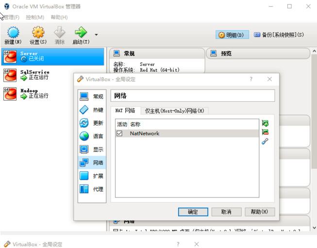
 
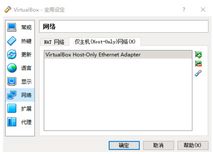

相应系统设置：

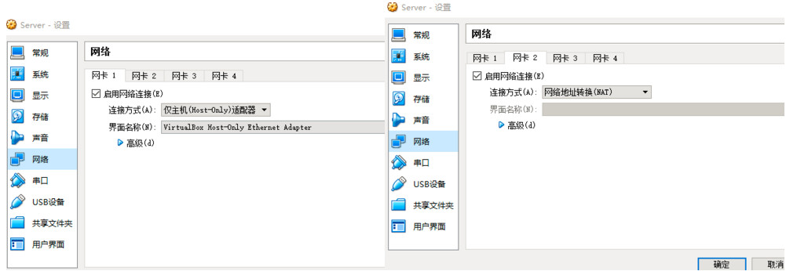

1、修改网卡MAC与设备名称eth*的映射
    vi /etc/udev/rules.d/70-persistent-net.rules

  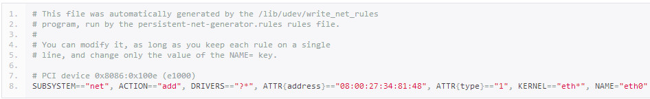

   P.S. 此文件中的<b style="color:blue"> ATTR{address} </b>的MAC必须与上图中虚拟机网卡的MAC地址一致;如若不一致,CentOS会自动创建一条新记录,同时eth*对应的数字会自增.

2、配置网卡的具体属性
      vi /etc/sysconfig/network-scripts/ifcfg-eth0

   

P.S. 此处我配置的是静态IP,目的是防止每次启动虚拟机时IP地址变化. 用过VirtualBox的都知道,56网段是VirtualBox的默认HostOnly网段,既然VM只能与宿主本机相通,就配成静态IP省的麻烦. 另外若要使用DHCP,请将如下配置:

   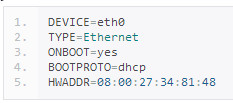

**注意不能设置GATEWAY,原因:**

linux双网卡默认路由问题: 在安装第二块网卡后出现无法上网问题,使用route发现是默认路由出现问题,经过多发查证,才发现原来linux在加载网卡配置文件的时候是先加载eth0,再加载eht1的.
这样,如果eth1设置了gateway项,则会覆盖掉eth0中的gateway设置,因此解决方法就是删除eth1的gateway设置.

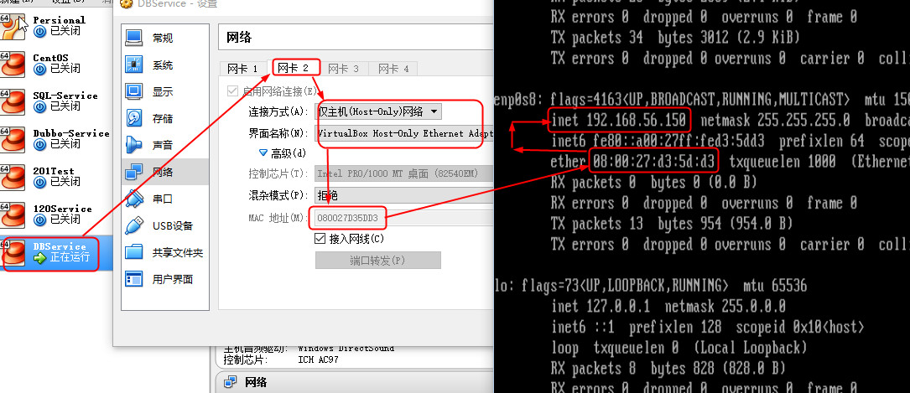

**ip  a查看所有网络设备名及信息**
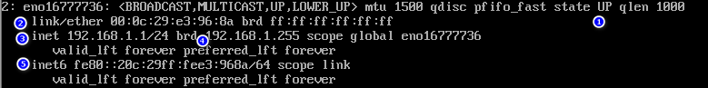

1：接口状态

2：硬件

3：ipv4地址及子网掩码

4：广播地址，范围，设备名称

5：ipv6信息

**查看路由信息**
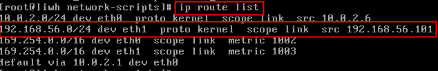
=======================================================>>>>>>>>>>>>>>>>>>>>>>>>

# vmware 配置网络
安装vmware之后，默认安装了两个虚拟网卡 VMnet1 和VMnet8 ，其他的未安装 (当然可以手动安装其他的)

+ VMnet1 是host网卡
+ VMnet8 是NAT网卡(用于net方式连接网络)

VMnet8是NAT网卡，用于NAT方式连接网络的。它们的IP地址是随机生成的，如果要用虚拟机做实验的话，最好将VMnet1到VMnet8的IP地址改掉。习惯上把VMware虚拟网卡使用的网段"固定"，使用如下原则：VMnet1对应的网段是192.168.10.0，VMnet2对应的网段是192.168.20.0，其他的类似。当然平常只是随便用用的就不用改了，能上网就行了。

VMware网络连接的方式主要有：

+ 桥接（Bridged）
+ NAT
+ 主机网络（Host-Only）。

> 桥接模式 （ Use bridged networking）

使用VMnet0虚拟交换机，此时虚拟机相当与网络上的一台独立计算机与主机一样，拥有一个独立的IP地址，其网络拓扑如图1所示，使用桥接方式，A，A1，A2，B可互访。

   **桥接方式拓扑示意**

   

> NAT （Use network address translation）

说明：使用Vmnet8虚拟交换机，此时虚拟机可以通过主机单向网络上的其他工作站，其他工作站不能访问虚拟机。其网络拓扑如图所示，使用NAT方式，A1，A2可以访问B，但B不可以访问A1，A2。但A，A1，A2可以互访。

   **NAT方式拓扑示意**

  

一般设置为NAT模式，NAT模式下的虚拟系统的TCP/IP配置信息是由VMnet8(NAT)虚拟网络的DHCP服务器提供的，无法进行手工修改，因此虚拟系统也就无法和本局域网中的其他真实主机进行通讯。采用NAT模式最大的优势是虚拟系统接入互联网非常简单，你不需要进行任何其他的配置，只需要宿主机器能访问互联网即可。因此可以点击菜单栏中的“虚拟机”——“设置”

> 主机模式【主机网络模式】 （Use Host-Only networking）

说明：使用Vmnet1虚拟交换机，此时虚拟机只能与虚拟机、主机互访。也就是不能上Internet，其网络拓扑如图3所示，使用Host方式，A，A1，A2可以互访，但A1，A2不能访问B，也不能被B访问。

  **主机网络方式拓扑示意**

   

实际应用：现在最普遍使用的是宽带，使用桥接方式，主机必然可以上网，但是虚拟机上的操作系统是不可以上网的。此时你的主机就相当于A，而虚拟机就相当于A1，除非你再向运营商（如电信，网通）申请个IP地址，显然这是不可取 的。如果你有路由器的话，那么就可以使用桥接方式上网，因为此时你申请的IP地址是写在了路由器上，而不是你的机器上，这样包括你的主机，虚拟机，也包括连在路由器上的其他人的机器，都将可以上网，使用着由路由器自动分配的IP地址，IP地址一般是192.168.0.XXX。貌似运营商不太乐意你使用路由器，说什么对他们交换机的接口有损害。当然，只要你的主机可以上网，使用NAT方式，虚拟机总是可以上网（当然不包括在你胡乱改写IP，网关，DNS等信息的情况下）。

   实例手动设置：假设主机的VMnet1使用网段地址为192.168.10.0，VMnet8使用网段地址为192.168.80.0，网关地址为192.168.80.254（也就是NAT路由器地址，可自己设置，在VMnet8上），主机网卡使用地址为192.168.1.1。
一、使用桥接方式，虚拟机A1的IP地址可以设置成192.168.1.5（与主机网卡地址同网段的即可），其他的诸如网关地址，DNS，子网掩码均与主机的相同。
二、使用NAT方式，虚拟机A1的IP地址可以设置成192.168.80.5（与VMnet8使用相同的网段），网关是NAT路由器地址，即192.168.80.524
三、使用host-only方式，虚拟机A1的IP地址可以设置成192.168.10.5（与VMnet1使用相同的网段）
说明：一般用户不需要自己手动设置，选择自动获取，或开启DHCP服务即可。

## vmnet0、vmnet1、vmnet8三种虚拟网络的工作方式图解

虚拟机装好之后，你的主机中就会出现如下的东西：

   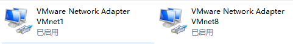
+  vmnet0
   虚拟网桥，这个网桥有若干端口，一个端口连接你的host，一个端口连接虚拟机，他们的位置是对等的，谁也不是谁的网关，所以桥接模式可以让虚拟机和主机有相同的网络位置，处于统一网段。
   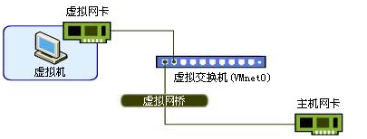

+ vmnet1
   他构建一个封闭的网络环境，不与主机以外的网络环境建立连接，也是一个虚拟交换机，一个端口连接到主机上，另一个端口连接到虚拟机的DHCP服务器上，其余的端口连载虚拟机上。
   

+ vmnet8  
  他是NAT连接模式使用的方式。从主机的虚拟网卡出来，链接到vmnet8交换机，虚拟交换机的其他口连接到NAT设备，另外一个连接DHCP服务器，其他接口连接虚拟机。
   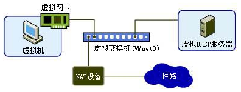

   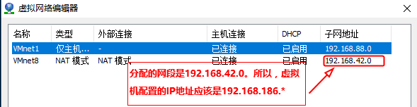
   

## 搭建一个就简易的实验环境
   

图意：主机上安装了，A,B,C,D,E，5个虚拟机，主机与其他主机150能够相互ping通。
那么接下来我们就相互ping一下，看下各种模式的网络连接情况，如下表：
   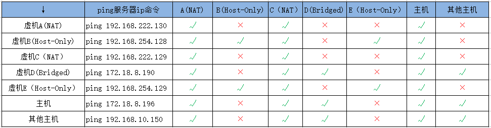
