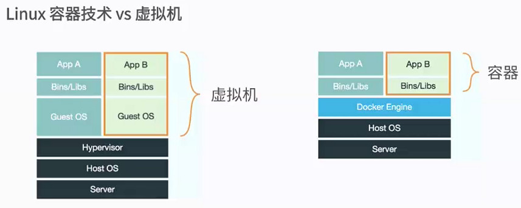
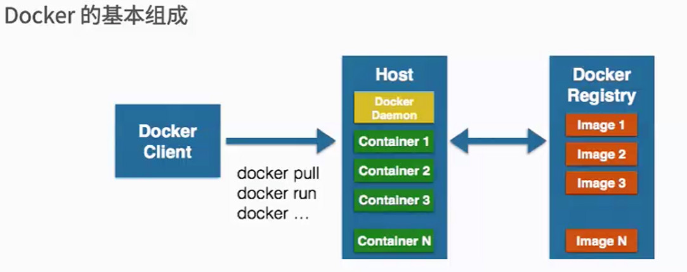

# Docker 了解

## 什么是Docker

### 将您的应用程序包装到软件开发的标准化单位
Docker容器将一个软件包装在一个完整的文件系统中，其中包含运行所需的所有内容：代码，运行时，系统工具，系统库 - 可以安装在服务器上的任何东西。这保证软件将始终运行相同，而不管其环境。


**轻量**

在单个机器上运行的容器共享相同的操作系统内核;他们立即开始使用更少的RAM。图像是从分层文件系统构建的，并共享公共文件，使磁盘使用和图像下载更加高效。


**开源**

Docker容器基于开放标准，使得容器可以在所有主要的Linux发行版和Microsoft Windows上运行，并在任何基础设施之上运行。

**安全**

容器将应用程序与另一个应用程序和底层基础架构隔离，同时为应用程序提供了一个附加的保护层。



小结：

 1、一种虚拟化的方案
 
 2、操作系统级别的虚拟化
 
 3、只能运行相同或相似内核的操作系统
 
 4、依赖Linux内核特性：Namespace和Cgroups（Control Group）

### Docker的目标与使用场景

**Docker的目标：**
+ 提高简单轻量的建模方式
+ 职责的逻辑分离
+ 快速高效的开发生命周期
+ 鼓励使用面向服务的架构

**Docker的使用场景：**
- 1、使用Docker容器开发、测试、部署服务
- 2、创建隔离的运行环境
- 3、搭建测试环境
- 4、构建多用户的平台及服务（PaaS）基础设施
- 5、提供软件及服务（SaaS）应用程序
- 6、高性能、超大规模的宿主机部署


### Docker 的基本组成

> Docker Client 客户端
> 
> Docker Daemon 守护进程
> 
> Docker Image 镜像 （容器的基石）
> 
> Docker Container 容器
> 
> Docker Registry 创库（公有、私有）




## 安装

使用阿里云镜像安装 Docker CE

+ 安装必要的一些系统工具

  `sudo yum install -y yum-utils device-mapper-persistent-data lvm2`

+ 添加软件信息

  `sudo yum-config-manager --add-repo http:*//mirrors.aliyun.com/docker-ce/linux/centos/docker-ce.repo*`

+ 更新并安装 Docker-CE

  sudo yum makecache fast
  sudo yum -y install docker-ce

+  开启Docker服务

  `sudo service docker start`

## 容器命令

1、新建并启动命令：`docker run [options] image [command][arg...]`

```shell 
OPTIONS说明（常用）：有些是一个减号，有些是两个减号

--name="容器新名字": 为容器指定一个名称；
-d: 后台运行容器，并返回容器ID，也即启动守护式容器；
-i：以交互模式运行容器，通常与 -t 同时使用；
-t：为容器重新分配一个伪输入终端，通常与 -i 同时使用；
-P: 随机端口映射；
-p: 指定端口映射，有以下四种格式
      ip : hostPort:containerPort
      ip :: containerPort
      hostPort : containerPort
      containerPort

例如：使用镜像centos:latest以交互模式启动一个容器,在容器内执行/bin/bash命令。
docker run -it centos /bin/bash 

```

2、列出当前所有正在运行的容器`docker ps [OPTIONS]`

```shell


OPTIONS说明（常用）： 
-a :列出当前所有正在运行的容器+历史上运行过的
-l :显示最近创建的容器。
-n：显示最近n个创建的容器。
-q :静默模式，只显示容器编号。
--no-trunc :不截断输出。

```

3、退出容器方式

```shell
容器停止退出：exit

容器不停止退出： ctrl +P+Q
```

4、启动容易：`docker start 容器ID或者容器名`

5、重启容器：`docker restart 容器ID或者容器名`

6、停止容器：`docker stop 容器ID或者容器名`

7、强制停止容器：`docker kill 容器ID或者容器名`

8、删除已停止的容器：`docker rm 容器ID`

```shell
一次性删除多个容器
docker rm -f $(docker ps -a -q)
docker ps -a -q | xargs docker rm

把该镜像的记录全部删除掉，如果删除所有镜像的记录，可以使用:
docker ps -a|awk '{print $1}'|xargs docker rm

想要删除untagged images，也就是那些id为<None>的image的话可以用
docker rmi $(docker images | grep "^<none>" | awk "{print $3}")
```

**9、启动守护式容器** ：`docker run -d 容器名`

10、查看容器日志 `docker logs -f -t --tail 容器ID`

```shell
-t 是加入时间戳
-f 跟随最新的日志打印
--tail 数字 显示最后多少条
```

11、查看容器内运行的进程： `docker top 容器ID`

12、查看容器内部细节： `docker inspect 容器ID`

13、进入正在运行的容器并以命令行交互

```shell
docker exec -it 容器ID bashShell
重新进入docker attach 容器ID
区别：
attach 直接进入容器启动命令的终端，不会启动新的进程
exec 是在容器中打开新的终端，并且可以启动新的进程
```

14、从容器内拷贝文件到主机上：`docker cp  容器ID:容器内路径 目的主机路径`


[小结：]
```shell
attach    Attach to a running container                 # 当前 shell 下 attach 连接指定运行镜像
build     Build an image from a Dockerfile              # 通过 Dockerfile 定制镜像
commit    Create a new image from a container changes   # 提交当前容器为新的镜像
cp        Copy files/folders from the containers filesystem to the host path   #从容器中拷贝指定文件或者目录到宿主机中
create    Create a new container                        # 创建一个新的容器，同 run，但不启动容器
diff      Inspect changes on a container's filesystem   # 查看 docker 容器变化
events    Get real time events from the server          # 从 docker 服务获取容器实时事件
exec      Run a command in an existing container        # 在已存在的容器上运行命令
export    Stream the contents of a container as a tar archive   # 导出容器的内容流作为一个 tar 归档文件[对应 import ]
history   Show the history of an image                  # 展示一个镜像形成历史
images    List images                                   # 列出系统当前镜像
import    Create a new filesystem image from the contents of a tarball # 从tar包中的内容创建一个新的文件系统映像[对应export]
info      Display system-wide information               # 显示系统相关信息
inspect   Return low-level information on a container   # 查看容器详细信息
kill      Kill a running container                      # kill 指定 docker 容器
load      Load an image from a tar archive              # 从一个 tar 包中加载一个镜像[对应 save]
login     Register or Login to the docker registry server    # 注册或者登陆一个 docker 源服务器
logout    Log out from a Docker registry server          # 从当前 Docker registry 退出
logs      Fetch the logs of a container                 # 输出当前容器日志信息
port      Lookup the public-facing port which is NAT-ed to PRIVATE_PORT    # 查看映射端口对应的容器内部源端口
pause     Pause all processes within a container        # 暂停容器
ps        List containers                               # 列出容器列表
pull      Pull an image or a repository from the docker registry server   # 从docker镜像源服务器拉取指定镜像或者库镜像
push      Push an image or a repository to the docker registry server    # 推送指定镜像或者库镜像至docker源服务器
restart   Restart a running container                   # 重启运行的容器
rm        Remove one or more containers                 # 移除一个或者多个容器
rmi       Remove one or more images             # 移除一个或多个镜像[无容器使用该镜像才可删除，否则需删除相关容器才可继续或 -f 强制删除]
run       Run a command in a new container              # 创建一个新的容器并运行一个命令
save      Save an image to a tar archive                # 保存一个镜像为一个 tar 包[对应 load]
search    Search for an image on the Docker Hub         # 在 docker hub 中搜索镜像
start     Start a stopped containers                    # 启动容器
stop      Stop a running containers                     # 停止容器
tag       Tag an image into a repository                # 给源中镜像打标签
top       Lookup the running processes of a container   # 查看容器中运行的进程信息
unpause   Unpause a paused container                    # 取消暂停容器
version   Show the docker version information           # 查看 docker 版本号
wait      Block until a container stops, then print its exit code   # 截取容器停止时的退出状态值
```

## Docker 镜像

镜像是一种轻量级、可执行的独立软件包，用来打包软件运行环境和基于运行环境开发的软件，它包含运行某个软件所需的所有内容，包括代码、运行时、库、环境变量和配置文件。

**Docker镜像commit操作**
```shell
docker commit提交容器副本使之成为一个新的镜像
docker commit -m=“提交的描述信息” -a=“作者” 容器ID 要创建的目标镜像名:[标签名]
```
## DockerFile解析

Dockerfile 是用来构建Docker镜像的构建文件，是由一系列命令和参数构成的脚本。

编写Dockerfile文件步骤：

## 编写docker-compose.yml并运行实例

场景：前面我们使用 Docker 的时候，定义 Dockerfile 文件，然后使用 docker build、docker run 等命令操作容器。然而微服务架构的应用系统一般包含若干个微服务，每个微服务一般都会部署多个实例，如果每个微服务都要手动启停，那么效率之低，维护量之大可想而知

解决方案：安装`Docker Compose` ;使用 Docker Compose 可以轻松、高效的管理容器，它是一个用于定义和运行多容器 Docker 的应用程序工具

```shell
//安装 Docker Compose 可以通过下面命令自动下载适应版本的 Compose，并为安装脚本添加执行权限
curl -L https://github.com/docker/compose/releases/download/1.24.1/docker-compose-`uname -s`-`uname -m` -o /usr/local/bin/docker-compose
chmod +x /usr/local/bin/docker-compose

chmod +x /usr/local/bin/docker-compose

docker-compose -v #查看安装是否成功

```

打包项目，获得 jar 包 docker-demo-0.0.1-SNAPSHOT.jar:`mvn clean package`

在 jar 包所在路径创建 Dockerfile 文件，添加以下内容
```yml
FROM java:8
VOLUME /tmp
ADD docker-demo-0.0.1-SNAPSHOT.jar app.jar
RUN bash -c 'touch /app.jar'EXPOSE 9000
ENTRYPOINT ["java","-Djava.security.egd=file:/dev/./urandom","-jar","app.jar"]
```

在 jar 包所在路径创建文件 docker-compose.yml，添加以下内容
```yml
version: '2' # 表示该 Docker-Compose 文件使用的是 Version 2 fileservices:
  docker-demo:  # 指定服务名称
    build: .  # 指定 Dockerfile 所在路径
    ports:    # 指定端口映射
      - "9000:8761"
```

在 docker-compose.yml 所在路径下执行该命令 Compose 就会自动构建镜像并使用镜像启动容器

```
docker-compose up
docker-compose up -d  // 后台启动并运行容器
```
访问 http://localhost:9000/hello 即可访问微服务接口

**工程、服务、容器**

+ Docker Compose 将所管理的容器分为三层，分别是工程（project）、服务（service）、容器（container）
+ Docker Compose 运行目录下的所有文件（docker-compose.yml）组成一个工程,一个工程包含多个服务，每个服务中定义了容器运行的镜像、参数、依赖，一个服务可包括多个容器实例

**Docker Compose 常用命令与配置**

常见命令
+ ps：列出所有运行容器 `docker-compose ps`
+ logs：查看服务日志输出`docker-compose logs`
+ port：打印绑定的公共端口，下面命令可以输出 eureka 服务 8761 端口所绑定的公共端口`docker-compose port eureka 8761`
+ build：构建或者重新构建服务`docker-compose build`
+ start：启动指定服务已存在的容器`docker-compose start eureka`
+ stop：停止已运行的服务的容器`docker-compose stop eureka`
+ rm：删除指定服务的容器`docker-compose rm eureka`
+ up：构建、启动容器`docker-compose up`
+ kill：通过发送 SIGKILL 信号来停止指定服务的容器`docker-compose kill eureka`
+ pull：下载服务镜像
+ scale：设置指定服务运气容器的个数，以 service=num 形式指定`docker-compose scale user=3 movie=3`
+ run：在一个服务上执行一个命令`docker-compose run web bash`

**docker-compose.yml 属性**

- version：指定 docker-compose.yml 文件的写法格式
- services：多个容器集合
- build：配置构建时，Compose 会利用它自动构建镜像，该值可以是一个路径，也可以是一个对象，用于指定 Dockerfile 参数

```yml
build: ./dir
---------------
build:
    context: ./dir
    dockerfile: Dockerfile
    args:
        buildno: 1
```
- command：覆盖容器启动后默认执行的命令

```yml
command: bundle exec thin -p 3000
----------------------------------command: [bundle,exec,thin,-p,3000]
```

- dns：配置 dns 服务器，可以是一个值或列表

```yml
dns: 8.8.8.8------------dns:    - 8.8.8.8
    - 9.9.9.9
```

- dns_search：配置 DNS 搜索域，可以是一个值或列表

```yml
dns_search: example.com------------------------dns_search:    - dc1.example.com
    - dc2.example.com
```

- environment：环境变量配置，可以用数组或字典两种方式

```yml
environment:
    RACK_ENV: development
    SHOW: 'ture'-------------------------
environment:
    - RACK_ENV=development
    - SHOW=ture
```

- env_file：从文件中获取环境变量，可以指定一个文件路径或路径列表，其优先级低于 environment 指定的环境变量

```yml
env_file: .env
---------------
env_file:
    - ./common.env
```

- expose：暴露端口，只将端口暴露给连接的服务，而不暴露给主机

```yml
expose:
    - "3000"
    - "8000"
```

- image：指定服务所使用的镜像`image: java`
- network_mode：设置网络模式
`network_mode: "bridge"network_mode: "host"network_mode: "none"network_mode: "service:[service name]"network_mode: "container:[container name/id]"`
- ports：对外暴露的端口定义，和 expose 对应

```yml
ports:   # 暴露端口信息  
  - "宿主机端口:容器暴露端口"- "8763:8763"- "8763:8763"
```
- links：将指定容器连接到当前连接，可以设置别名，避免ip方式导致的容器重启动态改变的无法连接情况

```yml
links:    # 指定服务名称:别名 
    - docker-compose-eureka-server:compose-eureka
```

- volumes：卷挂载路径

```yml
volumes:
  - /lib
  - /var
```

- logs：日志输出信息
```yml
--no-color          单色输出，不显示其他颜.
-f, --follow        跟踪日志输出，就是可以实时查看日志
-t, --timestamps    显示时间戳
--tail              从日志的结尾显示，--tail=200
```

**Docker Compose 其它**

更新容器
+ 当服务的配置发生更改时，可使用 docker-compose up 命令更新配置
+ 此时，Compose 会删除旧容器并创建新容器，新容器会以不同的 IP 地址加入网络，名称保持不变，任何指向旧容起的连接都会被关闭，重新找到新容器并连接上去

links
+ 服务之间可以使用服务名称相互访问，links 允许定义一个别名，从而使用该别名访问其它服务

```
version: '2'
 services:
    web:
        build: .
        links:
            - "db:database"
    db:
        image: postgres
```

+ 这样 Web 服务就可以使用 db 或 database 作为 hostname 访问 db 服务了


**使用注意：**

- 1.docker-compose.yml[或者docker-compose.yaml]文件
- 2.构建服务的镜像需要的Dockerfile文件
- 3.构建服务需要的jar包
- 4、需要尽量放在同一个目录下！！
