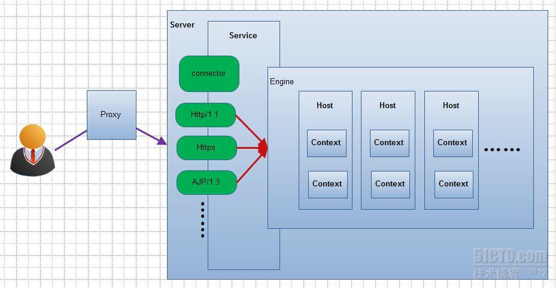
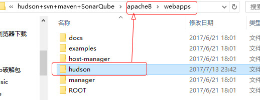
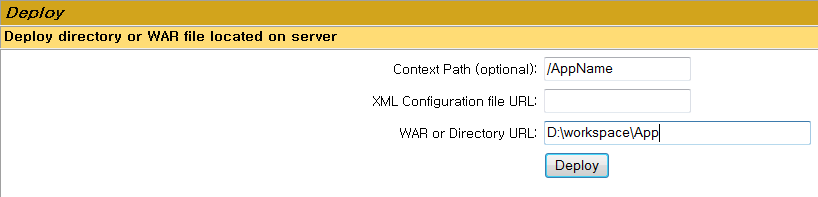
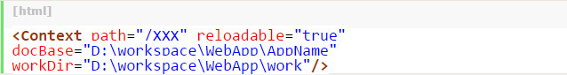
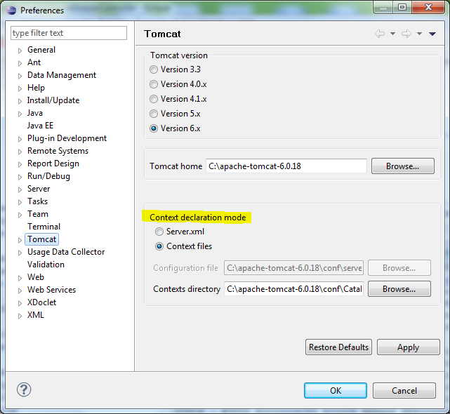
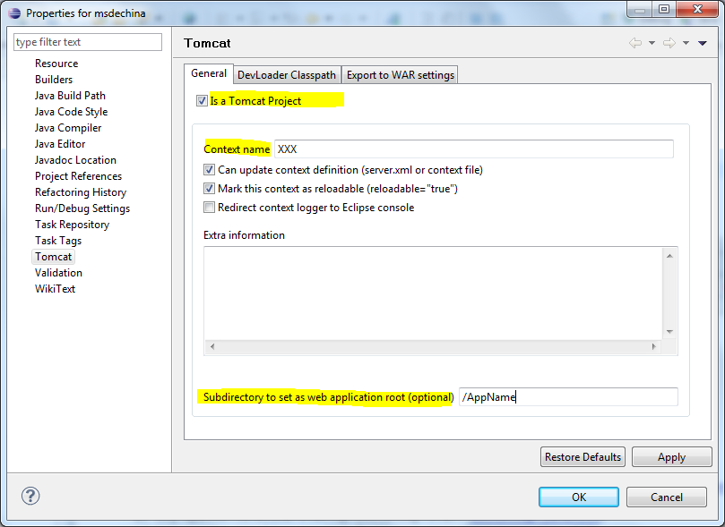
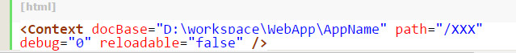
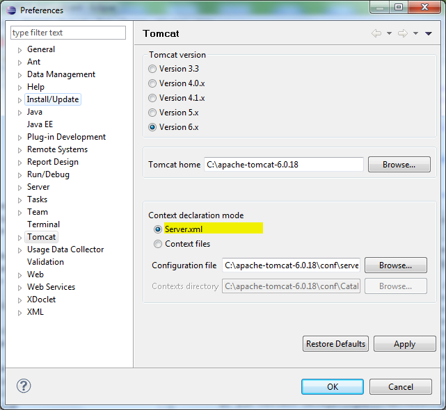

# window 安装可持续化集成环境

JDK-1.8.0_112
apache-tomcat-8.5.16-windows-x64.zip
hudson-3.3.3.war
postgresql-9.6.3-2-windows-x64.exe


## 1、安装JDK

## 2、安装hudson
 


# Tomcat部署web应用的4种方法



在Tomcat中有四种部署Web应用的方式，简要的概括分别是：   
（1）利用Tomcat自动部署   
（2）利用控制台进行部署   
（3）增加自定义的Web部署文件(%Tomcat_Home%\conf\Catalina\localhost\AppName.xml)   
（4）手动修改%Tomcat_Home%\conf\server.xml文件来部署web应用   

## 第一种方式：利用Tomcat自动部署

&emsp;&emsp;利用Tomcat自动部署方式是最简单的、最常用的方式。若一个web应用结构为**<font size=3 color=red face="黑体">D:\workspace\WebApp\AppName\WEB-INF\*，只要将一个Web应用的WebContent级的AppName</font>**直接扔进%Tomcat_Home%\webapps文件夹下，系统会把该web应用直接部署到Tomcat中。所以这里不再赘述。



## 第二种方式：利用控制台进行部署

&emsp;&emsp;若一个web应用结构为D:\workspace\WebApp\AppName\WEB-INF\*，利用控制台进行部署的方式如下：<font size=3 color=red face="黑体">进入tomcat的manager控制台的deploy区域——在Context path中键入"XXX"(可任意取名)——在WAR or Directory URL：键入D:\workspace\WebApp\AppName （表示去寻找此路径下的web应用）——点击deploy按钮。</font>



然后在%Tomcat_Home%\webapps路径下将会自动出现一个名为XXX的文件夹，其内容即是D:\workspace\WebApp\AppName的内容，只是名字是XXX而已（这就是前面在Context path键入XXX的结果）。
以上说明利用控制台进行部署的实质仍然是利用Tomcat的自动部署。

## 第三种方式：增加自定义的Web部署文件

&emsp;&emsp;若一个web应用结构为D:\workspace\WebApp\AppName\WEB-INF\*，这种部署方式稍微复杂一点，我们需要在%Tomcat_Home%\conf路径下新建一个文件夹catalina——再在其中新建一个localhost文件夹——最后再新建一个XML文件，即增加两层目录并新增XML文件：%Tomcat_Home%\conf\Catalina\localhost\web应用配置文件.xml ，该文件就是部署Web应用的配置文件。例如，我们新建一个%Tomcat_Home%\conf\Catalina\localhost\XXX.xml， 该文件的内容如下：



注意：
（1）以上代码中的workDir表示将该Web应用部署后置于的工作目录（Web应用中JSP编译成的Servlet都可在其中找到），如果使用的Eclipse作为IDE，一般可人为设置在WebApp的work目录下。
如果自定义web部署文件XXX.xml中未指明workdir，则web应用将默认部署在%Tomcat_Home%\work\Catalina\localhost\路径下新建的以XXX命名的文件夹下。（Web应用中JSP编译成的Servlet都可在其中找到）
（2）Context path即指定web应用的虚拟路径名。docBase指定要部署的Web应用的源路径。
其实开发者可以使用安装有Tomcat插件eclipse自动创建部署文件来部署Web应用而不必再手动建立该文件，方法如下：
1. 打开Eclipse——打开菜单栏window选择preference（首选项）——左侧选择Tomcat，如下图示：



2. 可以看到上图中高亮画出的Context declaration mode（Context 声明模式）中选择以Context files增加自定义部署文件的形式部署web应用——然后Contexts directory中指定上述文件的上级目录（即%Tomcat_Home%\conf\Catalina\localhost ）——点击Apply或OK。
3. 完上述步骤，再选中Web项目右键点击properties（属性）——选择右侧的Tomcat ，如下图所示：



4. 勾上"Is a Tomcat project"前的checkbox，将项目关联至Tomcat。
在Context name中填入XXX，即Web应用自定义部署文件名和Context path名。
在Subdirectory to set as web application root (optional)中填入要部署的Web应用的实际路径（即WEB-INF上级目录）。
注意：Eclipse会自动地将workdir设置在Workspace\WebApp\work下。
如此便自动创建了%Tomcat_Home%\conf\Catalina\localhost\XXX.xml 文件。启动Tomcat 即可自动部署Web应用。

## 第四种方式：手动修改%Tomcat_Home%\conf\server.xml文件来部署web应用

此方法即打开%Tomcat_Home%\conf\server.xml文件并在其中增加以下元素：



然后启动Tomcat即可。
当然如果使用Eclipse，在Eclipse中的设置也有改变：打开菜单栏window选择preference（首选项）——左侧选择Tomcat——可以看到上图中高亮画出的Context declaration mode（Context 声明模式）中选择以Server.xml文件来部署web应用。



# Tomcat部署多个web应用

> 想要在一个tomcat下访问两个web项目时，可以通过添加虚拟host的方式来解决。   

详细步骤：
 1、将两个项目打包放入tomcat的webapps目录下；
 2、修改tomcat的server.xml文件，原来的代码如下：

      <Host name="localhost" appBase="webapps"  
           unpackWARs="true" autoDeploy="true"
           xmlValidation="false" xmlNamespaceAware="false"></Host>

如下：

	
	//添加代码后如下：
	<Host name="localhost" appBase="webapps"
	      unpackWARs="true" autoDeploy="true"
	      xmlValidation="false" xmlNamespaceAware="false">
	            <Context path="ROOT" docBase="/ROOT"/> 
	</Host>
	<Host name="myspring.com" appBase="webapps"
	      unpackWARs="true" autoDeploy="true"
	      xmlValidation="false" xmlNamespaceAware="false">
	            <Context path="" docBase="/SpringMvcArchitect2"/>
	</Host>

需注意两点：

   a、原来的host需要加上context标签，并且path由原来的空变为项目名，因为两个host的path不能同时为空，不然会访问出错，原来的项目名默认为ROOT。

   b、添加新的host，将docBase里的路径设置为第二个web项目的路径，这里为/SpringMvcArchitect2，name为虚拟域名，自定义的。

 3、修改机器的host文件（区别于上面的Host标签，是系统host文件），添加一个ip映射，例如添加的host的name为myspring.com,则往系统host文件中添加127.0.0.1 myspring.com

 4、重启tomcat，就可以使用localhost:8080和myspring.com:8080访问两个web项目了，这里端口设置为8080，可以自己更改。

 5、同理可以扩展为多个web项目，只需配置多个host即可

附：部分项目如jfinal框架默认的项目在ROOT下，所以war包不能都放webapps文件夹下，这样需另外存放路径如E：\test
1、 server.xml配置文件如下

	<Host name="localhost" appBase="webapps"
	      unpackWARs="true" autoDeploy="true"
	      xmlValidation="false" xmlNamespaceAware="false">
	         <Context path="ROOT" docBase="C:\tomcat\webapps\ROOT"/> 
	</Host>
	<Host name="test.xiuyuewang.com" appBase="E:\test"
	      unpackWARs="true" autoDeploy="true">
	      <Valve className="org.apache.catalina.valves.AccessLogValve" directory="logs"
	      prefix="localhost_access_log." suffix=".txt"
	      pattern="%h %l %u %t &quot;%r&quot; %s %b" />
	   <Context path="" docBase="E:\test\ROOT" reloadable="false" crossContext="true"/>
	</Host>

2、 系统host配置文件
添加 127.0.0.1 新域名

3、重启tomcat。

【总结：】
Host 的name属性为你的域名、appBase指向你的工程文件所在的目录、docBase指向你的工程目录，其他属性可根据自己实际情况及需要配置。

1、webapps这个默认的应用目录也是可以改变。修改Tomcat的conf目录下的server.xml文件。如：
`<Host name="localhost" appBase="webapps" unpackWARs="true" autoDeploy="true" xmlValidation="false" xmlNamespaceAware="false">` 修改appBase即可

2、在Tomcat的配置文件中，一个Web应用就是一个特定的Context，可以通过在server.xml中新建Context里部署一个JSP应用程序。打开server.xml文件，在Host标签内建一个Context。在<Host>节点中添加,如下：
`<Context path="/hello" docBase="D:\workspace\hello\WebRoot" debug="0" privileged="true"></Context>`

或者：

`<Context path="/myapp" reloadable="true" docBase="D:\myapp" workDir="D:\myapp\work"/>`

或者

`<Context path="/sms4" docBase="D:\workspace\sms4\WebRoot"/>`

> appBase:基准目录 ，基准目录下的Root 目录被自动设置为根目录
> path是虚拟路径；
> docBase 是应用程序的物理路径；(换成你的项目路径)
> workDir 是这个应用的工作目录，存放运行时生成的与这个应用相关的文件；
> debug 则是设定debug level,  0表示提供最少的信息，9表示提供最多的信息
> privileged设置为true的时候，才允许Tomcat的Web应用使用容器内的Servlet
> reloadable 如果为true，则tomcat会自动检测应用程序的/WEB-INF/lib 和/WEB-INF/classes目录的变化，自动装载新的应用程序，可以在不重起tomcat的情况下改变应用程序，实现热部署
> antiResourceLocking和antiJARLocking  热部署是需要配置的参数，默认false避免更新了某个webapp，有时候Tomcat并不能把旧的webapp完全删除，通常会留下WEB-INF/lib下的某个jar包，必须关闭Tomcat才能删除，这就导致自动部署失败。设置为true，Tomcat在运行对应的webapp时，会把相应的源文件和jar文件复制到一个临时目录里。

Context元素属性列表如下：

|元素	|属性	|Mandatory	|Description
--------|-------|-----------|------------
Context	|docBase|	Y	|表示Web应用的根路径。若为war文件，属性值为该文件的路劲，若为目录，则为Web应用根目录路径
 	--|path	|N	|Web应用的上下文路径
 	--|reloadable	|N	|true/false(Default)。表示是否允许Tomcat服务器监视Web应用中/WEB-INF/classes和/WEB-INF/lib目录的变化
 --|workDir	|N	|指定一个目录路径来作为该Web应用的临时工作目录。若未指定该属性，则会使用Tomcat下的work目录
 	--|unpackWAR	|N	|true/false，如果设置成true则Tomcat在运行压缩的Web应用（war文件）会先将它解压缩


# Tomcat 部署应用的注意项

+ 将应用部署到Tomcat根目录的目的是可以通过“`http://[ip]:[port]`”直接访问应用，而不是使用“`http://[ip]:[port]/[appName]`”上下文路径进行访问。

**方法一：**（最简单直接的方法）    删除原 webapps/ROOT 目录下的所有文件，将应用下的所有文件和文件夹复制到ROOT文件夹下。（推荐使用）
**方法二：**   删除原 webapps/ROOT 目录下的所有文件，修改文件“conf/server.xml”，在Host节点下增加如下Context的内容配置：
```xml
<Host name="localhost" appBase="webapps" 
    unpackWARs="true" autoDeploy="true" xmlValidation="false" xmlNamespaceAware="false">
......
   <Context path="" docBase="C:/apache-tomcat-6.0.32/myapps/bc.war"></Context>
</Host>
```

注意：

1）path 的值设置为空；

2）应用不要放到tomcat的webapps目录下(如上述配置是放到自定义的文件夹myapps内的)，否则访问时路径很有问题；

3）docBase指定到绝对路径。如此设置后重启tomcat，如果docBase指向的是war文件，会自动将war解压到 webapps/ROOT 目录；如果docBase指向的是应用已解压好的目录，如 docBase="C:/apache-tomcat-6.0.32/myapps/bc"，tomcat不会生成webapps/ROOT目录（这种情况下之前可以不用删除webapps/ROOT目录，但webapps/ROOT目录内的内容是无法访问的），访问时将直接使用docBase指定的目录。

**方法三：**  与方法二类似，但不是修改全局配置文件“`conf/server.xml`”，而是在“`conf/Catalina/localhost`”目录下增加新的文件"ROOT.xml"（注意大小写哦），文件内容如下：
```xml
<?xml version="1.0" encoding="UTF-8"?>
<Context path="" docBase="C:/apache-tomcat-6.0.32/myapps/bc.war"></Context>
```


## 场景一：单一tomcat部署多个应用

修改server.xml,文件内有一个Host节点，在节点内加入如下内容：
```xml
<!--path是浏览器访问url后面跟随的目录，docBase是应用的路径。-->
<Context path="/test1" reloadable="true" docBase="E:\apach-tomcat\apache-tomcat-8.5.24\webapps\test1"/>

<Context path="/test2" reloadable="true" docBase="E:\apach-tomcat\apache-tomcat-8.5.24\webapps\test2"/>
```

部署过程遇到的问题：`java.lang.IllegalStateException: Web app root system property already set to different value: 'webapp.root' = [] instead of [D:/tomcat-5.0.19/webapps/its/] - Choose                  unique values for the 'webAppRootKey' context-param in your web.xml files!`

 **这个问题的解决方案即是在web.xml添加如下代码：**
```xml
<context-param>
	<param-name>webAppRootKey</param-name>
	<param-value>webapp.root1</param-value>
</context-param>
```
**注：webAppRootKey的解释，粗暴的理解就是每个应用的唯一key，在tomcat内webAppRootKey应该是独一无二！**

## 场景二：Tomcat8下将webapps目录与tomcat目录分离，规避tomcat切换导致数据丢失

在实际的生产环境中，默认情况下会将tomcat目录和时间部署目录进行分离，而非我们在开发环境下的将其放入`$CATALINA_HOME/webapps`下，那如何来实现这个功能呢？

`server.xml`中的配置信息，其默认会将首页映射到`$CATALINA_HOME/webapps/ROOT`,其中的Host的配置中默认情况为
```xml
 <Host name="localhost"  appBase="webapps"
            unpackWARs="true" autoDeploy="true">
        <Valve className="org.apache.catalina.valves.AccessLogValve" directory="logs"
               prefix="localhost_access_log" suffix=".txt"
               pattern="%h %l %u %t "%r" %s %b" />
</Host>
```
如何来修改？新增的Context节点将覆盖其默认的webapps部署目录，从而将其部署与tomcat目录进行分离。

server.xml配置文件，做如下配置：
```xml
 <Host name="localhost"  appBase="webapps"
            unpackWARs="true" autoDeploy="true">
	<Valve className="org.apache.catalina.valves.AccessLogValve" directory="logs"
               prefix="localhost_access_log" suffix=".txt"
               pattern="%h %l %u %t "%r" %s %b" />
	
	<!--新增了一个Context及其相应的属性信息-->
	<Context path="" docBase="/opt/apps/course/orff" 
	       reloadable="true" debug="0" crossContext="true"/>
</Host>
```
+ **path:** 指定访问该Web应用的URL入口
+ **docBase:** 指定Web应用的文件路径，可以给定绝对路径，也可以给定相对于<Host>的appBase属性的相对路径，如果Web应用采用开放目录结构，则指定Web应用的根目录，如果Web应用是个war文件，则指定war文件的路径。(指定项目所在地址)
+ **reloadable:** 如果这个属性设为true，tomcat服务器在运行状态下会监视在`WEB-INF/classes`和`WEB-INF/lib`目录下class文件的改动，如果监测到有class文件被更新的，服务器会自动重新加载Web应用
+ **crossContext:**  用来设置在不同的虚拟目录应用下Session的共享。如果要在同一虚拟主机中的不同Web应用程序之间共享某些信息，可以设置crossContext = true。


## tomcat中的虚拟目录和主目录

**虚拟目录：** 在我们在webapps中部署一个目录之时，会在`catalina_home/conf/CATALINA/localhost`目录下，默认生成一个ROOT.xml.其默认的内容如下
```xml
<?xml version='1.0' encoding='utf-8'?>
<Context crossContext="true" docBase="/opt/apps/course/orff" path="" reloadable="true">
</Context>
```
这里设置的虚拟目录的信息。 
**使用场景** 在我们在server.xml中删除了相应的context信息之后，如果发现不生效，则需要关注一下conf/Catalina/localhost下的相应文件，删除之后，重新启动即可解决类似问题。

> 主目录和虚拟目录的解析顺序

tomcat首先到conf/Catalina/localhost下解析其虚拟目录的信息，如果有则顺利跳转；如果虚拟目录不存在，则进入server.xml中的context部分进行解析，然后正常进行跳转，跳转进入正常的页面流转。

由此可知：  我们可以在虚拟目录和主目录两个位置来进行配置Context的目录信息，至于哪一个位置更好，大家可以自由选定，默认是server.xml为宜。

**主目录、虚拟目录；Tomcat下部署目录和Tomcat安装目录的分离，都在Context中进行体现。**
