# 前后端分离开发方案

> <font size=3 face="黑体">什么是前后端分离？</font>

因为目前开发存在的相关问题：

- View层仍然职责不清晰，究竟是该让前端学习点后台技术去直接套JSP模板，还是应该先在自己的机器上写好页面，然后交给后台开发人员去改造成JSP/FTL等
- 开发效率底下，不利于前后台的开发测试，后端不仅需要写逻辑代码，还需要去关注视图层

&emsp;前后端分离其实是职责的分离，将不同逻辑抽象出来，让前后端开发人员能够更好的合作，对于我个人说，能够更专一，开发后端的时候，只需要专心解决后端的问题，前端同理。

> <font size=3 face="黑体">怎么做前后端的分离</font>

&emsp; <font size=3 face="黑体">将Java作为一种服务存在，仅需要提供RESTFul接口即可，前端目前采用AngularJS，调用后端API，解析JSON数据，静态HTML页面。</font>

&emsp; <font size=3 face="黑体">交给Nginx代理，下面是具体配置：</font>

- > Java Layer
 
&emsp;&emsp; Java采用SpringMVC，方法返回JSON数据，然后运行带后台中，监听8080端口，处理来自前台的请求

    @RestController
    @RequestMapping("api")
    public class APIController {

        @Autowired
        private NewsItemService itemService;

        @Autowired
        private NewsDetailService detailService;
        /**
         * API:获取单页新闻
         * @param pageable
         * @return
         */
        @RequestMapping(value = "/news")
        public List<NewsItem> showNewsPage(Pageable pageable){
            return itemService.findAll(pageable);
        }
        /**
         * API：根据指定NewsItem ID
         *      获取新闻详情
         */
        @RequestMapping(value = "/news/detail/{id}")
        public NewsDetail showNewsDetail(@PathVariable("id")Long id){
            NewsDetail detail = detailService.findByNewsItemId(id);
            return detail;
        }
        /**
         * 获取指定ID新闻
         * @param id
         * @return
         */
        @RequestMapping(value = "/news/{id}")
        public NewsItem showNewsItem(@PathVariable("id") Long id){
            NewsItem item  = itemService.get(id);
            return item;
        }
        ...
    }


- > FrontEnd (前端)

&emsp;&emsp;  采用AngularJS，充当Controller层，前后端实现了真正的分离，但还是有点问题的。
	
	index.html
	<!doctype html>
	<html lang="zh-CN" ng-app="dznews">
	<head>
	    <title>DzNews</title>
	</head>
	<body >
	<div ng-view></div>
	</body>
	</html>
	
	app.js:
	var dznews = angular.module('dznews', [
	  'ngRoute',
	  'newsControllers',
	]);
	dznews.config(['$routeProvider','$locationProvider',
	  function($routeProvider,$locationProvider) {
	      $routeProvider.
	          when('/',{
	            templateUrl: 'part/news_list.html',
	            controller: 'listController'
	          }).
	          when('/news', {
	              templateUrl: 'part/news_list.html',
	              controller: 'listController'
	          }).
	          when('/news/:id', {
	              templateUrl: 'part/news_detail.html',
	              controller: 'newsDetailCtrl'
	          }).
	          otherwise({
	              redirectTo: '/news'
	          });
	
	          // use the HTML5 History API
	          $locationProvider.html5Mode(true);
	  }]);
	
	
	var newsControllers = angular.module('newsControllers', []);
	
	newsControllers.controller('listController', function ($scope,$http) {
	  $scope.page = 0;
	  <!--/api/news交给Nginx转发给8080端口的Java后端服务-->
	  $http.get('/api/news').success(function(data) {
	      $scope.newses = data;
	  });
	});
	
	newsControllers.controller("newsDetailCtrl",['$scope', '$routeParams','$http','$sce',
	  function($scope, $routeParams,$http,$sce) {
	        $http.get("/api/news/detail/"+$routeParams.id).success(function (data) {
	          $scope.detail = data ;
	          $scope.detail.content = $sce.trustAsHtml($scope.detail.content);
	      });
}]);

- > Nginx Layer

&emsp;&emsp; Nginx监听80端口，静态请求交由Nginx处理，动态请求转发给8080端口的Java后端服务，配置如下供参考

&emsp;&emsp; try_files：由于AngularJS是单页应用，一个ng-app对应一个页面，而且实现了自己的前端路由机制，这样就可以由一个ng-app管理多个页面，只需替换局部的ng-view,但是这样就会有一个问题，当我们直接访问首页，跳转到/news/:id的时候是没问题的，但是当直接访问/news/:id这个网址的时候，就会出现404的错误，就其原因，是因为WebServer找不到对应的页面，所以需要将所有的由AngularJS路由管理的URL都转发到ng-app即可，

	location /  {
	    root   DzNewsBackEnd/app;
	    #index  index.html index.htm;
	    try_files $uri $uri/ /index.html =404;
	}
	
	
	
	location /api/ {
	    proxy_pass http://localhost:8080;
	    proxy_redirect off;
	    proxy_set_header Host $host;
	    proxy_set_header X-Real-IP $remote_addr;
	    proxy_set_header X-Forwarded-For $proxy_add_x_forwarded_for;
	    client_max_body_size 10m;
	    client_body_buffer_size 128k;
	    proxy_connect_timeout 90;
	    proxy_send_timeout 90;
	    proxy_read_timeout 90;
	    proxy_buffer_size 4k;
	    proxy_buffers 4 32k;
	    proxy_busy_buffers_size 64k;
	    proxy_temp_file_write_size 64k;
	}

【总结：】

&emsp;&emsp;<font size=3 face="黑体">在用这种方式进行开发的时候，当我完成后端API的开发，就可以专注去写前端的页面和JS逻辑，遇到BUG的时候，也相当容易调试，因为很容易发现是哪一层的问题，但还是存在一些短板，将所有的逻辑交由前端JS去执行，安全及性能方面存在很多短板，当进去首页的时候，会发现有一个明显的白屏，而且会暴露后端的API，因此需要在后端进行一些验证，例如OAUTH等方案，我个人倾向于中间加一层NodeJS,将所有的逻辑，session管理等都交由这层处理，也可以部署多个Node实例，再加上Nginx进行负载均衡处理，与Java部署在不同的服务器上，这样Java只作为无状态的服务存在，可以部署多个实例。</font>

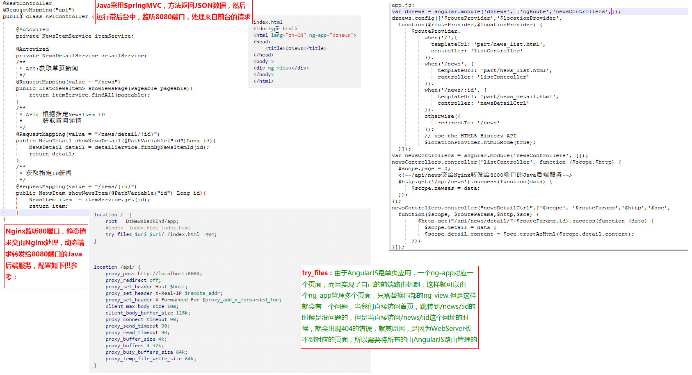

==============================前后端分离，请不要误读==============================
## 交互形式

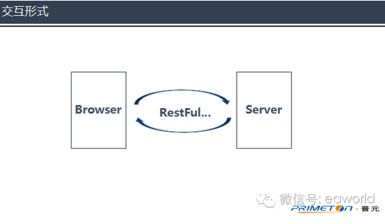
在前后端分离架构中，后端只需要负责按照约定的数据格式向前端提供可调用的API服务即可。前后端之间通过HTTP请求进行交互，前端获取到数据后，进行页面的装配和渲染。
## 代码组织方式

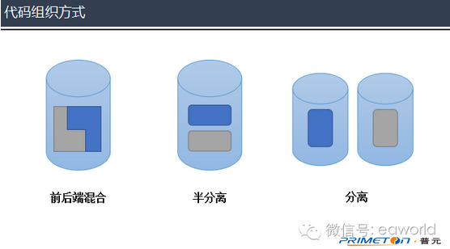

在传统架构模式中，前后端代码存放于同一个代码库中，甚至是同一工程目录下。页面中还夹杂着后端代码。前后端工程师进行开发时，都必须把整个项目导入到开发工具中。

而前后端分离模式在代码组织形式上有以下两种：

半分离

前后端共用一个代码库，但是代码分别存放在两个工程中。后端不关心或很少关心前端元素的输出情况，前端不能独立进行开发和测试，项目中缺乏前后端交互的测试用例。

分离

前后端代码库分离，前端代码中有可以进行Mock测试（通过构造虚拟测试对象以简化测试环境的方法）的伪后端，能支持前端的独立开发和测试。而后端代码中除了功能实现外，还有着详细的测试用例，以保证API的可用性，降低集成风险。

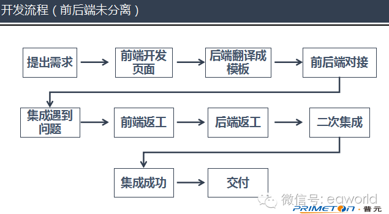

在前后端分离架构中，前端工程师只需要编写HTML、js、CSS等前端资源，然后通过HTTP请求调用后端提供的服务即可。除了开发期的分离，在运行期前后端资源也会进行分离部署。

前后端分离之后，开发流程将如下图所示。

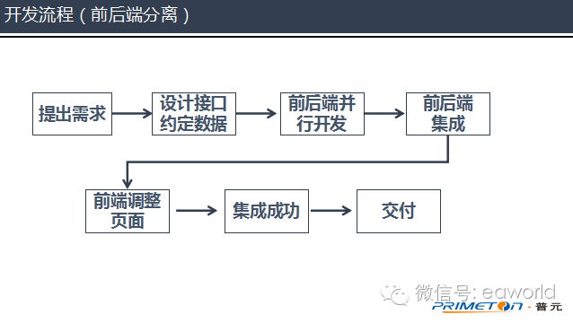

通过上面的两幅流程图，不难发现，在开发模式上，前后段分离不仅仅只是工程师的分工开发，更重要的意义在于实现了前后端的并行开发，和简化了开发流程。

## 分离部署方案浅析

目前业内较为常用的前后端分离部署方案有如下几种

> Nginx+Server

将前端资源部署在Nginx上，后端服务部署在常规的服务器。当浏览器发起访问请求的时候，如果请求的是页面资源，Nginx直接把资源返回到前端；如果请求是调用后端服务，则经过Nginx转发到后端服务器，完成响应后经Nginx返回到浏览器。

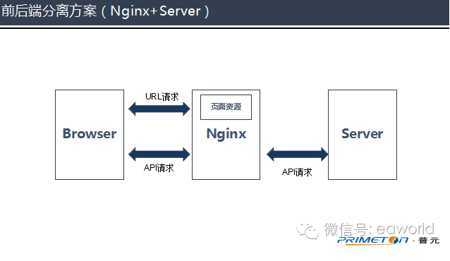

这个方案比较简单，易于实现，而且能达到前后端解耦的目的。

但是对于页面量比较大，需要有良好SEO的应用来说，此方案缺点也较为明显。因为Nginx只是向浏览器返回页面静态资源，而国内的搜索引擎爬虫只会抓取静态数据，不会解析页面中的js，这使得应用得不到良好的搜索引擎支持。同时因为Nginx不会进行页面的组装渲染，需要把静态页面返回到浏览器，然后完成渲染工作，这加重了浏览器的渲染负担。

> Node+Server

这是淘宝所使用的前后端分离模式，在浏览器与后端服务器之间增加一个了Node Server作为中间层，将前端资源部署到Node Server中。Node Server中还包含了一层Model Proxy，负责与服务端进行通信。

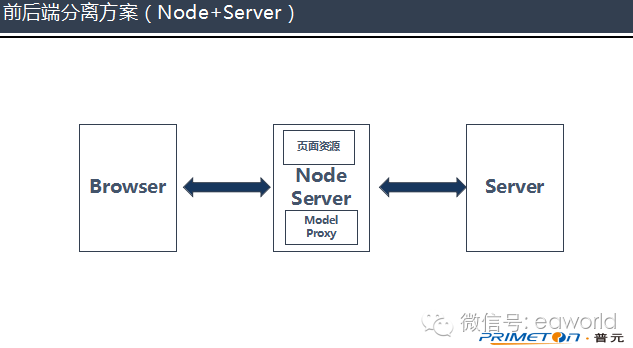

浏览器发出的请求都被Node Server接收，然后通过Model Proxy调用后端服务器提供的服务。Node Server得到后端服务器反馈，接着在Node Server中完成页面的组装渲染，把最终页面返回给浏览器。

如此一来不仅达到了前后端解耦的目的，还解决了浏览器渲染负担过重的问题，为SEO提供了比较好的支持。

但在这样的模式中，浏览器所有发出的请求都需要经过Node Server进行中转，然后才能到达后端服务器。在实际的应用中，并不是所有的请求都需要页面渲染，只要在页面上直接调用后端服务器提供的服务即可。所以这个模式必然会对请求性能有所消耗

> Nginx+Node+Server

为了能解决方案2中请求性能损失的问题，我们可以考虑在其基础之上增加Nginx。浏览器发起的请求经过Nginx进行分发，URL请求统一分发到Node Server，在Node Server中进行页面组装渲染；API请求则直接发送到后端服务器，完成响应。

目前在已经有一个名为Goku的Go语言框架提供了这样的前后端分离解决方案。

通过对三种前后端分离方案的对比可以看出：

如果是企业级应用，不需要考虑对SEO的支持，浏览器渲染也可以忽略不计，Nginx+Server的模式无疑是最好的选择，实施成本相对来说比较低；

如果是互联网应用，需要有良好的SEO支持，页面渲染工作量大，那应该选择Nginx+Node+Server的方案，各个方面都能得到比较好的兼顾。

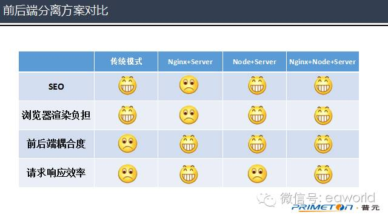


## 认识REST --面向资源

Rest是一个“无状态”的架构模式，因为在任何时候都可以由客户端发出请求到服务端，最终返回自己想要的数据，当前请求不会受到上次请求的影响。也就是说，服务端将内部资源发布REST服务，客户端通过URL来访问这些资源，这不就是SOA所提倡的“面向服务”的思想吗？所以，REST也被人们看做是一种“轻量级”的SOA实现技术，因此在企业级应用与互联网应用中都得到了广泛应用。

**REST请求类型：**

1) get
2) post
3) put
4) delete
5) head
6) options

前四种正好是<font size=4 color=#D9534F>CRUD(Create-Retrieve-Update-Delete,增删改查)</font>

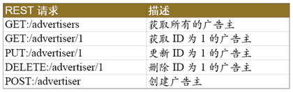

### 实现REST框架

1) 统一响应结构

使用REST框架实现前后端分离架构，我们需要首先确定返回的JSON响应结构是统一的，也就是说，每个REST请求将返回相同结构的JSON响应结构。不妨定义一个相对通用的JSON响应结构，其中包含两部分：元数据与返回值，其中，元数据表示操作是否成功与返回值消息等，返回值对应服务端方法所返回的数据。该JSON响应结构如下：

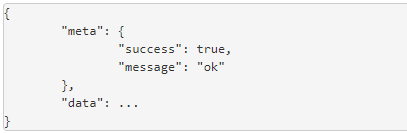

为了在框架中映射以上JSON响应结构，我们需要编写一个Response类与其对应：
```java
public class Response {  
  
    private static final String OK = "ok";  
    private static final String ERROR = "error";  
  
    private Meta meta;  
    private Object data;  
  
    public Response success() {  
        this.meta = new Meta(true, OK);  
        return this;  
    }  
  
    public Response success(Object data) {  
        this.meta = new Meta(true, OK);  
        this.data = data;  
        return this;  
    }  
  
    public Response failure() {  
        this.meta = new Meta(false, ERROR);  
        return this;  
    }  
  
    public Response failure(String message) {  
        this.meta = new Meta(false, message);  
        return this;  
    }  
  
    public Meta getMeta() {  
        return meta;  
    }  
  
    public Object getData() {  
        return data;  
    }  
  
    public class Meta {  
  
        private boolean success;  
        private String message;  
  
        public Meta(boolean success) {  
            this.success = success;  
        }  
  
        public Meta(boolean success, String message) {  
            this.success = success;  
            this.message = message;  
        }  
  
        public boolean isSuccess() {  
            return success;  
        }  
  
        public String getMessage() {  
            return message;  
        }  
    }  
}  
```

以上Response类包括两类通用返回值消息：ok与error，还包括两个常用的操作方法：success( )与failure( )，通过一个内部类来展现元数据结构，我们在下文中多次会使用该Response类。
实现该REST框架需要考虑许多问题，首当其冲的就是对象序列化问题。

2) 实现对象序列化

想要解释什么是对象序列化？不妨通过一些例子进行说明。比如，通过浏览器发送了一个普通的HTTP请求，该请求携带了一个JSON格式的参数，在服务端需要将该JSON参数转换为普通的Java对象，这个转换过程称为序列化。再比如，在服务端获取了数据，此时该数据是一个普通的Java对象，然后需要将这个Java对象转换为JSON字符串，并将其返回到浏览器中进行渲染，这个转换过程称为反序列化。不管是序列化还是反序列化，我们一般都称为序列化。

实际上，Spring MVC已经为我们提供了这类序列化特性，只需在Controller的方法参数中使用@RequestBody注解定义需要反序列化的参数即可，如以下代码片段：

```java
@Controller  
public class AdvertiserController {  
  
    @RequestMapping(value = "/advertiser", method = RequestMethod.POST)  
    public Response createAdvertiser(@RequestBody AdvertiserParam advertiserParam) {  
        ...  
    }  
}  
```

若需要对Controller的方法返回值进行序列化，则需要在该返回值上使用@ResponseBody注解来定义，如以下代码片段：

```java
@Controller  
public class AdvertiserController {  
  
    @RequestMapping(value = "/advertiser/{id}", method = RequestMethod.GET)  
    public @ResponseBody Response getAdvertiser(@PathVariable("id") String advertiserId) {  
        ...  
    }  
}  
```
当然，@ResponseBody注解也可以定义在类上，这样所有的方法都继承了该特性。由于经常会使用到@ResponseBody注解，所以Spring提供了一个名为@RestController的注解来取代以上的@Controller注解，这样我们就可以省略返回值前面的@ResponseBody注解了，但参数前面的@RequestBody注解是无法省略的。实际上，看看Spring中对应@RestController注解的源码便可知晓：

```java
@Target({ElementType.TYPE})  
@Retention(RetentionPolicy.RUNTIME)  
@Documented  
@Controller  
@ResponseBody  
public @interface RestController {  
  
    String value() default "";  
}  
```

可见，@RestController注解已经被@Controller与@ResponseBody注解定义过了，Spring框架会识别这类注解。需要注意的是，该特性在Spring 4.0中才引入。

因此，我们可将以上代码进行如下改写：

```java
@RestController  
public class AdvertiserController {  
  
    @RequestMapping(value = "/advertiser", method = RequestMethod.POST)  
    public Response createAdvertiser(@RequestBody AdvertiserParam advertiserParam) {  
        ...  
    }  
  
    @RequestMapping(value = "/advertiser/{id}", method = RequestMethod.GET)  
    public Response getAdvertiser(@PathVariable("id") String advertiserId) {  
        ...  
    }  
}  
```

除了使用注解来定义序列化行为以外，我们还需要使用Jackson来提供JSON的序列化操作，在Spring配置文件中只需添加以下配置即可：

```xml
<mvc:annotation-driven>  
    <mvc:message-converters>  
        <bean class="org.springframework.http.converter.json.MappingJackson2HttpMessageConverter"/>  
    </mvc:message-converters>  
</mvc:annotation-driven>  
```

若需要对Jackson的序列化行为进行定制，比如，排除值为空属性、进行缩进输出、将驼峰转为下划线、进行日期格式化等，这又如何实现呢？

首先，我们需要扩展Jackson提供的ObjectMapper类，代码如下：

```java
public class CustomObjectMapper extends ObjectMapper {  
  
    private boolean camelCaseToLowerCaseWithUnderscores = false;  
    private String dateFormatPattern;  
  
    public void setCamelCaseToLowerCaseWithUnderscores(boolean camelCaseToLowerCaseWithUnderscores) {  
        this.camelCaseToLowerCaseWithUnderscores = camelCaseToLowerCaseWithUnderscores;  
    }  
  
    public void setDateFormatPattern(String dateFormatPattern) {  
        this.dateFormatPattern = dateFormatPattern;  
    }  
  
    public void init() {  
        // 排除值为空属性  
        setSerializationInclusion(JsonInclude.Include.NON_NULL);  
        // 进行缩进输出  
        configure(SerializationFeature.INDENT_OUTPUT, true);  
        // 将驼峰转为下划线  
        if (camelCaseToLowerCaseWithUnderscores) {  
            setPropertyNamingStrategy(PropertyNamingStrategy.CAMEL_CASE_TO_LOWER_CASE_WITH_UNDERSCORES);  
        }  
        // 进行日期格式化  
        if (StringUtil.isNotEmpty(dateFormatPattern)) {  
            DateFormat dateFormat = new SimpleDateFormat(dateFormatPattern);  
            setDateFormat(dateFormat);  
        }  
    }  
}  
```

然后，将CustomObjectMapper注入到MappingJackson2HttpMessageConverter中，Spring配置如下：

```xml
<bean id="objectMapper" class="com.xxx.api.json.CustomObjectMapper" init-method="init">  
    <property name="camelCaseToLowerCaseWithUnderscores" value="true"/>  
    <property name="dateFormatPattern" value="yyyy-MM-dd HH:mm:ss"/>  
</bean>  
  
<mvc:annotation-driven>  
    <mvc:message-converters>  
        <bean class="org.springframework.http.converter.json.MappingJackson2HttpMessageConverter">  
            <property name="objectMapper" ref="objectMapper"/>  
        </bean>  
    </mvc:message-converters>  
</mvc:annotation-driven>  
```

通过以上过程，我们已经完成了一个基于Spring MVC的REST框架，只不过该框架还非常单薄，还缺乏很多关键性特性，尤其是异常处理。

3) 处理异常行为

在Spring MVC中，我们可以使用AOP技术，编写一个全局的异常处理切面类，用它来统一处理所有的异常行为，在Spring 3.2中才开始提供。使用法很简单，只需定义一个类，并通过@ControllerAdvice注解将其标注即可，同时需要使用@ResponseBody注解表示返回值可序列化为JSON字符串。代码如下：

```java
@ControllerAdvice  
@ResponseBody  
public class ExceptionAdvice {  
  
    /** 
     * 400 - Bad Request 
     */  
    @ResponseStatus(HttpStatus.BAD_REQUEST)  
    @ExceptionHandler(HttpMessageNotReadableException.class)  
    public Response handleHttpMessageNotReadableException(HttpMessageNotReadableException e) {  
        logger.error("参数解析失败", e);  
        return new Response().failure("could_not_read_json");  
    }  
  
    /** 
     * 405 - Method Not Allowed 
     */  
    @ResponseStatus(HttpStatus.METHOD_NOT_ALLOWED)  
    @ExceptionHandler(HttpRequestMethodNotSupportedException.class)  
    public Response handleHttpRequestMethodNotSupportedException(HttpRequestMethodNotSupportedException e) {  
        logger.error("不支持当前请求方法", e);  
        return new Response().failure("request_method_not_supported");  
    }  
  
    /** 
     * 415 - Unsupported Media Type 
     */  
    @ResponseStatus(HttpStatus.UNSUPPORTED_MEDIA_TYPE)  
    @ExceptionHandler(HttpMediaTypeNotSupportedException.class)  
    public Response handleHttpMediaTypeNotSupportedException(Exception e) {  
        logger.error("不支持当前媒体类型", e);  
        return new Response().failure("content_type_not_supported");  
    }  
  
    /** 
     * 500 - Internal Server Error 
     */  
    @ResponseStatus(HttpStatus.INTERNAL_SERVER_ERROR)  
    @ExceptionHandler(Exception.class)  
    public Response handleException(Exception e) {  
        logger.error("服务运行异常", e);  
        return new Response().failure(e.getMessage());  
    }  
}  
```

可见，在ExceptionAdvice类中包含一系列的异常处理方法，每个方法都通过@ResponseStatus注解定义了响应状态码，此外还通过@ExceptionHandler注解指定了具体需要拦截的异常类。以上过程只是包含了一部分的异常情况，若需处理其它异常，可添加方法具体的方法。需要注意的是，在运行时从上往下依次调用每个异常处理方法，匹配当前异常类型是否与@ExceptionHandler注解所定义的异常相匹配，若匹配，则执行该方法，同时忽略后续所有的异常处理方法，最终会返回经JSON序列化后的Response对象。

4) 支持参数验证

我们回到上文所提到的示例，这里处理一个普通的POST请求，代码如下：

```java
@RestController  
public class AdvertiserController {  
  
    @RequestMapping(value = "/advertiser", method = RequestMethod.POST)  
    public Response createAdvertiser(@RequestBody AdvertiserParam advertiserParam) {  
        ...  
    }  
}  
```

其中，AdvertiserParam参数包含若干属性，通过以下类结构可见，它是一个传统的POJO：

```java
public class AdvertiserParam {  
  
    private String advertiserName;  
      
    private String description;  
  
    // 省略 getter/setter 方法  
}  
```
如果业务上需要确保AdvertiserParam对象的advertiserName属性必填，如何实现呢？

若将这类参数验证的代码写死在Controller中，势必会与正常的业务逻辑搅在一起，导致责任不够单一，违背于“单一责任原则”。建议将其参数验证行为从Controller中剥离出来，放到另外的类中，这里仅提供一个@Valid注解来定义AdvertiserParam参数，并在AdvertiserParam类中通过@NotEmpty注解来定义advertiserName属性，就像下面这样：

```java
@RestController  
public class AdvertiserController {  
  
    @RequestMapping(value = "/advertiser", method = RequestMethod.POST)  
    public Response createAdvertiser(@RequestBody @Valid AdvertiserParam advertiserParam) {  
        ...  
    }  
}  
  
public class AdvertiserParam {  
  
    @NotEmpty  
    private String advertiserName;  
      
    private String description;  
  
    // 省略 getter/setter 方法  
}  
```

这里的@Valid注解实际上是Validation Bean规范提供的注解，该规范已由Hibernate Validator框架实现，因此需要添加以下Maven依赖到pom.xml文件中：

```xml
<dependency>  
    <groupId>org.hibernate</groupId>  
    <artifactId>hibernate-validator</artifactId>  
    <version>${hibernate-validator.version}</version>  
</dependency> 
```

需要注意的是，Hibernate Validator与Hibernate没有任何依赖关系，唯一有联系的只是都属于JBoss公司的开源项目而已。

要实现@NotEmpty注解的功能，我们需要做以下几件事情。

首先，定义一个@NotEmpty注解类，代码如下：

```java
@Documented  
@Target({ElementType.FIELD, ElementType.PARAMETER})  
@Retention(RetentionPolicy.RUNTIME)  
@Constraint(validatedBy = NotEmptyValidator.class)  
public @interface NotEmpty {  
  
    String message() default "not_empty";  
  
    Class<?>[] groups() default {};  
  
    Class<? extends Payload>[] payload() default {};  
}  
```

以上注解类必须包含message、groups、payload三个属性，因为这是规范所要求的，此外，需要通过@Constraint注解指定一个验证器类，这里对应的是NotEmptyValidator，其代码如下：

```java
public class NotEmptyValidator implements ConstraintValidator<NotEmpty, String> {  
  
    @Override  
    public void initialize(NotEmpty constraintAnnotation) {  
    }  
  
    @Override  
    public boolean isValid(String value, ConstraintValidatorContext context) {  
        return StringUtil.isNotEmpty(value);  
    }  
}  
```
以上验证器类实现了ConstraintValidator接口，并在该接口的isValid( )方法中完成了具体的参数验证逻辑。需要注意的是，实现接口时需要指定泛型，第一个参数表示验证注解类型（NotEmpty），第二个参数表示需要验证的参数类型（String）。

然后，我们需要在Spring配置文件中开启该特性，需添加如下配置：

```xml
<bean class="org.springframework.validation.beanvalidation.MethodValidationPostProcessor"/>  
```

最后，需要在全局异常处理类中添加参数验证处理方法，代码如下：

```java
@ControllerAdvice  
@ResponseBody  
public class ExceptionAdvice {  
  
    /** 
     * 400 - Bad Request 
     */  
    @ResponseStatus(HttpStatus.BAD_REQUEST)  
    @ExceptionHandler(ValidationException.class)  
    public Response handleValidationException(ValidationException e) {  
        logger.error("参数验证失败", e);  
        return new Response().failure("validation_exception");  
    }  
}  
```
至此，REST框架已集成了Bean Validation特性，我们可以使用各种注解来完成所需的参数验证行为了。

看似该框架可以在本地成功跑起来，整个架构包含两个应用，前端应用提供纯静态的HTML页面，后端应用发布REST API，前端需要通过AJAX调用后端发布的REST API，然而AJAX是不支持跨域访问的，也就是说，前后端两个应用必须在同一个域名下才能访问。这是非常严重的技术障碍，一定需要找到解决方案。

5) 解决跨域问题

比如，前端应用为静态站点且部署在http://web.xxx.com域下，后端应用发布REST API并部署在http://api.xxx.com域下，如何使前端应用通过AJAX跨域访问后端应用呢？这需要使用到CORS技术来实现，这也是目前最好的解决方案了。
[CORS全称为Cross Origin Resource Sharing（跨域资源共享），服务端只需添加相关响应头信息，即可实现客户端发出AJAX跨域请求。]

CORS技术非常简单，易于实现，目前绝大多数浏览器均已支持该技术（IE8浏览器也支持了），服务端可通过任何编程语言来实现，只要能将CORS响应头写入response对象中即可。

下面我们继续扩展REST框架，通过CORS技术实现AJAX跨域访问。

首先，我们需要编写一个Filter，用于过滤所有的HTTP请求，并将CORS响应头写入response对象中，代码如下：

```java
public class CorsFilter implements Filter {  
  
    private String allowOrigin;  
    private String allowMethods;  
    private String allowCredentials;  
    private String allowHeaders;  
    private String exposeHeaders;  
  
    @Override  
    public void init(FilterConfig filterConfig) throws ServletException {  
        allowOrigin = filterConfig.getInitParameter("allowOrigin");  
        allowMethods = filterConfig.getInitParameter("allowMethods");  
        allowCredentials = filterConfig.getInitParameter("allowCredentials");  
        allowHeaders = filterConfig.getInitParameter("allowHeaders");  
        exposeHeaders = filterConfig.getInitParameter("exposeHeaders");  
    }  
  
    @Override  
    public void doFilter(ServletRequest req, ServletResponse res, FilterChain chain) throws IOException, ServletException {  
        HttpServletRequest request = (HttpServletRequest) req;  
        HttpServletResponse response = (HttpServletResponse) res;  
        if (StringUtil.isNotEmpty(allowOrigin)) {  
            List<String> allowOriginList = Arrays.asList(allowOrigin.split(","));  
            if (CollectionUtil.isNotEmpty(allowOriginList)) {  
                String currentOrigin = request.getHeader("Origin");  
                if (allowOriginList.contains(currentOrigin)) {  
                    response.setHeader("Access-Control-Allow-Origin", currentOrigin);  
                }  
            }  
        }  
        if (StringUtil.isNotEmpty(allowMethods)) {  
            response.setHeader("Access-Control-Allow-Methods", allowMethods);  
        }  
        if (StringUtil.isNotEmpty(allowCredentials)) {  
            response.setHeader("Access-Control-Allow-Credentials", allowCredentials);  
        }  
        if (StringUtil.isNotEmpty(allowHeaders)) {  
            response.setHeader("Access-Control-Allow-Headers", allowHeaders);  
        }  
        if (StringUtil.isNotEmpty(exposeHeaders)) {  
            response.setHeader("Access-Control-Expose-Headers", exposeHeaders);  
        }  
        chain.doFilter(req, res);  
    }  
  
    @Override  
    public void destroy() {  
    }  
}  
```

以上CorsFilter将从web.xml中读取相关Filter初始化参数，并将在处理HTTP请求时将这些参数写入对应的CORS响应头中，下面大致描述一下这些CORS响应头的意义：
+ Access-Control-Allow-Origin：允许访问的客户端域名，例如：http://web.xxx.com，若为*，则表示从任意域都能访问，即不做任何限制。
+ Access-Control-Allow-Methods：允许访问的方法名，多个方法名用逗号分割，例如：GET,POST,PUT,DELETE,OPTIONS。
+ Access-Control-Allow-Credentials：是否允许请求带有验证信息，若要获取客户端域下的cookie时，需要将其设置为true。
+ Access-Control-Allow-Headers：允许服务端访问的客户端请求头，多个请求头用逗号分割，例如：Content-Type。
+ Access-Control-Expose-Headers：允许客户端访问的服务端响应头，多个响应头用逗号分割。

需要注意的是，CORS规范中定义Access-Control-Allow-Origin只允许两种取值，要么为*，要么为具体的域名，也就是说，不支持同时配置多个域名。为了解决跨多个域的问题，需要在代码中做一些处理，这里将Filter初始化参数作为一个域名的集合（用逗号分隔），只需从当前请求中获取Origin请求头，就知道是从哪个域中发出的请求，若该请求在以上允许的域名集合中，则将其放入Access-Control-Allow-Origin响应头，这样跨多个域的问题就轻松解决了。
以下是web.xml中配置CorsFilter的方法：

```xml
<filter>  
    <filter-name>corsFilter</filter-name>  
    <filter-class>com.xxx.api.cors.CorsFilter</filter-class>  
    <init-param>  
        <param-name>allowOrigin</param-name>  
        <param-value>http://web.xxx.com</param-value>  
    </init-param>  
    <init-param>  
        <param-name>allowMethods</param-name>  
        <param-value>GET,POST,PUT,DELETE,OPTIONS</param-value>  
    </init-param>  
    <init-param>  
        <param-name>allowCredentials</param-name>  
        <param-value>true</param-value>  
    </init-param>  
    <init-param>  
        <param-name>allowHeaders</param-name>  
        <param-value>Content-Type</param-value>  
    </init-param>  
</filter>  
<filter-mapping>  
    <filter-name>corsFilter</filter-name>  
    <url-pattern>/*</url-pattern>  
</filter-mapping>  
```

完成以上过程即可实现AJAX跨域功能了，但似乎还存在另外一个问题，由于REST是无状态的，后端应用发布的REST API可在用户未登录的情况下被任意调用，这显然是不安全的，如何解决这个问题呢？我们需要为REST请求提供安全机制。

6) 提供安全机制

解决REST安全调用问题，可以做得很复杂，也可以做得特简单，可按照以下过程提供REST安全机制：
 1) 当用户登录成功后，在服务端生成一个token，并将其放入内存中（可放入JVM或Redis中），同时将该token返回到客户端。
2) 在客户端中将返回的token写入cookie中，并且每次请求时都将token随请求头一起发送到服务端。
3) 提供一个AOP切面，用于拦截所有的Controller方法，在切面中判断token的有效性。
4) 当登出时，只需清理掉cookie中的token即可，服务端token可设置过期时间，使其自行移除。

首先，我们需要定义一个用于管理token的接口，包括创建token与检查token有效性的功能。代码如下：

```java
public interface TokenManager {  
  
    String createToken(String username);  
  
    boolean checkToken(String token);  
}  
```

然后，我们可提供一个简单的TokenManager实现类，将token存储到JVM内存中。代码如下：

```java
public class DefaultTokenManager implements TokenManager {  
  
    private static Map<String, String> tokenMap = new ConcurrentHashMap<>();  
  
    @Override  
    public String createToken(String username) {  
        String token = CodecUtil.createUUID();  
        tokenMap.put(token, username);  
        return token;  
    }  
  
    @Override  
    public boolean checkToken(String token) {  
        return !StringUtil.isEmpty(token) && tokenMap.containsKey(token);  
    }  
}  
```

需要注意的是，如果需要做到分布式集群，建议基于Redis提供一个实现类，将token存储到Redis中，并利用Redis与生俱来的特性，做到token的分布式一致性。

然后，我们可以基于Spring AOP写一个切面类，用于拦截Controller类的方法，并从请求头中获取token，最后对token有效性进行判断。代码如下：

```java
public class SecurityAspect {  
  
    private static final String DEFAULT_TOKEN_NAME = "X-Token";  
  
    private TokenManager tokenManager;  
    private String tokenName;  
  
    public void setTokenManager(TokenManager tokenManager) {  
        this.tokenManager = tokenManager;  
    }  
  
    public void setTokenName(String tokenName) {  
        if (StringUtil.isEmpty(tokenName)) {  
            tokenName = DEFAULT_TOKEN_NAME;  
        }  
        this.tokenName = tokenName;  
    }  
  
    public Object execute(ProceedingJoinPoint pjp) throws Throwable {  
        // 从切点上获取目标方法  
        MethodSignature methodSignature = (MethodSignature) pjp.getSignature();  
        Method method = methodSignature.getMethod();  
        // 若目标方法忽略了安全性检查，则直接调用目标方法  
        if (method.isAnnotationPresent(IgnoreSecurity.class)) {  
            return pjp.proceed();  
        }  
        // 从 request header 中获取当前 token  
        String token = WebContext.getRequest().getHeader(tokenName);  
        // 检查 token 有效性  
        if (!tokenManager.checkToken(token)) {  
            String message = String.format("token [%s] is invalid", token);  
            throw new TokenException(message);  
        }  
        // 调用目标方法  
        return pjp.proceed();  
    }  
}  
```

若要使SecurityAspect生效，则需要添加如下Spring 配置：

```xml
<bean id="securityAspect" class="com.xxx.api.security.SecurityAspect">  
    <property name="tokenManager" ref="tokenManager"/>  
    <property name="tokenName" value="X-Token"/>  
</bean>  
  
<aop:config>  
    <aop:aspect ref="securityAspect">  
        <aop:around method="execute" pointcut="@annotation(org.springframework.web.bind.annotation.RequestMapping)"/>  
    </aop:aspect>  
</aop:config>  
```

最后，别忘了在web.xml中添加允许的X-Token响应头，配置如下：

```xml
<init-param>  
    <param-name>allowHeaders</param-name>  
    <param-value>Content-Type,X-Token</param-value>  
</init-param>  
```

# 前后端分离的实战---带来的挑战

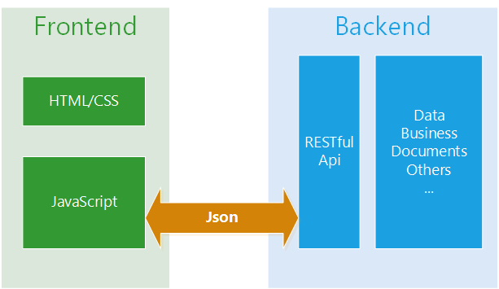

+ 后端负责
    + 提供接口
    + 封装业务逻辑
    + 维护数据
+ 前端负责
    + 用户交互，渲染界面
    + 转发数据，串接服务
    + 路由设计，控制逻辑

<font color=red size=5>前后端分离给权限管理带来的挑战</font>

1) 前端要控制页面的跳转和渲染

- 在一个页面中，用户只能看到其权限相关的组件和菜单项。
- 依照用户的权限对用户的路由跳转加以控制，当前用户无权访问的url不能暴露给用户。
- 要避免用户可以访问界面，在调用后端接口时却返回无权限的情况。

2) 后端要控制每一个接口的访问权限

- 用户登录系统需要认证和授权
- 每一个接口的访问都应该有相应的权限控制
- 保持用户的认证和授权状态
- 单点登录

3) 前后端交互

- 前端调用后端接口要携带权限信息
- 后端要对前端请求进行权限验证

<font color=red size=5>权限粒度的设计</font>

延伸：

```
我们为什么要区分用户权限的粒度?

- 在不同的应用场景中，我们需要要对用户进行不同粒度的权限控制，如:

    1) 我们要区分对不同种类资源的权限。对于User和Job这两种不同资源的操作显然需要不同的权限
   
    2) 我们要区分对同一种类不同实体资源的权限。对于Project1和Project2这两个不同的实体，需要加以不同的权限控制

    3) 我们要区分对同一种类同一实体不同操作（读、删、改、创）的权限。对于Project这一种资源类型，创建操作（Post）和读操作（Read）需要不同的权限；对于同一个实体，更新操作（Put）和读操作（Read）也需要不同的权限

- 批量控制权限

    1)我们需要对于权限进行批量的操作。想象这样一种应用场景，你是QQ的不锈钢贵族，你拥有10个不同的权限，同样的不锈钢贵族还有很多。难道QQ对每一个不锈钢贵族的用户都要维护其与10个权限的关联关系么，显然不是这样。这样会造成一定的数据冗余，因为每一个不锈钢贵族与权限的关联关系都是相同的，没有必要维护多次，冗余度会随着不锈钢贵族对应的权限数量的增长而变得更加严重；除此之外，还会对用户的授权和撤权造成一定的麻烦。

    2)因此我们需要引入Role（角色）的概念，Role与Permission建立关联，User再与Role建立关联。

```

综上，有关权限管理，共需要三种Entity(User、Role、Permission)

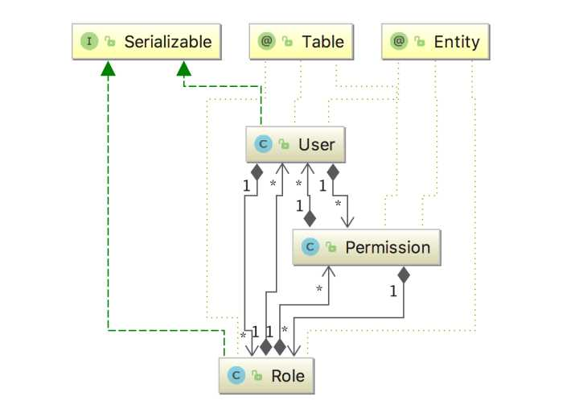

+ User 和 Role、Permission均是多对多的关系
    + User可以拥有多种 Role，一个Role也可以赋给多个用户
    + User可以拥有多种Permission，一个Permission可以赋给多个用户

+ Role 和 Permission之间是多对多的关系
    + Role可以拥有多个Permission，一个Permission也可以赋给多种Role

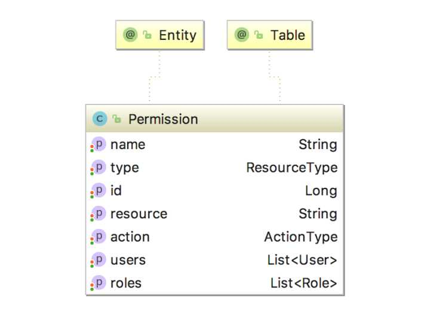

+ Permission的设计
    + type：资源的类型
    + id：特定资源的实体id
    + action：操作类型（GET，DELETE，PUT，POST）
    + resource：type:id，如Project:1
    + name：resource:action，如Project:1:GET，表示对id为1的Project的读权限；Job:Post，表示创建Job 的权限。

<font color=red size=5>如何认证授权 --- 基于shiro的后端认证和鉴权</font>

**对于访问后端服务器的所有请求，都要进行认证和鉴权** 
 + 认证：当前用户是否登录，是否为系统的合法用户
 + 鉴权：当前用户是否具有调用当前接口的权限

**对于登录到系统的用户，首先要进行认证和授权。**
 + 根据用户输入的用户名密码进行身份验证
 + 查找该用户所具有的Role和Permission，并将其赋给当前用户

 ```java
 protected AuthorizationInfo doGetAuthorizationInfo(PrincipalCollection principalCollection) {
      //获取当前用户 UserDto user = (UserDto) SecurityUtils.getSubject().getSession().getAttribute("user");

      //把principals放session中，key=userId value=principals SecurityUtils.getSubject().getSession().setAttribute(String.valueOf(user.getId()),SecurityUtils.getSubject().getPrincipals());

      SimpleAuthorizationInfo info = new SimpleAuthorizationInfo();
      //赋予角色 for(RoleDto role:user.getRoles()){
          info.addRole(role.getName());
      }
      //赋予权限 for(PermissionDto permission:user.getPermissions()){
          //System.out.println(permission.getName());
          info.addStringPermission(permission.getName());
      }
      return info;
  }

  @Override protected AuthenticationInfo doGetAuthenticationInfo(AuthenticationToken authenticationToken) throws AuthenticationException {
      UsernamePasswordToken token = (UsernamePasswordToken) authenticationToken;
      String userName = token.getUsername();
      User user = userDao.findUserByUsername(userName);
      UserDto userDto = convertToDto(user);
      if(user != null){
          //登陆成功 Session session = SecurityUtils.getSubject().getSession();
          session.setAttribute("user",userDto);
                      return new SimpleAuthenticationInfo(
                  userName, //用户
                  user.getPassword(), //密码
                  getName() //realm name
          );
      } else {
          throw new UnknownAccountException();
      }
  }
 ```
 
**服务器要配置Filter链以进行认证和鉴权，对用户的访问和重定向等进行限制**

+ 证失败、鉴权失败如何重定向
+ 哪些接口需要哪些权限和角色才能够访问

```java
 @Bean(name = "shiroFilter")
  public ShiroFilterFactoryBean shiroFilterFactoryBean(){
      ShiroFilterFactoryBean shiroFilterFactoryBean = new ShiroFilterFactoryBean();
      shiroFilterFactoryBean.setSecurityManager(securityManager());

      Map<String, Filter> filters = new LinkedHashMap<String,Filter>();
      LogoutFilter logoutFilter = new LogoutFilter();
      logoutFilter.setRedirectUrl("/login");
      shiroFilterFactoryBean.setFilters(filters);
      shiroFilterFactoryBean.setLoginUrl("/notAuthc");

      Map<String,String> filterChainDefinitionManager = new LinkedHashMap<String,String>();
      filterChainDefinitionManager.put("/logout","logout");
      filterChainDefinitionManager.put("/userInfo","authc");
      filterChainDefinitionManager.put("/jobs/**","perms[WORDCOUNT:CREATE]");
      filterChainDefinitionManager.put("/admin/**","roles[Admin]");
      shiroFilterFactoryBean.setFilterChainDefinitionMap(filterChainDefinitionManager);

      shiroFilterFactoryBean.setSuccessUrl("/");
      shiroFilterFactoryBean.setUnauthorizedUrl("/notAuthz");
      return shiroFilterFactoryBean;
  }
```

一个用户访问后端接口的完整过程

<font color=#3DB922 size=4>登录请求 -> 认证 -> 授权 -> 访问接口 -> 认证、鉴权 -> 成功则允许调用(不成功则重定向请求到相应url)</font>


<font color=red size=5>用户登录状态的保持和单点登录 -- 带来的挑战</font>

+ 服务器应该对用户的登录状态有保持机制。即在用户登录成功之后的一段时间内，用户无需重复登录即可访问权限允许的接口
+ 在有多个应用服务器的情况下，用户的登录状态能够在多个互相信任的服务器之间共享（即单点登录）

**挑战**
+ Http请求是无状态的，协议对于事务处理没有记忆能力，人生只若初见
+ 多台硬件服务器之间的缓存无法共享
+ 用户的权限和角色信息如何体现在请求中

**解决方案**
+ 利用Session机制，浏览器端发送的请求携带一个SessionId
+ 将用户的权限和角色信息存储到session之中
+ Session缓存到Redis中，在服务器集群之间共享

