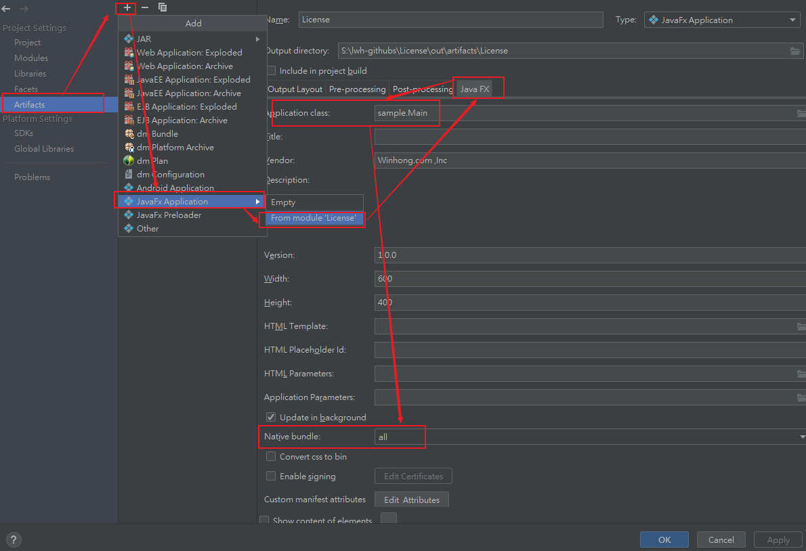

# JavaFX -- IntelliJ IDEA使用之JavaFX

富互联网应用是那些提供与Web应用程序类似的功能，并可作为桌面应用程序体验的应用。与用户的正常网络应用程序相比，它们提供更好的视觉体验。这些应用程序可作为浏览器插件或作为虚拟机提供，用于将传统静态应用程序转换为更加增强，流畅，动画和引人入胜的应用程序。

与传统的桌面应用程序不同，RIA不需要任何额外的软件来运行。作为替代需要安装一些软件，如：ActiveX，Java，Flash，这取决于应用程序使用的组件。

在RIA中，图形表示在客户端处理，因为它有一个丰富的图形提供支持的插件。 简而言之，RIA中的数据操作在服务器端执行，而相关对象操纵在客户端端执行。
有三个主要技术可使用于开发RIA。这些三个技术以下 -
+ Adobe Flash （这是开发和执行RIA的最常用平台，桌面浏览器渗透率为96％。）
+ Microsoft Silverlight （这个平台较少使用，用于桌面浏览器渗透率66％。）
+ JavaFX （JavaFX是一个Java库，可以使用它开发富互联网应用程序。通过使用Java技术，这些应用程序的浏览器渗透率为76％。）

## JavaFX是什么？

JavaFX 是用于构建富互联网应用程序的Java库。 使用此库编写的应用程序可以跨多个平台一致运行。使用JavaFX开发的应用程序可以在各种设备上运行，如台式计算机，手机，电视，平板电脑等。

要使用Java编程语言开发GUI应用程序，程序员依赖于诸如高级窗口工具包(AWT)和Swings之类的库。**在JavaFX出现之后，这些Java程序开发就可以有效地利用丰富的类库来开发GUI应用程序。**

### 需要JavaFX

- 要开发具有丰富特性的客户端应用程序，程序员过去依赖于各种库来添加诸如媒体，UI控件，Web，2D和3D等功能。JavaFX将所有这些功能包括在单个库中。除了这些，开发人员还可以访问Java库的现有功能，如：Swings。

- JavaFX提供了一组丰富的图形和媒体API，并通过硬件加速图形利用现代图形处理单元。JavaFX还提供了接口，开发人员可以使用它们组合图形动画和UI控件。

- 可以使用JavaFX和基于JVM的技术，如Java，Groovy和JRuby。 如果开发人员选择JavaFX，没有必要学习额外的技术，因为任何上述技术的先前知识将足以开发使用JavaFX的RIA。


### JavaFX的特性（重要特性）

+ 1、**使用Java语言编写**- JavaFX库都是用Java编写的，可用于在JVM上执行的语言，包括Java，Groovy和JRuby。这些JavaFX应用程序也是平台无关的。

+ 2、**FXML** - JavaFX采用称为FXML的语言，这是一种类似声明式标记语言的HTML。这种语言的唯一目的是定义用户界面。

+ 3、**Scene Builder** - JavaFX提供了一个名为Scene Builder(场景生成器)的应用程序。 在将此应用程序集成到IDE(如IDEA、Eclipse和NetBeans)中时，用户可以访问拖放设计界面，用于开发FXML应用程序(就像Swing Drag＆Drop和DreamWeaver应用程序一样)。

+ 4、**Swing互操作性** - 在JavaFX应用程序中，可以使用Swing Node类嵌入Swing内容。 同样，可以使用JavaFX功能(如嵌入式Web内容和丰富的图形媒体)更新现有的Swing应用程序。

+ 5、**内置UI控件** - JavaFX库UI控件使用它可以开发一个全功能的应用程序。

+ 6、**类似CSS的样式** - JavaFX提供像样式的CSS。 通过使用它，可以使用CSS的简单知识改进应用程序的设计。

+ 7、**画布和打印API** - JavaFX提供了Canvas，即时模式样式的渲染API。 在包`javafx.scene.canvas`中，它包含一组用于canvas的类，可以使用它们直接在JavaFX场景的一个区域内绘制。JavaFX还在`javafx.print`包中提供用于打印目的的类。

+ 8、**丰富的API集合** - JavaFX库提供了一组丰富的API来开发GUI应用程序，2D和3D图形等。这套API还包括Java平台的功能。因此，使用此API，可以访问Java语言的功能，如通用，注释，多线程和Lambda表达式。传统的Java集合库已增强，包括可观察列表和映射等概念。使用这些，用户可以观察数据模型中的更改。

+ 9、**集成图形库** - JavaFX为2d和3d图形提供类。

+ 10、**图形管道** - JavaFX支持基于硬件加速图形管道(称为Prism)的图形。 当与支持的图形卡或GPU一起使用时，它提供平滑的图形。 如果系统不支持图形卡，则棱镜默认为软件渲染堆栈。


**IntelliJ IDEA中的JavaFX支持包括JavaFX特定源文件（包括FXML和JavaFX CSS文件）中的代码完成、搜索、导航和重构、与JavaFX Scene Builder的集成，JavaFX应用程序打包功能等。**

## 为JavaFX开发创建项目

1、如果IntelliJ IDEA中当前未打开任何项目，请单击“欢迎”屏幕上的“创建新项目 ” 。否则，请选择：文件|新建|项目（File | New | Project）。因此，将打开“新建项目”向导。

2、在向导的第一页的左侧窗格中，选择JavaFX。
   - 在页面的右侧，指定要在项目中使用的SDK（JDK）。
   - 从列表中选择JDK，或单击“新建”，选择“JDK”并选择所需JDK的安装文件夹。
   - 请注意，应指定JDK版本7或更高版本。单击“下一步”。

3、指定项目名称和位置，然后单击“完成”。

**src文件夹用于源代码。在这个文件夹中，已经有一个名为sample的包，它包含三个文件：**
+ Main.java. 这是启动示例应用程序的主要应用程序类。
+ sample.fxml. 这是用于定义用户界面的FXML文件。
+ Controller.java. 这是用于处理用户与UI交互的控制器类。

## 在JavaFX Scene Builder中打开FXML文件

**在编辑器中打开FXML文件时，编辑区域下方有两个选项卡：**
+ Text（文本）。此选项卡用于开发标记。
+ Scene Builder（场景生成器）。 此选项卡用于在JavaFX Scene Builder中编辑文件 。（您应该使用Scene Builder 2.x版本）

如果尚未指定Scene Builder的路径，则使用文本“Please”配置JavaFX Scene Builder路径。
单击路径链接，然后在打开的对话框中选择Scene Builder可执行文件。
片刻之后，FXML文件将在Scence Builder中打开。

## 如何打包

使用IDEA打包JavaFX项目

1、在项目上按F4进入当前项目配置界面(shift+ctrl+alt+s)，在Artifact中点击+添加一个新的Artifact > JavaFX Application -> from module xxx

2、 配置新添加的对象来输出exe程序;选中新增的Artifact对象，找到JavaFX选项卡

3、选择程序的入口Application class

4、修改Native bundle为all

5、重新生成新的对象，重新生成对象,菜单中选择Build Artifacts...

6、找到新添加的 Artifact -> Rebuild



## fxml理解

使用的“FX”命名空间前缀。这是一个保留的前缀定义FXML源文件的内部处理使用的元素和属性的数量。
它一般是一个FXML文件的根元素声明。

**属性：**
```
	fx:id	
	fx:factory	
	fx:value
		例如：
        <FXCollections fx:id="lis" fx:factory="observableArrayList">
			    <String fx:value="A"/>
			    <String fx:value="B"/>
			    <String fx:value="C"/>
			</FXCollections>
	<fx:reference source="">
		元素的属性指定新元素将引用的对象的名称;
		source指定重新加载的值或者是先前的元素名重新加载；
		元素创建一个新的参考现有元素。无论在什么情况下，这个标签出现时，它会有效地命名的元素的值所取代。
		它是用来结合的FX：ID属性或脚本变量.
	<fx:copy>元素创建一个现有元素的副本 。<fx:reference>一样，它是用来与FX:id属性或脚本变量。
		元素的“source”属性指定将复制的对象的名称。源类型必须定义一个拷贝构造函数，
		将用于构建从源头值的副本。

目前，没有JavaFX平台的类提供了这样一个拷贝构造函数，所以这个元素主要用于提供应用程序开发人员使用。这可能会改变在未来的版本。
```

**标签：**

`<fx:include source="my_button.fxml"/>`

- 1、标签创建了一个从FXML标记在另一个文件中定义的对象 
- 2、还支持指定的资源束的名称应使用本地化包含的内容，以及使用的字符集编码的源文件的属性。


**资源引用：**

+ 1、引用变量：$
		<fx:define>
    			<ToggleGroup fx:id="myToggleGroup"/>
		</ FX：define>
	
		<RadioButton text="A" toggleGroup="$myToggleGroup"/>
		<RadioButton text="B" toggleGroup="$myToggleGroup"/>
		<RadioButton text="C" toggleGroup="$myToggleGroup"/>
+ 2、引用属性文件的值：%
+ 3、引用资源文件：@my_image.png
+ 4、表达式取值：

	`<TextField fx:id="textField"/>`
	`<Label text="${textField.text}"/>`

**脚本事件处理程序：**

```
<?language javascript?>
<VBox>
      <children>
      <Button text="Click Me!" 
            onAction="java.lang.System.out.println('You clicked me!');"/>
      </children>
</VBox>
```

**控制器方法的事件处理程序：**

- 标签绑定：
```
<VBox fx:controller="com.foo.MyController"
      xmlns:fx="http://javafx.com/fxml">
      <children>
            <Button text="Click Me!" onAction="#handleButtonAction"/>
      </children>
</VBox>
```

- 控制器类：
```
	package com.foo;
	public class MyController {
    		public void handleButtonAction(ActionEvent event) {
        		System.out.println("You clicked me!");
    		}
	}
```

- 直接写脚本：

```
	<?language javascript?>
	<?import javafx.scene.control.*?>
	<?import javafx.scene.layout.*?>

	<VBox xmlns:fx="http://javafx.com/fxml">
    		<fx:script>
    		importClass(java.lang.System);

    		function handleButtonAction(event) {
       			System.out.println('You clicked me!');
    		}
    		</fx:script>

    		<children>
        	<Button text="Click Me!" onAction="handleButtonAction(event);"/>
    	</children>
	</VBox>
```
- 导入脚本：
```
<?import javafx.scene.control.*?>
<?import javafx.scene.layout.*?>

<VBox xmlns:fx="http://javafx.com/fxml">
      <fx:script source="example.js"/>

      <children>
         <Button text="Click Me!" onAction="handleButtonAction(event);"/>
      </children>
</VBox>
```