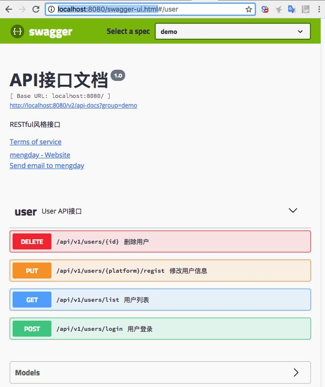
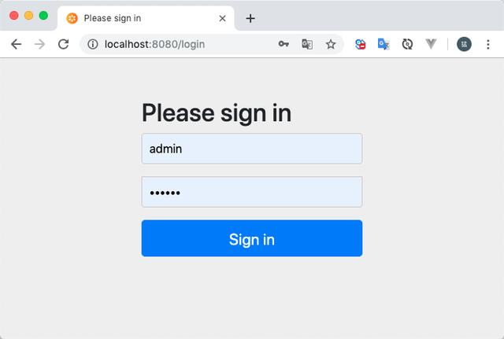
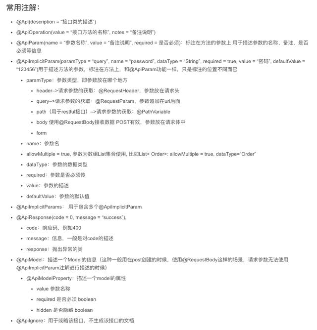
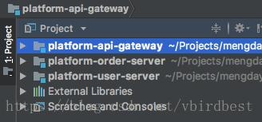
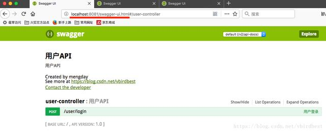
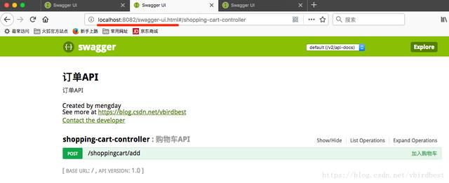

# 前后分离最详尽的Swagger2使用

前后端分离，前端和后端api沟通目前企业中几乎都是使用Swagger2。基本上工作中都会用到：
- Swagger2基本的集成
- 对Swagger2配置安全访问
- 聚合多个项目

1、添加入Swagger2的依赖

```xml
<dependency>
    <groupId>io.springfox</groupId>
    <artifactId>springfox-swagger2</artifactId>
    <version>2.8.0</version>
</dependency>
<dependency>
    <groupId>io.springfox</groupId>
    <artifactId>springfox-swagger-ui</artifactId>
    <version>2.8.0</version>
</dependency>
```

2、Swagger2Config

```java
@Configuration
@EnableSwagger2
public class Swagger2Config {
 @Bean
 public Docket docket() {
    return new Docket(DocumentationType.SWAGGER_2)
        .groupName("demo")
        .apiInfo(apiInfo())
        .select()
        // 设置basePackage会将包下的所有类的所有方法作为api
        // .apis(RequestHandlerSelectors.basePackage("com.example.demo2.controller"))
        // 只有标记@ApiOperation才会暴露出给swagger
        .apis(RequestHandlerSelectors.withMethodAnnotation(ApiOperation.class))
        .paths(PathSelectors.regex("/api/.*"))
        .build();
 }
 private ApiInfo apiInfo() {
    return new ApiInfoBuilder()
        .title("API接口文档")
        .description("RESTful风格接口")
        .termsOfServiceUrl("https://blog.csdn.net/vbirdbest") // 服务条款网址
        .version("1.0")
        .contact(new Contact("mengday", "httphttp://wwww.xxx.com", "xxx@gmail.com"))
        .build();
    }
}
```
3、UserController

```java
@RestController
@RequestMapping("/api/v1/users")
@Api(value = "User API接口", tags = "user", description = "User API接口")
public class UserController {

    @ApiOperation(value = "用户登录", notes = "用户登录接口")
    @ApiResponses({
    @ApiResponse(code = 0, message = "success"),
    @ApiResponse(code = 10001, message = "用户名错误", response = IllegalArgumentException.class),
    @ApiResponse(code = 10002, message = "密码错误")
    })
    @PostMapping(value = "/login")
    public String login(@ApiParam(name = "username", value = "用户名", required = true) @RequestParam String username,
    @ApiParam(name = "password", value = "密码", required = true) @RequestParam String password){
        return "{'username':'" + username + "', 'password':'" + password + "'}";
    }

    @ApiOperation(value = "修改用户信息", notes = "修改用户信息")
    @ApiImplicitParams({
    @ApiImplicitParam(dataTypeClass = String.class, paramType = "header", name = "phone", required = true, value = "手机号"),
    @ApiImplicitParam(dataTypeClass = String.class, paramType = "query", name = "nickname", required = true, value = "nickname", defaultValue = "双击666"),
    @ApiImplicitParam(dataTypeClass = String.class, paramType = "path", name = "platform", required = true, value = "平台", defaultValue = "PC"),
    @ApiImplicitParam(dataTypeClass = String.class, paramType = "body", name = "password", required = true, value = "密码")
    })
    @PutMapping(value = "/{platform}/regist")
    public String regist(@RequestHeader String phone, @RequestParam String nickname, @PathVariable String platform, @RequestBody String password){
        return "{'username':'" + phone + "', 'nickname':'" + nickname + "', 'platform': '" + platform + "', 'password':'"+password+"'}";
    }

    @ApiOperation(value = "用户列表", notes = "查询用户列表")
    @GetMapping(value = "/list")
    public String getUserList(PagerIDto pager){
        return "[{'id': "+pager.getPage()+", 'username': 'zhangsan"+pager.getSize()+"'}]";
    }
    @ApiOperation(value = "删除用户", notes = "删除用户")
    @DeleteMapping("/{id}")
    public String removeUser(@PathVariable Long id){
        return "success";
    }

    @ApiIgnore
    @RequestMapping("/ignoreApi")
    public String ignoreApi(){
        return "docs";
    }
}
```

4、启动应用程序并访问swagger-ui.html



5、为swagger-ui增加密码

- 5.1 pom.xml

```xml
<dependency>
 <groupId>org.springframework.boot</groupId>
 <artifactId>spring-boot-starter-security</artifactId>
</dependency>
```

- 5.2 application.yml

```
spring:
 security:
 basic:
 path: /swagger-ui.html
 enabled: true
 user:
 name: admin
 password: 123456
```

 - 5.3 WebSecurityConfigurerAdapter

```java
/**
 * Spring Security 会拦截swagger-ui.html 同样也会拦截api，这里将或略掉/api/下的所有子路径
 */
@EnableWebSecurity
@Configuration
public class CustomWebSecurityConfigurerAdapter extends WebSecurityConfigurerAdapter {
    @Override
    public void configure(WebSecurity web) throws Exception {
    super.configure(web);
    web.ignoring().antMatchers("/api/v1/**");
    }
}
```

 - 5.4 重启项目再次访问swagger-ui

 访问 `http://localhost:8080/swagger-ui.html` 会跳转到 `http://localhost:8080/login` 输入application.yml配置的用户名密码即可跳转到到swagger-ui.html





`apis(RequestHandlerSelectors.basePackage(“com.example.demo2.controller”))`   会将包下的所有Controller类带有`@RequestMapping`或者`XxxMapping`都会给暴露给swagger，如果想部分类暴露出去部分不暴露出去，只能将不暴露的controller放到其他package中，放在同一个package是做不到的。

`apis(RequestHandlerSelectors.withMethodAnnotation(ApiOperation.class))`:  只有在类上使用`@Api`注解标注并且在方法上使用`@ApiOperation`注解才会暴露给swagger，这种方式没有包名的限制，可以将需要暴露的接口分散到各个包里，只要类上有@Api注解方法上有`@ApiOperation`注解就能暴露出来，如果不想暴露出来就不用使用这两个注解。

6、swagger 聚合多个项目

现在的项目一般都是微服务，`swagger`可以做到将多个项目合并到一个`swagger`上，这样便于接口的使用。

对于低版本的swagger可以直接改造源码，swagger实现多项目api管理：`https://blog.csdn.net/liufei198613/article/details/78898789` 对于2.2.2版本可以直接改造源码`https://testerhome.com/topics/9427`高版本的可以通过`SwaggerResourcesProvider`来实现，具体步骤如下

本示例只使用了Spring Boot, 后面可以结合spring-cloud-zuul来使用。

首先准备两个api项目(`platform-user-server、platform-order-server`)，并且每个项目都配置好swagger，然后再使用一个聚合的api项目(`platform-api-gateway`)来聚合这两个api，这样只需查看聚合api上对应的swagger ui即可。



**一：platform-user-server**
 
 - 6.1 pom.xml

 ```xml
<dependency>
    <groupId>io.springfox</groupId>
    <artifactId>springfox-swagger2</artifactId>
    <version>2.6.1</version>
</dependency>
<dependency>
    <groupId>io.springfox</groupId>
    <artifactId>springfox-swagger-ui</artifactId>
    <version>2.6.1</version>
</dependency>
 ```

 - 6.2 application.properties 
```
server.port=8081
```

 - 6.3 Configuration 

```java
@Configuration
public class CORSConfiguration {
 @Bean
 public CorsFilter corsFilter() {
    UrlBasedCorsConfigurationSource source = new UrlBasedCorsConfigurationSource();
    CorsConfiguration corsConfiguration = new CorsConfiguration();
    // 1 设置访问源地址
    corsConfiguration.addAllowedOrigin("*");
    // 2 设置访问源请求头
    corsConfiguration.addAllowedHeader("*");
    // 3 设置访问源请求方法
    corsConfiguration.addAllowedMethod("*");
    // 4 对接口配置跨域设置
    source.registerCorsConfiguration("/**", corsConfiguration);
    return new CorsFilter(source);
 }
}

@Configuration
public class Swagger2Configuration {
 @Bean
 public Docket shopRestApi() {
    return new Docket(DocumentationType.SWAGGER_2)
        .apiInfo(apiInfo())
        .select()
        .apis(RequestHandlerSelectors.basePackage("com.example.platform.user"))
        .apis(RequestHandlerSelectors.withMethodAnnotation(ApiOperation.class))
        .paths(PathSelectors.any())
        .build();
 }

 private ApiInfo apiInfo() {
 Contact contact = new Contact("mengday", "https://blog.csdn.net/vbirdbest", "mengday.zhang@gmail.com");
    return new ApiInfoBuilder()
        .title("用户API")
        .description("用户API")
        .termsOfServiceUrl("http://localhost:8081/swagger-ui.html")
        .contact(contact)
        .version("1.0")
        .build();
 }
```

 - 6.4 Application

```java
@EnableSwagger2
@SpringBootApplication
public class PlatformUserServerApplication {
 public static void main(String[] args) {
    SpringApplication.run(PlatformUserServerApplication.class, args);
 }
}
``` 

 - 6.5 controller

```java
@RestController
@RequestMapping("/user")
@Api(description = "用户API")
public class UserController {

    @ApiOperation(value = "用户登录", notes = "用户登录", produces = MediaType.APPLICATION_JSON_UTF8_VALUE)
    @ApiImplicitParams({
    @ApiImplicitParam(name = "username", value = "用户名", required = true, paramType = "body", dataType = "String"),
    @ApiImplicitParam(name = "password", value = "密码", required = true, paramType = "body", dataType = "String")
    })
    @PostMapping("/login")
    public String login(String username, String password) {
        return "success";
    }
}
```

 - 6.6 访问swagger

 `http://localhost:8081/swagger-ui.html`

注意：swagger不要使用太高的版本，不建议使用2.8.0以上的版本，不然很可能会报如下错误，即使低版本也可能会报该错误。Chrome报错，遇到这个错误可以尝试清除缓存或者使用其他浏览器，这个问题很多人都遇到了，也没找到有效的解决方案，自己在测试的时候就一会好使，一会又不好使，祝你好运。



**二：platform-order-server**

 - 6.7 pom.xml

```xml
<dependency>
 <groupId>io.springfox</groupId>
 <artifactId>springfox-swagger2</artifactId>
 <version>2.6.1</version>
</dependency>
<dependency>
 <groupId>io.springfox</groupId>
 <artifactId>springfox-swagger-ui</artifactId>
 <version>2.6.1</version>
</dependency>
```

 - 6.8 application.properties
```
 server.port=8082
```

 - 6.9 Configuration

```java
@Configuration
public class CORSConfiguration {
 @Bean
 public CorsFilter corsFilter() {
    UrlBasedCorsConfigurationSource source = new UrlBasedCorsConfigurationSource();
    CorsConfiguration corsConfiguration = new CorsConfiguration();
    // 1 设置访问源地址
    corsConfiguration.addAllowedOrigin("*");
    // 2 设置访问源请求头
    corsConfiguration.addAllowedHeader("*");
    // 3 设置访问源请求方法
    corsConfiguration.addAllowedMethod("*");
    // 4 对接口配置跨域设置
    source.registerCorsConfiguration("/**", corsConfiguration);
    return new CorsFilter(source);
 }
}

@Configuration
public class Swagger2Configuration {
 @Bean
 public Docket shopRestApi() {
    return new Docket(DocumentationType.SWAGGER_2)
        .apiInfo(apiInfo())
        .select()
        .apis(RequestHandlerSelectors.basePackage("com.example.platform.order"))
        .apis(RequestHandlerSelectors.withMethodAnnotation(ApiOperation.class))
        .paths(PathSelectors.any())
        .build();
 }

 private ApiInfo apiInfo() {
    Contact contact = new Contact("mengday", "https://blog.csdn.net/vbirdbest", "mengday.zhang@gmail.com");
    return new ApiInfoBuilder()
    .title("订单API")
    .description("订单API")
    .termsOfServiceUrl("http://localhost:8082/swagger-ui.html")
    .contact(contact)
    .version("1.0")
    .build();
 }
}
```

 - 6.10 Application

```java
@EnableSwagger2
@SpringBootApplication
public class PlatformOrderServerApplication {
 public static void main(String[] args) {
    SpringApplication.run(PlatformOrderServerApplication.class, args);
 }
}
```

 - 6.11 controller

```java
@RestController
@RequestMapping("/shoppingcart")
@Api(description = "购物车API")
public class ShoppingCartController {
 @ApiOperation(value = "加入购物车", notes = "加入购物车", produces = MediaType.APPLICATION_JSON_UTF8_VALUE)
 @ApiImplicitParams({
 @ApiImplicitParam(name = "barcode", value = "条形码", required = true, paramType = "body", dataType = "String"),
 @ApiImplicitParam(name = "quantity", value = "数量", required = true, paramType = "body", dataType = "Integer")
 })
 @PostMapping("/add")
 public String addShoppingCart(String barcode, Integer quantity) {
    return "success";
 }
}
```

 - 6.12 访问swagger

 


**三：platform-api-gateway**

 - 6.13 pom.xml

```xml
<dependency>
 <groupId>io.springfox</groupId>
 <artifactId>springfox-swagger2</artifactId>
 <version>2.6.1</version>
</dependency>
<dependency>
 <groupId>io.springfox</groupId>
 <artifactId>springfox-swagger-ui</artifactId>
 <version>2.6.1</version>
</dependency>
```


 - 6.14 application.properties
```
server.port=8080
```

 - 6.15 Application

```java
@EnableSwagger2
@SpringBootApplication
public class PlatformApiGatewayApplication {
 public static void main(String[] args) {
 SpringApplication.run(PlatformApiGatewayApplication.class, args);
 }
}
```
 - 6.16 configuration

```java
@Configuration
public class CORSConfiguration {
 @Bean
 public CorsFilter corsFilter() {
    UrlBasedCorsConfigurationSource source = new UrlBasedCorsConfigurationSource();
    CorsConfiguration corsConfiguration = new CorsConfiguration();
    // 1 设置访问源地址
    corsConfiguration.addAllowedOrigin("*");
    // 2 设置访问源请求头
    corsConfiguration.addAllowedHeader("*");
    // 3 设置访问源请求方法
    corsConfiguration.addAllowedMethod("*");
    // 4 对接口配置跨域设置
    source.registerCorsConfiguration("/**", corsConfiguration);
    return new CorsFilter(source);
 }
}

@Configuration
public class SwaggerConfiguration {
 @Bean
 public Docket createRestApi() {
 return new Docket(DocumentationType.SWAGGER_2)
 .apiInfo(apiInfo());
 }
 private ApiInfo apiInfo() {
    Contact contact = new Contact("mengday", "https://blog.csdn.net/vbirdbest", "mengday.zhang@gmail.com");
    return new ApiInfoBuilder()
        .title("项目名称")
        .description("Swagger多项目聚合")
        .termsOfServiceUrl("http://localhost:8080")
        .contact(contact)
        .version("1.0")
        .build();
 }
}

@Component
@Primary
public class DocumentationConfiguration implements SwaggerResourcesProvider {
 @Override
 public List<SwaggerResource> get() {
    List resources = new ArrayList<>();
    resources.add(swaggerResource("用户API", "http://localhost:8081/v2/api-docs", "2.0"));
    resources.add(swaggerResource("购物车API", "http://localhost:8082/v2/api-docs", "2.0"));
    return resources;
 }

 private SwaggerResource swaggerResource(String name, String location, String version) {
    SwaggerResource swaggerResource = new SwaggerResource();
    swaggerResource.setName(name);
    swaggerResource.setLocation(location);
    swaggerResource.setSwaggerVersion(version);
    return swaggerResource;
 }
}
```
 - 6.17 访问swagger

 
 

 # 如何更加友好的表现文档 --  一款不一样的swagger-ui

 `swagger-bootstrap-ui`是`springfox-swagger`的增强UI实现，为Java开发者在使用Swagger的时候，能拥有一份简洁、强大的接口文档体验

主要功能：
 - 生成 markdown 格式的离线文档
 - 可自定义全局参数
 - 左右多 tab 组合
 - 请求参数、响应示例 treetable 组件展示,方便展示

[官网： http://doc.xiaominfo.com/](http://doc.xiaominfo.com/)

[github： https://github.com/xiaoymin/swagger-bootstrap-ui](https://github.com/xiaoymin/swagger-bootstrap-ui)