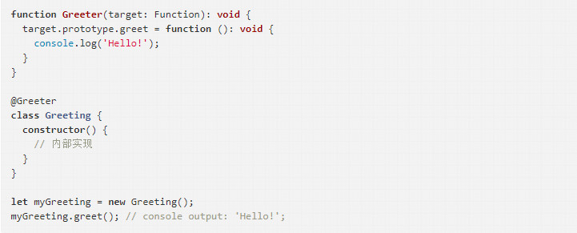

007 Angular 4.x 修仙之路

+ Angular 4.x 快速入门
  + Angular 4 快速入门
  + Angular 4 基础教程
  + Angular 4 指令快速入门
  + Angular 4 表单快速入门
  + Angular 表单简介
  + Angular 4.x 路由快速入门
  + TypeScript 简介

+ Angular 4.x 组件学习线路
  + Angular 4.x Template Syntax & Common Directives
  + Angular 4.x Directive
  + Angular 4.x Directive Lifecycle
  + Angular 4.x constructor & ngOnInit
  + Angular 4.x ViewEncapsulation
  + Angular 4.x Input
  + Angular 4.x Output
  + Angular 4.x ViewChild & ViewChildren
  + Angular 4.x ContentChild & ContentChildren
  + Angular 4.x HostListener & HostBinding
  + Angular 4.x ElementRef
  + Angular 4.x TemplateRef & ViewContainerRef
  + Angular 4.x Components Communicate
  + Angular 4.x Component Inheritance
  + Angular 4.x Change Detection - 1、Angular 4.x Change Detection - 2

+ Provider
  + Angular 4.x Provider
  + Angular 4.x Multi Providers
  + Angular 4.x Forward Reference
  + Angular 4.x OpaqueToken & InjectionToken
 
+ Directive(指令)
  + Angular 4.x Template Syntax & Common Directives
  + Angular 4.x Directive
  + Angular 2.x 结构指令
  + Angular 4.x Directive Lifecycle
  + Angular 4.x NgIf
  + Angular 4.x NgForOf
  + Angular 4.x NgTemplateOutlet
  + Angular 4.x Components Communicate
  + Angular 4.x Pass Async Data
  + Angular 4.x Component Inheritance
  + Angular 4.x Dynamically Creating Components

+ Decorator(装饰器)
  + Angular 4.x Decorator - 1
    
	常见的装饰器：
     + @NgModule 
	 + @Component
	 + @Inject

    > 装饰器是什么？
    
     - 它是一个表达式
     - 该表达式被执行后，返回一个函数
     - 函数的入参分别为 targe、name 和 descriptor
     - 执行该函数后，可能返回 descriptor 对象，用于配置 target 对象　

    > 装饰器的分类
    
     - 类装饰器 (Class decorators)
     - 属性装饰器 (Property decorators)
     - 方法装饰器 (Method decorators)
     - 参数装饰器 (Parameter decorators)

    > TypeScript 类装饰器
    
      类装饰器声明：
      `declare type ClassDecorator = <TFunction extends Function>(target: TFunction) => TFunction | void`

      类装饰器顾名思义，就是用来装饰类的。它接收一个参数：`target: TFunction - 被装饰的类`
      
    

  + Angular 4.x Decorator - 2
  + Angular 4.x Decorator - 3
  + Angular 4.x Input
  + Angular 4.x Output
  + Angular 4.x Inject Decorator
  + Angular 4.x ViewChild & ViewChildren
  + Angular 4.x ContentChild & ContentChildren
  + Angular 4.x HostListener & HostBinding

+ Pipe(管道)
  + Angular 4.x Pipe
  + Angular 4.x AsyncPipe
  
+ Dependency Injection(依赖注入)
  + Angular 4 依赖注入教程之一 依赖注入简介
  + Angular 4 依赖注入教程之二 组件服务注入
  + Angular 4 依赖注入教程之三 ClassProvider的使用
  + Angular 4 依赖注入教程之四 FactoryProvider的使用
  + Angular 4 依赖注入教程之五 FactoryProvider配置依赖对象
  + Angular 4 依赖注入教程之六 Injectable 装饰器
  + Angular 4 依赖注入教程之七 ValueProvider的使用
  + Angular 4 依赖注入教程之八 InjectToken的使用
  + Angular 4.x IoC & DI
  + Angular 4.x Injector

+ Change Detection(变化检测)
  + Angular 4.x Change Detection - 1
  + Angular 4.x Change Detection - 2
  
+ Http
  + Angular 4.x Http Module - HTTP
  + Angular 4.x Http Module - XMLHttpRequest
  + Angular 4.x HttpModule 脑图(思维导图)
  + Angular 4.x HttpModule Reveal(源码揭秘)
  + 使用 RxJS 处理多个 Http 请求
  + 激动人心的 Angular HttpClient
  + Angular HTTP Client 快速入门
  
+ Form(表单)
  + Angular 表单控件示例
  + Angular 4.x Template Driven Forms
  + Angular 4.x Reactive Forms
  + Angular 4.x Reactive Form 表单验证
  + Angular 4.x 基于AbstractControl自定义表单验证
  + Angular 4.x Custom Form Control
  + Angular 4.x Custom Validator Directive
  + Angular 4.x Forms patchValue and setValue
  + Angular 4.x ngModel 双向绑定原理揭秘
  + Angular 4.x Creating Dynamic Form

+ Router
  + Angular 4.x 路由快速入门
  + Angular 4.x LocationStrategy
  + Angular 4.x Router Link Directives
  
+ Events
  + Angular 4.x Events Bubbling
  + Angular 4.x EventManager & Custom EventManagerPlugin

+ Compiler(编译器)
  + Angular 4.x JIT vs AOT
  + Angular 4.x Compiler (未完成)
  
+ Reference Object(引用对象)
  + Angular 4.x ElementRef
  + Angular 4.x TemplateRef & ViewContainerRef

+ RxJS
  + Functional Programming
    + 涉及函数式编程概念、基础条件、重要特性、优势、常用方法等
    
  + Observable
    + 涉及观察者、迭代器模式、Observable提案、自定义Observable、Create Operators、Observer、Pull vs Push、Observable vs Promise 等

  + Operators
  + Subject
  + RxJS - Observables, observers 和 operators 简介
  + 自定义 toJSON 操作符
  
+ Others(其他)
  + Angular 4.x ViewEncapsulation
  + Angular 4.x constructor & ngOnInit
  + Angular 4.x DomSanitizer
  + Angular NgModule 作用域相关问题
  + Angular CLI 终极指南
  + ng-conf-2017 - Angular Form Validation
  + Angular 中何时取消订阅
  + Angular Renderer (渲染器)
  + TypeScript 资源集