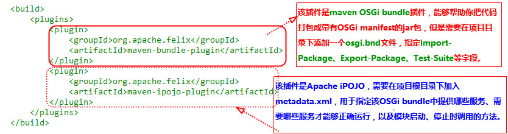

# Apache开源项目

## 了解Apache 开源协议

**开源社区的常用开源协议：**      

* MIT License
* GPL
* Apache License 

**扼要说明：**

**Apache License** : 你可以用这代码，但是如果开源你必须保留我写的声明；你可以改我的代码，但是如果开源你必须写清楚你改了哪些；你可以加新的协议要求，但不能与我所公布的协议要求产生冲突；你用这代码干什么我不管，但是你不能让我承担任何责任。


## 常用开源项目

# 开源好用的工具包

## Hazelcast （开源的可嵌入式数据网格）

&emsp;&emsp;Hazelcast 是一个开源的可嵌入式数据网格（社区版免费，企业版收费）。你可以把它看做是内存数据库，不过它与 Redis 等内存数据库又有些不同。项目地址：http://hazelcast.org/

&emsp;&emsp;Hazelcast 使得 Java 程序员更容易开发分布式计算系统，提供了很多 Java 接口的分布式实现，如：Map, Queue, ExecutorService, Lock, 以及 JCache。它以一个 JAR 包的形式提供服务，只依赖于 Java，并且提供 Java, C/C++, .NET 以及 REST 客户端，因此十分容易使用。

## Guice

&emsp;&emsp;Guice是Google开源的一个依赖注入类库，<font size=3 color=red>相比于Spring IoC来说更小更快。Elasticsearch大量使用了Guice。</font>

 + Guice 概述 
  + Guice是Google开源的依赖注入类库，通过Guice减少了对工厂方法和new的使用，使得代码更易交付、测试和重用；
  + Guice可以帮助我们更好地设计API，它是个轻量级非侵入式的类库；
  + Guice对开发友好，当有异常发生时能提供更多有用的信息用于分析；

## Apache Felix

&emsp;&emsp;Apache Felix是在Apache许可下实施OSGi框架和服务平台和其他有趣的OSGi相关技术的社区努力。 OSGi规范最初针对嵌入式设备和家庭服务网关，但它们非常适合任何对模块化，面向组件和/或服务导向原则感兴趣的项目。 OSGi技术结合了上述原理的各个方面来定义适合于远程管理的动态服务部署框架。

<font size=3 face="黑体" color=red >使用Apache Felix提供的OSGi容器，并且加上Apache Felix下面的iPOJO插件，这样服务的引用、获取更加方便。</font>



```
 示例
  <?xml version="1.0" encoding="UTF-8"?>
	<iPOJO>
	    <component className="com.example.ServiceImpl"
	               name="ServiceImpl" architecture="true">
	        <provides specifications="com.example.IService"/>
	        <callback transition="validate" method="starting"/>
	        <callback transition="invalidate" method="stopping"/>
	    </component>
	    <instance component="ServiceImpl" name="ServiceImpl"/>
	</iPOJO>
```

###  PowerMock

**为什么要使用Mock工具？**

&emsp;&emsp; 在做单元测试的时候，我们会发现我们要测试的方法会引用很多外部依赖的对象，比如：（发送邮件，网络通讯，远程服务, 文件系统等等）。 而我们没法控制这些外部依赖的对象，为了解决这个问题，我们就需要用到Mock工具来模拟这些外部依赖的对象，来完成单元测试。

**为什么要使用PowerMock?**
&emsp;&emsp; 现如今比较流行的Mock工具如[jMock](http://jmock.org/) 、[EasyMock](http://easymock.org/) 、[Mockito](https://code.google.com/archive/p/mockito/)等都有一个共同的缺点：不能mock静态、final、私有方法等。而PowerMock能够完美的弥补以上三个Mock工具的不足。


###  GreenMail (邮件测试服务器)
GreenMail是一个用于测试的、开源的、直观的和易于使用的邮件服务器测试套件。它支持 SMTP、POP3、IMAP 等。它还为JBoss提供GreenMail服务。

GreenMail是第一个并且是唯一的一个为从Java接收和检索电子邮件提供测试框架的库。主页：http://www.icegreen.com/greenmail/。


