# lwhtarena_note


## JVM 

数据、指令、控制

**JVM运行时数据去**

程序计数器： 指向当前线程正在运行的字节码指令的地址。（<font color=red>为什么要记住字节码(的地址)？</font>）

虚拟机栈： 当前线程运行方法所需要<font color=red>数据、指令、返回地址</font>。


## Java 中的接口有什么作用？

> 1、“接口+实现”最常见的优势就是实现类和接口分离，在更换实现类的时候，不用更换接口功能。
>


## Java 中 如果clone为什么必须实现Cloneable接口？
> 【解答：】 如果不继承自Cloneable接口，当调用clone()时会抛出CloneNotSupportedException异常。
> 
> 【题外话：】
> 
> 1、 接口就是只有函数声明,没有函数实现; 为什么要用这种,是因为在编写程序的时候一个类只能继承一个类,但是可以实现N个接口。
>
> 2、这个是经典的标识接口！还有序列化接口（java.io.Serializable）也是什么方法也没有！
> 它们的作用就是告诉虚拟机它们现在已经被标示了，可以进行相应的处理了！

## 泛型中<? extends T>和<? super T> 区别
> **<? extends T>**  `很容易误解它为继承于T的所有类的集合`,不是一个集合，而是T的某一种子类(的意思)，`记住是一种，单一的一种`
> 
> **<? super T>** 以T类为下限的某种类，简单地说就是T类的超类
>
> 【扩展:】(`看apache parquet源码时，发现代码各种泛型嵌套，有必要系统整理一下关于泛型的各种知识`)
> 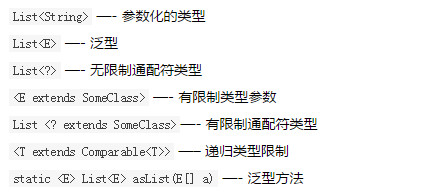
> 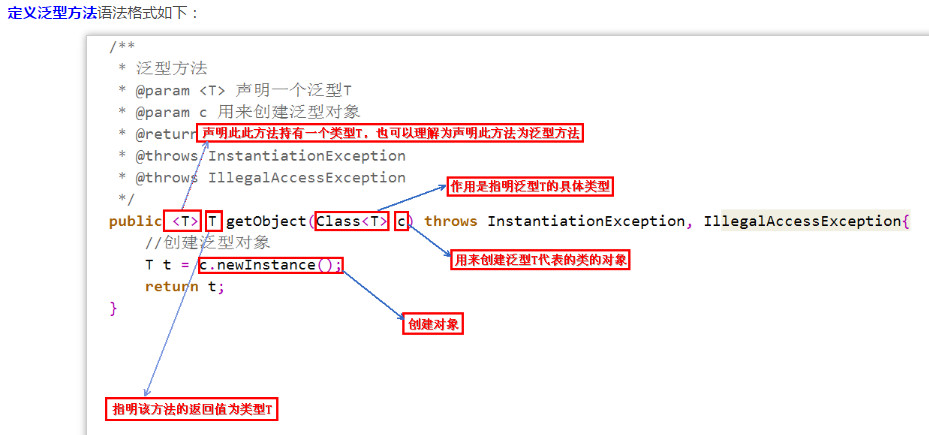
> 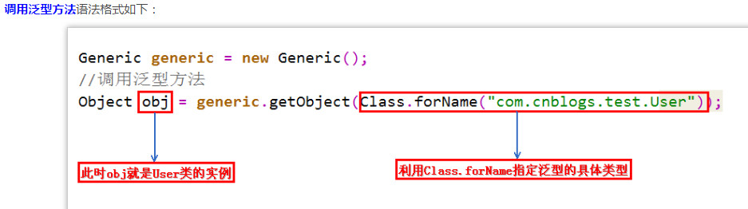

例子：


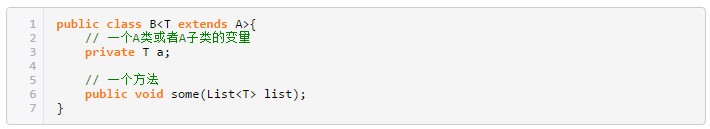

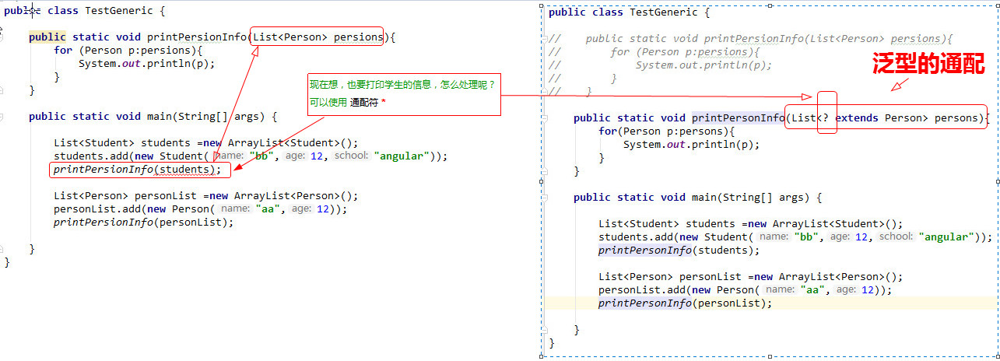

<font color=red size=4><? extends Shape></font> 是有限制通配符。这里`？`代表一个未知类型,(这个未知的类型实际上是Shape的一个子类)我们说<font color=red size=4>Shape是这个通配符的上限。</font>

我们在声明一个类或接口时，可以通过这样的方式定义（声明）泛型,然后在这个类或接口的里面，任何可以使用泛型的地方（比如说：方法的返回值类型或方法的参数类型以及方法体里面的对用的对象类型）		


<font color=red size=4> 类型参数在整个类的声明中可用，几乎是所有可以使用其他普通类型的地方</font>

- 泛型类
    `<>` 不能使用在基本类型上，不能使用在静态属性上
- 泛型接口
     注意:`接口中泛型字母只能使用在方法中，不能使用在全局常量中`

- 泛型方法
	注意:`泛型方法可以用在非泛型类中`

- 泛型继承、实现
    
-泛型擦除 		
  定义:泛型擦除是指在继承(实现)或使用时没有指定具体的类型		
  特点:一旦擦除之后按Object处理
	- 依然存在警告，加上Object可以去除，但是有些画蛇添足
	- 不完全等同于Object ,编译不会类型检查
	


extends : 泛型的上限  <= 即子类或自身

	 * 1、一般用于 限制操作
	 * 2、不能使用在 添加数据上面，一般都是读取操作
	 * 3、规则
	 *  List<Fruit> -->List<? extends Fruit>
	 *  List<Apple> -->List<? extends Fruit>
	 *  List<? extends Apple> -->List<? extends Fruit>
	 *  不能存放
	 *  List<?>
	 *  List<? extends Object>

super : 泛型的下限  >= 即父类或自身

	* 1、一般用于 下限操作
	* 2、能够添加数据上面，不能添加父对象
	* 3、规则
	*  List<Fruit> -->List<? super Apple>
	*  List<Apple> -->List<? super Apple>
	*  List<? super Fruit> -->List<?super Apple>
	*  不能存放
	*  List<? super FujiApple> -->List<?super Apple>

泛型嵌套 -->由外到内拆分

**小结：**

泛型通配符`<? extends T>`来接收返回的数据，此写法的泛型集合不能使用 add 方
法， 而`<? super T>`不能使用 get 方法，做为接口调用赋值时易出错。

说明： 扩展说一下 PECS(Producer Extends Consumer Super)原则： 
- 第一、 频繁往外读取内容的，适合用`<? extends T>`。 
- 第二、 经常往里插入的，适合用`<? super T>`。

一个查，一个插入！

## 集合常用

+ map 常见操作

Map集合的四种遍历方式
1）方式一 这是最常见的并且在大多数情况下也是最可取的遍历方式。在键值都需要时使用。

```java
Map<Integer, Integer> map = new HashMap<Integer, Integer>(); 
for (Map.Entry<Integer, Integer> entry : map.entrySet()) { 
  System.out.println("Key = " + entry.getKey() + ", Value = " + entry.getValue()); 
}
```

2）方法二 在for-each循环中遍历keys或values。

```java
//如果只需要map中的键或者值，你可以通过keySet或values来实现遍历，而不是用entrySet。

Map<Integer, Integer> map = new HashMap<Integer, Integer>(); 
//遍历map中的键 
for (Integer key : map.keySet()) { 
  System.out.println("Key = " + key); 
} 
//遍历map中的值 
for (Integer value : map.values()) { 
  System.out.println("Value = " + value); 
}
```
该方法比entrySet遍历在性能上稍好（快了10%），而且代码更加干净。

3）方法三 使用Iterator遍历

使用泛型
```java
Map<Integer, Integer> map = new HashMap<Integer, Integer>(); 
Iterator<Map.Entry<Integer, Integer>> entries = map.entrySet().iterator(); 
while (entries.hasNext()) { 
  Map.Entry<Integer, Integer> entry = entries.next(); 
  System.out.println("Key = " + entry.getKey() + ", Value = " + entry.getValue()); 
}
```

不适用泛型
```java
Map map = new HashMap(); 
Iterator entries = map.entrySet().iterator(); 
while (entries.hasNext()) { 
  Map.Entry entry = (Map.Entry) entries.next(); 
  Integer key = (Integer)entry.getKey(); 
  Integer value = (Integer)entry.getValue(); 
  System.out.println("Key = " + key + ", Value = " + value); 
}
```

你也可以在keySet和values上应用同样的方法。

该种方式看起来冗余却有其优点所在。首先，在老版本java中这是惟一遍历map的方式。另一个好处是，你可以在遍历时调用iterator.remove()来删除entries，另两个方法则不能。根据javadoc的说明，如果在for-each遍历中尝试使用此方法，结果是不可预测的。

从性能方面看，该方法类同于for-each遍历（即方法二）的性能。

4）方法四 通过键找值遍历（效率低）

```java
Map<Integer, Integer> map = new HashMap<Integer, Integer>(); 
for (Integer key : map.keySet()) { 
  Integer value = map.get(key); 
  System.out.println("Key = " + key + ", Value = " + value);
```

作为方法一的替代，这个代码看上去更加干净；但实际上它相当慢且无效率。因为从键取值是耗时的操作（与方法一相比，在不同的Map实现中该方法慢了20%~200%）。如果你安装了FindBugs，它会做出检查并警告你关于哪些是低效率的遍历。所以尽量避免使用。

**总结**

如果仅需要键(keys)或值(values)使用方法二。如果你使用的语言版本低于java 5，或是打算在遍历时删除entries，必须使用方法三。否则使用方法一(键值都要)。


```java
import java.util.HashMap;
import java.util.Iterator;
import java.util.Map;

public class TestMap {
    public static void main(String[] args) {
        Map<Integer, String> map = new HashMap<Integer, String>();
        map.put(1, "a");
        map.put(2, "b");
        map.put(3, "ab");
        map.put(4, "ab");
        map.put(4, "ab");// 和上面相同 ， 会自己筛选
        System.out.println(map.size());
        
		// 第一种：
        /*
         * Set<Integer> set = map.keySet(); //得到所有key的集合
         * 
         * for (Integer in : set) { String str = map.get(in);
         * System.out.println(in + "     " + str); }
         */
        System.out.println("第一种：通过Map.keySet遍历key和value：");
        for (Integer in : map.keySet()) {
            //map.keySet()返回的是所有key的值
            String str = map.get(in);//得到每个key多对用value的值
            System.out.println(in + "     " + str);
        }

        // 第二种：
        System.out.println("第二种：通过Map.entrySet使用iterator遍历key和value：");
        Iterator<Map.Entry<Integer, String>> it = map.entrySet().iterator();
        while (it.hasNext()) {
             Map.Entry<Integer, String> entry = it.next();
               System.out.println("key= " + entry.getKey() + " and value= " + entry.getValue());
        }

        // 第三种：推荐，尤其是容量大时
        System.out.println("第三种：通过Map.entrySet遍历key和value");
        for (Map.Entry<Integer, String> entry : map.entrySet()) {
            //Map.entry<Integer,String> 映射项（键-值对）  有几个方法：用上面的名字entry
            //entry.getKey() ;entry.getValue(); entry.setValue();
            //map.entrySet()  返回此映射中包含的映射关系的 Set视图。
            System.out.println("key= " + entry.getKey() + " and value= "
                    + entry.getValue());
        }

        // 第四种：
        System.out.println("第四种：通过Map.values()遍历所有的value，但不能遍历key");
        for (String v : map.values()) {
            System.out.println("value= " + v);
        }
    }
}
```


+ list 常见操作

+ set 常见操作
 

## 关于java注解方法isAnnotationPresent

**注解的本质**

`java.lang.annotation.Annotation` 接口中有这么一句话，用来描述『注解』:`所有的注解类型都继承自这个普通的接口`（**Annotation**）

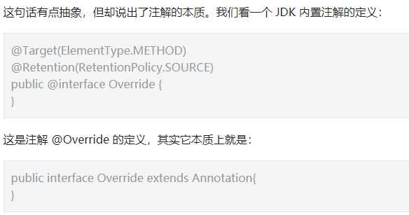

一个注解准确意义上来说，只不过是一种特殊的注释而已，如果没有解析它的代码，它可能连注释都不如。

**元注解**

『元注解』是用于修饰注解的注解，通常用在注解的定义上，例如：

```java
@Target(ElementType.METHOD)
@Retention(RetentionPolicy.SOURCE)
public @interface Override {
}
```
这是我们 `@Override` 注解的定义，你可以看到其中的 `@Target，@Retention` 两个注解就是我们所谓的『元注解』，『元注解』一般用于指定某个注解生命周期以及作用目标等信息。

**JAVA 中有以下几个『元注解』：**

- @Target：注解的作用目标
- @Retention：注解的生命周期
- @Documented：注解是否应当被包含在 JavaDoc 文档中
- @Inherited：是否允许子类继承该注解


## 类加载器		
在哪些领域运用（大放异彩）：
 - OSGI
 - 热部署
 - 代码加密

## `...` 可变参数，使用方式跟数组一致

## 进一步理解get和set

做CRUD时，会在实体Entity的每个属性加上get和set方法；更加规范的做法，再加一个DTO类，两者长的几乎一模一样。

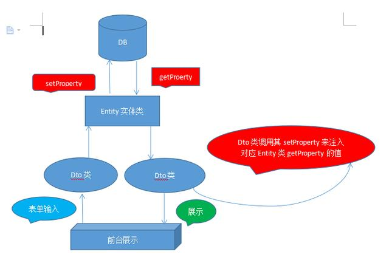

> 知识延伸： Java中的几种对象PO、VO、DAO、BO、DTO、POJO解释说明 

+ 一、PO :(persistant object )，持久对象

    可以看成是与数据库中的表相映射的java对象。使用Hibernate来生成PO是不错的选择。

+ 二、VO :(value object) ，值对象

	通常用于业务层之间的数据传递，和PO一样也是仅仅包含数据而已。但应是抽象出的业务对象,可以和表对应,也可以不,这根据业务的需要.

	PO只能用在数据层，VO用在商业逻辑层和表示层。各层操作属于该层自己的数据对象，这样就可以降低各层之间的耦合，便于以后系统的维护和扩展。

+ 三、DAO :(Data Access Objects) ，数据访问对象接口

	DAO是Data Access Object数据访问接口，数据访问：顾名思义就是与数据库打交道。夹在业务逻辑与数据库资源中间。

	J2EE开发人员使用数据访问对象（DAO）设计模式把底层的数据访问逻辑和高层的商务逻辑分开.实现DAO模式能够更加专注于编写数据访问代码.

	DAO模式是标准的J2EE设计模式之一.开发人员使用这个模式把底层的数据访问操作和上层的商务逻辑分开.一个典型的DAO实现有下列几个组件：

	1. 一个DAO工厂类；
	
	2. 一个DAO接口；
	
	3. 一个实现DAO接口的具体类；
	
	4. 数据传递对象（有些时候叫做值对象）.
	
	具体的DAO类包含了从特定的数据源访问数据的逻辑。

+ 四、BO :(Business Object)，业务对象层

	表示应用程序领域内“事物”的所有实体类。这些实体类驻留在服务器上，并利用服务类来协助完成它们的职责。

+ 五、DTO Data Transfer Object数据传输对象

	主要用于远程调用等需要大量传输对象的地方。比如我们一张表有100个字段，那么对应的PO就有100个属性。但是我们界面上只要显示10个字段，客户端用WEB service来获取数据，没有必要把整个PO对象传递到客户端，这时我们就可以用只有这10个属性的DTO来传递结果到客户端，这样也不会暴露服务端表结构.到达客户端以后，如果用这个对象来对应界面显示，那此时它的身份就转为VO

+ 六、POJO :(Plain Old Java Objects)，简单的Java对象

	实际就是普通JavaBeans,使用POJO名称是为了避免和EJB混淆起来, 而且简称比较直接.其中有一些属性及其getter、setter方法的类,有时可以作为value object或dto(Data Transform Object)来使用.当然,如果你有一个简单的运算属性也是可以的,但不允许有业务方法,也不能携带有connection之类的方法

## 从“领域驱动设计”角度——浅析VO、DTO、DO、PO的概念、区别和用处

概念：

**VO（View Object）：** 视图对象，用于展示层，它的作用是<font color=#5CB85C size=4>把某个指定页面（或组件）的所有数据封装起来</font>。

**DTO（Data Transfer Object）：** 数据传输对象，这个概念来源于J2EE的设计模式，原来的目的是为了EJB的分布式应用提供粗粒度的数据实体，以减少分布式调用的次数，从而提高分布式调用的性能和降低网络负载，但在这里，我<font color=#5CB85C size=4>泛指用于展示层与服务层之间的数据传输对象</font>。

**DO（Domain Object）：** <font color=#5CB85C size=4>领域对象，就是从现实世界中抽象出来的有形或无形的业务实体。</font>

**PO（Persistent Object）：** <font color=#5CB85C size=4>持久化对象，它跟持久层（通常是关系型数据库）的数据结构形成一一对应的映射关系</font>，如果持久层是关系型数据库，那么，数据表中的每个字段（或若干个）就对应PO的一个（或若干个）属性。

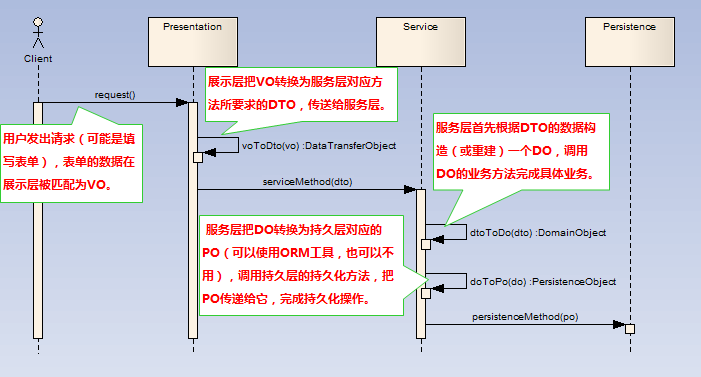

## double和floa精度不准，怎么处理

> float和double ==> 科学计算或工程计算
> BigDecimal    ==> 商业计算

【延伸】 数据类型
**基本类型：** 不具备面向对象的基本特征，没有属性和方法。
**封装类型：**属于应用类型，提供了valueOf(String s)方法。jdk之后，自动装箱和封箱，方便封装类型和基本类型的相互转化，不需要编码转换。

## 抽象类、接口

> 由于抽象类可以包含实现方法和抽象方法（非常灵活），<font size=3 color=red face="黑体">在设计模式中，有很多模式都是基于抽象类实现的。</font>
> 接口之间允许多继承，类之间只允许单继承。

#### 接口常见的用法
 - 单方法接口(一个接口一个方法，如runnable)
 - 标识接口(没有任何方法和属性的接口，通常使用在工具类中)
    标识接口不对实现它的类有任何意义上的要求，它仅仅表明实现它的类属于特定的类型    
    如：java.io.Serializable 和 java.rmi.Remote 等接口
 - 常量接口（使用接口来声明一些常量，由实现这个接口的实现类使用这些常量--尽量不要模仿写）

## 异常
> RuntimeException异常有哪些？
	
	//常见RuntimeException的异常
	NullPointerException - 空指针引用异常
	ClassCastException - 类型强制转换异常。
	IllegalArgumentException - 传递非法参数异常。
	ArithmeticException - 算术运算异常
	ArrayStoreException - 向数组中存放与声明类型不兼容对象异常
	IndexOutOfBoundsException - 下标越界异常
	NegativeArraySizeException - 创建一个大小为负数的数组错误异常
	NumberFormatException - 数字格式异常
	SecurityException - 安全异常
	UnsupportedOperationException - 不支持的操作异常

	//非RuntimeException的异常
	NoSuchMethodException：方法为找到异常
    IOException：输入输出异常
    EOFException：文件已结束异常
    NumberFormatException：字符串转换为数字异常
    SQLException：操作数据库异常

> 异常处理机制（处理方式有哪些？）

 - try-catch-finally（如果发生异常之后，还需继续执行下去，使用try-catch）
 - 使用throw

> 使用自定义异常（两种格式）

 - 违反业务逻辑
 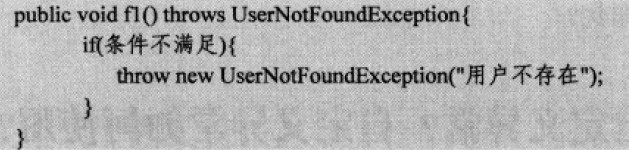

 - try-catch捕获异常
 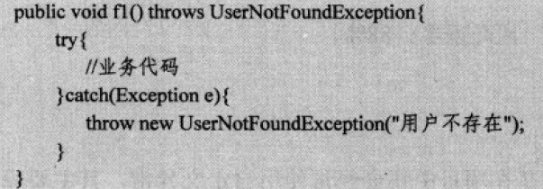

在实现自定义异常类，为了方便使用，会给该异常类设计两个构造方法，一个无参数，另一个带String类型的参数。

 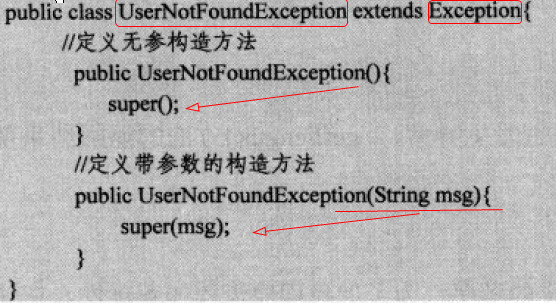

> 为什么要自定义异常？

1、JAVA给我们提供了多种异常，我们不可能每个异常都要捕获处理，但如果直接捕获Exception又无法区分每个异常的原因。

2、如果代码执行过程中，我们的一些检查或者判断不通过，我们想终止运行，此时可以通过抛出异常实现，但抛出什么异常不好决定。

3、一个工程可能有多个子项目，或者多个模块，模块间调用，如果统一自定义的异常更便于错误的处理和携带一些错误信息。

> 如何使用自定义异常？

比如controller为界面的请求Controller代码，doSomeThing为后端业务代码也可以理解为第三方接口，doSomeThing统一做异常处理，然后在Controller层对异常进行处理，StatusException的异常为需要返回给用户的，其他异常均需要隐藏细节，只返回给用户系统繁忙或内部错误等，后端显示具体异常信息，供开发者查找bug。

 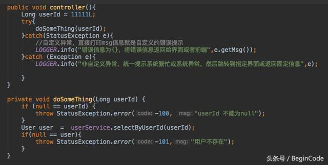

自定义异常类：
 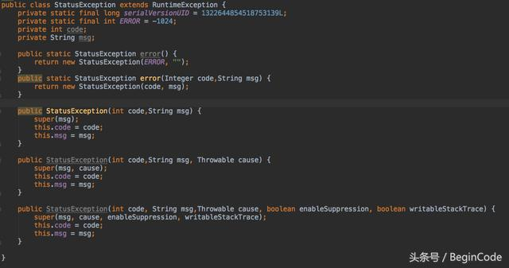

## 优雅的处理Java异常

我们开发的业务系统，或者是产品，常常面临着这样的问题：
- **系统运行出错,但是完全不知道错误发生的位置**
- **我们找到了错误的位置,但是完全不知道是因为什么**
- **系统明明出了错误,但是就是看不到错误堆栈信息**

## ClassLoader
[参考](http://blog.csdn.net/xyang81/article/details/7292380)

程序在启动的时候，并不会一次性加载程序程序所要用的所有class文件。而是根据程序需要，通过Java的类加载机制（ClassLoader）来动态加载某个class文件到内存中，从而只有class文件被载入到了内存之后，才能被其它class所引用。所以ClassLoader就是用来动态加载class文件到内存当中用的。

### Java默认提供的三个ClassLoader
- BootStrap ClassLoader（启动类加载器）
 - BootStrap ClassLoader：称为启动类加载器，是Java类加载层次中最顶层的类加载器，**负责加载JDK中的核心类库，如：rt.jar、resources.jar、charsets.jar等**，可通过如下程序获得该类加载器从哪些地方加载了相关的jar或class文件

```
URL[] urls = sun.misc.Launcher.getBootstrapClassPath().getURLs();  
for (int i = 0; i < urls.length; i++) {  
    System.out.println(urls[i].toExternalForm());  
}  
```
- Extension ClassLoader
 - Extension ClassLoader：称为扩展类加载器，负责加载Java的扩展类库，默认加载JAVA_HOME/jre/lib/ext/目下的所有jar。
- ClassLoader
 - App ClassLoader：称为系统类加载器，负责加载应用程序classpath目录下的所有jar和class文件。

### ClassLoader的体系架构：
 

### 定义自己的ClassLoader

> 既然JVM已经提供了默认的类加载器，为什么还要定义自已的类加载器呢？

&emsp;&emsp;因为Java中提供的默认ClassLoader，只加载指定目录下的jar和class，如果我们想加载其它位置的类或jar时，比如：我要加载网络上的一个class文件，通过动态加载到内存之后，要调用这个类中的方法实现我的业务逻辑。在这样的情况下，默认的ClassLoader就不能满足我们的需求了，所以需要定义自己的ClassLoader。

> 定义自已的类加载器分为两步：

- 1、继承java.lang.ClassLoader
- 2、重写父类的findClass方法
 
读者可能在这里有疑问，父类有那么多方法，为什么偏偏只重写findClass方法？

&emsp;&emsp;因为JDK已经在loadClass方法中帮我们实现了ClassLoader搜索类的算法，当在loadClass方法中搜索不到类时，loadClass方法就会调用findClass方法来搜索类，所以我们只需重写该方法即可。如没有特殊的要求，一般不建议重写loadClass搜索类的算法。下图是API中ClassLoader的loadClass方法：

###### 目前常用web服务器中都定义了自己的类加载器，用于加载web应用指定目录下的类库（jar或class），如：Weblogic、Jboss、tomcat等，下面我以Tomcat为例，展示该web容器都定义了哪些个类加载器：
 	
		
1、新建一个web工程httpweb			

2、新建一个ClassLoaderServletTest，用于打印web容器中的ClassLoader层次结构

## Java反射使用及各种实战总结

> 反射机制是什么？     

&emsp;&emsp;反射机制是在运行状态中，对于任意一个类，都能够知道这个类的所有属性和方法；对于任意一个对象，都能够调用它的任意一个方法和属性；这种动态获取的信息以及动态调用对象的方法的功能称为java语言的反射机制。

> 反射机制能做什么？

&emsp;反射机制主要提供了以下功能：

- 在运行时判断任意一个对象所属的类；
- 在运行时构造任意一个类的对象；
- 在运行时判断任意一个类所具有的成员变量和方法；
- 在运行时调用任意一个对象的方法；
- 生成动态代理。

## `<context-param>` 与 `<init-param>` 的区别与作用

了解JavaEE 容器启动：
- 1.启动一个WEB项目的时候,容器(如:Tomcat)会去读它的配置文件web.xml.读两个节点: <listener></listener> 和 <context-param></context-param>

- 2.紧接着,容器创建一个ServletContext(上下文),这个WEB项目所有部分都将共享这个上下文.

- 3.容器将<context-param></context-param>转化为键值对,并交给ServletContext.

- 4.容器创建<listener></listener>中的类实例,即创建监听.

- 5.在监听中会有contextInitialized(ServletContextEvent args)初始化方法,在这个方法中获得
ServletContext = ServletContextEvent.getServletContext();
context-param的值 = ServletContext.getInitParameter("context-param的键");

- 6.得到这个context-param的值之后,你就可以做一些操作了.注意,这个时候你的WEB项目还没有完全启动完成.这个动作会比所有的Servlet都要早.
换句话说,这个时候,你对<context-param>中的键值做的操作,将在你的WEB项目完全启动之前被执行.

- 7.举例.你可能想在项目启动之前就打开数据库.
那么这里就可以在<context-param>中设置数据库的连接方式,在监听类中初始化数据库的连接.

8.这个监听是自己写的一个类,除了初始化方法,它还有销毁方法.用于关闭应用前释放资源.比如说数据库连接的关闭.

	<!-- 加载spring的配置文件 -->
	<context-param>
	    <param-name>contextConfigLocation</param-name>
	   <param-value>
					/WEB-INF/applicationContext.xml,
					/WEB-INF/action-servlet.xml,
					/WEB-INF/jason-servlet.xml
	   </param-value>
	</context-param>
	<listener>
	   <listener-class>org.springframework.web.context.ContextLoaderListener</listener-class>
	</listener>

[http://blog.csdn.net/mydwr/article/details/8047515](http://blog.csdn.net/mydwr/article/details/8047515)

## Java开发之`@PostConstruct`和@`PreConstruct`注解

&nbsp;&nbsp; 从Java EE5规范开始，Servlet增加了两个影响Servlet生命周期的注解（Annotation）：`@PostConstruct`和`@PreConstruct`。这两个注解被用来<font color=red>修饰一个非静态的void()方法</font>.而且这个方法不能有抛出异常声明。
```java
	@PostConstruct                                 //方式1
	public void someMethod(){
		...
	}
	public @PostConstruct void someMethod(){        //方式2   
		...  
	}
```
- `@PostConstruct`

&nbsp;&nbsp;被`@PostConstruct`修饰的方法会在服务器加载Servlet的时候运行，并且只会被服务器调用一次，类似于Serclet的inti()方法。被<font color=red size=4>@PostConstruct修饰的方法会在构造函数之后，init()方法之前运行</font>。

- `@PreConstruct`

&nbsp;&nbsp;被`@PreConstruct`修饰的方法会在服务器卸载Servlet的时候运行，并且只会被服务器调用一次，类似于Servlet的destroy()方法。<font color=red size=4>被@PreConstruct修饰的方法会在destroy()方法之后运行，在Servlet被彻底卸载之前</font>。

**延伸拓展1：Spring中的 Bean 及 @Bean 的理解**

>Bean

JavaBean 是一个可重复使用的组件。
```
1、Java面向对象，对象有方法和属性，那么就需要对象实例来调用方法和属性（即实例化）；
2、凡是有方法或属性的类都需要实例化，这样才能具象化去使用这些方法和属性；
3、规律：凡是子类及带有方法或属性的类都要加上注册Bean到Spring IoC的注解；
4、把Bean理解为类的代理或代言人（实际上确实是通过反射、代理来实现的），这样它就能代表类拥有该拥有的东西了
5、我们都在微博上@过某某，对方会优先看到这条信息，并给你反馈，那么在Spring中，你标识一个@符号，那么Spring就会来看看，并且从这里拿到一个Bean或者给出一个Bean
```

注解分为两类：
1) **一类是使用Bean:**  即是把已经在xml文件中配置好的Bean拿来用，完成属性、方法的组装；比如`@Autowired` , `@Resource`，可以通过byType(@Autowired)、byName(@Resource) 的方式获取Bean；

2) **一类是注册Bean:**  `@Component` , `@Repository` , `@ Controller` , `@Service` , `@Configration` 这些注解都是把你要实例化的对象转化成一个Bean，放在IoC容器中，等你要用的时候，它会和上面的`@Autowired` , `@Resource` 配合到一起，把对象、属性、方法完美组装。

>@Bean (放在方法上)

`@Bean`明确地指示了一种方法(<font color=red>产生一个bean的方法，并且交给Spring容器管理</font>).

1) 凡是子类及带属性、方法的类都注册Bean到Spring中，交给它管理；

2) `@Bean` 用在方法上，告诉Spring容器，你可以从下面这个方法中拿到一个Bean

**延伸拓展2：Spring中的 `@Configuration` 与 `@Bean`**

- `@Configuration`注解该类，等价于`XML`中配置`beans`

- `@Bean`标注方法等价于`XML`中配置`bean`

## 使用spring注解读取properties文件的值

- 引用单个properties文件

  `<util:properties id="propertiesReader" location="classpath:test.properties" /> `

- 引用多个properties文件

```
	<bean id="propertiesReader" class="org.springframework.beans.factory.config.PropertiesFactoryBean">
	  <property name="locations">
	   <list>
	    <value>classpath:param.properties</value>
	    <value>classpath:base.properties</value>
	   </list>
	  </property>
	</bean>
```

**延伸知识点1： 在类中读取properties文件属性**

在类中需要注入的属性实现 setter 和 getter 方法。
在 setter 方法前，添加 @Value 注解如`@Value("#{propertiesReader[propertiesName]}")`
propertiesName 为 properties 文件中的键。这样，在容器启动过程中， spring 将自动注入值。

**延伸知识点2：Spring 依赖注入：自动注入properties文件中的配置**

要自动注入properties文件中的配置，需要在spring配置文件中添加：
`org.springframework.beans.factory.config.PropertiesFactoryBean`和`org.springframework.beans.factory.config.PreferencesPlaceholderConfigurer`的实例配置。

## 字节码操作

很多框架都会使用到字节码操作

+ JAVA 动态性的两种常见实现方式
 + 字节码操作
 + 反射


   动态代理，可以使用字节码或者反射。（字节码操作比反射性能高，但二者又相辅相成）

+ 运行时操作细节码可以让我们实现如下功能：
 + 动态生成新的类
 + 动态改变某个类的结构（添加/删除/修改 新的属性/方法）

+ 优势
 + 比反射开销小，性能高
 + javaassist性能高于反射，低于ASM

**常见的字节码操作类库**

+ BCEL
  
  BCEL在实际的JVM指令层次上进行操作(BCEL拥有丰富的JVM指令级支持)而javassist所强调的是源代码级别的操作

+ ASM

  asm 是一个轻量级别java字节码操作框架，直接涉及到JVM底层的操作和指令

+ CGLIB(Code Generation Library) 
  
  CGLIB是一个强大的，高性能，高质量的Code生成类库，基于ASM实现。

+ javaassist

  是一个开源的分析、编辑和创建字节码的类库。性能较ASM差,跟cglib差不多，但是使用简单。<font color=red>很多框架都在使用它。</font>
 
**什么是ASM?**
&emsp;&emsp; asm是assembly的缩写，是汇编的称号，对于java而言，asm就是字节码级别的编程。  

**如何使用ASM**

ASM框架中的核心类有以下几个：

①  ClassReader: 该类用来解析编译过的class字节码文件。
②  ClassWriter: 该类用来重新构建编译后的类，比如说修改类名、属性以及方法，甚至可以生成新的类的字节码文件。
③  ClassAdapter: 该类也实现了ClassVisitor接口，它将对它的方法调用委托给另一个ClassVisitor对象。

**<font color=red>延伸1：动态代理有什么作用及应用场景？</font>**

a.日志集中打印

b.事务

c.权限管理

d.AOP

**<font color=red>延伸2：在Spring Aop当中可以哪些方式实现及区别？</font>**

a.java Proxy(动态构建字节码)

b.cglib(动态构建字节码)

c.Aspectj(修改目标类的字节码，植入代理的字节,在程序编译)--静态

d.instrumentation(修改目标类的字节码,类加载的时候<font color=red>动态拦截</font>去修改,基于javaagent[即-javaagent：spring-instrument-4.3.8.RELEASE.jar])

延伸总结：<font color=red>无论哪种方式实现动态代理，其本质实现都是对字节码的修改。其区别是从哪里进行切入修改字节码。</font>

1、动态代理可以由java proxy、cglib、instrumentation、Aspectj 等多种方式实现

2、动态代理本质是对class字节码进行动态构建或修改。

  a、修改的工具有ASM、javavssist

3、多种实现方式的区别在于对字节码切入方式不一样。可选方式的有：

  a、java proxy 、 Cglib是基于动态构建接口实现字节

  b、AspectJ 是借助Eclipse工具在编译时织入代理字节

  c、instrumentation 是基于javaagent 在类转载时修改Class织入代理字节

  d、使用字节定义ClassLoader在装载时织入代理字节

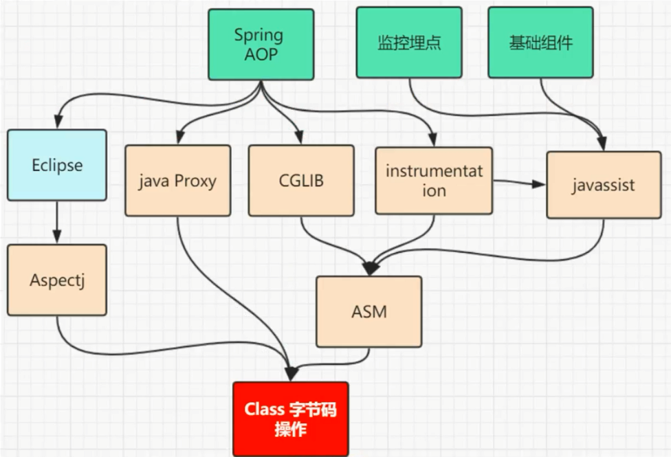

**JAVA Proxy 实现过程**


## 什么是DSL？

&emsp;&emsp;领域特定语言，针对一个特定的领域，具有受限表达性的一种计算机程序语言。可以看做是一种抽象处理的方式。具有四个元素，第一个是计算机程序设计语言，使用DSL来指挥计算机做事情，语言性（一种特定的语言），受限的表达性，并不像同通用的设计语言那样具有广泛的能力，针对一个明确的领域。

**DSL分类有哪些？**
+ 外部DSL：
    不同于应用系统主要使用语言的语言，通常采用自定义语法，宿主应用的代码采用文本解析技术对外部DSL编写的脚本进行解析。例子如：正则表达式、SQL、AWK以及Struts的配置文件等

+ 内部DSL：
    通用语言的特定语法，用内部DSL写成的脚本是一段合法的程序，但是它具有特定的风格，而且仅仅用到了语言的一部分特性，用于处理整个系统一个小方面的问题；

语言工作台：一种专用的IDE，用于定义和构建DSL，具体的讲，语言工作台不仅用来确定DSL的语言结构，而且是人们编写DSL脚本的编辑环境，最终的脚本讲编辑环境和语言本身紧密的结合在一起；

**为什么需要DSL？**

1、提高开发效率，通过DSL来抽象构建模型，抽取公共的代码，减少重复的劳动；
2、和领域专家沟通，领域专家可以通过DSL来构建系统的功能；
3、执行环境的改变，可以弥补宿主语言的局限性；

**DSL的处理可能包含那几个步骤？**

1、DSL脚本；
2、解析脚本；
3、语义模型；
4、生成代码或者执行模型；

**为啥groovy能比较好的构建DSL？**

1、不需要class文件，可以直接执行脚本；
2、闭包等特性以及语法的简介，使用非常灵活；
3、可以和java系统无缝的整合；
4、Groovy自身不是 DSL。 Groovy官方已经发布了较多基于 Groovy书写的 DSL，比如 GANT， GORM， XMLBuilder， HtmlBuilder等等；

## 高并发线程

+ <font color=red>进程：每个进程都有独立的代码和数据空间（进程上下文），进程间的切换会有较大的开销，一个进程包含1--n个线程。（进程是资源分配的最小单位）</font>

+ <font color=red>线程：同一类线程共享代码和数据空间，每个线程有独立的运行栈和程序计数器(PC)，线程切换开销小。（线程是cpu调度的最小单位）</font>

**创建线程的两个方式：**

  + 继承 Thread 类
  + 实现 runnable 接口（ 开发多线程，肯定永远以实现接口为主 ）
  
**实现 Runnable 接口相比继承 Thread 类有如下优势：**

+ 可以避免由于 Java 的单继承特性而带来的局限；
+ 增强程序的健壮性，代码能够被多个线程共享，代码与数据是独立的；
+ 适合多个相同程序代码的线程区处理同一资源的情况。

**线程 VS 线程组 VS 线程池**

> 1、 线程：进程中负责程序执行的执行单元。一个进程中至少有一个线程。
> 2、 多线程：解决多任务同时执行的需求，合理使用CPU资源。多线程的运行是根据CPU切换完成，如何切换由CPU决定，因此多线程运行具有不确定性。
> 3、 线程池：基本思想还是一种对象池的思想，开辟一块内存空间，里面存放了众多(未死亡)的线程，池中线程执行调度由池管理器来处理。当有线程任务时，从池中取一个，执行完成后线程对象归池，这样可以避免反复创建线程对象所带来的性能开销，节省了系统的资源。
> 
> 线程组是为了方便线程的管理，线程池是为了管理线程的生命周期，复用线程，减少创建销毁线程的开销。

①  Java中使用ThreadGroup来表示线程组，它可以对一批线程进行分类管理。对线程组的控管理，即同时控制线程组里面的这一批线程。


[延申知识：]

+ 1、 创建线程对象Thread，默认有一个线程名，以`Thread-`开头，从0开始计数
  构造函数 `Thread()`

+ 2、 如果在构造Thread的时候没有传递Runnable或者没有重写Thread的run方法，该Thread将不会调用任何东西，如果传递了Runnable接口的实例或重写Thread的run方法，则才会执行该方法的逻辑单元（逻辑代码）

+ 3、 如果在构造线程对象时未传入ThreadGroup，Thread会默认获取父线程的ThreadGroup作为该线程的ThreadGroup，此时子线程和父线程将会在同一个threadGroup中。（<font color=red>用户创建的所有线程都属于指定线程组，如果没有显示指定属于哪个线程组，那么该线程就属于默认线程组（即main线程组）。默认情况下，子
+ 和父线程处于同一个线程组。</font>）

+ 非守护线程
   如main程序入口

+ 守护线程
   

## Java集合排序方法的总结（实现集合里的元素自定义排序）

> 集合元素（bean对象）实现接口comparable。  然后重写compare方法，按照自然的方式进行减运算，返回减运算的结果，然后直接使用Collections.sort(List list)方法就行了。这一种叫做自然排序，只适合原始的List和Set。
 
 按照存储的对象的某个属性排列来显示该对象的所有属性
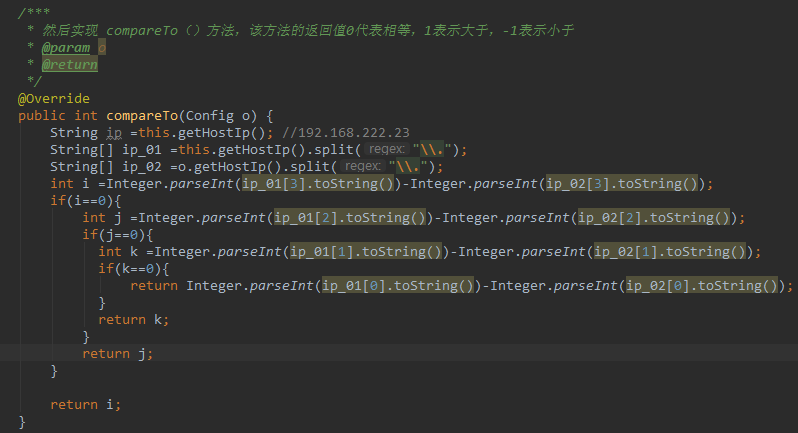

然后，排序`Collections.sort(list);`

> 实现comparator接口，Comparator是在集合外部实现的排序。  如果你不想使用自然排序，没问题，那么就定义一个Comparator对象，将逻辑在那里面去实现，然后使用Collections.sort(List list, Comparator comparator)。

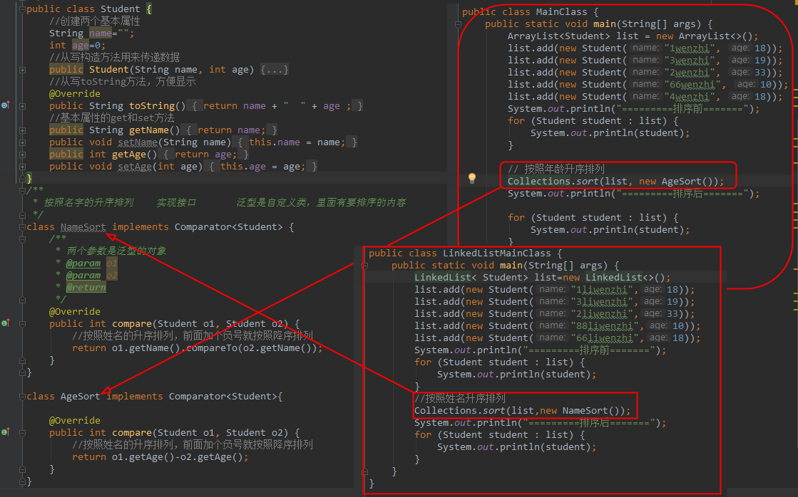

【总结一下】：

1、 <font size=3 color=red>其实所有的集合排序最后都可以转换为List的排序，因为Collections本身提供了对List排序的支持。</font>
   
2、Map可以变为set，set可以变为list，所以都可以变为list。
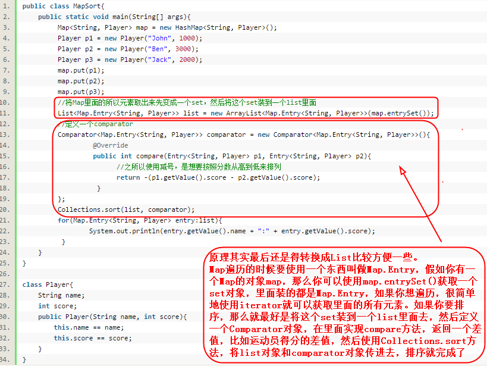

## 详细阐述一下Spring的事务保障机制是如何运行的。

## 详述redis的分片原理

## spring mvc 如何实现统一异常处理

## 如何实现分布式锁

## spring mail和Java Mail的区别

使用[通过Spring Mail Api发送邮件](http://blog.csdn.net/smcwwh/article/details/7095027)


## Object流与序列化

- 对象类必须序列化，即实现Serializable接口，才能整个读写。
- 如果对象的成员变量前加上transient关键字，则该成员变量不能写入其值。

延伸：为什么要bean实现Serializable接口实例化？

## Java日志体系概述

常用的日志框架有哪些？

| 名称        | jar           | 描述  |
| ------------- |:-------------:| -----:|
| log4j      | log4j-1.2.17.jar | 早期常用的日志组件 |
| logback      |  logback-core、logback-classic、logback-access   |  一套日志组件的实现,性能优于log4j(slf4j阵营)  |
| log4j2 | log4j、log4j-api、log4j-core      |   apache开发的一款Log4j的升级产品 |
| java.util.logging | jdk     |   Java1.4开发以来的官方日志实现。无需第三方依赖|

延伸1：<font color=#green>如果让你开发一个类似Spring框架，你会采用上述哪个组件？</font>
   
   发现哪个都不能选，只能基于实际应用来使用的日志组件。不然就会日志打印多份。怎么找到应用实际使用的日志组件 JCL (Apache Commons loging) 解决了这个问题。（例如：spring框架采用的就是jcl）

延伸2：<font color=#green>假如你们系统当中之前在用JCL打印日志，但这时候加入slf4j来打印日志，就会出现两类日志输出如何解决？</font>

只要classPath当中指定sfl4j适配器jar包，即可无缝将日志输出到slf4j上来

- jcl-over-slfj：转移jcl日志到slf4j
- log4j-over-slfj：转移log4j日志至slf4j
- jul-over-sl4j：转移jul日志至slf4j

slf4j各个部件总结：

| 名称        |描述          | 相关jar包  |
| ------------- |:-------------:| -----:|
|门面:|slf4j API接口|slf4j-api.jar|
|桥接器:|用于slf4j连接对应日志实现|slf4j-log4j12.jar、slf4j-jdk14.jar、log4j-slf4j-impl、logback-classic.jar、slf4j-jcl.jar|
|适配器(替换器)：|用于将原来日志输出无缝转移到slf4j|jcl-over-slfj、log4j-over-slfj、jul-over-sl4j|
|具体实现：|日志的具体实现|log4j、logback、log4j2、java.util.logging|

延伸3：<font color=#green>log4j同时桥接又适配器到slf4j会有什么问题发生？</font>

slfj错误集成导致死循环

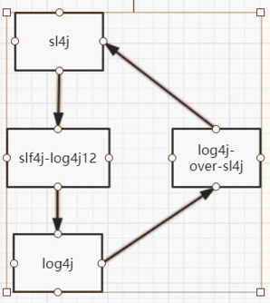

延伸4：<font color=#green>slf4j+log4j2统一系统日志</font>

## 通过Spring工具类获取classpath下的文件资源

+ 1、资源文件不在jar中

```
File cfgFile = ResourceUtils.getFile("classpath:test.txt");
或者
org.springframework.core.io.Resource fileRource = new ClassPathResource("test.txt");
获取文件：fileRource.getFile();
获取文件流：fileRource.getInputStream();
```

+ 2、资源文件在jar中

```
org.springframework.core.io.Resource fileRource = new ClassPathResource("test.txt");
获取文件流：fileRource.getInputStream();
注：不管是文件系统中的类资源，还是JAR中的类资源文件，都可以以流的形式读取
```

## Spring 面向切面编程的三种方式以及常用相关案例总结

### 面向切面编程3个方式

+ 方式一： 实现接口方式
	+ 1)执行前增强：MethodBeforeAdvice接口
	```java
	public void before(Method arg0, Object[] arg1, Object arg2){

	}
	```
	+ 2)执行前增强：AfterReturningAdvice接口
	```java
	public void afterReturning(Object arg0, Method arg1, Object[] arg2,Object arg3) throws Throwable {

	}
	```
	+ 3)异常抛出时增强:ThrowAdvice接口
	```java
	/***
	 * Method method----目标方法,
	 * Object[] args----方法中的参数,
	 * Object target----目标对象,
	 * SQLException ex------特定的异常对象， 即该异常时才会使用增强方法
	 **/
	public void afterThrowing(Method method, Object[] args, Object target,SQLException ex) {

	}
	```

	+ 4)环绕增强：MethodInterceptor
	```java
	public Object invoke(MethodInvocation arg0) throws Throwable {
		//Object target = arg0.getThis(); // 获取被代理对象
			
		//Method method = arg0.getMethod(); // 获取被代理方法
			
		//Object[] args = arg0.getArguments(); // 获取方法参数
			
		//Object result = arg0.proceed(); // 调用目标方法，获取目标方法返回值--------注意抛出异常，用来定义异常是的输出。

	}
	```

	+ 5)使用的是aop标签：定义bean用来指代特定的需调用的切面的类，后织入增强（定义切点以及增强）
	```xml
	<bean id="beforeAdvice" class="com.yunhe.aspect.BeforeAdvice"></bean>
	<aop:config>
	    <aop:pointcut expression="execution(* com.yunhe.biz.*.*(..))" id="pc1"/>
		<aop:advisor advice-ref="beforeAdvice" pointcut-ref="pc1"/>
	</aop:config>
	```

+ 方式二： 注解方式

	+ 1)使用`@Aspect`标示类，表明该类是使用注解是实现增强
	+ 2).执行前增强：`@Before("execution(* biz.IUserBiz.*(..))")` 
	```java
	public void before() { }
	```
	+ 3)执行后增强：`@AfterReturning("execution(* biz.IUserBiz.*(..))")`
	```java
	public void afterReturning() { }
	```
	+ 4)异常抛出时增强：`@AfterThrowing(pointcut = "execution(* biz.IUserBiz.*(..))", throwing = "e")`
	```java
	public void afterThrowing(JoinPoint jp, RuntimeException e) { }
	```
	+ 5)环绕增强：`@Around("execution(* biz.IUserBiz.*(..))")`
	```java
	public Object aroundLogger(ProceedingJoinPoint jp) throws Throwable { }
	```
	+ 6)最终增强：`@After("execution(* biz.IUserBiz.*(..))")`
	```java
	public void afterLogger(JoinPoint jp) { }
	```
	+ 7)spring容器标示类的存在，使用aop标签在容器中表明使用注解方式进行增强
	```xml
	<bean class="aop.UserBizLogger"></bean>
	<aop:aspectj-autoproxy />
	```
	+ 8)`JoinPoint jp`的方法：
	```xml
	Object target = jp.getTarget(); // 获取被代理对象
	
	Method method = jp.getSignature(); // 获取被代理方法
	
	Object[] args = jp.getArgs(); // 获取方法参数，通常Arrays.toString(jp.getArgs())转化后用来输出参数表列
	
	Object result = jp.proceed(); // 调用目标方法，获取目标方法返回值--------注意抛出异常，用来定义异常是的输出。

	```

+ 方式三： Schama方式:普通JavaBean使用aop标签在容器中定义

	+ 1)前置增强：<aop:after>
	```java
	public void before(JoinPoint  jp) { }
	```
	+ 2)后置增强：<aop:after-returning>
	```java
	public void afterReturning(JoinPoint  jp, Object  result) { }
	```


	+ 3)异常抛出时增强：<aop:after-throwing>
	```java
	public void afterThrowing(JoinPoint jp,RuntimeException e) { }
	```


	+ 4)环绕增强：<aop:around>
	```java
	public Object aroundLogger(ProceedingJoinPoint jp) throws Throwable { } 
	```
	+ 5)最终增强：<aop:aspect>
	```java
	public void afterLogger(JoinPoint  jp) { }
	```
	+ 6)定义增强类，织入（定义切点，织入）
	```xml
	<bean id="theLogger" class="aop. AfterLogger"></bean>
	<aop:config>
		<aop:pointcut id="pointcut" expression="execution(* biz.IUserBiz.*(..))" />
		<aop:aspect ref="theLogger">
			<aop:after  method="afterLogger"  pointcut-ref="pointcut" />
		</aop:aspect>
	</aop:config> 
	```

**使用到aop切面编程的场景：**

<font color=#009A61 size=3>场景一：log4j实现记录日志---接口</font>

1.实现方式：利用实现接口的Aop方法给特定方法执行后置增强

2.步骤：添加log4j.properties在src下，以及log4j-1.2.17.jar添加lib下

3.实现类实现接口用来定义
```java
public class AfterAdvice implements AfterReturningAdvice {  
    Logger logger = Logger.getLogger(AfterAdvice.class);  
    public void afterReturning(Object arg0, Method arg1, Object[] arg2,Object arg3) throws Throwable {  
        // TODO Auto-generated method stub  
        logger.debug("后置：执行对象：" + arg3 + "的方法为：" + arg1.getName() );  
    }  
}
```
4.Spring容器中定义切入方式（一个点多个面，一个面多个点均可）
```xml
  <bean id="beforeAdvice" class="com.yunhe.aspect.BeforeAdvice"></bean>  
  <bean id="afterAdvice" class="com.yunhe.aspect.AfterAdvice"></bean>  
  <aop:config>  
	<aop:pointcut expression="execution(* com.yunhe.biz.*.*(..))" id="pc1"/>  
	<aop:advisor advice-ref="beforeAdvice" pointcut-ref="pc1"/>  
	<aop:advisor advice-ref="afterAdvice" pointcut-ref="pc1"/> 
  </aop:config> 
```
  5.log4j.properties的配置文件信息
  ```xml
  log4j.rootLogger=debug, stdout,logfile 

  log4j.appender.stdout=org.apache.log4j.ConsoleAppender log4j.appender.stdout.Target=System.err  log4j.appender.stdout.layout=org.apache.log4j.SimpleLayout  
  log4j.appender.logfile=org.apache.log4j.FileAppender  log4j.appender.logfile.File=jbit.log  log4j.appender.logfile.layout=org.apache.log4j.PatternLayout  
log4j.appender.logfile.layout.ConversionPattern=%d{yyyy-MM-dd HH:mm:ss} %l %F %p %m%n 
  ```

<font color=#009A61 size=3>场景二：环绕增强---接口</font>

1.实现方式：利用实现接口的Aop方法给特定方法执行环绕增强，并在产生异常的情况下进行提示

2.步骤：添加`log4j.properties`在src下，以及log4j-1.2.17.jar添加lib下

3.实现类实现接口用来定义
```java
public class AroundLogger implements MethodInterceptor {  
     private static final Logger log = Logger.getLogger(AroundLogger.class);  
     public Object invoke(MethodInvocation arg0) throws Throwable {  
         Object target = arg0.getThis(); // 获取被代理对象  
         Method method = arg0.getMethod(); // 获取被代理方法  
         Object[] args = arg0.getArguments(); // 获取方法参数  
         log.info("调用 " + target + " 的 " + method.getName() + " 方法。方法入参："+ Arrays.toString(args));  
         try {  
             Object result = arg0.proceed(); // 调用目标方法，获取目标方法返回值  
             log.info("调用 " + target + " 的 " + method.getName() + " 方法。方法返回值：" + result);  
             return result;  
         } catch (Throwable e) {  
             log.error(method.getName() + " 方法发生异常：" + e);  
             throw e;  
         }  
     }  
 }  
```

4.Spring容器配置
```xml
<bean id="aroundLogger" class="aop.AroundLogger"></bean>
<aop:config>
   <aop:pointcut id="pointcut" expression="execution(* biz.IUserBiz.*(..))" />
   <aop:advisor pointcut-ref="pointcut" advice-ref="aroundLogger" />  
</aop:config>
```
<font color=#009A61 size=3>场景三：特定异常增强---注解</font>

1.使用注解的Aop方式实现异常增强

2.方法中
```java
@Aspect  
public class ErrorLogger {  
	private static final Logger log = Logger.getLogger(ErrorLogger.class);  
	@AfterThrowing(pointcut = "execution(* biz.IUserBiz.*(..))", throwing = "e")  
	public void afterThrowing(JoinPoint jp, RuntimeException e) {  
		log.error(jp.getSignature().getName() + " 方法发生异常：" + e);  
	}  
}  
```
3.Spring容器配置
```xml
<bean class="aop.ErrorLogger"></bean>
<aop:aspectj-autoproxy />
```

<font color=#009A61 size=3>场景四：环绕增强---注解</font>

1.使用注解方式实现环绕增强

2.
```java
@Aspect  
public class AroundLogger {  
     private static final Logger log = Logger.getLogger(AroundLogger.class);  
     @Around("execution(* biz.IUserBiz.*(..))")  
     public Object aroundLogger(ProceedingJoinPoint jp) throws Throwable {  
         log.info("调用 " + jp.getTarget() + " 的 " + jp.getSignature().getName()+ " 方法。方法入参：" + Arrays.toString(jp.getArgs()));  
         try {   
		    Object result = jp.proceed();  
            log.info("调用 " + jp.getTarget() + " 的 "+ jp.getSignature().getName() + " 方法。方法返回值：" + result);  
            return result;  
        } catch (Throwable e) {  
		   log.error(jp.getSignature().getName() + " 方法发生异常：" + e);  
		   throw e; 
		}  
     }   
}  
```

3.注解方式的前置后置以及最终增强类型
```java
@Aspect  
public class AfterLogger {  
	private static final Logger log = Logger.getLogger(AfterLogger.class);  
	@After("execution(* biz.IUserBiz.*(..))")  
	public void afterLogger(JoinPoint jp) {  
      log.info(jp.getSignature().getName() + " 方法结束执行。");  
   }  
}  
```
```java
@Aspect  
public class UserBizLogger {
  private static final Logger log = Logger.getLogger(UserBizLogger.class);
  @Before("execution(* biz.IUserBiz.*(..))")
  public void before() {
     log.info("即将调用业务方法");
  }
  @AfterReturning("execution(* biz.IUserBiz.*(..))")
  public void afterReturning() {
     log.info("业务方法调用完毕");
  }
}
```

<font color=#009A61 size=3>场景五：环绕增强-----schema方式</font>

1.使用注解方式实现环绕增强
```java
public class AroundLogger {  
   public Object aroundLogger(ProceedingJoinPoint jp) throws Throwable { … }   
}
``` 
```xml
<bean id="theLogger" class="aop. AroundLogger"></bean>  
<aop:config>  
   <aop:pointcut id="pointcut" expression="execution(* biz.IUserBiz.*(..))" />  
   <aop:aspect ref="theLogger">  
       <aop:around  method="aroundLogger"  pointcut-ref="pointcut" />  
   </aop:aspect>  
</aop:config>  

```
<font color=#009A61 size=3>场景六：最终增强-----schema方式</font>
```java
public class AfterLogger {  
	public void afterLogger(JoinPoint  jp) { … }  
}  
```
```xml
<bean id="theLogger" class="aop. AfterLogger"></bean>  
<aop:config>  
   <aop:pointcut id="pointcut" expression="execution(* biz.IUserBiz.*(..))" />  
   <aop:aspect ref="theLogger">  
	  <aop:after  method="afterLogger"  pointcut-ref="pointcut" />  
   </aop:aspect>  
</aop:config>  

```

## servlet/filter/listener/interceptor区别与联系

+ **servlet：** servlet是一种运行服务器端的java应用程序

+ **filter：** filter是一个可以复用的代码片段，可以用来转换HTTP请求、响应和头信息。

+ **listener：** 监听器,通过listener可以监听web服务器中某一个执行动作，并根据其要求作出相应的响应

+ **interceptor：** 是在面向切面编程的,就是在你的service或者一个方法，前调用一个方法，或者在方法后调用一个方法，是基于JAVA的反射机制。(比如动态代理就是拦截器的简单实现)

### 延伸1： 

servlet、filter、listener是配置到web.xml中（web.xml 的加载顺序是：`context-param -> listener -> filter -> servlet` ），interceptor不配置到web.xml中，struts的拦截器配置到struts.xml中。spring的拦截器配置到spring.xml中。 

## servlet vs filter

1) Filter不像Servlet，它不能产生一个请求或者响应，它只是修改对某一资源的请求，或者修改从某一的响应。

## 为什么有些设计要有空接口？

<font size=3 face="黑体" color=#FF768C >一个类只能继承一个父类，但是可以实现一个或多个接口</font>

<font size=3 face="黑体" color=#FF768C >定义空接口，就是为了定义一组规范。[让别人依据规范来开发](空接口仅做标记使用，无其他含义)</font>

**抽象类：** 抽象类体内可以有被实例的方法，但必须至少有一个抽象方法，而接口的方法必须是抽象的。抽象类只是被继承一次，而一个类可以有N个接口。
**接口** Java接口本身没有任何实现，因为Java接口不涉及表象，而只描述public行为，所以Java接口比Java抽象类更抽象化。Java接口的方法只能是抽象的和公开的，而抽象类可以有私有的属性。

接口有方法，属性，索引器（有参属性），事件四种成员。

## java事件机制包括哪三个部分？分别介绍。

## 为什么要使用线程池？

**延伸1：线程池有什么作用？**

**延伸2：说说几种常见的线程池及使用场景。**

**延伸3：线程池都有哪几种工作队列？**

**延伸4：怎么理解无界队列和有界队列？**

**延伸5：线程池中的几种重要的参数及流程说明。**

##什么是反射机制？##

**延伸1：说说反射机制的作用。**

**延伸2：反射机制会不会有性能问题？**

##你怎么理解http协议？##

**延伸1：说说http协议的工作流程。**

**延伸2：http有哪些请求提交方式？**

**延伸3：http中的200,302,403,404,500,503都代表什么状态？**

**延伸4：http get和post有什么区别？**

**延伸5：什么是https，说说https的工作原理？**

**延伸6：什么是http代理服务器，有什么用？**

##你怎么理解cookie和session，有哪些不同点？##

##什么是web缓存？有什么优点？##

##什么是虚拟主机及实现原理？##

**延伸1：什么是Java虚拟机，为什么要使用？**

**延伸2：说说Java虚拟机的生命周期及体系结构。**

**延伸3：说一说Java内存区域。**

##什么是分布式系统？##

**延伸1：分布式系统你会考虑哪些方面？**

**延伸2：从分布式系统部署角度考虑，分哪几层？**

**延伸3：为了解决数据库服务器的负担，如何做数据库的分布？**

**延伸4：如何解决业务层的数据访问问题？**

**延伸5：分布式系统设计你会考虑哪些策略？**

**延伸6：最常见的数据分布方式是什么？**

##什么是DoS、DDoS、DRDoS攻击？如何防御？##

##什么是检查异常，不受检查异常，运行时异常？并分别举例说明。##

**延伸1：描述一下Java异常层次结构。**

**延伸2：finally块一定会执行吗？**

**延伸3：正常情况下，当在try块或catch块中遇到return语句时，finally语句块在方法返回之前还是之后被执行？**

**延伸4：try、catch、finally语句块的执行顺序。**

## 基于Cookie/服务端的认证

身份认证是Web应用中极重要的一个部分，Cookie和基于服务器的身份验证（Session）一直都是最简单而常见的解决方案

在传统的基于Cookie/服务端方案中,用户的每个请求中携带Cookie，服务端据此识别用户。

**这种方式可能存在很多问题:**

+ 它在跨域场景表现并不好
+ 很难提供对移动端的支持
+ 存在跨站点脚本攻击（XSS）的风险
+ 很难在两个使用不同语言编写的web框架间共享session数据。

## 基于Token的认证

在API被广泛使用的今天（广泛到不少应用后端仅需提供API就好了），为API设计更合适的身份认证解决方案就变得十分必要，`OAuth 2.0`和`JSON Web Token（JWT）`是这些解决方案中最流行的

**基于Token的认证，除了能回避Cookie存在的问题，还有许多额外的优点：**

+ **无状态：** 由于Token已经自包含了所有的用户信息，所以无须再存储Session， 服务端易于扩展。
+ **内容分发：** 易于实现CDN，将静态资源分布到CDN上，某些CDN服务商提供了基于Token验证的安全服务，服务器仅提供API
+ **解耦：** 无须被绑定在一个特定的验证方案。作为独立的会话系统，利于实现分布式
+ **基于标准：** JWT作为Token的标准已经被广泛的接受。主流语言都有相应支持JWT标准的工具包

## instanceof VS isInstance

+ obj.instanceof(class) 判断对象是不是某种对象，这个分成三种情况

1) 对象是不是本身类的对象

2) 对象是不是本身接口（接口的接口）和本身父类（父类的父类）的对象

3) 所有对象都是Object

+ class.isInstance(obj) 对象能不能被强转成对象，这个也分成三种情况

1) 对象能不能被自己对象强转

2) 对象能不能被自己对象所继承的类和实现的接口强转

3) 对象能不能被object强转

```java
public class X { }

public class Y extends X { }

public class TestObj {
    public static void main(String[] args) {
        Y y = new Y();
        X x = new X();
        X yx = new Y();
        System.out.println("=======1=======");
        System.out.println(y instanceof Y);
        System.out.println(y instanceof X);
        System.out.println(y instanceof Object);
        System.out.println("=======2=======");
        System.out.println(y.getClass().isInstance(y));
        System.out.println(y.getClass().isInstance(x));
        System.out.println("=======3=======");
        System.out.println(x.getClass().isInstance(yx));
        System.out.println(y.getClass().isInstance(yx));
        System.out.println("=======4=======");
        System.out.println(X.class.isInstance(x));
        System.out.println(X.class.isInstance(y));
        System.out.println(X.class.isInstance(yx));
        System.out.println("=======5=======");
        System.out.println(Y.class.isInstance(x));
        System.out.println(Y.class.isInstance(y));
        System.out.println(Y.class.isInstance(yx));
        System.out.println("=======6=======");
        System.out.println(Object.class.isInstance(y));
    }
}
```

## Java RMI与RPC的区别

+ **RMI:** 远程方法调用(Remote Method Invocation)。<font color=#FF5E52 size=4>能够让在客户端Java虚拟机上的对象像调用本地对象一样调用服务端java 虚拟机中的对象上的方法。</font>


+ **RPC（Remote Procedure Call Protocol）** 远程过程调用协议，通过网络从远程计算机上请求调用某种服务。

**RPC与RMI的区别:**
```
1) 方法调用方式不同：

 RMI中是通过在客户端的Stub对象作为远程接口进行远程方法的调用。每个远程方法都具有方法
 签名。如果一个方法在服务器上执行，但是没有相匹配的签名被添加到这个远程接口(stub)上，
 那么这个新方法就不能被RMI客户方所调用。

  RPC中是通过网络服务协议向远程主机发送请求，请求包含了一个参数集和一个文本值，通常形
  成“classname.methodname(参数集)”的形式。RPC远程主机就去搜索与之相匹配的类和方
  法，找到后就执行方法并把结果编码，通过网络协议发回。

2) 适用语言范围不同：

   RMI只用于Java；

   RPC是网络服务协议，与操作系统和语言无关。

3) 调用结果的返回形式不同：

    Java是面向对象的，所以RMI的调用结果可以是对象类型或者基本数据类型；

    RMI的结果统一由外部数据表示 (External Data Representation, XDR) 语言表示，这
	种语言抽象了字节序类和数据类型结构之间的差异。
```

>java RMI的缺点：

1) 从代码中也可以看到，代码依赖于ip与端口

2) RMI依赖于Java远程消息交换协议JRMP（Java Remote Messaging Protocol），该协议为java定制，要求服务端与客户端都为java编写

## 分布式、集群环境中，缓存如何刷新，如何保持同步？

答：A、缓存如何刷新？ 
- 1、定时刷新  
- 2、主动刷新覆盖 ，每个缓存框架都有自带的刷新机制，或者说缓存失效机制，就拿Redis和 Ehcache举例， 他们都有自带的过期机制，另外主动刷新覆盖时，只需获取对应的key进行数据的覆盖即可

B、缓存如何保持同步？  这个redis有自带的集群同步机制，即复制功能，具体参考：[基于Redis分布式缓存实现](http://blog.csdn.net/pi9nc/article/details/17719737)      ，Ehcache也有分布式缓存同步的配置，只需要配置不同服务器地址即可，参照：[Ehcache分布式缓存同步](http://blog.csdn.net/bjyfb/article/details/7939672)

## 一条sql执行过长的时间，你如何优化，从哪些方面？

1、查看sql是否涉及多表的联表或者子查询，如果有，看是否能进行业务拆分，相关字段冗余或者合并成临时表（业务和算法的优化）  
2、涉及链表的查询，是否能进行分表查询，单表查询之后的结果进行字段整合   
3、如果以上两种都不能操作，非要链表查询，那么考虑对相对应的查询条件做索引。加快查询速度   
4、针对数量大的表进行历史表分离（如交易流水表）   
5、数据库主从分离，读写分离，降低读写针对同一表同时的压力，至于主从同步，mysql有自带的binlog实现 主从同步   
6、explain分析sql语句，查看执行计划，分析索引是否用上，分析扫描行数等等  
7、查看mysql执行日志，看看是否有其他方面的问题  

个人理解：从根本上来说，查询慢是占用mysql内存比较多，那么可以从这方面去酌手考虑


## 集群环境中，session如何实现共享

1、Java集群之session共享    
2、session多服务器共享方案，还有一种方案就是使用一个固定的服务器专门保持session，其他服务器共享

## Dubbo 和Spring cloud 的区别？

## Memcache 与 Redis 的区别

- memcache把数据存在内存之中，断电后会挂掉；Redis部分数据持久化在硬盘上，断电不会丢失。

- memcache存的是key-value对，redis支持更多的数据结构和数据类型

- memcache可以使用一致性hash做分布式，redis可以做主从同步

- redis单线程，只使用1个cpu

## 线程

延伸01：进程和线程的区别，进程间如何通讯，线程间如何通讯？

## 什么是XSS攻击？什么是SQL注入攻击？什么是CSRF攻击？ 

- XSS（Cross Site Script，跨站脚本攻击）

是向网页中注入恶意脚本在用户浏览网页时在用户浏览器中执行恶意脚本的攻击方式。跨站脚本攻击分有两种形式：反射型攻击（诱使用户点击一个嵌入恶意脚本的链接以达到攻击的目标，目前有很多攻击者利用论坛、微博发布含有恶意脚本的URL就属于这种方式）和持久型攻击（将恶意脚本提交到被攻击网站的数据库中，用户浏览网页时，恶意脚本从数据库中被加载到页面执行，QQ邮箱的早期版本就曾经被利用作为持久型跨站脚本攻击的平台）。XSS虽然不是什么新鲜玩意，但是攻击的手法却不断翻新，防范XSS主要有两方面：消毒（对危险字符进行转义）和HttpOnly（防范XSS攻击者窃取Cookie数据）。


- SQL注入攻击是注入攻击最常见的形式

（此外还有OS注入攻击（Struts 2的高危漏洞就是通过OGNL实施OS注入攻击导致的）），当服务器使用请求参数构造SQL语句时，恶意的SQL被嵌入到SQL中交给数据库执行。SQL注入攻击需要攻击者对数据库结构有所了解才能进行，攻击者想要获得表结构有多种方式：（1）如果使用开源系统搭建网站，数据库结构也是公开的（目前有很多现成的系统可以直接搭建论坛，电商网站，虽然方便快捷但是风险是必须要认真评估的）；（2）错误回显（如果将服务器的错误信息直接显示在页面上，攻击者可以通过非法参数引发页面错误从而通过错误信息了解数据库结构，Web应用应当设置友好的错误页，一方面符合最小惊讶原则，一方面屏蔽掉可能给系统带来危险的错误回显信息）；（3）盲注。防范SQL注入攻击也可以采用消毒的方式，通过正则表达式对请求参数进行验证，此外，参数绑定也是很好的手段，这样恶意的SQL会被当做SQL的参数而不是命令被执行，JDBC中的PreparedStatement就是支持参数绑定的语句对象，从性能和安全性上都明显优于Statement。

- CSRF攻击（Cross Site Request Forgery，跨站请求伪造）

是攻击者通过跨站请求，以合法的用户身份进行非法操作（如转账或发帖等）。CSRF的原理是利用浏览器的Cookie或服务器的Session，盗取用户身份，其原理如下图所示。防范CSRF的主要手段是识别请求者的身份，主要有以下几种方式：（1）在表单中添加令牌（token）；（2）验证码；（3）检查请求头中的Referer（前面提到防图片盗链接也是用的这种方式）。令牌和验证都具有一次消费性的特征，因此在原理上一致的，但是验证码是一种糟糕的用户体验，不是必要的情况下不要轻易使用验证码，目前很多网站的做法是如果在短时间内多次提交一个表单未获得成功后才要求提供验证码，这样会获得较好的用户体验。


**补充：** 防火墙的架设是Web安全的重要保障，ModSecurity是开源的Web防火墙中的佼佼者。企业级防火墙的架设应当有两级防火墙，Web服务器和部分应用服务器可以架设在两级防火墙之间的DMZ，而数据和资源服务器应当架设在第二级防火墙之后。

##  什么是领域模型(domain model)？贫血模型(anaemic domain model)和充血模型(rich domain model)有什么区别？

答：领域模型是领域内的概念类或现实世界中对象的可视化表示，又称为概念模型或分析对象模型，它专注于分析问题领域本身，发掘重要的业务领域概念，并建立业务领域概念之间的关系。
**贫血模型**是指使用的领域对象中只有setter和getter方法（POJO），所有的业务逻辑都不包含在领域对象中而是放在业务逻辑层。有人将我们这里说的贫血模型进一步划分成失血模型（领域对象完全没有业务逻辑）和贫血模型（领域对象有少量的业务逻辑），我们这里就不对此加以区分了。**充血模型**将大多数业务逻辑和持久化放在领域对象中，业务逻辑（业务门面）只是完成对业务逻辑的封装、事务和权限等的处理。下面两张图分别展示了贫血模型和充血模型的分层架构。

**贫血模型**


**充血模型**


贫血模型下组织领域逻辑通常使用事务脚本模式，让每个过程对应用户可能要做的一个动作，每个动作由一个过程来驱动。也就是说在设计业务逻辑接口的时候，每个方法对应着用户的一个操作，这种模式有以下几个有点：
- 它是一个大多数开发者都能够理解的简单过程模型（适合国内的绝大多数开发者）。 
- 它能够与一个使用行数据入口或表数据入口的简单数据访问层很好的协作。 
- 事务边界的显而易见，一个事务开始于脚本的开始，终止于脚本的结束，很容易通过代理（或切面）实现声明式事务。 

然而，事务脚本模式的缺点也是很多的，随着领域逻辑复杂性的增加，系统的复杂性将迅速增加，程序结构将变得极度混乱。开源中国社区上有一篇很好的译文《贫血领域模型是如何导致糟糕的软件产生》对这个问题做了比较细致的阐述。


## 谈一谈测试驱动开发（TDD）的好处以及你的理解。 

答：TDD是指在编写真正的功能实现代码之前先写测试代码，然后根据需要重构实现代码。在JUnit的作者Kent Beck的大作《测试驱动开发：实战与模式解析》（Test-Driven Development: by Example）一书中有这么一段内容：“消除恐惧和不确定性是编写测试驱动代码的重要原因”。因为编写代码时的恐惧会让你小心试探，让你回避沟通，让你羞于得到反馈，让你变得焦躁不安，而TDD是消除恐惧、让Java开发者更加自信更加乐于沟通的重要手段。TDD会带来的好处可能不会马上呈现，但是你在某个时候一定会发现，这些好处包括：
- 更清晰的代码 — 只写需要的代码 
- 更好的设计 
- 更出色的灵活性 — 鼓励程序员面向接口编程 
- 更快速的反馈 — 不会到系统上线时才知道bug的存在

**补充：** 敏捷软件开发的概念已经有很多年了，而且也部分的改变了软件开发这个行业，TDD也是敏捷开发所倡导的。

TDD可以在多个层级上应用，包括单元测试（测试一个类中的代码）、集成测试（测试类之间的交互）、系统测试（测试运行的系统）和系统集成测试（测试运行的系统包括使用的第三方组件）。TDD的实施步骤是：红（失败测试）- 绿（通过测试） - 重构。
在使用TDD开发时，经常会遇到需要被测对象需要依赖其他子系统的情况，但是你希望将测试代码跟依赖项隔离，以保证测试代码仅仅针对当前被测对象或方法展开，这时候你需要的是测试替身。测试替身可以分为四类：
- 虚设替身：只传递但是不会使用到的对象，一般用于填充方法的参数列表 
- 存根替身：总是返回相同的预设响应，其中可能包括一些虚设状态 
- 伪装替身：可以取代真实版本的可用版本（比真实版本还是会差很多） 

## 理解Java的PRC技术

**RPC概念**

RPC即远程过程调用（Remote Procedure Call），这么讲你可能不明白，画个图

+ RPC（远程过程调用）就是一功能的称呼

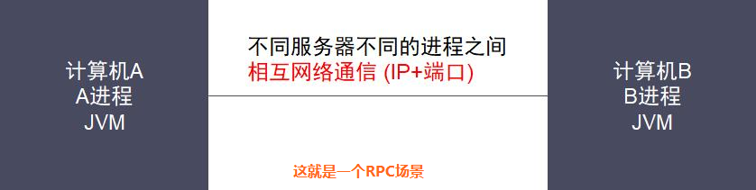

+ RPC核心过程包括了客户端和服务端的**通讯协议，寻址，数据序列化/反序列化**

举个例子，你（客户端）要一个外国人（服务端）帮你干一件事情，这就是RPC的过程，这个过程是这样的：

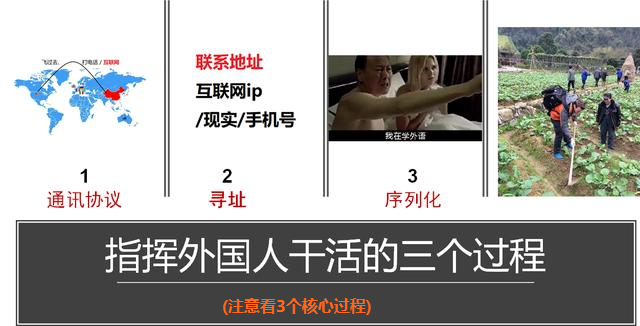

你可以选择飞过去找一个外国人(寻址)，面对面的交谈(通信)，要让她帮你干活，你们之间必须用一样的语言(数据序列化)进行交流。

+ RPC协议

协议就是，详细的规定了上面说的RPC三个核心过程怎么样去实现。比如：规定协议是tcp还是udp，你通过什么方式去找到服务端的地址，请求/响应数据如何去组装。

http，dubbo-rpc，rmi等很多协议都属于rpc范畴，如果你要基于他们去实现rpc，就得遵守它们这个协议。

就像你要去写一个http客户端，你就必须按照它的要求去实现，组装数据的方式也要按它的来。

+ RPC框架

对上述核心过程进行了封装，不需要开发人员自己去定义协议、实现序列化的细节工作，这样的组件称为RPC框架，常见的框架比如：**thrift，gRpc，dubbo，motan** 。

小结：

**RPC技术被称为分布式系统的基石**，在互联网公司应用是最广泛的，如果你长期重复没技术含量的工作，还没有接触过这些分布式系统开发技术，一定用心学习，提升自己的竞争力。

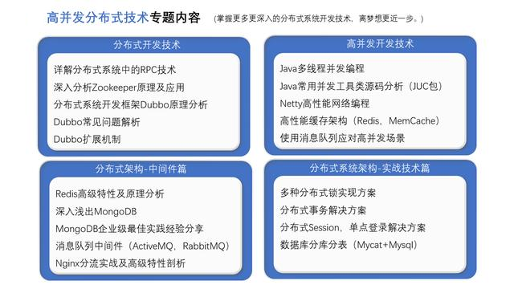

## java获取当前类的绝对路径

### 1.如何获得当前文件路径
常用：

+ (1).Test.class.getResource("")

得到的是当前类FileTest.class文件的URI目录。不包括自己！

+ (2).Test.class.getResource("/")

得到的是当前的classpath的绝对URI路径。

+ (3).Thread.currentThread().getContextClassLoader().getResource("")

得到的也是当前ClassPath的绝对URI路径。

+ (4).Test.class.getClassLoader().getResource("")

得到的也是当前ClassPath的绝对URI路径。

+ (5).ClassLoader.getSystemResource("")

得到的也是当前ClassPath的绝对URI路径。
尽量不要使用相对于System.getProperty("user.dir")当前用户目录的相对路径，后面可以看出得出结果五花八门。

+ (6) new File("").getAbsolutePath()也可用。

### 2.Web服务器

+ (1).Tomcat

在类中输出System.getProperty("user.dir");显示的是%Tomcat_Home%/bin

+ (2).Resin

不是你的JSP放的相对路径,是JSP引擎执行这个JSP编译成SERVLET
的路径为根.比如用新建文件法测试File f = new File("a.htm");
这个a.htm在resin的安装目录下

+ (3).如何读文件

使用ServletContext.getResourceAsStream()就可以

+ (4).获得文件真实路径

String   file_real_path=ServletContext.getRealPath("mypath/filename"); 
不建议使用request.getRealPath("/");

**文件操作的类，不建议使用，可以使用commons io类**

目前new FileInputStream()只会使用绝对路径，相对没用过，因为要相对于web服务器地址，比较麻烦。还不如写个配置文件来的快。


### 按Java文件类型分类读取配置文件

+ 1、`servlet`中读写。如果运用Struts 或者Servlet可以直接在初始化参数中配置，调用时根据`servletcontext的getRealPath("/")`获
取真实路径，再根据 `String file = this.servlet.getInitParameter("abc")`;获取相对的WEB-INF的相对路径。

```java
InputStream input = Thread.currentThread().getContextClassLoader().getResourceAsStream("abc.properties");
Properties prop = new Properties();
prop.load(input);
input.close();
OutputStream out = new FileOutputStream(path);
prop.setProperty("abc", “test");
prop.store(out, “–test–");
out.close();
```

+ 2、直接在jsp中操作，通过jsp内置对象获取可操作的绝对地址。
```java
// jsp页面
String path = pageContext.getServletContext().getRealPath("/");
String realPath = path+"/WEB-INF/classes/abc.properties";
 
//java 程序
InputStream in = getClass().getClassLoader().getResourceAsStream("abc.properties"); // abc.properties放在webroot/WEB-INF/classes/目录下
prop.load(in);
in.close();
 
OutputStream out = new FileOutputStream(path); // path为通过页面传入的路径
prop.setProperty("abc", “abcccccc");
prop.store(out, “–test–");
out.close();
```

+ 3、只通过Java程序操作资源文件

```java
InputStream in = new FileInputStream("abc.properties"); // 放在classes同级
OutputStream out = new FileOutputStream("abc.properties");

//1、利用System.getProperty()函数获取当前路径：
System.out.println(System.getProperty("user.dir"));//user.dir指定了当前的路径

/**
 * 2、使用File提供的函数获取当前路径：
 *File.getCanonicalPath() 和 File.getAbsolutePath() 大约只是对于new File(".")和new File("..")两种路径有所区别。
 * 对于getCanonicalPath()函数，“."就表示当前的文件夹，而”..“则表示当前文件夹的上一级文件夹
 * 对于getAbsolutePath()函数，则不管”.”、“..”，返回当前的路径加上你在new File()时设定的路径
 * 至于getPath()函数，得到的只是你在new File()时设定的路径
 **/
File directory = new File("");//设定为当前文件夹
try{
    System.out.println(directory.getCanonicalPath());//获取标准的路径
    System.out.println(directory.getAbsolutePath());//获取绝对路径
}catch(Exceptin e){  }

//比如当前的路径为 C:\test ：
File directory = new File("abc");
directory.getCanonicalPath(); //得到的是C:\test\abc
directory.getAbsolutePath();    //得到的是C:\test\abc
direcotry.getPath();                    //得到的是abc

File directory = new File(".");
directory.getCanonicalPath();   //得到的是C:\test
directory.getAbsolutePath();    //得到的是C:\test\.
direcotry.getPath();                    //得到的是.

File directory = new File("..");
directory.getCanonicalPath(); //得到的是C:\
directory.getAbsolutePath();    //得到的是C:\test\..
direcotry.getPath();                    //得到的是..


//System.getProperty()中的字符串参数如下：
<p>System.getProperty()参数大全
# java.version                                Java Runtime Environment version 
# java.vendor                                Java Runtime Environment vendor 
# java.vendor.url                           Java vendor URL
# java.home                                Java installation directory
# java.vm.specification.version   Java Virtual Machine specification version 
# java.vm.specification.vendor    Java Virtual Machine specification vendor 
# java.vm.specification.name      Java Virtual Machine specification name
# java.vm.version                        Java Virtual Machine implementation version
# java.vm.vendor                        Java Virtual Machine implementation vendor
# java.vm.name                        Java Virtual Machine implementation name 
# java.specification.version        Java Runtime Environment specification version
# java.specification.vendor         Java Runtime Environment specification vendor 
# java.specification.name           Java Runtime Environment specification name 
# java.class.version                    Java class format version number
# java.class.path                      Java class path
# java.library.path                 List of paths to search when loading libraries
# java.io.tmpdir                       Default temp file path
# java.compiler                       Name of JIT compiler to use
# java.ext.dirs                       Path of extension directory or directories 
# os.name                              Operating system name
# os.arch                                  Operating system architecture
# os.version                       Operating system version
# file.separator                         File separator ("/" on UNIX)
# path.separator                  Path separator (":" on UNIX)
# line.separator                       Line separator ("\n" on UNIX)
# user.name                        User's account name
# user.home                              User's home directory
# user.dir                               User's current working directory
```

## servlet/filter/listener/interceptor 区别与联系

> 概念

1、**servlet：** servlet是一种运行服务器端的java应用程序，具有独立于平台和协议的特性，并且可以动态的生成web页面，它工作在客户端请求与服务器响应的中间层。

2、**filter：** filter是一个可以复用的代码片段，可以用来转换HTTP请求、响应和头信息。Filter不像Servlet，它不能产生一个请求或者响应，它只是修改对某一资源的请求，或者修改从某一的响应。

3、**listener：** 监听器，从字面上可以看出listener主要用来监听只用。通过listener可以监听web服务器中某一个执行动作，并根据其要求作出相应的响应。通俗的语言说就是在application，session，request三个对象创建消亡或者往其中添加修改删除属性时自动执行代码的功能组件。

4、**interceptor：** 是在面向切面编程的，就是在你的service或者一个方法，前调用一个方法，或者在方法后调用一个方法，比如动态代理就是拦截器的简单实现，在你调用方法前打印出字符串（或者做其它业务逻辑的操作），也可以在你调用方法后打印出字符串，甚至在你抛出异常的时候做业务逻辑的操作。

5、**servlet、filter、listener是配置到web.xml中**，interceptor不配置到web.xml中，struts的拦截器配置到struts.xml中。spring的拦截器配置到spring.xml中。

> 生命周期

1、servlet：servlet的生命周期始于它被装入web服务器的内存时，并在web服务器终止或重新装入servlet时结束。servlet一旦被装入web服务器，一般不会从web服务器内存中删除，直至web服务器关闭或重新结束。

(1)、装入：启动服务器时加载Servlet的实例；

(2)、初始化：web服务器启动时或web服务器接收到请求时，或者两者之间的某个时刻启动。初始化工作有init（）方法负责执行完成；

(3)、调用：从第一次到以后的多次访问，都是只调用doGet()或doPost()方法；

(4)、销毁：停止服务器时调用destroy()方法，销毁实例。

2、filter：（一定要实现javax.servlet包的Filter接口的三个方法init()、doFilter()、destroy()，空实现也行）

(1)、启动服务器时加载过滤器的实例，并调用init()方法来初始化实例；

(2)、每一次请求时都只调用方法doFilter()进行处理；

(3)、停止服务器时调用destroy()方法，销毁实例。

3、listener：类似于servlet和filter

**web.xml 的加载顺序是：context- param -> listener -> filter -> servlet**

4、interceptor：以struts的拦截器为例，加载了struts.xml以后，初始化相应拦截器。当action请求来时调用intercept方法，服务器停止销毁interceptor。

> 职责

1、servlet：

创建并返回一个包含基于客户请求性质的动态内容的完整的html页面；

创建可嵌入到现有的html页面中的一部分html页面（html片段）；

读取客户端发来的隐藏数据；

读取客户端发来的显示数据；

与其他服务器资源（包括数据库和java的应用程序）进行通信；

通过状态代码和响应头向客户端发送隐藏数据。

2、filter：

filter能够在一个请求到达servlet之前预处理用户请求，也可以在离开servlet时处理http响应：

在执行servlet之前，首先执行filter程序，并为之做一些预处理工作；

根据程序需要修改请求和响应；

在servlet被调用之后截获servlet的执行

3、listener：职责如概念。

servlet2.4规范中提供了8个listener接口，可以将其分为三类，分别如下：

第一类：与servletContext有关的listner接口。包括：ServletContextListener、ServletContextAttributeListener

第二类：与HttpSession有关的Listner接口。包括：HttpSessionListner、HttpSessionAttributeListener、HttpSessionBindingListener、 HttpSessionActivationListener；

第三类：与ServletRequest有关的Listener接口，包括：ServletRequestListner、ServletRequestAttributeListener

4、interceptor：与过滤器十分相似，通过层层拦截，处理用户的请求和响应。

备注：web.xml 的加载顺序是：context-param -> listener -> filter -> servlet 。了解了这几个概念的区别以后，不难理论这个加载顺序了。

> 几个区别：

1,servlet 流程是短的，url传来之后，就对其进行处理，之后返回或转向到某一自己指定的页面。它主要用来在 业务处理之前进行控制.

2,filter 流程是线性的， url传来之后，检查之后，可保持原来的流程继续向下执行，被下一个filter, servlet接收等，而servlet 处理之后，不会继续向下传递。

filter功能可用来保持流程继续按照原来的方式进行下去，或者主导流程，而servlet的功能主要用来主导流程。

filter可用来进行字符编码的过滤，检测用户是否登陆的过滤，禁止页面缓存等

3, servlet,filter都是针对url之类的，而listener是针对对象的操作的，如session的创建，session.setAttribute的发生，在这样的事件发生时做一些事情。

可用来进行：Spring整合Struts,为Struts的action注入属性，web应用定时任务的实现，在线人数的统计等

4，interceptor 拦截器，类似于filter,不过在struts.xml中配置，不是在web.xml,并且不是针对URL的，而是针对action,当页面提交action时，进行过滤操作，

相当于struts1.x提供的plug-in机制，可以看作，前者是struts1.x自带的filter,而interceptor 是struts2 提供的filter.

与filter不同点：

（１）不在web.xml中配置，而是在struts.xml中完成配置，与action在一起

( 2 ) 可由action自己指定用哪个interceptor 来在接收之前做事

5，struts2中的过滤器和拦截器的区别与联系：

（1）、拦截器是基于java反射机制的，而过滤器是基于函数回调的。

（2）、过滤器依赖与servlet容器，而拦截器不依赖与servlet容器。

（3）、拦截器只能对Action请求起作用，而过滤器则可以对几乎所有请求起作用。

（4）、拦截器可以访问Action上下文、值栈里的对象，而过滤器不能。

（5）、在Action的生命周期中，拦截器可以多次调用，而过滤器只能在容器初始化时被调用一次。

五、执行流程图：

1、servlet：
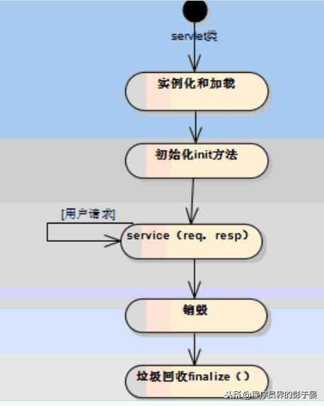
2、filter：

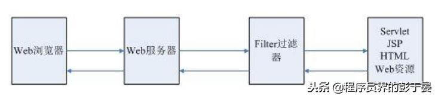
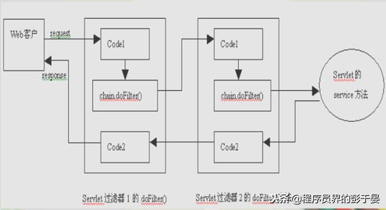
3、listener：

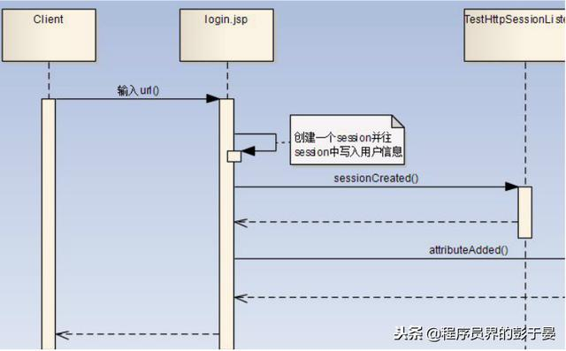
4、interceptor：

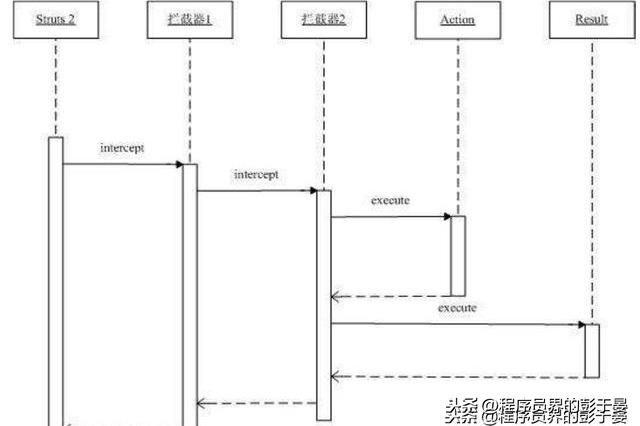


### Filter和Interceptor的区别 

+ 1、filter基于filter接口中的doFilter回调函数，interceptor则基于Java本身的反射机制；

+ 2、filter是依赖于servlet容器的，没有servlet容器就无法回调doFilter方法，而interceptor与servlet无关；

+ 3、filter的过滤范围比interceptor大，filter除了过滤请求外通过通配符可以保护页面、图片、文件等，而interceptor只能过滤请求，只对action起作用，在action之前开始，在action完成后结束（如被拦截，不执行action）；

+ 4、filter的过滤一般在加载的时候在init方法声明，而interceptor可以通过在xml声明是guest请求还是user请求来辨别是否过滤；

+ 5、interceptor可以访问action上下文、值栈里的对象，而filter不能；

+ 6、在action的生命周期中，拦截器可以被多次调用，而过滤器只能在容器初始化时被调用一次。

## 开发中，MyBatis、Hibernate、Spring Data JPA应该如何选择

目前Java开发中MyBatis、Hibernate、Spring Data JPA是3个使用比较普遍的持久化框架

+ 1.Hibernate

Hibernate是将POJO通过Xml映射文件（或注解）提供的规则映射到数据库表上，是一种全表映射的模型，可以通过POJO直接操作数据库。我们不需要写SQL，只要使用HQL语言就可以了。

+ 2.MyBatis

Mybatis是半自动的框架。之所以说它是半自动的，是因为它需要手工匹配提供POJO、SQL和映射关系，而Hibernate只需要提供POJO和映射关系即可。

+ 3.Spring Data JPA

Spring Data JPA是在JPA规范的基础下提供了Repository层的实现，是对ORM框架的进一步抽象封装，它不直接代替ORM框架，默认底层使用的ORM框架是Hibernate，但可以灵活的在各种ORM框架之间切换，同时也简化了我们对ORM框架的使用。

```shell
小结：
综上，使用Hibernate的可以使用Spring Data JPA来简化开发了。
我们只需要在MyBatis和Spring Data JPA之间做选择，而这个选择还是得看MyBatis和Hibernate的对比。
```

### 各自的优缺点

+ MyBatis
	+ 优点
		+ 它是一个半自动化的持久层框架，支持动态SQL，灵活可控。
		+ 更容易掌握，入门简单，即学即用，学习成本低。
  + 缺点
	  + 需要维护SQL和结果映射，增加了工作量。
	  + 移植性差，所有的SQL语句都依赖所用的数据库，对不同数据库类型的支持不好。

+ Hibernate
	+ 优点
		+ 不需要维护SQL和结果映射，开发工作量少。
		+ 移植性好，所有的 HQL 语句与具体使用的数据库无关。
	+ 缺点
		+ 性能相对较差。
		+ 学习门槛不低，精通门槛更高，学习成本高。

### 适用场景

+ 1.MyBatis
	+ 数据量大，高并发。
	+ 表关联比较复杂。
	+ 要求对于数据库可控性好， 可深度调优。
+ 2.Hibernate
	+ 场景不太复杂。
	+ 需求变化不多。
	+ 性能要求不高。

##


