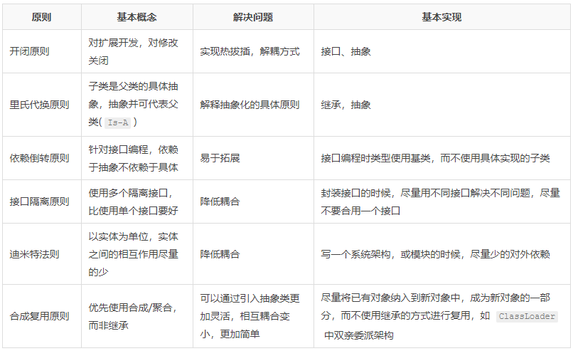
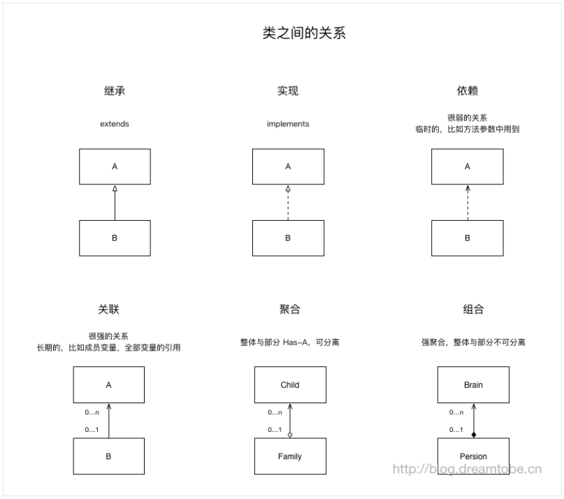
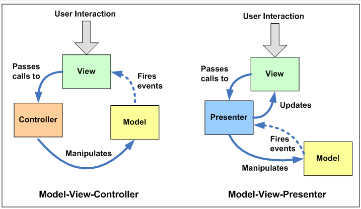
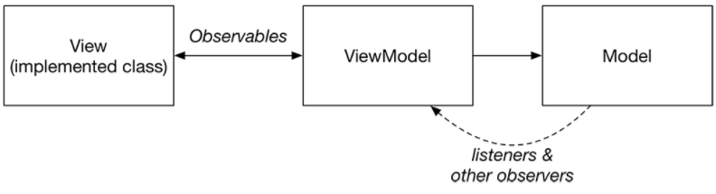
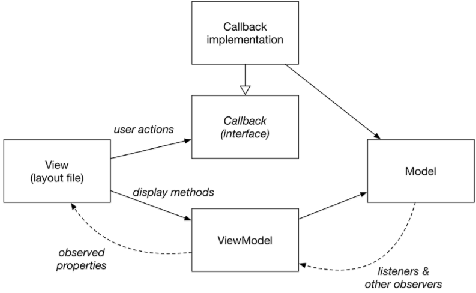

# 架构设计基础知识整理

### 原则

**灵活运用，非刻意遵循**

1) 基础原则

尽量少的重复代码，低耦合(尽量小的影响)，高内聚

模块，可小到一个类，大到一个系统

**模块间耦合因素**

构建架构时，需要谨慎耦合的因素

+ 模块间调用
+ 模块间传递的数据量(模块间的通信)
+ 模块间控制
+ 模块间接口复杂度

**模块间耦合从弱到强顺序**

构建架构或简单的类时，需要根据实际情况尽量契合弱的模块间耦合关系
做到职责分明，简单轻量，尽量少的潜在性的数据流动，尽量少的相互影响，避免牵一发而动全身

1、非直接耦合: 相互之间没有直接关系，而是由第三方模块控制和调用

2、数据耦合: 通过传递`java的内置数据类型`通讯

3、标记耦合: 都引用了共同的数据结构，并且通过传递该数据结构通讯

4、控制耦合: 通过传递开关、标志、名字等控制信息，明显的控制选择另一个模块的功能

5、外部耦合: 都访问一个`java的内置数据类型`的全局变量

6、公共耦合: 都访问了一个公共代码块( 全局数据结构、公共通讯区、内存公共覆盖区等)

7、内容耦合: 一个模块直接修改另外一个模块的数据。

**降低耦合度的方法**

+ 少用类继承，多用类接口隐藏实现细节
+ 模块功能尽量单一
+ 拒绝重复代码
+ 尽量不使用全局变量(Android中的全局变量会有一些坑，因为Attach在ClassLoader上的，因此根据不同ROM的优化，可能会在未预料的情况被unload，导致数据丢失)
+ 类成员变量与方法少用public，多用private
+ 尽量不用硬编码(如 字符串放到 res/string.xml，SQL语句做一层基于业务的封装供上层使用)
+ 使用设计模式，尽量让模块间的耦合关系保证在数据耦合或更弱

2) 原则汇总

**使用组合而非继承的场景:**

优先使用对象组合，而非继承

+ Has-A的关系，而非Is-A的关系
+ 子类的主要目的是拓展父类，而非override或final，如果存在大量这种情况，改用组合
+ 引入工具类，而非继承自工具类
+ 有可能或不确定 子类 有可能被替换为 另外一个类的子类的情况 ( 如果出现这种情况，就需要修改。因此还不如使用 组合，如果有类似需求，再 组合如新的对象，进行拓展即可)

**继承需要注意**

当已经选择使用继承时，需要注意

+ 实现抽象方法，拓展新的特性方法，尽量少的重载父类非抽象方法
+ 重载父类非抽象方法时: 方法前置条件(方法形参)要比父类方法更宽松，方法后置条件(方法返回值)要比父类更严格

**类之间的关系与UML表示**

### 常见的模式

1. MVC 与 MVP

MVP(Model-View_Presenter)是MVC(Model-View_Controller)的一个子集。

+ MVC中Controller控制全局事务，View将事件发送给Controller，Controller处理完事件同步给Model(数据库/数据模型)，View是通过所绑定的Model的改变来刷新自己。
+ MVP中Presenter从View中获取数据，刷新Model，当Model中的数据发生改变后，Presenter读取Model并刷新View。

2. MVVM

MVVM(View<->ViewModel->Model)

在Android中可以通过DataBinding，直接在Layout文件中绑定其ViewModel。

+ View: 布局
+ ViewModel: 负责显示数据(监听到Model中的数据变化进行显示)，以及处理用户交互(监听View布局中的用户Action)
+ Model: 存储内容

3. MVVM-C

MVVM-C(View-ViewModel-Callback-Model)

+ View: 布局
+ Callback: 通常可以是Fragment或Activity，用于处理用户交互(监听View布局中的用户Action)
+ ViewModel: 显示数据(监听Model中的数据变化进行显示)
+ Model: 存储内容

### 设计模式

[https://blog.dreamtobe.cn/2016/03/09/oo_architecture/](https://blog.dreamtobe.cn/2016/03/09/oo_architecture/)